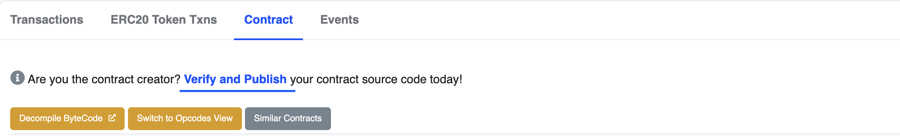
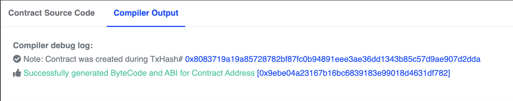

After deploying your contract, you can verify it using popular explorers like [basescan](https://sepolia.basescan.org). Verifying your contract allows users to trust that it does what you claim and enables you to interact with it using a user-friendly interface similar to Remix.

---

## Objectives

By the end of this lesson, you will be able to:

- Verify a contract on the Base Sepolia testnet
- Interact with your verified contract on [sepolia.basescan.org](https://sepolia.basescan.org)

---

### Verifying Your Contract

First, ensure you have the address of the contract you deployed in the previous article copied to your clipboard.

While you can interact with your deployed contract using Remix, you can also do so through [sepolia.basescan.org](https://sepolia.basescan.org). To find your contract, paste its address into the search field and click search. 

On the contract page, you can review the balance, information, and all transactions associated with your contract.

Click the _Contract_ tab in the main panel. At the top, you'll see a message prompting you to _Verify and Publish_ your contract source code.

Verifying your contract maps function and variable names to the compiled byte code, enabling interaction with the contract using a human-readable interface.

Click the verification link. Your contract address should already be filled in.

Under _Please select Compiler Type_, choose _Solidity (Single file)_.

For _Please Select Compiler Version_, select the version matching the `pragma` at the top of your source file. Our examples currently use _v0.8.17+commit.8df45f5f_.

For _Please select Open Source License Type_, choose the license that matches your contract's `SPDX-License-Identifier`. If you followed the Solidity-recommended practice of using `UNLICENSED`, select _None_.

On the next page, paste your source code into the provided window. Verify that you're not a robot, and click _Verify and Publish_. You should see a success message.

Click the linked address to return to your contract page, where you'll now see your code!

:::tip

If you have imports, you'll need to right click on the name of the file and choose `Flatten`. Submit the newly generated `filename_flattened.sol` for verification.

:::

### Interacting with Your Verified Contract

Now that your contract is verified, you can interact with it using the web interface. Click the _Read Contract_ button to see a list of your contract's functions that can be tested.

Note that there won't be anything under _Write Contract_ if your contract doesn't have functions that modify its state.

---

## Conclusion

With your contracts verified, you can begin to interact with them using online tools--and your users can be confident that your code does what you claim.

---

<!-- Add reference style links here. These do not render on the page. -->
[`sepolia.basescan.org`]: https://sepolia.basescan.org/
[coinbase]: https://www.coinbase.com/wallet
[faucet]: https://docs.base.org/tools/network-faucets
[set up]: https://www.youtube.com/watch?v=CZDgLG6jpgw
[coinbase settings]: https://docs.cloud.coinbase.com/wallet-sdk/docs/developer-settings 
[faucets on the web]: https://coinbase.com/faucets