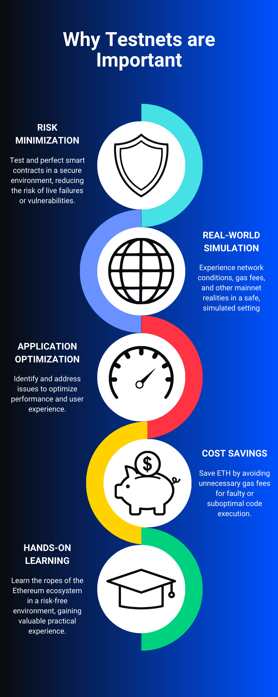
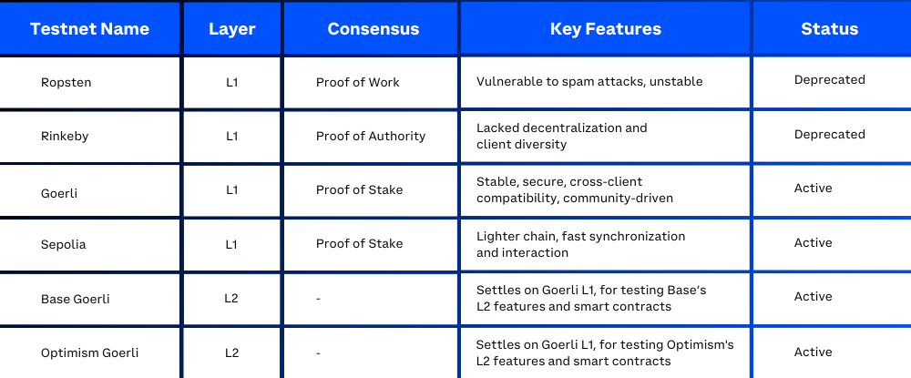

This article provides a concise overview of Ethereum test networks, highlighting their advantages, potential challenges, and comparing some of the most popular testnets.

---

## Objectives:

By the end of this lesson you should be able to:

- Describe the uses and properties of the Ethereum testnet
- Compare and contrast Ropsten, Rinkeby, and Goerli

---

## Why Testnets?

As you dive into the development of smart contracts and dapps on Ethereum, you'll need a safe, controlled, and efficient environment for testing and experimentation. Test networks, or testnets, serve as essential tools for you to test your smart contracts before deploying them to the mainnet, minimizing the risk of failures or vulnerabilities in live applications.

By simulating the Ethereum mainnet environment, testnets offer a realistic representation of real-world conditions, complete with network latency, gas fees, and other factors that impact the performance of smart contracts. This accurate representation enables you to identify potential issues, optimize your applications, and ensure the best possible user experience for your end-users. Moreover, testnets allow you to familiarize yourself with the Ethereum ecosystem and gain valuable hands-on experience, making them indispensable tools for both seasoned developers and newcomers to the world of blockchain development.

---

## The Advantages of Using Testnets

Testnets offer several key advantages to developers:

- **Real-time feedback:** Developers can quickly identify and fix errors or vulnerabilities in their smart contracts, ensuring robust and secure applications.

- **No cost or risk:** Testnets use "fake" ether, enabling developers to deploy and interact with smart contracts without incurring any financial cost or risk.

- **Easy accessibility:** Testnets are readily available for developers to join, allowing them to focus on development rather than infrastructure setup.

- **Stress testing:** Testnets provide a suitable environment to stress test the Ethereum network infrastructure under various conditions. By simulating high transaction volumes, developers can evaluate how their applications perform under load and optimize them accordingly.

- **Protocol upgrades and improvements:** Testnets allow developers to test new protocol updates, improvements, and potential forks before implementing them on the mainnet. This process helps identify any issues or incompatibilities and ensures a smoother transition to new features and optimizations.

---

## Challenges Associated with Testnets

While Ethereum testnets provide a valuable testing environment for developers, there are some challenges and limitations you should be aware of when using them:

- **Network congestion:** Just like the mainnet, testnets can experience periods of network congestion due to high transaction volumes or other factors. During these periods, developers might face slow transaction processing times, which could impact their testing process and potentially delay development.

- **Testnet instability:** Testnets may occasionally face downtime or network issues, which can disrupt the testing process. While these events are relatively rare, it's essential to be prepared for such occurrences and have a backup plan, such as switching to another testnet or using a local development environment.

- **Differences in network behavior:** Although testnets simulate the Ethereum mainnet environment, there might be subtle differences in network behavior, gas fees, or transaction processing times between the two. These differences could potentially impact the performance of your smart contracts on the mainnet. It's crucial to be aware of these discrepancies and make any necessary adjustments before deploying your smart contracts to the mainnet.

- **Limited resources:** Testnet ether is generally available for free through faucets, but these sources might have daily limits or other restrictions on the amount of testnet Ether that can be obtained. This limitation could affect your ability to perform extensive testing or carry out large-scale experiments on the testnet.

---

## Popular Ethereum Testnets

Several well-known Ethereum testnets have emerged over the years, each with its own set of features and benefits.

### L1 Testnets

- **Ropsten:** Ropsten played a significant role in Ethereum's history but was effectively deprecated by late 2022 when the Merge took place. The Merge marked the transition from proof-of-work to proof-of-stake consensus for the Ethereum mainnet. Ropsten's vulnerability to spam attacks and network instability made it unreliable for testing purposes.

- **Rinkeby:** Rinkeby offered better security than Ropsten and used a proof-of-authority consensus mechanism. However, it lacked decentralization and client diversity, which ultimately led to its decline in popularity. After the Merge, Rinkeby is no longer a recommended test network.

- **Goerli:** Launched in early 2019, Goerli initially utilized a multi-client proof-of-authority consensus model to improve stability and security. Following the Merge, it transitioned to a proof-of-stake consensus mechanism, maintaining its cross-client compatibility and making it an ideal choice for developers. Goerli's strong community support and collaboration, as the first community-driven testnet for Ethereum, contribute to ongoing maintenance, improvements, and feature enhancements, ensuring a robust testing environment for developers.

- **Sepolia:** As one of the two maintained primary testnets alongside Goerli, Sepolia is designed for developers seeking a lighter weight chain for faster synchronization and interaction. While Goerli is optimal for stakers and developers working with large existing states, Sepolia provides a more streamlined experience for testing and development.

### L2 Testnets

- **Base Goerli:** As new Layer-2 networks emerged that settled on Ethereum's Layer-1, the need for testnets dedicated to these L2 networks also arose. For instance, the L2 network Base has its own testnet, known as Base Goerli. This testnet settles on the Ethereum Goerli L1 testnet, providing an environment for testing L2-specific features and smart contracts.

- **Optimism Goerli:** Optimism, an Ethereum Layer-2 scaling solution utilizing Optimistic Rollups, has its own testnet called Optimism Goerli. This testnet is built on the Ethereum Goerli L1 testnet and offers a testing environment for developers to experiment with Optimism's Layer-2 features, smart contracts, and dapps.

---

## Conclusion

Ethereum testnets are essential for the safe and efficient development of smart contracts and dapps, offering numerous advantages such as real-time feedback, cost-free testing, easy accessibility, stress testing, and protocol upgrade testing. Despite certain challenges associated with testnets, developers continue to rely on them for a robust testing environment. Among the various options, Goerli and Sepolia have emerged as preferred choices for Ethereum developers due to their enhanced security, stability, and strong community support. As the Ethereum ecosystem evolves, incorporating Layer-2 networks and other innovations, testnets will continue to play a crucial role in fostering blockchain development and contributing to the overall success and growth of the space.

---

## See Also

- [Networks](https://ethereum.org/en/developers/docs/networks/)
- [The History of Ethereum Testnets](https://consensys.net/blog/news/the-history-of-ethereum-testnets/)
