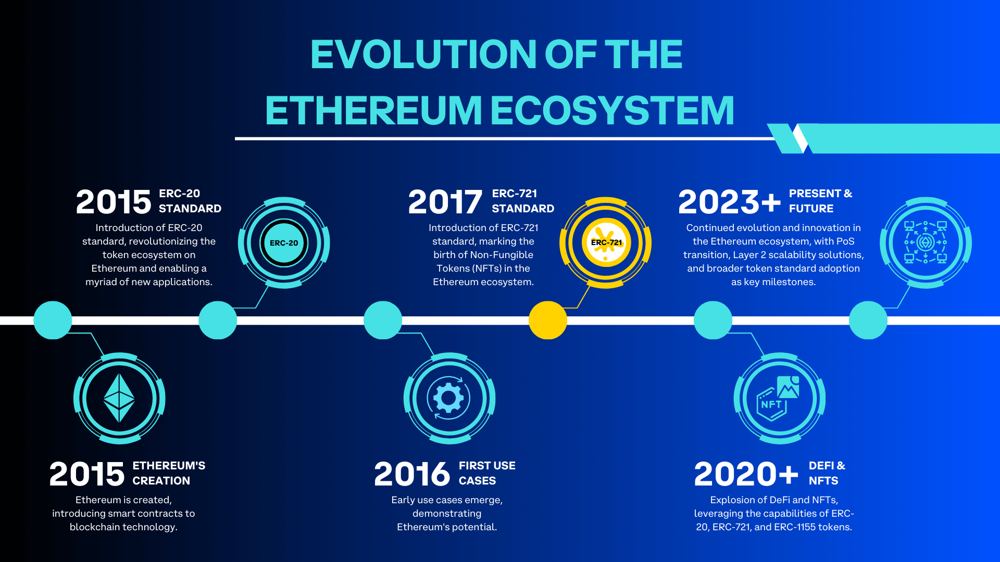

In this article, we'll delve into the ERC-721 token standard, exploring its technical specs, applications, and how it differs from the ERC-20 standard.

---

## Objectives:

By the end of this lesson you should be able to:

- Analyze the anatomy of an ERC-721 token
- Compare and contrast the technical specifications of ERC-20 and ERC-721
- Review the formal specification for ERC-721

---

## Introduction

The development of the Ethereum ecosystem has been marked by key milestones, two of which are the inception of the ERC-20 and ERC-721 token standards. While ERC-20 provided a foundational framework for fungible tokens, ERC-721 established a flexible and adaptable infrastructure for non-fungible tokens (NFTs).

The ERC-721 token standard is pivotal in the Ethereum ecosystem for creating and managing unique digital assets. With its consistent rules and functions, it has greatly enhanced the user experience, solidifying its position as the go-to standard for non-fungible tokens. ERC-721 has been instrumental in expanding the digital collectibles market and spurring the development of new applications and services.

---

## ERC-721 Specification

EIP-721 (Ethereum Improvement Proposal 721) is the formal specification for ERC-721, defining the requirements for creating compliant non-fungible tokens on Ethereum. EIP-721 prescribes mandatory functions and events that a token must implement to achieve ERC-721 compliance. Adherence to EIP-721 ensures compatibility of unique tokens with existing Ethereum applications and services, simplifying integration.

---

## Anatomy of an ERC-721 Token

An ERC-721 token comprises a smart contract implementing the standardized interface, which includes six primary functions:

- **balanceOf(address)** Returns the number of tokens held by a specific address.
- **ownerOf(uint256):** Provides the owner of a specified token.
- **safeTransferFrom(address, address, uint256):** Transfers a specific token's ownership from one address to another.
- **transferFrom(address, address, uint256):** Allows a third party to transfer tokens on the token owner's behalf, given the owner's approval.
- **approve(address, uint256):** Enables the token owner to permit a third party to transfer a specific token on their behalf.
- **getApproved(uint256):** Shows the approved address for a specific token.

These functions ensure each ERC-721 token has a unique identifier and can be owned and transferred individually.

---

## ERC-721 Vs ERC-20

The ERC-721 and ERC-20 token standards share a common goal of providing a set of standards for tokens on the Ethereum network but diverge in terms of functionality and use cases.

ERC-20 tokens are fungible, meaning each token is identical to every other token; they are interchangeable like currency. On the other hand, ERC-721 tokens are non-fungible, meaning each token is unique and not interchangeable with any other token. This uniqueness is made possible through the ownerOf() and getApproved() functions, which provide information about the ownership of each unique token.

The ERC-20 standard has primarily found use in creating cryptocurrencies for apps, governance tokens, utility tokens, stablecoins, and more. The ERC-721 standard, conversely, has been adopted largely for creating unique digital assets like collectibles, digital art, and tokenized virtual real estate, among other applications.

---

## Benefits of ERC-721 Standardization

Standardizing non-fungible tokens via the ERC-721 token standard presents substantial benefits to developers and users in the Ethereum ecosystem. Developers have access to a standardized set of functions, leading to less code ambiguity, fewer errors, and a streamlined development process. This uniformity also ensures smooth integration with existing apps and platforms on Ethereum.

For users, the ERC-721 standard offers an intuitive, consistent interface for interacting with a wide array of unique tokens. Regardless of the token's specific use or design, users can reliably check their ownership of tokens, transfer tokens to other addresses, and approve transactions. This consistency enhances usability across the Ethereum platform, from digital art marketplaces to tokenized real estate and gaming applications.

---

## Applications

ERC-721 tokens find wide-ranging applications in various categories:

- **Digital Art:** Artists can create unique digital artworks as ERC-721 tokens. These tokens can be sold or traded on platforms like OpenSea, Rarible, and Coinbase NFT. Examples include work by the digital artist Beeple.

- **Gaming:** Game assets such as characters, items, and land can be tokenized as ERC-721 tokens, providing players with true ownership of their in-game assets. Examples include Axie Infinity and Decentraland.

- **Collectibles:** ERC-721 tokens can represent unique collectible items in a digital space. Examples include NBA Top Shot moments and CryptoPunks.

- **Virtual Real Estate:** Virtual real estate can be tokenized as ERC-721 tokens, providing proof of ownership and facilitating trade on virtual platforms. Examples include parcels of land in Cryptovoxels and Decentraland.

---

## Conclusion

ERC-721, with its consistent framework for non-fungible tokens, has revolutionized the unique digital asset space on Ethereum. This standard, when contrasted with ERC-20, highlights Ethereum's capacity for both fungible and unique asset types. Adhering to the EIP-721 specification, ERC-721 tokens have significantly influenced the Ethereum-based digital economy. From digital art to gaming, these tokens underscore their importance and role as catalysts in the burgeoning NFT revolution.

---

## See Also

- [EIP-721: ERC-721 Token Standard](https://eips.ethereum.org/EIPS/eip-721)
- [ERC-721 Token Standard](https://ethereum.org/en/developers/docs/standards/tokens/erc-721/)
