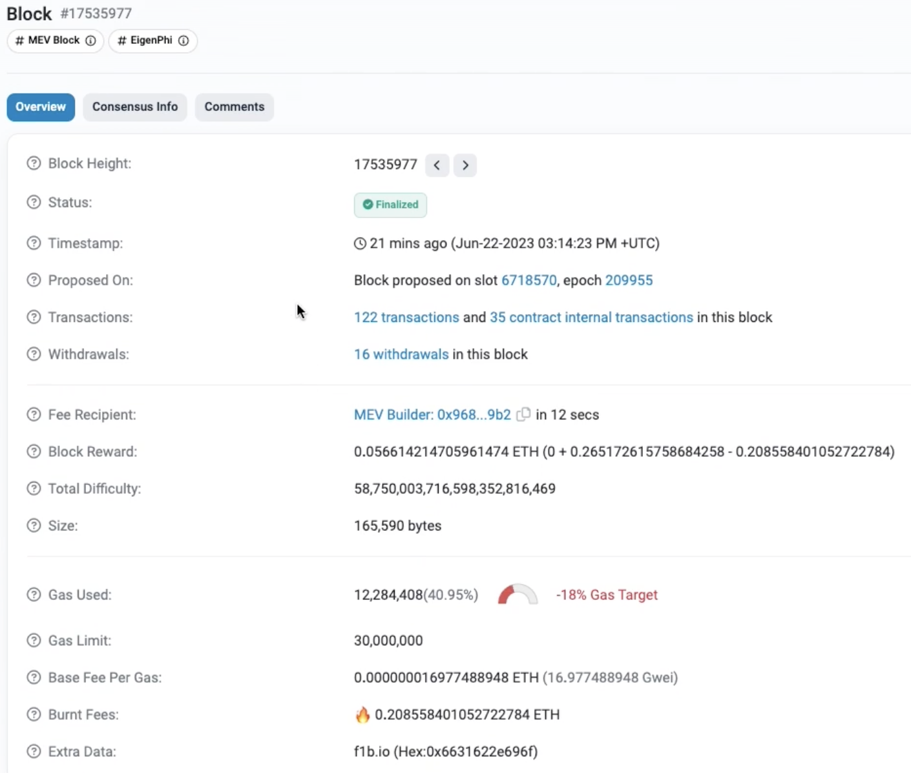

In this article, you'll learn about Etherscan, a Blockchan explorer to inspect the Blockchain state and activity.

---

## Objectives

By the end of this lesson you should be able to:

- List some of the features of Etherscan

- Read data from the Bored Apes Yacht Club contract on Etherscan

- Write data to a contract using Etherscan.

---

## Overview

[Etherscan](https://etherscan.io) is a popular Blockchain explorer that works for several different networks. In it you can explore the state and activity of a particular network.

You can explore:

- Blocks

- Transactions

- Smart contracts

- And more !

For instance the following shows the details of a Block.

Where we can see information like:

- Timestamp

- Transactions

- Block height

- Among other details

There are many variations of Etherscan for different networks. For instance:

- [Goerli Etherscan](https://goerli.etherscan.io)

- [Polygon Scan](https://polygonscan.com)

- [Mumbai Polygon Scan](https://mumbai.polygonscan.com)

- [Base Goerli](https://goerli.basescan.org)

## Reading data from smart contracts using Etherscan

Another of the things we can do with Etherscan is interact with already deployed contracts.

For instance, if we want to read information of a famous contract like [BAYC](https://etherscan.io/token/0xbc4ca0eda7647a8ab7c2061c2e118a18a936f13d).

We can simply go to Etherscan and explore the contract.

We will be able to see information like:

- The ETH balance it holds
- The contract creator
- The transaction when it was created
- Latest transactions
- And the verified contract

In the Contract tab we can see the full source code of BAYC.

As developer verifying contracts is important since it gives transparency to our users. However, there are some risks because this means bad actors can see the full source code and can try to exploit it.

In order to read the state of the BAYC, we can go to the main menu and selec the option "Read Contract".

Once we select that option we will be able to see all the read functions of the contract.

And we can for instance query, who is the owner of the BAYC with id 150.

## Writing data to smart contracts using Etherscan

In the same way we can read data from smart contracts using Etherscan. It is also possible to write data.

We can simply go to the "Write Contract" tab.

From there, we can connect our wallet by pressing the button "Connect with web3".

Once we are connected, we will be able to see a UI like:

And we can simply call the functions, we wish to write to.

Be aware that you might require to have real Ethereum in case you want to write to a contract in Ethereum mainnet. And also any logic that the smart contract defines will be respected. This means that if you try to write to a contract that verifies certain conditions during the transaction, for instance, a function where only the owner of the contract can write information. Then, you won't be able to execute the transaction if you are not the owner.

## Conclusion

In this lesson, you've learned some of the main features of Etherscan, including interacting with already deployed contracts like BAYC to read and write data.

---

## See also

[Goerli Etherscan]: https://goerli.etherscan.io
[Polygon Scan]: https://polygonscan.com
[Mumbai Polygon Scan]: https://mumbai.polygonscan.com
[Base Goerli]: https://goerli.basescan.org
