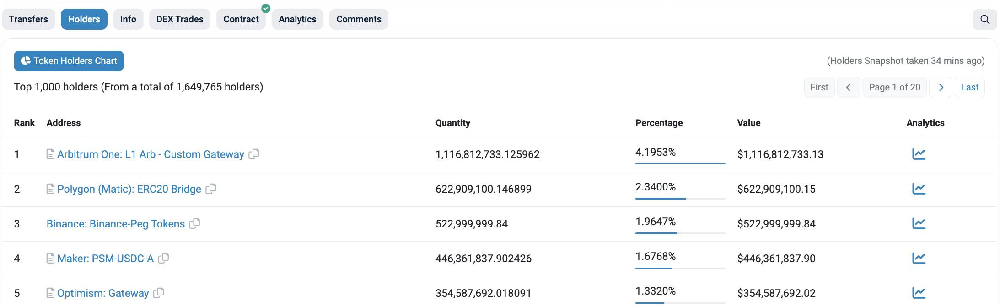

In this article, you'll learn how to fork smart contracts in Ethereum mainnet using Hardhat.

---

## Objectives

By the end of this lesson, you should be able to:

- Use Hardhat Network to create a local fork of mainnet and deploy a contract to it
- Utilize Hardhat forking features to configure the fork for several use cases

---

## Overview

Hardhat forking is a powerful feature that allows developers to create a local replica or fork of the Ethereum network or any other EVM-compatible Blockchain. By using this feature, you can develop smart contracts that rely on smart contracts that are already deployed to a particular network.

You will create a BalanceReader.sol contract that reads the USDC balance of a particular holder.

In order to achieve that, you need to:

- Create the BalanceReader.sol contract
- Configure Hardhat to support forking
- Create a test for the BalanceReader.sol contract

Hardhat forking also has other capabilities like:

- hardhat_impersonateAccount (useful to impersonate an account and others)
- hardhat_stopImpersonatingAccount
- hardhat_setNonce
- hardhat_setBalance
- hardhat_setCode
- hardhat_setStorageAt

Those won't be covered in this guide, however it's recommended to explore them a bit more in the following link:

- https://hardhat.org/hardhat-network/guides/mainnet-forking.html

## Creating the Balance Reader contract

The BalanceReader contract is created as follows:

```tsx
pragma solidity 0.8.9;

import "@openzeppelin/contracts/token/ERC20/IERC20.sol";

contract BalanceReader {
    function getERC20BalanceOf(address _account, address _tokenAddress)
        external
        view
        returns (uint256)
    {
        // we create an instance only using the interface and the address
        return IERC20(_tokenAddress).balanceOf(_account);
    }
}
```

You simply pass the address of an account and the address of a token, then you get and return the balance.

You will need to install @openzeppelin by running:

```bash
npm install @openzeppelin/contracts
```

Then, check that everything is working correctly by running:

```bash
npx hardhat compile
```

You should get:

```
Generating typings for: 2 artifacts in dir: typechain-types for target: ethers-v6
Successfully generated 18 typings!
Compiled 2 Solidity files successfully
```

## Configuring Hardhat to support forking

By default, Hardhat uses a network called `hardhat`. You must change its default configuration by going to the `hardhat.config.ts` file and include the following in the network:

```json
hardhat: {
    forking: {
        url: `https://eth-mainnet.g.alchemy.com/v2/${process.env.ALCHEMY_MAINNET_KEY ?? ""}`,
        enabled: true
    }
},
```

Be aware that you need to have an `ALCHEMY_MAINNET_KEY` in your .env file. You can get one directly from [Alchemy](https://www.alchemy.com/).

Also notice that forking is enabled by specifying `enabled: true`, however this value can be changed via environment variables.

## Creating a test for the BalanceReader.sol contract

Create a test file in the test folder called `BalanceReader.ts` and include the following:

```tsx
import { Signer } from 'ethers';
import { ethers } from 'hardhat';

import { BalanceReader, BalanceReader__factory } from '../typechain-types';

describe('BalanceReader tests', () => {
  let instance: BalanceReader;
  let accounts: Signer[];

  // Configure the addresses we can to check balances for
  const USDC_MAINNET_ADDRESS = '0xa0b86991c6218b36c1d19d4a2e9eb0ce3606eb48'; // https://etherscan.io/token/0xa0b86991c6218b36c1d19d4a2e9eb0ce3606eb48
  const ARBITRUM_ONE_GATEWAY = '0xcEe284F754E854890e311e3280b767F80797180d';
  const USDC_DECIMALS = 6;

  it('gets arbitrum gateway balance', async () => {
    // We get signers as in a normal test
    accounts = await ethers.getSigners();
    const factory = new BalanceReader__factory(accounts[0]);

    // We deploy the contract to our local test environment
    instance = await factory.deploy();

    // Our contract will be able to check the balances of the mainnet deployed contracts and address
    const balance = await instance.getERC20BalanceOf(ARBITRUM_ONE_GATEWAY, USDC_MAINNET_ADDRESS);
    const balanceAsString = ethers.formatUnits(balance, USDC_DECIMALS);

    console.log(
      'The USDC Balance of Arbitrum Gateway is $',
      Number(balanceAsString).toLocaleString(),
    );
  });
});
```

In this example, the [USDC address](https://etherscan.io/token/0xa0b86991c6218b36c1d19d4a2e9eb0ce3606eb48) is used and since USDC is an ERC-20 token, you can explore the token holders of that particular token directly in Etherscan:



Or, visit https://etherscan.io/token/0xa0b86991c6218b36c1d19d4a2e9eb0ce3606eb48#balances, where you can see, at the time or writing, Arbitrum ONE Gateway is the top token holder.

Then, run the following command:

```bash
npx hardhat test ./test/BalanceReader.ts
```

You should get:

```
BalanceReader tests
The USDC Balance of Arbitrum Gateway is $ 1,116,923,836.506
    ✔ gets arbitrum gateway balance (4345ms)

  1 passing (4s)
```

## Conclusion

In this lesson, you've learned how to use hardhat forking capabilities to test smart contracts. You learned how contracts can interact with already-deployed contracts in an easy way.

---

## See also

[Solidity Docs]: https://docs.soliditylang.org/en/v0.8.17/
[Remix Project]: https://remix-project.org/
[Hardhat Deploy]: https://github.com/wighawag/hardhat-deploy
[Hardhat Forking]: https://hardhat.org/hardhat-network/docs/guides/forking-other-networks
