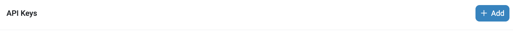
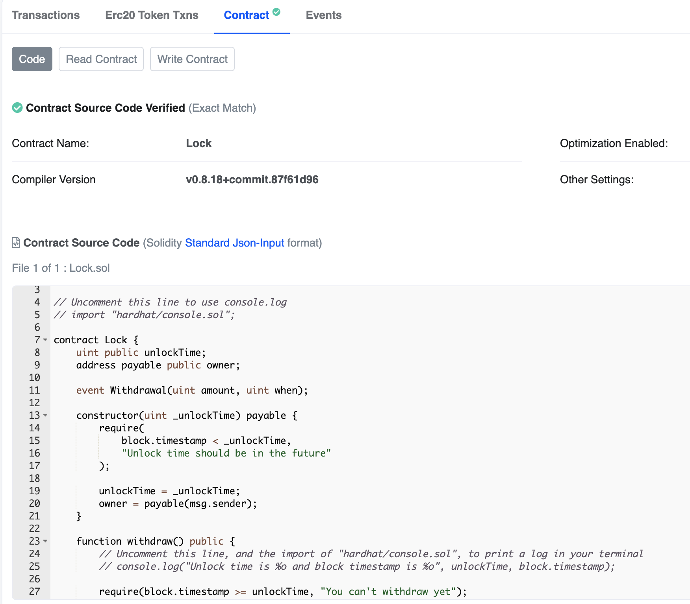

In this article, you'll learn how to verify smart contracts in Etherscan with hardhat and the hardhat deploy plugin.

---

## Objectives

By the end of this lesson you should be able to:

- Verify a deployed smart contract on Etherscan
- Connect a wallet to a contract in Etherscan
- Use etherscan to interact with your own deployed contact

---

## Overview

Verifying smart contracts plays an important role in providing security and certainty to the users of our decentralized applications. By offering full visibility of the source code of our smart contract, we provide confidence and transparency of the intention of the code that is being executed.

The way smart contracts are verified is by simply uploading the source code and contract address to services like Etherscan.

Once the contract is verified, the Etherscan explorer will show a status like the following image:


Luckily Hardhat and Hardhat-deploy already contain a built-in capability to do this task easily on our behalf.

This process involves the following steps:

- Getting an Etherscan key

- Configure Hardhat

- Verify

## Getting an Etherscan key

In order to obtain an Etherscan API key, you simply have to go to [Etherscan](https://etherscan.io/) and create an account.

Then go to [https://etherscan.io/myapikey](https://etherscan.io/myapikey) and creeate an API key by clicking the "Add" button.



Bear in mind that different networks have other Blockchain explorers:

For instance:

- [Base](https://goerli.basescan.org/)

- [Goerli](https://goerli.etherscan.io/)

- [Polygon](https://polygonscan.com/)

So you have to go to that particular explorer (except for Goerli Etherscan, you can use the Etherscan mainnet one) and get the API Key following a similar process as mentioned before.

## Configure Hardhat

We can configure our Etherscan API Key for each different network.

For instance for base goerli, we include the following to our `hardhat.config.ts` file:

```Javascript
base_goerli: {
      url: "https://goerli.base.org",
      accounts: {
        mnemonic: process.env.MNEMONIC ?? ""
      },
      verify: {
        etherscan: {
          apiUrl: "https://api-goerli.basescan.org",
          apiKey: process.env.ETHERSCAN_API_KEY ?? "ETHERSCAN_API_KEY"
        }
      }
}
```

Be aware that at this point an API Key for base goerli is not required, so we can simply define a placeholder like `"ETHERSCAN_API_KEY"`.

However, for other networks, you might have to include in your `.env` file the following:

```
ETHERSCAN_API_KEY=<YOUR_ETHERSCAN_API_KEY>
```

## Verify

We will verify in base, to do so, we simply run the following command:

`npx hardhat --network base_goerli etherscan-verify`

You should get a message like:

```
verifying Lock ...
waiting for result...
 => contract Lock is now verified
```

Now you can go to Basescan, search for your contract address and you will see something like:



## Conclusion

In this lesson, you've learned how to verify smart contracts using Hardhat and Hardhat-deploy. We learned how to configure Hardhat to support multiple networks and verify by using a simple command.

---

## See also

[Solidity Docs]: https://docs.soliditylang.org/en/v0.8.17/
[Remix Project]: https://remix-project.org/
[Hardhat Deploy]: https://github.com/wighawag/hardhat-deploy
