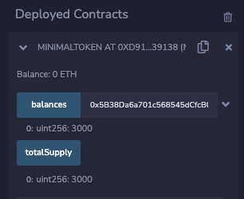

At their core, tokens are very simple. The technology powering famous NFT collections and fungible tokens worth vast amounts of money simply uses the EVM to keep track of who owns what, and provides a permissionless way for the owner to transfer what they own to someone new.

---

## Objectives

By the end of this lesson you should be able to:

- Construct a minimal token and deploy to testnet
- Identify the properties that make a token a token

---

## Implementing a Token

The minimal elements needed for a token are pretty basic. Start by creating a contract called `MinimalToken`. Add a `mapping` to relate user addresses to the number of tokens they possess. Finally, add a variable to track `totalSupply`:

<details>

<summary>Reveal code</summary>

```solidity
contract MinimalToken {
    mapping (address => uint) public balances;
    uint public totalSupply;
}
```

</details>

<br/>

Add a `constructor` that initializes the `totalSupply` at 3000 and assigns ownership to the contract creator:

<details>

<summary>Reveal code</summary>

```solidity
constructor() {
    totalSupply = 3000;

    balances[msg.sender] = totalSupply;
}
```

</details>

<br/>

Deploy and test to confirm that the total supply is 3000, and the balance of the first account is as well.



Update the constructor and hardcode a distribution of the tokens to be evenly split between the first three test accounts:

<details>

<summary>Reveal code</summary>

```solidity
constructor() {
    totalSupply = 3000;

    balances[msg.sender] = totalSupply / 3;
    balances[0xAb8483F64d9C6d1EcF9b849Ae677dD3315835cb2] = totalSupply / 3;
    balances[0x4B20993Bc481177ec7E8f571ceCaE8A9e22C02db] = totalSupply / 3;
}
```

</details>

<br/>

Redeploy and test again. Now, each of the first three accounts should have 1000 tokens.


---

## Transferring Tokens

We can set an initial distribution of tokens and we can see balances, but we're still missing a way to allow the owners of these tokens to share them or spend them.

To remediate this, all we need to do is add a function that can update the balances of each party in the transfer.

Add a `function` called `transfer` that accepts an `address` of `_to` and a `uint` for the `_amount`. You don't need to add anything for `_from`, because that should only be `msg.sender`. The function should subtract the `_amount` from the `msg.sender` and add it to `_to`:

<details>

<summary>Reveal code</summary>

```solidity
function transfer(address _to, uint _amount) public {
    balances[msg.sender] -= _amount;
    balances[_to] += _amount;
}
```

</details>

<br/>

Double-check that you've switched back to the first address and redeploy. Then, try sending 500 tokens to the second address.


What happens if you try to transfer more tokens than an account has? Give it a try!

```text
transact to MinimalToken.transfer pending ...
transact to MinimalToken.transfer errored: VM error: revert.

revert
	The transaction has been reverted to the initial state.
Note: The called function should be payable if you send value and the value you send should be less than your current balance.
Debug the transaction to get more information.
```

You won't be able to do it, though the `Note:` here is **misleading**. In the EVM, `payable` **only** refers to transfers of the primary token used to pay gas fees: ETH, Base ETH, Sepolia ETH, Matic, etc. It does **not** refer to the balance of our simple token.

Instead, the transaction is reverting because of the built-in overflow/underflow protection. It's not a great programming practice to depend on this, so add an error for `InsufficientTokens` that returns the `newSenderBalance`.

```Solidity
function transfer(address _to, uint _amount) public {
    int newSenderBalance = int(balances[msg.sender] - _amount);
    if (newSenderBalance < 0) {
        revert InsufficientTokens(newSenderBalance);
    }

    balances[msg.sender] = uint(newSenderBalance);
    balances[_to] += _amount;
}
```

Try spending too much again. You'll get the same error in Remix:

```text
transact to MinimalToken.transfer pending ...
transact to MinimalToken.transfer errored: VM error: revert.

revert
	The transaction has been reverted to the initial state.
Note: The called function should be payable if you send value and the value you send should be less than your current balance.
Debug the transaction to get more information.
```

However, you can use the debug tool to review the error in memory to see that it now matches your custom `error`.

## Destroying Tokens

Tokens can be effectively destroyed by accident, or on purpose. Accidental destruction happens when someone sends a token to an unowned wallet address. While it's possible that some day, some lucky person will create a new wallet and find a pleasant surprise, the most likely outcome is that any given randomly chosen address will never be used, thus no one will ever have the ability to use or transfer those tokens.

Luckily, there are some protections here. Similar to credit card numbers, addresses have a built-in checksum that helps protect against typos. Try it out by trying to transfer tokens to the second Remix address, but change the first character in the address from `A` to `B`. You'll get an error:

```text
transact to MinimalToken.transfer errored: Error encoding arguments: Error: bad address checksum (argument="address", value="0xBb8483F64d9C6d1EcF9b849Ae677dD3315835cb2", code=INVALID_ARGUMENT, version=address/5.5.0) (argument=null, value="0xBb8483F64d9C6d1EcF9b849Ae677dD3315835cb2", code=INVALID_ARGUMENT, version=abi/5.5.0)
```

A more guaranteed way to destroy, or _burn_ a token, is to transfer it to the default address `0x0000000000000000000000000000000000000000`. This address is unowned and unownable, making it mathematically impossible to retrieve any tokens that are sent to it. Redeploy and try it out by sending 1000 tokens to the zero address.

The `totalSupply` remains unchanged, and the balance of the zero address are visible, but those tokens are stuck there forever.

:::info

The [zero address] currently has a balance of more than 11,000 ETH, worth over **20 million dollars**! Its total holding of burned assets is estimated to be worth more than **200 million dollars**!!!

:::

---

## Conclusion

In this lesson, you've learned to implement a simple token, which is really just a system to store the balance of each address, and a mechanism to transfer them from one wallet to another. You've also learned how to permanently destroy tokens, whether by accident, or on purpose.

---

[zero address]: https://etherscan.io/address/0x0000000000000000000000000000000000000000
