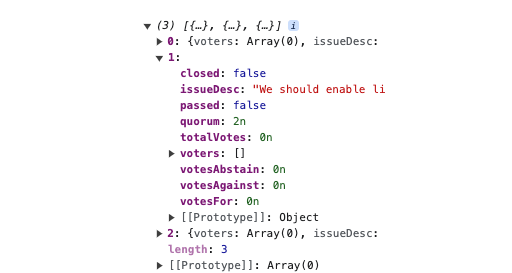
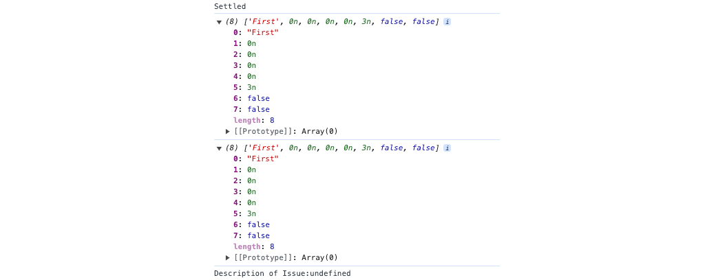

The `useReadContract` hook is [wagmi]'s method of calling `pure` and `view` functions from your smart contracts. As with `useAccount`, `useReadContract` contains a number of helpful properties to enable you to manage displaying information to your users.

---

## Objectives

By the end of this guide you should be able to:

- Implement wagmi's `useReadContract` hook to fetch data from a smart contract
- Convert data fetched from a smart contract to information displayed to the user
- Identify the caveats of reading data from automatically-generated getters

---

## Contract Setup

For this guide, you'll be continuing from the project you started for the [`useAccount` hook]. You'll work with an upgrade to the contract that you may have created if you completed the [ERC 20 Tokens Exercise]. See below for an example you can use if you don't already have your own!

The contract creates a very simple DAO, in which users can create issues and vote for them, against them, or abstain. Anyone can `claim` 100 tokens. This is an insecure system for demonstration purposes, since it would be trivial to claim a large number of tokens with multiple wallets, then transfer them to a single address and use that to dominate voting.

But it makes it much easier to test!

:::caution

If you're using your own contract, please redeploy it with the following `view` functions:

```solidity
function numberOfIssues() public view returns(uint) {
    return issues.length;
}

function getAllIssues() public view returns(ReturnableIssue[] memory) {
    ReturnableIssue[] memory allIssues = new ReturnableIssue[](issues.length);

    for(uint i = 0; i < issues.length; i++) {
        allIssues[i] = getIssue(i);
    }

    return allIssues;
}
```

**You also need to make the `getIssue` function `public`. The original spec called for it to be `external`.**

:::

### Create Demo Issues

To start, you'll need to put some data into your contract so that you can read it from your frontend. Open [Sepolia BaseScan], find your contract, connect with your wallet, and call the `claim` function.

Add the following two issues:

```text
_issueDesc: We should enable light mode by default.
_quorom: 2
```

```text
_issueDesc: We should make inverted mouse controls the default selection.
_quorom: 2
```

Switch to a **different wallet address**. Claim your tokens with the new address, and add one more issue:

```text
_issueDesc: Two spaces, not four, not tabs!
_quorom: 2
```

Call the `getAllIssues` function under the `Read Contract` tab to make sure all three are there.

---

## Reading from your Smart Contract

To be able to read from your deployed smart contract, you'll need two pieces of information: the address and [ABI]. These are used as parameters in the `useReadContract` hook.

If you're using [Hardhat], both of these can be conveniently found in a json file in the `deployments/<network>` folder, named after your contract. For example, our contract is called `FEWeightedVoting`, so the file is `deployments/base-sepolia/FEWeightedVoting.json`.

If you're using something else, it should produce a similar artifact, or separate artifacts with the [ABI] and address. If this is the case, make the adjustments you need when you import this data.

Either way, add a folder called `deployments` and place a copy of the artifact file(s) inside.

### Using the `useReadContract` Hook

Add a file for a new component called `IssueList.tsx`. You can start with:

```tsx
import { useReadContract } from 'wagmi';

export function IssueList() {
  return (
    <div>
      <h2>All Issues</h2>
      <div>{/* TODO: List each issue */}</div>
    </div>
  );
}
```

You'll need to do some prepwork to enable Typescript to more easily interpret the data returned from your contract. Add an `interface` called `Issue` that matches with the `ReturnableIssue` type:

```tsx
interface Issue {
  voters: string[];
  issueDesc: string;
  votesFor: bigint;
  votesAgainst: bigint;
  votesAbstain: bigint;
  totalVotes: bigint;
  quorum: bigint;
  passed: boolean;
  closed: boolean;
}
```

:::warning

Be very careful here! `bigint` is the name of the type, `BigInt` is the name of the constructor for that type. If you incorrectly use the constructor as the type, much of your code will still work, but other parts will express very confusing bugs.

:::

Now, import `useState` and add a state variable to hold your list of `Issue`s.

```tsx
const [issues, setIssues] = useState<Issue[]>([]);
```

You'll also need to import your contract artifact:

```tsx
import contractData from '../deployments/FEWeightedVoting.json';
```

Finally, the moment you've been waiting for: Time to read from your contract! Add an instance of the [`useReadContract`] hook. It works similarly to the [`useAccount`] hook. Configure it with:

```tsx
const {
  data: issuesData,
  isError: issuesIsError,
  isPending: issuesIsPending,
} = useReadContract({
  address: contractData.address as `0x${string}`,
  abi: contractData.abi,
  functionName: 'getAllIssues',
});
```

You can use `useEffect` to do something when the call completes and the data. For now, just log it to the console:

```tsx
useEffect(() => {
  if (issuesData) {
    const issuesList = issuesData as Issue[];
    console.log('issuesList', issuesList);
    setIssues(issuesList);
  }
}, [issuesData]);
```

Add in instance of your new component to `index.tsx`:

```tsx
<main className={styles.main}>
  <ConnectButton />
  <ConnectionWindow />
  <IssueList />
</main>
```

Run your app, and you should see your list of issues fetched from the blockchain and displayed in the console!



Breaking down the hook, you've:

- Renamed the properties decomposed from `useReadContract` to be specific for our function. Doing so is helpful if you're going to read from more than one function in a file
- Configured the hook with the address and ABI for your contract
- Made use of `useEffect` to wait for the data to be returned from the blockchain, log it to the console, and set the list of `Issue`s in state.

### Displaying the Data

Now that you've got the data in state, you can display it via your component. One strategy to display a list of items is to compile a `ReactNode` array in a render function.

```tsx
function renderIssues() {
  return issues.map((issue) => (
    <div key={issue.issueDesc}>
      <h3>{issue.issueDesc}</h3>
      <p>{'Voters: ' + issue.voters.toString()}</p>
      <p>{'Votes For: ' + issue.votesFor.toString()}</p>
      <p>{'Votes Against: ' + issue.votesAgainst.toString()}</p>
      <p>{'Votes Abstain: ' + issue.votesAbstain.toString()}</p>
      <p>{'Quorum: ' + issue.quorum.toString()}</p>
      <p>{'Passed: ' + issue.passed}</p>
      <p>{'Closed: ' + issue.closed}</p>
    </div>
  ));
}
```

Then, call the render function in the return for your component:

```tsx
return (
  <div>
    <h2>All Issues</h2>
    <div>{renderIssues()}</div>
  </div>
);
```

You'll now see your list of issues rendered in the browser! Congrats, you've finally made a meaningful connection between your smart contract and your frontend!

### A Caveat with Automatic Getters

Remember how the Solidity compiler creates automatic getters for all of your public state variables? This feature is very helpful, but it can create bewildering results when you use it for `struct`s that contain `mapping`s. Remember, nesting mappings **cannot** be returned outside the blockchain. The `enumerableSet` protects you from this problem, because it has private variables inside it, which prevents setting `issues` as `public`. Had we instead used a mapping, we'd lose this protection:

```solidity
  // Code for demo only
  struct Issue {
      mapping(address => bool) voters;
      string issueDesc;
      uint votesFor;
      uint votesAgainst;
      uint votesAbstain;
      uint totalVotes;
      uint quorum;
      bool passed;
      bool closed;
  }
```

Redeploy with the above change, and add a second `useReadContract` to fetch an individual issue using the getter:

```tsx
// Bad code for example, do not use
const {
  data: getOneData,
  isError: getOneIsError,
  isPending: getOneIsPending,
} = useReadContract({
  address: contractData.address as `0x${string}`,
  abi: contractData.abi,
  functionName: 'issues',
  args: [1],
});

useEffect(() => {
  if (getOneData) {
    console.log('getOneData', getOneData);
    const issueOne = getOneData as Issue;
    console.log('Issue One', issueOne);
  }
}, [getOneData]);
```

Everything appears to be working just fine, but how is `issueOne.desc` undefined? You can see it right there in the log!



If you look closely, you'll see that `voters` is missing from the data in the logs. What's happening is that because the nested `mapping` cannot be returned outside the blockchain, it simply isn't. TypeScript then gets the `data` and does the best it can to cast it `as` an `Issue`. Since `voters` is missing, this will fail and it instead does the JavaScript trick of simply tacking on the extra properties onto the object.

Take a look at the working example above where you retrieved the list. Notice that the keys in your `Issue` type are in that log, but are missing here. The assignment has failed, and all of the `Issue` properties are `null`.

---

## Conclusion

In this guide, you've learned how to use the `useReadContract` hook to call `pure` and `view` functions from your smart contracts. You then converted this data into React state and displayed it to the user. Finally, you explored a tricky edge case in which the presence of a nested `mapping` can cause a confusing bug when using the automatically-generated getter.

---

## Simple DAO Contract Example

Use this contract if you don't have your own from the [ERC 20 Tokens Exercise]. You can also use this if you want to cheat to get that badge. Doing so would be silly though!

:::caution
If you use your own contract, redeploy it with the `numberOfIssues` and `getAllIssues` functions from the bottom of the contract below. We'll need this for our first pass solution for getting all the `Issues` in the contract.

**You also need to make the `getIssue` function `public`. The original spec called for it to be `external`.**
:::

```Solidity
// SPDX-License-Identifier: MIT

pragma solidity ^0.8.17;

import "@openzeppelin/contracts/token/ERC20/ERC20.sol";
import "@openzeppelin/contracts/utils/structs/EnumerableSet.sol";

contract FEWeightedVoting is ERC20 {
    using EnumerableSet for EnumerableSet.AddressSet;

    mapping(address => bool) claimed;
    uint public maxSupply = 1000000;
    uint totalClaimed;

    uint constant claimAmount = 100;

    error TokensClaimed();
    error AllTokensClaimed();
    error NoTokensHeld();
    error QuorumTooHigh(uint);
    error AlreadyVoted();
    error VotingClosed();

    enum Vote {
        AGAINST,
        FOR,
        ABSTAIN
    }

    struct Issue {
        EnumerableSet.AddressSet voters;
        string issueDesc;
        uint votesFor;
        uint votesAgainst;
        uint votesAbstain;
        uint totalVotes;
        uint quorum;
        bool passed;
        bool closed;
    }

    // EnumerableSets are mappings and cannot be returned outside a contract
    struct ReturnableIssue {
        address[] voters;
        string issueDesc;
        uint votesFor;
        uint votesAgainst;
        uint votesAbstain;
        uint totalVotes;
        uint quorum;
        bool passed;
        bool closed;
    }

    Issue[] issues;

    constructor(
        string memory _name,
        string memory _symbol
    ) ERC20(_name, _symbol) {
        // Burn Issue 0
        issues.push();
    }

    function claim() public {
        if (claimed[msg.sender] == true) {
            revert TokensClaimed();
        }

        if (totalSupply() >= maxSupply) {
            revert AllTokensClaimed();
        }

        _mint(msg.sender, claimAmount);
        claimed[msg.sender] = true;
    }

    function createIssue(
        string memory _issueDesc,
        uint _quorum
    ) public returns (uint) {
        if (balanceOf(msg.sender) == 0) {
            revert NoTokensHeld();
        }

        if (_quorum > totalSupply()) {
            revert QuorumTooHigh(_quorum);
        }

        Issue storage newIssue = issues.push();
        newIssue.issueDesc = _issueDesc;
        newIssue.quorum = _quorum;
        return issues.length - 1;
    }

    function getIssue(uint _id) public view returns (ReturnableIssue memory) {
        Issue storage issue = issues[_id];
        return
            ReturnableIssue(
                issue.voters.values(),
                issue.issueDesc,
                issue.votesFor,
                issue.votesAgainst,
                issue.votesAbstain,
                issue.totalVotes,
                issue.quorum,
                issue.closed,
                issue.passed
            );
    }

    function vote(uint _issueId, Vote _vote) public {
        Issue storage issue = issues[_issueId];
        if (issue.voters.contains(msg.sender)) {
            revert AlreadyVoted();
        }
        if (issue.closed) {
            revert VotingClosed();
        }
        issue.voters.add(msg.sender);

        if (_vote == Vote.FOR) {
            issue.votesFor += balanceOf(msg.sender);
        } else if (_vote == Vote.AGAINST) {
            issue.votesAgainst += balanceOf(msg.sender);
        } else if (_vote == Vote.ABSTAIN) {
            issue.votesAbstain += balanceOf(msg.sender);
        } else {
            revert("Error...");
        }

        issue.totalVotes += balanceOf(msg.sender);

        if (issue.totalVotes >= issue.quorum) {
            issue.closed = true;
            if (issue.votesFor > issue.votesAgainst) {
                issue.passed = true;
            }
        }
    }

    function numberOfIssues() public view returns(uint) {
        return issues.length;
    }

    function getAllIssues() public view returns(ReturnableIssue[] memory) {
        ReturnableIssue[] memory allIssues = new ReturnableIssue[](issues.length);

        for(uint i = 0; i < issues.length; i++) {
            allIssues[i] = getIssue(i);
        }

        return allIssues;
    }
}
```

---

[RainbowKit]: https://www.rainbowkit.com/
[wagmi]: https://wagmi.sh/
[quick start]: https://www.rainbowkit.com/docs/installation/
[Wallet Connectors]: ../frontend-setup/wallet-connectors/
[`useAccount`]: https://wagmi.sh/react/hooks/useAccount
[hydration error]: https://nextjs.org/docs/messages/react-hydration-error
[ERC 20 Tokens Exercise]: https://docs.base.org/base-camp/docs/erc-20-token/erc-20-exercise
[Sepolia BaseScan]: https://sepolia.basescan.org/
[`useAccount` hook]: ./useAccount
[Hardhat]: https://hardhat.org/
[ABI]: https://docs.soliditylang.org/en/latest/abi-spec.html
[`useReadContract`]: https://wagmi.sh/react/hooks/useReadContract
