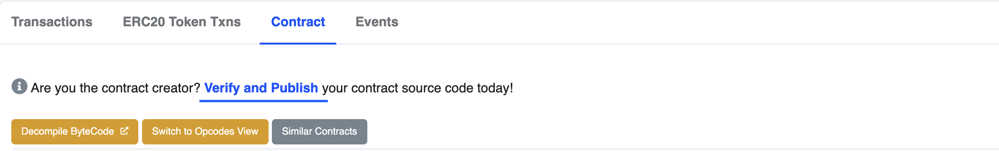
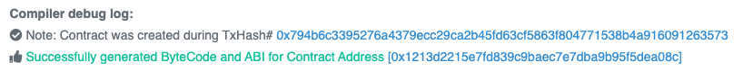

Once your contract is deployed, you can verify it using a number of popular services. Doing so will let your users have confidence that your contract does what you claim, and will allow you to interact with it using a similar interface to what you used in Remix.

---

## Objectives

By the end of this lesson you should be able to:

- Verify a contract on the Base Sepolia testnet and interact with it in [BaseScan]

---

### Verify the Contract

Make sure you still have the address of the contract you deployed in the last article copied to the clipboard.

You can interact with your deployed contract using Remix, the same as before, but it's also possible to interact with it through BaseScan. Paste your address in the search field to find it.

On this page, you can review the balance, information about, and all the transactions that have ever occurred with your contract.

Click the _Contract_ tab in the main panel. At the top is a message asking you to _Verify and Publish_ your contract source code.

Verifying your contract maps the names of your functions and variables to the compiled byte code, which makes it possible to interact with the contract using a human-readable interface.

Click the link. Your contract address is already entered.

Under _Please select Compiler Type_ choose \_Solidity (Single file)

For _Please Select Compiler Version_ select the version matching the `pragma` at the top of your source file. Our examples are currently using _v0.8.17+commit.8df45f5f_.

For _Please select Open Source License Type_ pick the license that matches what you selected for your contract as the `SPDX-License-Identifier`. Pick _None_ if you followed the Solidity-recommended practice of using `UNLICENSED`.

On the next page, copy and paste your source code in the window. Verify that you are not a robot, and click _Verify and Publish_. You should see a success message.

Click the linked address to your contract to return to the contract page. You'll now see your code!

:::tip

If you have imports, you'll need to right click on the name of the file and choose `Flatten`. Submit the newly generated `filename_flattened.sol` for verification.

:::

### Interact with the Contract

You can now interact with your contract using BaseScan. Click the _Read Contract_ button. Both of your functions will be listed here and can be tested using the web interface.

You won't have anything under _Write Contract_ because this contract doesn't have any functions that save data to state.

---

## Conclusion

With your contracts verified, you can interact with them using online tools and your users can be secure that your code does what you claim.

---

<!-- Add reference style links here.  These do not render on the page. -->

[`sepolia.basescan.org`]: https://sepolia.basescan.org/
[coinbase]: https://www.coinbase.com/wallet
[faucet]: https://docs.base.org/tools/network-faucets
[set up]: https://www.youtube.com/watch?v=CZDgLG6jpgw
[coinbase settings]: https://docs.cloud.coinbase.com/wallet-sdk/docs/developer-settings
[BaseScan]: https://sepolia.basescan.org/
[faucets on the web]: https://coinbase.com/faucets
