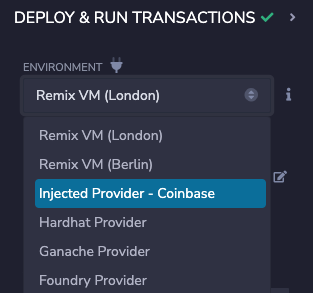
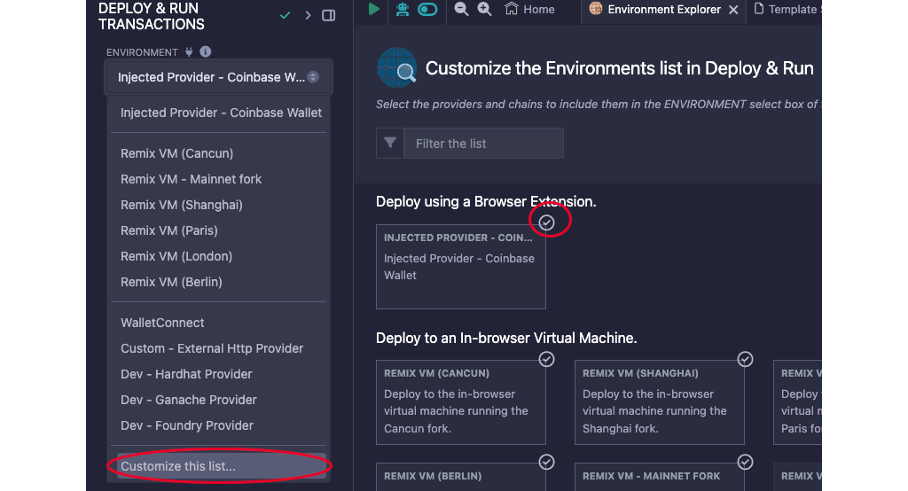
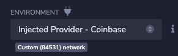
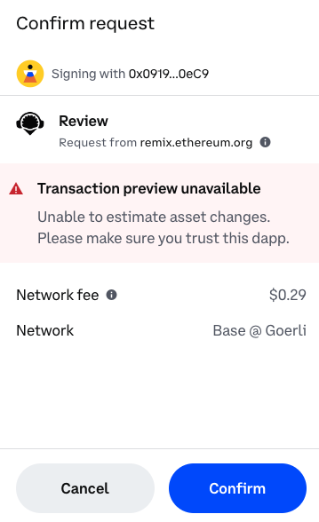

Remix contains a simulation of a blockchain that you can use to rapidly deploy and test your contracts. This simulation only exists within your browser so you can't share it with others, use external tools, or a front end to interact with it. However, you can also deploy to a variety of testnets from within Remix. Doing so will allow you to share your contract with others, at the cost of making it public.

---

## Objectives

By the end of this lesson you should be able to:

- Deploy a contract to the Base Sepolia testnet and interact with it in [BaseScan]

---

## Prepare for Deployment

Testnets operate in a similar, **but not exactly the same** manner as the main networks they shadow. You need a wallet with the appropriate token to interact with them by deploying a new contract or calling functions in a deployed contract.

### Set Up a Wallet

If you already have a wallet set up **exclusively for development**, you can skip to the next section. Otherwise, now is the time to jump in!

:::danger

It is very dangerous to use a wallet with valuable assets for development. You could easily write code with a bug that transfers the wrong amount of the wrong token to the wrong address. Transactions cannot be reversed once sent!

Be safe and use separate wallets for separate purposes.

:::

First, add the [Coinbase] or [Metamask] wallet to your browser, and then [set up] a new wallet. As a developer, you need to be doubly careful about the security of your wallet! Many apps grant special powers to the wallet address that is the owner of the contract, such as allowing the withdrawal of all the Ether that customers have paid to the contract or changing critical settings.

Once you've completed the wallet setup, enable developer settings and turn on testnets ([Coinbase Settings], [Metamask Settings]).

### Add Base Sepolia to your Wallet

Use the [faucet] to add Base Sepolia ETH to your wallet. You can also ask Base personnel on Discord or other social media for some!

### Get Testnet Ether

Testnet tokens have no real value, but the supply is not unlimited. You can use a faucet to get a small amount of Sepolia Ether to pay gas fees for testing. Most faucets allow you to ask for a small amount each day, and some won't send you more if your balance is too high.

You can find many faucets by searching, and it's good to keep a few bookmarked because they have a tendency to go down from time to time. Faucet providers are constantly combating bad actors and sometimes need to disable their faucets while doing so.

You can also access the [faucets on the web].

Once you have testnet Base Sepolia Ether, you can view your balance under the _Testnets_ tab in the Coinbase wallet or by selecting the testnet from the network dropdown in Metamask. Sadly, it's not actually worth the amount listed!

---

## Deploying to Testnet

Once you have testnet Ether, you can deploy your BasicMath contract!

### Selecting the Environment

Open the _Deploy & Run Transactions_ tab. Under _Environment_, select _Injected Provider_. It will list _Coinbase_, _Metamask_, or any other wallet you have activated here.

If that option is not available, you can add it by choosing `Customize this list...`

The first time you do this, your wallet will ask you to confirm that you want to connect this app (Remix) to your wallet.

Once you are connected, you'll see the name of the network below the _Environment_ dropdown.

For Base Sepolia, you should see `Custom (84532) network`. The old network, Goerli, was `84531`. If you don't see the correct network, change the active network in your wallet.

### Deploy the Contract

Click the orange _Deploy_ button. Because it costs gas to deploy a contract, you'll be asked to review and confirm a transaction.

:::danger

Always carefully review all transactions, confirming the transaction cost, assets transferred, and network. As a developer, you'll get used to approving transactions regularly. Do the best you can to avoid getting into the habit of clicking _Confirm_ without reviewing the transaction carefully. If you feel pressured to _Confirm_ before you run out of time, it is almost certainly a scam.

:::

After you click the _Confirm_ button, return to Remix and wait for the transaction to deploy. Copy its address and navigate to [`sepolia.basescan.org`].

## Conclusion

You now have the power to put smart contracts on the blockchain! You've only deployed to a test network, but the process for real networks is exactly the same - just more expensive!

---

<!-- Add reference style links here.  These do not render on the page. -->

[`sepolia.basescan.org`]: https://sepolia.basescan.org/
[coinbase]: https://www.coinbase.com/wallet
[metamask]: https://metamask.io/
[faucet]: https://docs.base.org/tools/network-faucets
[set up]: https://www.youtube.com/watch?v=CZDgLG6jpgw
[coinbase settings]: https://docs.cloud.coinbase.com/wallet-sdk/docs/developer-settings
[Metamask Settings]: https://support.metamask.io/hc/en-us/articles/13946422437147-How-to-view-testnets-in-MetaMask
[BaseScan]: https://sepolia.basescan.org/
[faucets on the web]: https://coinbase.com/faucets
