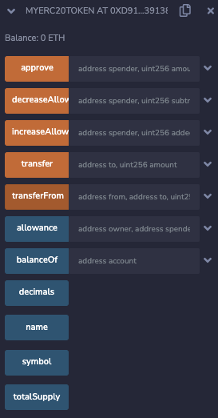

The ERC-20 is a standard that allows for the development of fungible tokens and helps sites and apps, such as exchanges, know how to find and display information about these tokens. You can leverage existing implementations, such as the one by [OpenZeppelin] to develop your own tokens.

---

## Objectives

By the end of this lesson you should be able to:

- Describe OpenZeppelin
- Import the OpenZeppelin ERC-20 implementation
- Describe the difference between the ERC-20 standard and OpenZeppelin's ERC20.sol
- Build and deploy an ERC-20 compliant token

---

## Setting Up the Contract

Create a new Solidity file, add the license and pragma, and import the ERC-20 implementation linked above.

Add a contract called `MyERC20Token` that inherits from `ERC20`.

```solidity
// SPDX-License-Identifier: MIT

pragma solidity ^0.8.17;

import "https://github.com/OpenZeppelin/openzeppelin-contracts/blob/master/contracts/token/ERC20/ERC20.sol";

contract MyERC20Token is ERC20 {

}
```

### Adding a Constructor

Review the constructor on line 53 of the [OpenZeppelin] implementation. It requires strings for the name and symbol you wish to use for your token. They're using a slightly different naming convention by putting the `_` after the name of the parameters. Like any other function, you can pass variables of **any** name as long as they're the right type, so feel free to continue adding the `_` in front in your contract's constructor:

```solidity
constructor(string memory _name, string memory _symbol) ERC20(_name, _symbol) {

}
```

:::caution

There is neither a governing body nor built-in programmatic rules preventing you, or anyone else, from using the same name and symbol as an already in-use token. Scammers often take advantage of this fact, and even well-meaning developers can cause confusion by not being careful here.

:::

That's it. You're done! Deploy and test, and you should see all of the functionality called for by the standard and provided by the OpenZeppelin implementation.



Do some testing. You'll see that the `totalSupply` and all balances are zero.

By default, the decimal for the token will be 18, which is the most common choice. Remember, there aren't decimal types yet, so 1.0 ETH is really a `uint` holding 1 \* 10\*\*18, or 1000000000000000000.

---

## ERC-20 Further Testing

Line 251 of the [OpenZeppelin] implementation contains a `_mint` function, but it's internal. As a result, you'll need to figure out a minting mechanism and add it via your own contract.

### Minting in the Constructor

One method of using the `_mint` function is to create an initial supply of tokens in the constructor. Add a call to `_mint` that awards 1 full token to the contract creator. Remember, the decimal is 18. Minting literally `1` is creating a tiny speck of dust.

```solidity
constructor(string memory _name, string memory _symbol) ERC20(_name, _symbol) {
    _mint(msg.sender, 1 * 10**18);
}
```

Redeploy. Without you needing to do anything, you should find that the `totalSupply` is now 1000000000000000000, as is the `balanceOf` the deploying address.

You can also use this to mint to other users. Go ahead and add the second and third accounts:

<details>

<summary>Reveal code</summary>

```solidity
constructor(string memory _name, string memory _symbol) ERC20(_name, _symbol) {
    _mint(msg.sender, 1 * 10**18);
    _mint(0xAb8483F64d9C6d1EcF9b849Ae677dD3315835cb2, 1 * 10**18);
    _mint(0x4B20993Bc481177ec7E8f571ceCaE8A9e22C02db, 1 * 10**18);
}
```

</details>

<br/>


**Switch back** to the first account and redeploy. Test to confirm that each account has the appropriate amount of tokens.

### Testing the Transfer Function

Try using the `transfer` function to move tokens around.

What happens if you try to burn a token by sending it to the zero address? Give it a try!

You'll get an error, because protecting from burning is built into the `_transfer` function.

```text
transact to MyERC20Token.transfer pending ...
transact to MyERC20Token.transfer errored: VM error: revert.

revert
	The transaction has been reverted to the initial state.
Reason provided by the contract: "ERC20: transfer to the zero address".
Debug the transaction to get more information.
```

### Testing the Transfer From Function

You might have noticed that there's another function called `transferFrom`. What's that for? Check the documentation in the contract to find out!

This function works with the `allowance` function to give the owner of one wallet permission to spend up to a specified amount of tokens owned by another. Exchanges can make use of this to allow a user to post tokens for sale at a given price without needing to take possession of them.

---

## ERC-20 Final Thoughts

The world is still figuring out how to handle all of the new possibilities tokens provide. Old laws are being applied in new ways, and new laws are being written. Different jurisdictions are doing this in unique and sometimes conflicting ways.

You should consult with a lawyer in your jurisdiction before releasing your own tokens.

---

## Conclusion

In this lesson, you've learned how easy it is to create an ERC-20 compliant token by using the OpenZeppelin implementation. You've reviewed at least one method to mint an initial supply of tokens, and that it's up to you to figure out the best way to create your tokens and follow all relevant laws and regulations.

---

[OpenZeppelin]: https://github.com/OpenZeppelin/openzeppelin-contracts/blob/master/contracts/token/ERC20/ERC20.sol
