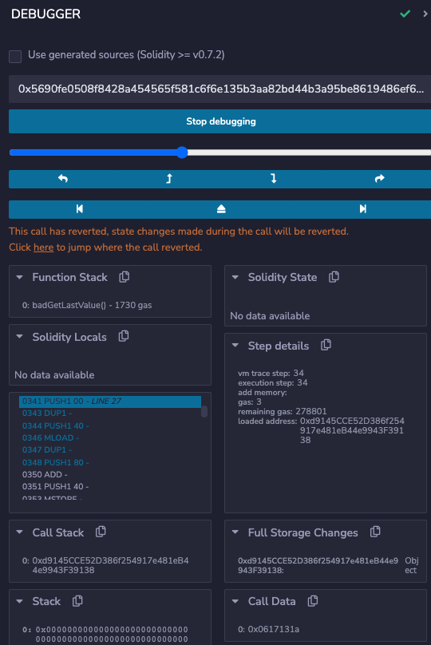
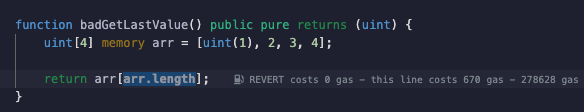
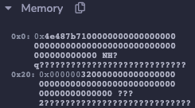
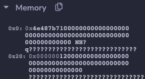

Debugging is a part of every language, platform, and framework. The EVM is a unique and relatively constrained computer, so you'll encounter some types of errors that may be unfamiliar. In this article, we'll explore some of the more common ones and share methods for resolving them.

---

## Objectives

By the end of this lesson you should be able to:

- Debug common solidity errors including transaction reverted, out of gas, stack overflow, value overflow/underflow, index out of range, etc.

---

## Compiler Errors

Compiler errors are manifold but almost always very easy to debug, since the error message usually tells you what is wrong and how to fix it.

### Type Errors

You will get a compiler error if you try to assign a literal to the wrong type.

```solidity
// Bad code example, do not use
function compilerTypeError() public pure returns (uint) {
    uint myNumber = "One";
    return myNumber;
}
```

```text
from solidity:
TypeError: Type literal_string "One" is not implicitly convertible to expected type uint256.
 --> contracts/ErrorTriage.sol:8:9:
  |
8 |         uint myNumber = "One";
  |         ^^^^^^^^^^^^^^^^^^^^^
```

Fix by correcting the type or value, as appropriate for your needs:

<details>

<summary>Reveal code</summary>


```solidity
function compilerTypeErrorFixed() public pure returns (string) {
    string myNumber = "One";
    return myNumber;
}
```

</details>

<br/>

### Conversion Errors

Conversion errors occur when you attempt to _implicitly_ convert one type to another. Solidity only allows this under very narrow circumstances where there is no possibility of ambiguous interpretation of the data.

```solidity
// Bad code example, do not use
function compilerConversionError() public pure returns (uint) {
    int8 first = 1;

    return first;
}
```

```text
from solidity:
TypeError: Return argument type int8 is not implicitly convertible to expected type (type of first return variable) uint256.
  --> contracts/ErrorTriage.sol:15:16:
   |
15 |         return first;
   |                ^^^^^
```

Fix by explicitly casting as necessary:

<details>

<summary>Reveal code</summary>


```solidity
function compilerConversionErrorFixed() public pure returns (uint) {
    int8 first = 1;

    return uint(uint8(first));
}
```

</details>

<br/>

:::tip

You'll commonly need to use multiple conversions to bridge from one type to another.

:::

### Operator Errors

You cannot use operators between types as flexibly as you may be used to.

```solidity
// Bad code example, do not use
function compilerOperatorError() public pure returns (uint) {
    int8 first = 1;
    uint256 second = 2;

    uint sum = first + second;

    return sum;
}
```

Operator errors are often paired with a type error.

```text
from solidity:
TypeError: Operator + not compatible with types int8 and uint256.
  --> contracts/ErrorTriage.sol:22:20:
   |
22 |         uint sum = first + second;
   |                    ^^^^^^^^^^^^^^

from solidity:
TypeError: Type int8 is not implicitly convertible to expected type uint256.
  --> contracts/ErrorTriage.sol:22:9:
   |
22 |         uint sum = first + second;
   |         ^^^^^^^^^^^^^^^^^^^^^^^^^
```

Resolve by explicitly converting to the final type:

<details>

<summary>Reveal code</summary>


```
function compilerOperatorErrorFixed() public pure returns (uint) {
    int8 first = 1;
    uint256 second = 2;

    uint sum = uint(uint8(first)) + second;

    return sum;
}
```

</details>

<br/>

### Stack Depth Limit

The [EVM stack] has 1024 slots, but only the top 16 slots are accessible. As a result, you can only have fewer than 16 variables in scope at one time.

:::caution

Other items can also use up these slots. You are **not** guaranteed 15 slots, it can be lower.

:::

```solidity
// Bad code example, do not use
function stackDepthLimit() public pure returns (uint) {
        uint first = 1;
        uint second = 2;
        uint third = 3;
        uint fourth = 4;
        uint fifth = 5;
        uint sixth = 6;
        uint seventh = 7;
        uint eighth = 8;
        uint ninth = 9;
        uint tenth = 10;
        uint eleventh = 11;
        uint twelfth = 12;
        uint thirteenth = 13;
        uint fourteenth = 14;
        uint fifteenth = 15;
        uint sixteenth = 16;

        return first +
                second +
                third +
                fourth +
                fifth +
                sixth +
                seventh +
                eighth +
                ninth +
                tenth +
                eleventh +
                twelfth +
                thirteenth +
                fourteenth +
                fifteenth +
                sixteenth;
    }
```

```text
from solidity:
CompilerError: Stack too deep. Try compiling with --via-ir (cli) or the equivalent viaIR: true (standard JSON) while enabling the optimizer. Otherwise, try removing local variables.
  --> contracts/ErrorTriage.sol:92:17:
   |
92 |                 eighth +
   |                 ^^^^^^
```

Resolve this error by breaking up large functions and separating operations into different levels of scope.

<details>

<summary>Reveal code</summary>


```solidity
function stackDepthLimitFixed() public pure returns (uint) {
    uint subtotalA;
    {
        uint first = 1;
        uint second = 2;
        uint third = 3;
        uint fourth = 4;
        uint fifth = 5;
        uint sixth = 6;
        uint seventh = 7;
        uint eighth = 8;
        subtotalA = first +
            second +
            third +
            fourth +
            fifth +
            sixth +
            seventh +
            eighth;
    }

    uint subtotalB;
    {
        uint ninth = 9;
        uint tenth = 10;
        uint eleventh = 11;
        uint twelfth = 12;
        uint thirteenth = 13;
        uint fourteenth = 14;
        uint fifteenth = 15;
        uint sixteenth = 16;
        subtotalB = ninth +
            tenth +
            eleventh +
            twelfth +
            thirteenth +
            fourteenth +
            fifteenth +
            sixteenth;
    }

    return subtotalA + subtotalB;
}
```

</details>

<br/>

---

## Logical Errors

Logical errors occur when your code is syntactically correct, but still results in a data state that is a violation of the rules of the language.

A [panic] occurs when your code tries to do an illegal operation. These return with a very basic error code, which Remix unfortunately hides. However, it makes up for that annoyance by providing a very powerful debugger.

:::caution

The Remix VM doesn't behave exactly the same as true onchain operations, so note that these errors will not behave exactly the same if triggered while testing with Hardhat, or called from a front end.

:::caution

For each of these examples, copy them into Remix to explore with the debugger on your own.

### Array Index Out-of-Bounds

A panic will be triggered if you try to access an array at an invalid index.

```solidity
// Bad code example, do not use
function badGetLastValue() public pure returns (uint) {
    uint[4] memory arr = [uint(1), 2, 3, 4];

    return arr[arr.length];
}
```

Running this function will result in the following error in the console:

```text
call to ErrorTriage.badGetLastValue errored: VM error: revert.

revert
	The transaction has been reverted to the initial state.
Note: The called function should be payable if you send value and the value you send should be less than your current balance.
Debug the transaction to get more information.
```

Click the _Debug_ button to open the debugger.



The debugger contains panels with information about variables in storage, memory, what's on the stack, and so on. You can also add breakpoints to lines of code to further help with debugging.

One of the most useful features is the link near the top instructing you to _"Click here to jump where the call reverted."_

Click that link and the debugger will jump to the point of failure, **and highlight the code that caused the panic.** Neat!



You can find the specific error here, but it's difficult.

Look in the _Memory_ panel. The first item at `0x0` has a hash starting with `0x4e487b71`. This code indicates a panic.

The second item, at `0x20` has the error code of `32` hidden in it, which is for array out-of-bounds.



It's sometimes better to just review the code first to see if the error is obvious.

```solidity
function badGetLastValueFixed() public pure returns (uint) {
    uint[4] memory arr = [uint(1), 2, 3, 4];

    return arr[arr.length-1];
}
```

### Out of Gas

The default settings for Remix make it difficult to trigger an out of gas error because the VM will often crash first. For this example, go to the _Deploy & Run Transactions_ tab and reduce the gas limit to **300000**.

If you write code that can have an ambiguous execution time, it becomes very difficult to accurately estimate gas limits.

In this example, each loop has a 1 in 1000 chance of ending.

:::warning

`block.timestamp` can be manipulated. **DO NOT** use this as a source of randomness if any value can be derived from one outcome over another!

:::

```solidity
// Bad code example, do not use
function badRandomLoop() public view returns (uint) {
    uint seed = 0;
    // DO NOT USE THIS METHOD FOR RANDOM NUMBERS!!! IT IS EASILY EXPLOITABLE!!!
    while(uint(keccak256(abi.encodePacked(block.timestamp, seed))) % 1000 != 0) {
        seed++;
        // ...do something
    }

    return seed;
}
```

Run this function a few times. Often, it will work just fine. Other times, an error appears:

```text
call to ErrorTriage.badLoop errored: VM error: out of gas.

out of gas
	The transaction ran out of gas. Please increase the Gas Limit.

Debug the transaction to get more information.
```

The error message here is a bit misleading. You do **not** usually want to fix this by increasing the gas limit. If you're getting a gas error because the transaction didn't estimate for enough gas, it's better to refactor for better predictability.

```solidity
function badRandomLoopFixed() public view returns (uint) {
    // DO NOT USE THIS METHOD FOR RANDOM NUMBERS!!! IT IS EASILY EXPLOITABLE!!!
    uint times = uint(keccak256(abi.encodePacked(block.timestamp))) % 1000;

    for(uint i = 0; i <= times; i++) {
        // ...do something
    }

    return times;
}
```

### Overflow or Underflow

The `uint` type will _panic_ in the event of an overflow or underflow.

```solidity
function badSubtraction() public pure returns (uint) {
    uint first = 1;
    uint second = 2;
    return first - second;
}
```

As before, you can see the panic code and panic type in _memory_.


In this case, the error type is `11`, for overflow/underflow outside of an `unchecked` block.

Fix by changing your code to handle the expected range of values.

<details>

<summary>Reveal code</summary>


```solidity
function badSubstractionFixed() public pure returns (int) {
    int first = 1;
    int second = 2;
    return first - second;
}
```

</details>

<br/>

### Divide by Zero

Divide by zero errors also trigger a panic, with a code of `12`.

```solidity
function badDivision() public pure returns (uint) {
    uint first = 1;
    uint second = 0;
    return first / second;
}
```



Don't divide by zero.

---

## Conclusion

In this lesson, you reviewed the causes of and solutions for a number of compiler errors and logical errors that you may encounter.

---

[panic]: https://docs.soliditylang.org/en/v0.8.17/control-structures.html?#panic-via-assert-and-error-via-require
[EVM stack]: https://docs.soliditylang.org/en/v0.8.17/introduction-to-smart-contracts.html#storage-memory-and-the-stack
