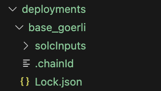

In this article, you'll learn how to deploy smart contracts to multiple Blockchain networks using Hardhat and Hardhat deploy.

---

## Objectives

By the end of this lesson, you should be able to:

- Deploy a smart contract to the Base Sepolia Testnet with hardhat-deploy
- Deploy a smart contract to the Sepolia Testnet with hardhat-deploy
- Use BaseScan to view a deployed smart contract

---

## Overview

Hardhat capabilities enable developers to deploy smart contracts easily to any Blockchain by simply creating `tasks` or `scripts`. However, due to the Hardhat architecture that enables its extension by creating plugins, you can rely on existing solutions developed by the community.

[Hardhat deploy](https://github.com/wighawag/hardhat-deploy) is a community-developed plugin that enables the deployment of your smart contracts in a simple way.

## Setting up Hardhat deploy

To install:

1. Run `npm install -D hardhat-deploy`. Then, import hardhat-deploy in `hardhat.config.ts`:

```tsx
import 'hardhat-deploy';
```

2. Create a folder called deploy and inside it create a new file called `001_deploy_lock.ts`.

3. Include the following:

```tsx
import { HardhatRuntimeEnvironment } from 'hardhat/types';
import { DeployFunction } from 'hardhat-deploy/types';

const func: DeployFunction = async function (hre: HardhatRuntimeEnvironment) {
  // code here
};
export default func;
```

4. Modify the `tsconfig.json` file to look like:

```json
{
  "compilerOptions": {
    "target": "es2020",
    "module": "commonjs",
    "esModuleInterop": true,
    "forceConsistentCasingInFileNames": true,
    "strict": true,
    "skipLibCheck": true,
    "resolveJsonModule": true
  },
  "include": ["./hardhat.config.ts", "./scripts", "./deploy", "./test"]
}
```

5. Before implementing the deploy functionality, configure a deployer account in the `hardhat.config.ts` file. Hardhat deployment includes a way to name accounts in the config file.

6. Run the following, which adds an alias to the account 0 of your environment:

```tsx
const config: HardhatUserConfig = {
  solidity: '0.8.23',
  namedAccounts: {
    deployer: 0,
  },
};
```

7. Implement the deploy function by including the following in the `001_deploy_lock.ts` file:

```tsx
import { HardhatRuntimeEnvironment } from 'hardhat/types';
import { DeployFunction } from 'hardhat-deploy/types';
import { ethers } from 'hardhat';

const func: DeployFunction = async function (hre: HardhatRuntimeEnvironment) {
  const { deploy } = hre.deployments;
  // We can now use deployer
  const { deployer } = await hre.getNamedAccounts();

  // The value we want to lock
  const VALUE_LOCKED = hre.ethers.parseEther('0.01');

  // The unlock time after deployment
  const UNLOCK_TIME = 10000;

  // We use ethers to get the current time stamp
  const blockNumber = await ethers.provider.getBlockNumber();
  const lastBlockTimeStamp = (await ethers.provider.getBlock(blockNumber))?.timestamp as number;

  // We say we want to deploy our Lock contract using the deployer
  // account and passing the value and arguments.
  await deploy('Lock', {
    from: deployer,
    args: [lastBlockTimeStamp + UNLOCK_TIME],
    value: VALUE_LOCKED.toString(),
  });
};

export default func;

// This tag will help us in the next section to trigger this deployment file programmatically
func.tags = ['DeployAll'];
```

## Testing your deployment

The easiest way to test your deployment is by modifying the test.

Go to `Lock.ts` and include in the imports the following:

```tsx
import { ethers, deployments } from 'hardhat';
```

`deployments` will allow you to execute the deployment files from your test.

Change the `before` function to look like the following:

```tsx
before(async () => {
  lastBlockTimeStamp = await time.latest();

  const signers = await ethers.getSigners();
  ownerSigner = signers[0];
  otherUserSigner = signers[1];

  await deployments.fixture(['DeployAll']);
  const lockDeployment = await deployments.get('Lock');

  lockInstance = Lock__factory.connect(lockDeployment.address, ownerSigner);
});
```

Notice how you execute `deployments.fixture` and pass a tag that matches the one you specified in the deployment file (`001_deploy_lock.ts`).

The deployment file is then executed and you can then reuse that functionality and simply consume the address of the newly-deployed contract by using:

```tsx
const lockDeployment = await deployments.get('Lock');
```

Reuse `Lock__factory` but use the connect function and pass the address of the newly-created contract plus a signer. Then, run `npx hardhat test` and you should get the same result:

```
  Lock
    ✔ should get the unlockTime value
    ✔ should have the right ether balance
    ✔ should have the right owner
    ✔ shouldn't allow to withdraw before unlock time (51ms)
    ✔ shouldn't allow to withdraw a non owner
    ✔ should allow to withdraw a owner

  6 passing (2s)
```

## Deploying to a test network

Deploying to a real test network involves configuring the network parameters in the hardhat config file. You need to include parameters such as:

- The JSON RPC URL
- The account you want to use
- Real test ether or the native Blockchain token for gas costs

Include the following in the `hardhat.config.ts` file:

```tsx
const config: HardhatUserConfig = {
  solidity: '0.8.18',
  namedAccounts: {
    deployer: 0,
  },
  networks: {
    base_sepolia: {
      url: 'https://sepolia.base.org',
      accounts: {
        mnemonic: process.env.MNEMONIC ?? '',
      },
    },
    sepolia: {
      url: `https://eth-sepolia.g.alchemy.com/v2/${process.env.ALCHEMY_SEPOLIA_KEY ?? ''}`,
      accounts: {
        mnemonic: process.env.MNEMONIC ?? '',
      },
    },
  },
};
```

You've configured 2 networks:

- base_sepolia
- sepolia

You also need to create a `.env` file with the following variables:

```
MNEMONIC="<REPLACE WITH YOUR MNEMONIC>"
ALCHEMY_SEPOLIA_KEY=<REPLACE WITH YOUR API KEY>
```

In order to ensure the environment variables are loaded, you need to install another package called `dotenv`:

```bash
npm install -D dotenv
```

Then, include the following in the `hardhat.config.ts` file:

```tsx
import dotenv from 'dotenv';

dotenv.config();
```

Deploy to base with the following command:

```bash
npx hardhat deploy --network base_sepolia
```

After you run the command, a deployments folder appears with a newly-created deployment for `base_sepolia`:



If you want to deploy to another network, change the network name as follows:

```bash
npx hardhat deploy --network sepolia
```

:::info

Be aware that you must have the correct environment variables for the JSON RPC URLs. For example, for Sepolia use `ALCHEMY_SEPOLIA_KEY`.

:::

## Conclusion

In this lesson, you've learned how to deploy smart contracts using Hardhat and Hardhat-deploy. You have configured hardhat to easily deploy to multiple networks and you created deployment files to abstract this task.

---

## See also

[Solidity Docs](https://docs.soliditylang.org/en/v0.8.17/)
[Remix Project]: https://remix-project.org/
[Hardhat]: https://hardhat.org/
[Hardhat Deploy]: https://github.com/wighawag/hardhat-deploy
