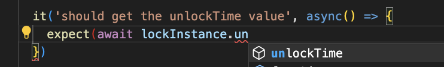

In this article, you'll learn how to test smart contracts with Hardhat and Typechain.

---

## Objectives

By the end of this lesson, you should be able to:

- Set up TypeChain to enable testing
- Write unit tests for smart contracts using Mocha, Chai, and the Hardhat Toolkit
- Set up multiple signers and call smart contract functions with different signers

---

## Overview

Testing is an important aspect of software development and developing smart contracts is no different. In fact, you need to be more careful because
smart contracts usually manage money and live in an adversarial environment, where anyone can see the code and interact with your smart contract. This means you can expect bad actors to try to exploit your smart contracts.

## Setup Typechain

In the previous guide, you created a new project using the `init` command that by default installs `@nomicfoundation/hardhat-toolbox`. This package already contains Typechain, which is a plugin that generates static types for your smart contracts. This means you can interact with your contracts and get immediate feedback about the parameters received by a particular function and the functions of a smart contract.

The best way to see its true potential is to start writing tests.

After compiling the hardhat project in the previous lesson, a new folder called `typechain-types` was created, which Typechain is already installed and running.

### Writing your first unit test with Typechain

Hardhat includes a sample smart contract named `Lock.sol` and a sample test inside the test folder named `Lock.ts`.

In the following, you reuse this smart contract but rewrite the test using Typechain.

To remove the body of the `Lock.ts` file:

```tsx
import { expect } from 'chai';
import { ethers } from 'hardhat';

describe('Lock', function () {});
```

Then, import two files from `typechain-types`, `Lock`, and `Lock__Factory`.

Typechain always creates two files per contract. The first one `Lock` refers to the type and functions of a particular contract. `Lock__Factory` is used to deploy the Lock contract or to create instances of a particular contract.

The `Lock.sol` contract allows the creator to lock Ether until an unlock time has passed.

Notice the constructor has a payable keyword:

```tsx
constructor(uint _unlockTime) payable {
        require(
            block.timestamp < _unlockTime,
            "Unlock time should be in the future"
        );

        unlockTime = _unlockTime;
        owner = payable(msg.sender);
    }
```

This means the contract is expecting to receive an amount of ether.

Next, test the following:

- The unlock time value
- The value locked during creation
- The owner address
- The withdraw function

<details>

<summary>Reveal code</summary>

Start with the value locked, however you must set up a `before` function, which will run before each test case.

Then, include some new imports and variables:

```tsx
import { expect } from 'chai';
import { ethers } from 'hardhat';

// A helper utility to get the timestamp.
import { time } from '@nomicfoundation/hardhat-network-helpers';

// We import this type to have our signers typed.
import { SignerWithAddress } from '@nomicfoundation/hardhat-ethers/signers';

// Types from typechain
import { Lock__factory, Lock } from '../typechain-types';

describe('Lock', function () {
  // This represents the time in the future we expect to release the funds locked.
  const UNLOCK_TIME = 10000;

  // The amount of ether we plan to lock.
  const VALUE_LOCKED = ethers.parseEther('0.01');

  // This variable will store the last block timestamp.
  let lastBlockTimeStamp: number;

  // Typechain allow us to type an instance of the Lock contract.
  let lockInstance: Lock;

  // This is the Signer of the owner.
  let ownerSigner: SignerWithAddress;

  // A non owner signed is useful to test non owner transactions.
  let otherUserSigner: SignerWithAddress;

  before(async () => {
    // We get the latest block.timestamp using the latest function of time.
    lastBlockTimeStamp = await time.latest();

    // Hardhat provide us with some sample signers that simulate Ethereum accounts.
    const signers = await ethers.getSigners();

    // We simply assign the first signer to ownerSigner
    ownerSigner = signers[0];

    // We assign the second signer to otherUserSigner
    otherUserSigner = signers[1];

    // We estimate unlockTime to be the last time stamp plus UNLOCK_TIME
    const unlockTime = lastBlockTimeStamp + UNLOCK_TIME;

    // Notice how we use the Lock__factory and pass a signer. Then we deploy by passing the unlockTime and the amount of ether we will lock.
    lockInstance = await new Lock__factory(ownerSigner).deploy(unlockTime, {
      value: VALUE_LOCKED,
    });
  });
});
```

</details>

### Testing `unlockTime`

Next, you include test cases after the `before` function.

The first test case should verify that the `unlockTime` variable is correct.

<details>

<summary>Reveal code</summary>

```tsx
it('should get the unlockTime value', async () => {
  // we get the value from the contract
  const unlockTime = await lockInstance.unlockTime();

  // We assert against the
  expect(unlockTime).to.equal(lastBlockTimeStamp + UNLOCK_TIME);
});
```

Notice how autocomplete appears after entering `lockInstance`:



You can simply run `npx hardhat test` and then get:

```
  Lock
    ✔ should get the unlockTime value

  1 passing (1s)
```

</details>

### Testing Ether balance

In order to get the balance of your `Lock` contract, you simply call `ethers.provider.getBalance`.

Create a new test case:

<details>

<summary>Reveal code</summary>

```tsx
it('should have the right ether balance', async () => {
  // Get the Lock contract address
  const lockInstanceAddress = await lockInstance.getAddress();

  // Get the balance using ethers.provider.getBalance
  const contractBalance = await ethers.provider.getBalance(lockInstanceAddress);

  // We assert the balance against the VALUE_LOCKED we initially sent
  expect(contractBalance).to.equal(VALUE_LOCKED);
});
```

</details>
<br/>

Then, run `npx hardhat test` and you should get:

```
  Lock
    ✔ should get the unlockTime value
    ✔ should have the right ether balance

  2 passing (1s)
```

### Testing `owner`

Similar to the previous test cases, you can verify that the owner is correct.

<details>

<summary>Reveal code</summary>

```tsx
it('should have the right owner', async () => {
  // Notice ownerSigned has an address property
  expect(await lockInstance.owner()).to.equal(ownerSigner.address);
});
```

</details>
<br/>

Then, run `npx hardhat test` and you should get:

```
  Lock
    ✔ should get the unlockTime value
    ✔ should have the right ether balance
    ✔ should have the right owner

  3 passing (1s)
```

### Testing withdraw

Testing withdrawal is more complex because you need to assert certain conditions, such as:

- The owner cannot withdraw before the unlock time.
- Only the owner can withdraw.
- The withdraw function works as expected.

Hardhat allow you to test reverts with a set of custom matchers.

For example, the following code checks that an attempt to call the function `withdraw` reverts with a particular message:

```tsx
it('shouldn"t allow to withdraw before unlock time', async () => {
  await expect(lockInstance.withdraw()).to.be.revertedWith("You can't withdraw yet");
});
```

In addition, Hardhat also allows you to manipulate the time of the environment where the tests are executed. You can think of it as a Blockchain that is running before the tests and then the tests are executed against it.

You can modify `the block.timestamp` by using the time helper:

```tsx
it('shouldn"t allow to withdraw a non owner', async () => {
  const newLastBlockTimeStamp = await time.latest();

  // We set the next block time stamp using this helper.
  // We assign a value further in the future.
  await time.setNextBlockTimestamp(newLastBlockTimeStamp + UNLOCK_TIME);

  // Then we try to withdraw using other user signer. Notice the .connect function that is useful
  //  to create and instance but have the msg.sender as the new signer.
  const newInstanceUsingAnotherSigner = lockInstance.connect(otherUserSigner);

  // We attempt to withdraw, but since the sender is not the owner, it will revert.
  await expect(newInstanceUsingAnotherSigner.withdraw()).to.be.revertedWith("You aren't the owner");
});
```

Finally, test that the owner can withdraw. You can manipulate the time similarly to the previous test case but you won't change the signer and will assert the new balances.

<details>

<summary>Reveal code</summary>

```tsx
it('should allow to withdraw a owner', async () => {
  const balanceBefore = await ethers.provider.getBalance(await lockInstance.getAddress());

  // Its value will be the one we lock at deployment time.
  expect(balanceBefore).to.equal(VALUE_LOCKED);

  const newLastBlockTimeStamp = await time.latest();

  // We increase time
  await time.setNextBlockTimestamp(newLastBlockTimeStamp + UNLOCK_TIME);

  // Attempt to withdraw
  await lockInstance.withdraw();

  // Get new balance and assert that is 0
  const balanceAfter = await ethers.provider.getBalance(await lockInstance.getAddress());
  expect(balanceAfter).to.equal(0);
});
```

</details>

<br/>

You can then run `npx hardhat test` and you should get:

```
  Lock
    ✔ should get the unlockTime value
    ✔ should have the right ether balance
    ✔ should have the right owner
    ✔ shouldn"t allow to withdraw before unlock time (51ms)
    ✔ shouldn"t allow to withdraw a non owner
    ✔ should allow to withdraw a owner

  6 passing (2s)
```

## Conclusion

In this lesson, you've learned how to test smart contracts using Hardhat and Typechain.

---

## See also

[Solidity Docs](https://docs.soliditylang.org/en/v0.8.17/)
[Remix Project]: https://remix-project.org/
[Hardhat]: https://hardhat.org/
