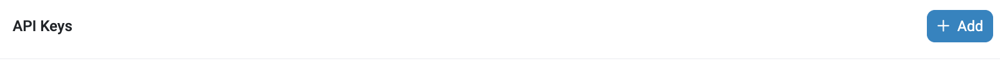
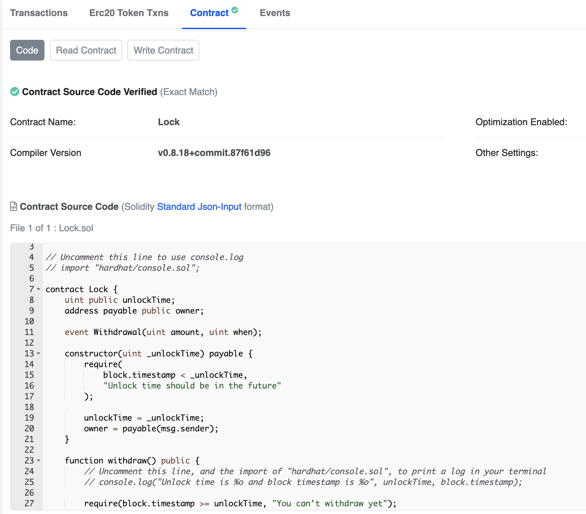

In this article, you'll learn how to verify smart contracts in Etherscan with hardhat and the hardhat deploy plugin.

---

## Objectives

By the end of this lesson, you should be able to:

- Verify a deployed smart contract on Etherscan
- Connect a wallet to a contract in Etherscan
- Use etherscan to interact with your own deployed contract

---

## Overview

Verifying smart contracts plays an important role in providing security and certainty to the users of your decentralized applications. By offering full visibility of the source code of your smart contract, you provide confidence and transparency of the intention of the code that is being executed.

The way smart contracts are verified is by simply uploading the source code and contract address to services such as Etherscan.

Once the contract is verified, the Etherscan explorer shows a status like the following image:


Luckily, Hardhat and Hardhat-deploy already contain a built-in capability to do this task easily on your behalf.

This process involves the following steps:

1. Getting an Etherscan key
2. Configuring Hardhat
3. Verifying

## Getting an Etherscan key

In order to obtain an Etherscan API key, visit [Etherscan](https://etherscan.io/) and create an account.

Then, go to [https://etherscan.io/myapikey](https://etherscan.io/myapikey) and create an API key by clicking the **Add** button:



Bear in mind that different networks have other Blockchain explorers. For example:

- [Base](https://basescan.org/)
- [Sepolia](https://sepolia.etherscan.io/)

You'll need to go to that particular explorer and get the API Key following a similar process as mentioned previously (except for Sepolia Etherscan, where you can use the Etherscan mainnet one instead).

## Configuring Hardhat

You can configure the Etherscan API Key for each different network. For example, include the following to the `hardhat.config.ts` file for Base Sepolia:

```tsx
base_sepolia: {
  url: "https://sepolia.base.org",
  accounts: {
    mnemonic: process.env.MNEMONIC ?? ""
  },
  verify: {
    etherscan: {
      apiUrl: "https://api-sepolia.basescan.org",
      apiKey: process.env.ETHERSCAN_API_KEY
    }
  }
}
```

Include in your `.env` file the following:

```
ETHERSCAN_API_KEY=<YOUR_ETHERSCAN_API_KEY>
```

## Verifying

You verify in base, and to do so, simply run the following command:

```bash
npx hardhat --network base_sepolia etherscan-verify
```

You should receive the following response:

```
verifying Lock ...
waiting for result...
 => contract Lock is now verified
```

You can now go to Basescan and search for your contract address, where you'll see the following:



## Conclusion

In this lesson, you've learned how to verify smart contracts using Hardhat and Hardhat-deploy. You learned how to configure Hardhat to support multiple networks and verify by using a simple command.

---

## See also

[Solidity Docs]: https://docs.soliditylang.org/en/v0.8.17/
[Remix Project]: https://remix-project.org/
[Hardhat Deploy]: https://github.com/wighawag/hardhat-deploy
