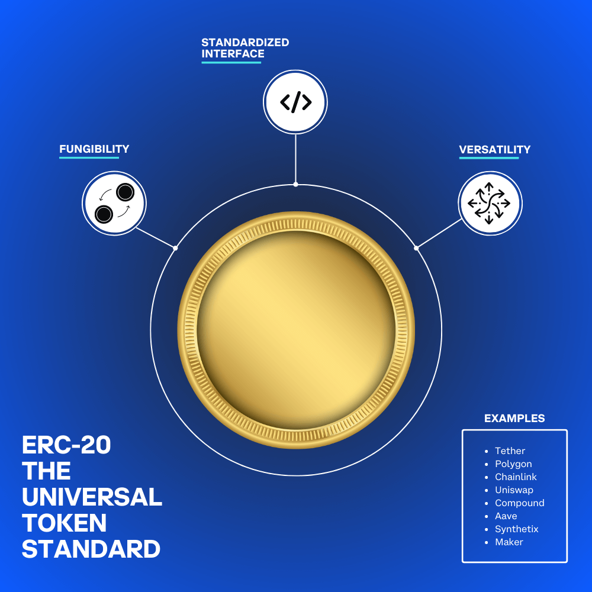
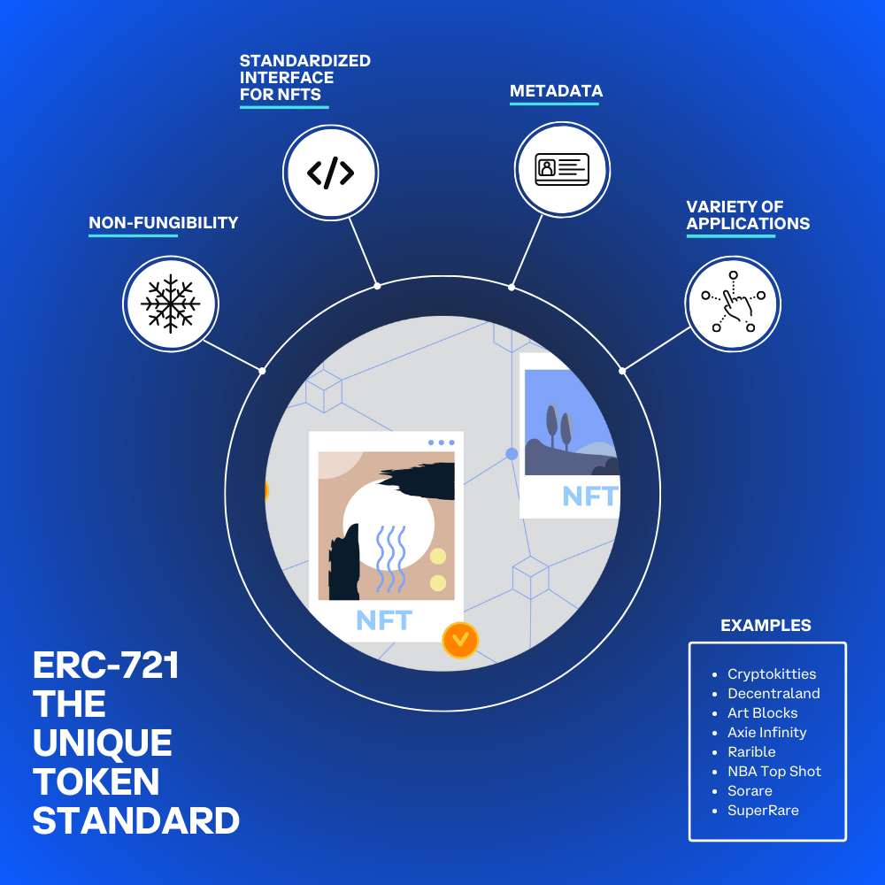
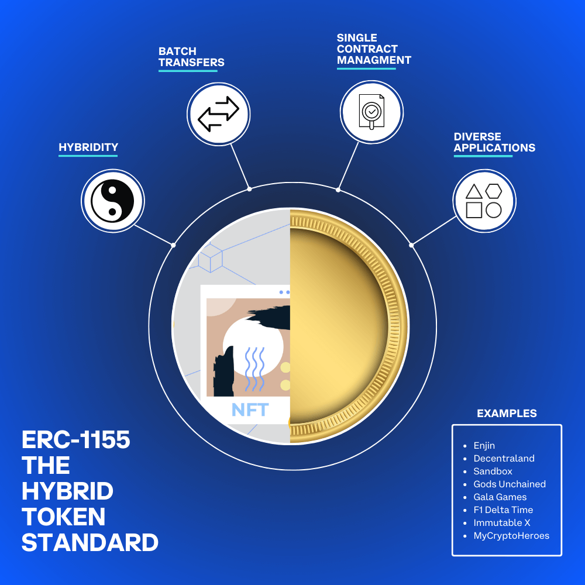

This article will provide an overview of the most popular token standards on Ethereum, including ERC-20, ERC-721, ERC-1155, and a discussion on their properties and various use cases.

---

## Objectives:

By the end of this lesson you should be able to:

- Describe the properties of ERC-20 and ERC-721 tokens
- List popular ERC-721 tokens
- List the uses for ERC-20, ERC-721, and ERC-1155 tokens

---

## ERC Token Standards

Ethereum Request for Comments (or, ERC) is a term used to describe technical proposals and standards for Ethereum. An ERC is authored by developers and members of the Ethereum community to suggest improvements, new features, or guidelines for creating and managing tokens and smart contracts. Once an ERC is submitted, it undergoes review and discussion by the community. If it gains consensus, it can then be implemented or adopted as a standard in the ecosystem.

Token standards on Ethereum form the backbone of the digital asset ecosystem. They are a set of predefined rules and guidelines that govern the creation, management, and interaction of tokens on the network. These standards ensure that tokens are compatible with various apps, wallets, and other tokens within the Ethereum ecosystem. Token standards allow developers to create tokens with consistent behavior, facilitating seamless interaction and interoperability within the network.

---

## ERC-20

ERC-20 tokens, the most widely-used token standard on Ethereum, possess several key properties that make them versatile and flexible for various applications. One of the defining characteristics of these tokens is their fungibility. Each unit of an ERC-20 token is interchangeable and holds equal value to another unit of the same token, rendering them indistinguishable from one another. In other words, one USDC token is always equal in value and interchangeable with another USDC token.

Another aspect of ERC-20 tokens is their standardized interface, which includes a set of six mandatory functions: `totalSupply()`, `balanceOf(address)`, `transfer(address, uint256)`, `transferFrom(address, address, uint256)`, `approve(address, uint256)`, and `allowance(address, address)`. This standardization ensures consistency when interacting with these tokens, irrespective of their specific implementation or use case. For example, a user can easily check their token balance or transfer tokens using the same set of functions, whether they are interacting with a governance token like UNI or a stablecoin like DAI.

Some notable applications of ERC-20 tokens include utility tokens (FIL, BAT, MANA), governance tokens (UNI, AAVE, COMP), and stablecoins (USDC, USDT, DAI).

---

## ERC-721

ERC-721 is a prominent token standard specifically designed for NFTs, allowing for the creation and management of unique, indivisible digital assets that each have their own special properties.

In contrast to ERC-20 tokens, which are fungible and can be easily exchanged, ERC-721 tokens are non-fungible and can't be swapped on a one-to-one basis. Every token has its own attributes that set it apart from the rest. This one-of-a-kind nature enables the representation of a wide range of digital assets, including digital art, virtual real estate, and collectibles. For example, an artist could mint a one-of-a-kind digital painting, a virtual land parcel could be tokenized in a metaverse, or a rare sports card could be digitized as a collectible NFT.

ERC-721 tokens, like ERC-20 tokens, follow a standardized interface but employ a unique set of functions designed for non-fungible tokens, which allow developers to interact with NFTs across multiple platforms. For instance, a developer would use the same set of functions to interact with a digital artwork NFT listed on OpenSea as they would with a virtual land parcel NFT in Decentraland.

Besides their unique qualities, ERC-721 tokens come with metadata properties that offer information about the token's specific features, such as the artwork's title, the artist, and an image preview. This metadata helps users better understand and appreciate the distinct aspects of each NFT, and it is consistent across platforms.

Some notable applications of ERC-721 tokens include digital art by Beeple, virtual collectibles by NBA Top Shot, virtual real estate in Decentraland, and Ethereum-based domain names like vitalik.eth on the Ethereum Name Service (ENS).

---

## ERC-1155

ERC-1155 is an innovative hybrid token standard that merges the best aspects of both fungible and non-fungible tokens, enabling developers to create and manage diverse token types using a single smart contract. This combination of features allows ERC-1155 tokens to provide greater versatility while representing a wide array of assets with different levels of fungibility.

For example, a video game might use both fungible and non-fungible tokens within its ecosystem. Fungible tokens could represent in-game currencies, consumables, or resources, while non-fungible tokens could represent exclusive and unique items like character skins, weapons, or collectible cards.

Digital artists can also benefit from ERC-1155, as it allows them to mint limited edition series of their artwork, with each piece in the series having unique attributes. At the same time, they can create fungible tokens that represent ownership of a specific edition number within the series.

Similar to other token standards, ERC-1155 tokens adhere to a standardized interface with a set of functions that ensure consistency and compatibility across platforms and services. Furthermore, this standard enables efficient batch transfers, simplifying the process and reducing the cost of managing multiple tokens within a single application. For instance, a user who has collected various in-game items in a virtual world can leverage ERC-1155's batch transfer feature to send multiple fungible and non-fungible tokens to another user or marketplace simultaneously. This efficient approach minimizes transaction costs and the complexity typically involved in transferring numerous tokens one by one.

---

## Other Token Standards

In addition to the three most prominent token standards that we covered, it is worth mentioning that other standards like ERC-777 and ERC-4626 have been introduced to address specific use cases or challenges. ERC-777 offers enhanced security and functionality over the fungible ERC-20 standard, while ERC-4626 streamlines yield-bearing vault integration by optimizing and unifying technical parameters. These lesser-known standards highlight the ongoing innovation and adaptability of the Ethereum token ecosystem as it continues to grow and evolve.

---

## Conclusion

Ethereum's ERC token standards have played a pivotal role in shaping the digital asset ecosystem by providing clear guidelines and rules for the creation, management, and interaction of tokens on the network. From the widely-used ERC-20 standard for fungible tokens to the distinct ERC-721 standard for non-fungible tokens and the versatile hybrid ERC-1155 standard, these token standards empower developers to craft diverse tokens tailored to various use cases and applications. The standardized interfaces ensure seamless interoperability within the Ethereum ecosystem, facilitating token transfers and interactions across different platforms and services. Additional token standards, such as ERC-777 and ERC-4626, address specific challenges and further demonstrate the continuous innovation and adaptability of the Ethereum token ecosystem.

---

## See Also

- [EIP-20](https://eips.ethereum.org/EIPS/eip-20)
- [EIP-721](https://eips.ethereum.org/EIPS/eip-721)
- [EIP-1155](https://eips.ethereum.org/EIPS/eip-1155)
- [EIP-777](https://eips.ethereum.org/EIPS/eip-777)
- [EIP-4626](https://eips.ethereum.org/EIPS/eip-4626)

<!-- Reference Style Links -->

[token standards]: https://ethereum.org/en/developers/docs/standards/tokens/
