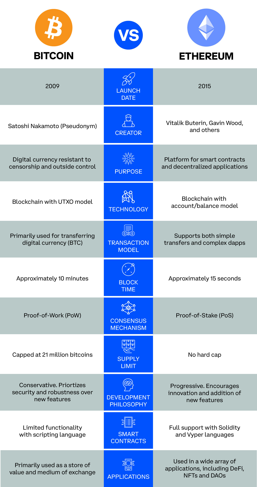
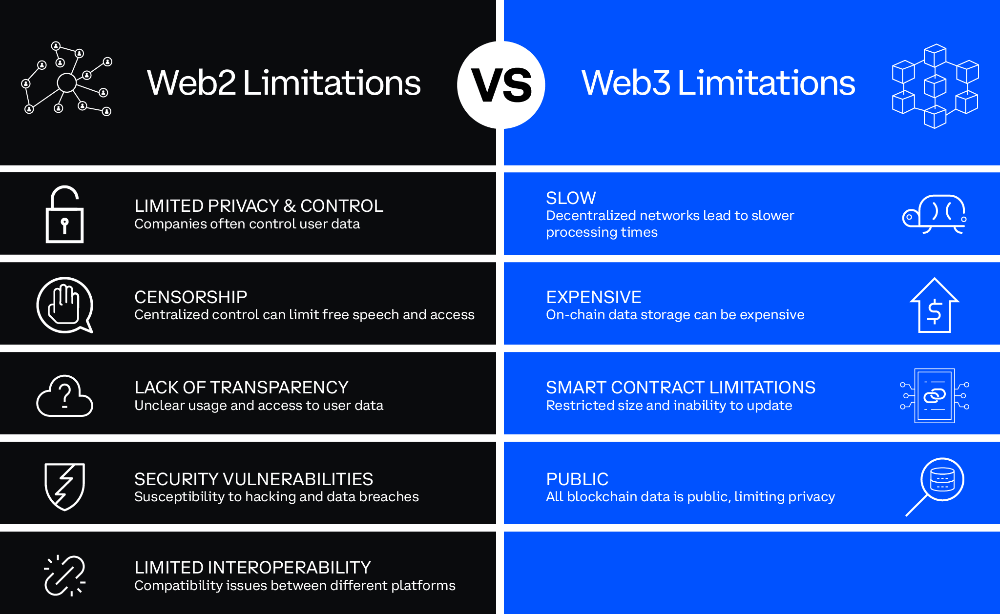
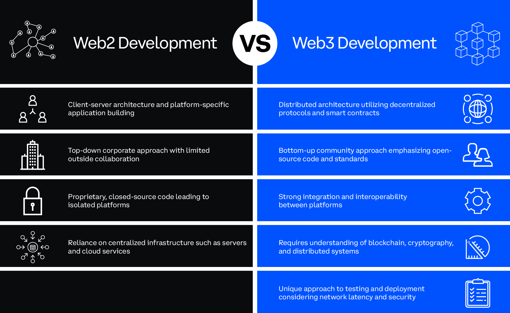

In this article, we'll explore Ethereum's significance and impact in the crypto ecosystem as well as its role in shaping the Web3 landscape. We'll learn about Ethereum's ethos and goals and also examine the different types of applications developed on Ethereum. Lastly, we'll take a look at the evolution of the web with an emphasis on comparing Web2 and Web3 development.

---

## Objectives

By the end of this lesson you should be able to:

- Describe the origin and goals of the Ethereum blockchain
- List common types of applications that can be developed with the Ethereum blockchain
- Compare and contrast Web2 vs. Web3 development
- Compare and contrast the concept of "ownership" in Web2 vs. Web3

---

## The Ethos and Goals of Ethereum

Ethereum was originally proposed in 2013 by Vitalik Buterin, who was then a young developer in the Bitcoin community. Vitalik had a vision that the potential of blockchain technology extended far beyond a decentralized digital currency. When his ideas were rejected by the Bitcoin community, he set out to create a platform that could bring his vision to life.

The ethos of Ethereum is fundamentally different from Bitcoin's. Bitcoin development is conservative; it's focused on maintaining the existing protocol, making only incremental improvements over time rather than implementing radical changes. In other words, changes are slow and deliberate and any unnecessary risk-taking is generally frowned upon. Ethereum development, on the other hand, is focused on innovation and experimentation. There is more of a willingness to take risks and make radical changes to the protocol in order to improve on and expand upon functionality and enable new use cases.

Ethereum's primary goal is to be a general, all-purpose blockchain that allows developers to create any type of decentralized application that their minds can conjure up. One of the most important features that unlock all of these possibilities is smart contracts. Without smart contract functionality, most applications built on the platform today would be nonexistent.

---

## Applications on Ethereum

Before delving into the different types of applications built on Ethereum, let's review one of the underlying forces of the smart contracts that make them possible.

### Scripting

As we've learned, one of Bitcoin's limitations when it comes to complex applications being built on the protocol is scripting. Its simple stack-based, left-to-right scripting system lacks the flexibility to support smart contracts. In the Ethereum whitepaper, Vitalik pointed out several limitations to Bitcoin scripting. A couple of key ones to note are:

- Lack of Turing-completeness. Although this is an intentional feature of Bitcoin to avoid infinite loops during transaction verification, without loops or recursion, running a complex program that a decentralized application demands, is not possible.

- Lack of state. Bitcoin's UTXO model only allows for simple contracts and not the complex stateful contracts needed for most decentralized applications. What that means is that there is no internal state beyond a UTXO being spent or unspent.

Ethereum's scripting languages, most notably Solidity, are Turing-complete and stateful, among other features. These features allow smart contracts to be executed deterministically, meaning that the outcome of the contract is predictable and can be enforced automatically and autonomously. They also allow developers to write much more complex programs that can execute a much wider range of operations.

It is this flexibility and versatility in Ethereum's scripting that ultimately powers the decentralized applications that we know.

### Decentralized Finance (DeFi)

DeFi is one of the most popular use cases for Ethereum. In DeFi Summer 2020, we saw an explosion in the usage and popularity of DeFi applications built on Ethereum. During this brief period alone, the total value locked in DeFi protocols increased from less than $1 billion to more than $10 billion. This period marked a turning point, as it brought more attention to the space, and it solidified Ethereum as the de facto smart contract platform of the DeFi and greater Web3 ecosystem.

DeFi applications are designed to provide traditional financial services, such as lending, borrowing, trading, and much more, in a transparent, open and accessible manner. All of these services are facilitated by smart contracts.

How exactly does this work? Let's take a look at a simple example in the context of a DeFi lending platform, such as Aave or Compound.

Suppose Alice wants to borrow 5 ETH but doesn't want to sell her 10,000 USDC. She can deposit that USDC as collateral and borrow 5 ETH against it.

First, Alice must interact with the smart contract of the platform. The smart contract will check if Alice has 10,000 USDC in her wallet and, if so, will lock it up as collateral for the loan. The smart contract then transfers 5 ETH to Alice's wallet. The smart contract will also define the terms of the loan, such as the interest rate and the repayment date.

Alice now has 5 ETH that she can use for whatever she wants. However, she must repay the loan within the specified period. If Alice repays the loan on time, the smart contract will release her deposited collateral back to her. Otherwise, it will automatically liquidate her collateral and transfer it to the lender's address in exchange for the 5 ETH that was lent to her. The repayment will also include any accrued interest based on the interest rate set by the smart contract.

In this way, smart contracts enable DeFi platforms to operate autonomously without a centralized entity. The smart contract provides security and transparency to both the borrower and the lender, as the terms of the loan are defined in the code and enforced automatically.

Of course, this does not mean that DeFi comes without risks. Although it's beyond the scope of this article, it's worth mentioning that DeFi has been the target of numerous smart contract exploits involving hundreds of millions of dollars in value.

### Non-Fungible Token (NFT)

NFTs are another application of Ethereum that has gained significant attention in recent years. NFTs are unique digital assets that represent ownership of a specific item. They can be used to represent just about anything, but most notably digital artwork, sports collectibles, and in-game items.

Smart contracts play a crucial role in NFTs by providing a way to represent and enforce ownership of the digital asset. When a new NFT is created, a smart contract is deployed on Ethereum that defines the unique characteristics of that asset as well as the ownership information and rules for transferring ownership.

Ethereum's ERC-721 standard was the first to introduce NFTs in 2017, and it has since become the most popular standard for creating and trading NFTs on Ethereum.

We'll cover more on tokens and token standards for fungible and non-fungible assets later on in the course.

### Decentralized Autonomous Organization (DAO)

DAOs are another common use case for Ethereum and also one of the earliest use cases implemented on the network. In simple words, DAOs are software-enabled, community-led organizations. They allow a community to pool resources toward a shared goal, such as [buying one of the original copies of the U.S. Constitution](https://www.theverge.com/22820563/constitution-meme-47-million-crypto-crowdfunding-blockchain-ethereum-constitution) or determining the future of a protocol. Because DAOs aren't tied to a physical location, they are able to mobilize quickly and
attract resources and capital from all over the world.

The rules of a DAO are established by community members through the use of smart contracts, which lay the groundwork for how a DAO operates. When a new DAO is created, a contract is deployed to the network. It contains the rules that govern the organization, including how its resources are managed. Members of the DAO can then interact with the contract by sending transactions to the blockchain.

DAOs typically use a token-based system to govern voting and decision-making. Members of the DAO are issued tokens that represent their ownership and influence within the organization. These tokens can be used to vote on proposals and allocate resources.

When a proposal is submitted to the DAO, members can vote on whether to accept or reject it. The smart contract tracks the votes and automatically executes the proposal if it receives enough support from the members. This process allows members of the DAO to collectively make decisions and take actions in a decentralized way.

### Other Applications

While the above use cases have been the most prominent applications on Ethereum, there are a plethora of others, including:

- **Identity Management** is one use case that has come to the forefront in recent years. The most notable example is the Ethereum Name Service (ENS). It allows users to register human-readable domain names, similar to the traditional DNS system, but with the added functionality of being able to associate Ethereum and other blockchain addresses with a domain name, such as `vitalik.eth`. This makes it easier for users to send and receive transactions without having to remember or type in long and complex addresses.

- **Gaming** is another common use case. Axie Infinity and Decentraland are both popular examples of decentralized games that make use of fungible and non-fungible tokens for a variety of purposes.

- **Prediction markets** are another use case where users can bet on the outcome of real-world events, such as forecasting election results or predicting which team will win a game. Augur and Gnosis are popular examples of this application.

There are many other use cases from supply chain, energy, and intellectual property management to decentralized storage and content management to governance and voting systems. The list goes on and on, and it's worth taking some time to explore these types of applications on your own.

---

## Evolution of the Web

Opinions abound in the history, divisions, and eras of the development and evolution of the internet. One popular explanation divides the web into three major eras (so far).

#### Web1

The web has come a long way since its humble read-only beginnings in the early 1990s. Web1 is often referred to as the _static web_, meaning it was primarily a collection of static web pages that provided information to users with limited interaction and dynamic content.

#### Web2

In the early 2000s, a _dynamic web_ emerged. Web2 introduced more interactive and dynamic content, such as social media and e-commerce. It's characterized by the use of centralized servers that store and control user data. In other words, with Web2, users can interact with content, share information, and collaborate with others, but they have limited control over their data. A vast majority of the web today operates in this paradigm.

#### Web3

Web3 or the _decentralized web_ is the next phase of the web that has started to emerge in recent years with the rise in popularity of Ethereum. This iteration of the web is focused on user ownership and control over data, providing a more private, decentralized, and secure web experience.

### The Limitations of Web2

While Web2 brought many benefits beyond its predecessor, there are some key limitations to consider.

- **Privacy & Control:** Users have limited control over their data and how it is used. Companies often have broad or even complete control over user data on a given platform.

- **Censorship:** Due to centralized control of user data, corporations or governments can censor content they deem as inappropriate or dangerous, which can limit free speech and expression or block access to certain online services. This is especially concerning in countries with authoritarian regimes, which often use censorship as a tool to control citizens and maintain power.

- **Lack of transparency:** Users cannot always verify how their data is being used or who has access to it.

- **Security vulnerabilities:** Because Web2 relies on centralized servers, it is more vulnerable to hacking and data breaches, which can expose sensitive user information and compromise online safety.

- **Limited interoperability:** Most Web2 platforms are not interoperable, meaning that different platforms may not be compatible with each other. Data is generally confined to one system.

### The Limitations of Web3

While many of the limitations of Web2 have spurred the development of Web3 by aiming to provide a more decentralized, secure, and private web, Web3 does not come without its own set of limitations.

- **Speed:** The reliance on decentralized networks and consensus mechanisms result in much slower processing times compared to centralized systems.

- **Storage:** Storing data onchain can be very expensive, which can make it challenging for developers to create apps that require large amounts of storage.

- **Smart contract limitations:**

  - Smart contracts on Ethereum are currently limited to a maximum size of 24 KB, which can limit the complexity of the logic that can be programmed into them.

  - Once a smart contract is deployed, it cannot be updated or changed. If there is a bug or a flaw in the contract, it cannot be fixed unless a new contract is deployed.

- **All data is public:** The transparency of blockchain means that all data is public and visible to anyone. While this can be an advantage in terms of transparency and accountability, it can also be a limitation for applications that may require privacy or confidentiality.

### Web2 vs Web3 Development

While there are many general distinctions to be made between Web2 and Web3, these characteristics are even more apparent when examining their development approaches.

#### Web2

In Web2, engineering is centered around a client-server architecture, and development is focused on building applications for specific platforms and using APIs and tools provided by those platforms to create user interfaces and access data. There is a top-down corporate approach to development processes, and code is generally proprietary and closed-sourced. As a result, there tends to be very limited collaboration with developers outside of a company and there is little integration between different platforms.

Web2 developers rely on centralized infrastructure, such as servers and cloud-computing services provided by large tech companies to host their applications and store data. This creates a centralized system where the platforms and companies that control the infrastructure have significant power and control over the applications and data that are built on top of them.

#### Web3

In contrast, the Web3 development paradigm is centered around a distributed architecture, where developers build applications that run on decentralized protocols and smart contracts. There is a bottom-up community approach to development processes, and there is an emphasis on open-source code and open standards. Web3 development culture is collaborative, and there is strong integration and interoperability between platforms.

Web3 development requires a different set of engineering skills and tools. Developers need to have a strong understanding of blockchain technology, cryptography, and distributed systems, and they also need to be proficient in programming languages like Solidity.

There is also a different approach to testing and deployment. Because onchain apps run on distributed systems, developers need to consider factors like network latency and the possibility of network partitions. They also need to ensure that their applications are extremely secure and resistant to a variety of attacks because the stakes can often be very high when it comes to dealing with millions and even billions of dollars of value that cannot be recovered in the event of a hack. Developers also have to consider concepts like immutability because once code is deployed to a blockchain, it cannot be edited.

Overall, Web3 development requires a different set of engineering skills and tools as well as a deeper understanding of distributed systems and cryptography. Developers also need the ability to think creatively about how to build applications that are constrained by the technical limitations of the Web3 paradigm, such as speed, storage, and scalability.

---

## Conclusion

Ethereum was created to extend the potential of blockchain technology beyond just a decentralized digital currency platform. Its ethos of innovation and experimentation has made a major impact on shaping the crypto ecosystem and has played a significant role in shaping the landscape of Web3. The use of smart contracts has enabled a wide range of new web applications, including DeFi, NFTs, DAOs, and many more.

The evolution of the web has brought us from a static Web1 to a dynamic Web2, and now to a decentralized Web3. While Web2 brought many key benefits, it also came with many drawbacks regarding privacy, censorship, and security vulnerabilities. Web3 aims to address these challenges but has its own set of limitations. Lastly, the development paradigms of Web2 and Web3 are distinct in their architecture, infrastructure, and their development approaches. Web3 development requires a different set of skills and a different mental framework from its predecessor.

---

## See also

- [Ethereum Whitepaper](https://ethereum.org/en/whitepaper/)
- [Decentralized Applications (Dapps)](https://ethereum.org/en/dapps/)
- [Web2 vs Web3](https://ethereum.org/en/developers/docs/web2-vs-web3/)
- [The Architecture of a Web 3.0 Application](https://www.preethikasireddy.com/post/the-architecture-of-a-web-3-0-application)

<!-- Reference Style Links -->

[Ethereum Whitepaper]: https://ethereum.org/en/whitepaper/
