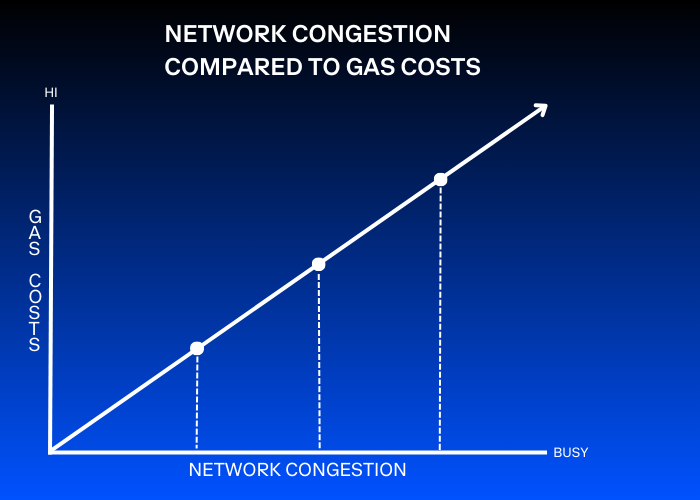

In this article, we'll delve into the concept of gas and its importance in the Ethereum ecosystem. You'll learn why Ethereum relies on a system of gas to regulate the execution of transactions and smart contracts, and how it plays a crucial role in the proper functioning of the network.

---

## Objectives

By the end of this lesson you should be able to:

- Explain what gas is in Ethereum
- Explain why gas is necessary in Ethereum
- Understand how gas works in Ethereum transactions

---

## What is gas?

Gas is a term used in Ethereum to describe a computational unit that measures the amount of computational work needed to perform specific operations on the network. Unlike Bitcoin, where transaction fees only consider the size of a transaction, Ethereum accounts for every computational step performed by transactions and smart contract code execution. In other words, every single operation that is performed on Ethereum requires a certain amount of gas.

### Complexity

The amount of gas required for an operation depends on its complexity. More complex operations require more computational resources and therefore require more gas to be executed. For example, a simple transaction that involves sending ETH from one address to another may require less gas than a complex smart contract that executes multiple operations or interacts with multiple other contracts.

### State of the Network

Gas costs can also vary depending on the state of the network, or more specifically, how congested it is. When there are more transactions waiting to be processed than the network can handle, it will prioritize transactions based on the gas price that was set by the user, meaning that higher gas prices are more likely to get processed first. When the network is congested, gas prices increase to encourage more efficient use of the network's resources and decrease when network usage is lower. This dynamic pricing mechanism ensures that the Ethereum network remains accessible and functional for all users, while also incentivizing responsible and efficient use of the network's resources.

---

## Why is gas necessary?

### Turing Completeness

As we've learned, Ethereum is a Turing-complete platform, which means that any program that can be represented in code can theoretically be expressed and executed on the network. This opens up the door to countless different types of applications that can be built, but it also creates the possibility that malicious or inefficient code can clog up the network, potentially leading to denial-of-service attacks, network spam, and other problems.

### Preventing Infinite Loops

Gas to the rescue! To prevent accidental or intentional infinite loops in smart contract code, Ethereum requires that every transaction specify a gas limit. The gas limit establishes the maximum amount of gas that the transaction can consume, and they ensure that transactions are executed within a predetermined amount of computational resources, preventing the execution of code that might consume too much computation power and potentially cause the network to freeze or crash. Without gas, Ethereum's Turing completeness would be insecure and inefficient.

### Autonomous Execution

It's also important to note that gas enables the execution of smart contracts without the need for a central authority to monitor their execution. The gas system provides a mechanism for regulating the resources required to execute the code of these contracts as well. In other words, without gas, it would be difficult to guarantee that smart contracts could operate autonomously, fairly and efficiently.

---

## How does gas work?

### Ethereum Denominations

Before diving into the inner workings of gas, it's important to understand a few of the most common denominations used in Ethereum.

#### Ether (ETH)

Ether is the native cryptocurrency of the Ethereum network. Gas fees are paid in ETH.

#### Wei

Wei is the smallest denomination of Ethereum and is equivalent to 10^-18 ETH. It is used to represent very small amounts of ETH, usually gas prices and transaction fees. To put 10^-18 into perspective:

- 1 ETH = 1,000,000,000,000,000,000 wei
- 1 wei = 0.000000000000000001 ETH

#### Gwei

Gwei is commonly used to express the price of gas. One gwei is equivalent to one billionth of one ETH or 10^-9 ETH.

- 1 ETH = 1,000,000,000 gwei
- 1 gwei = 0.000000001 ETH

### Gas Price

Gas price on the network is denominated in gwei, and the gas fee is calculated as the product of the gas price and the amount of gas required for an operation. For example, if the gas price is 50 gwei, and an operation requires 100,000 units of gas, the gas fee would be 0.005 ETH (50 gwei x 100,000 gas = 0.005 ETH).

### Gas Limit

Gas limit is an essential component of the gas system in Ethereum. It defines the maximum amount of gas a user is willing to spend for a transaction to be processed. This gas limit is set by the sender of the transaction and represents the upper limit of computational resources that the transaction can consume. The Ethereum Virtual Machine (EVM) starts deducting the amount of gas used from the gas limit as soon as it starts processing the transaction.

Consider Alice wants to send some ETH to Bob. Alice specifies a gas limit of 100,000 units and a gas price of 10 gwei (0.00000001 ETH) per unit of gas. So, she's willing to spend a maximum of 0.001 ETH for this transaction (1,000,000 gwei).

The EVM, upon receiving Alice's transaction, starts executing it. As the transaction is processed, the EVM deducts the used gas from the gas limit. If the transaction completes before reaching the gas limit, the remaining unused gas is refunded to Alice's account.

Let's illustrate this with a couple scenarios:

- Suppose the transaction used 80,000 units of gas, leaving 20,000 units unused. Since the gas price was set at 10 gwei per unit, Alice would receive a refund of 0.0002 ETH (200,000 gwei) for the unused gas.

- In a different scenario, suppose Alice sends a transaction with a gas limit of 100,000 units. After processing all the opcodes in the transaction except for the last one, Alice's transaction has consumed 99,998 units of gas. The EVM checks and sees that the last opcode will initiate because there are 2 units of gas remaining, enough to start it. However, as the opcode executes, it becomes clear that it actually requires more than 2 units of gas. At this point, the EVM throws an "Out of Gas" exception and halts the transaction. In this scenario, Alice loses all 100,000 units of gas, as they are consumed in the attempted execution. All state changes that might have occurred during the execution are rolled back, and the ETH Alice tried to send to Bob is returned to her.

### Gas Estimation

Gas estimation is another key concept to understand. It refers to the process of predicting the amount of gas that will be required to execute a transaction. This is important because as we've seen in our example, the gas limit of a transaction needs to be set before it can be broadcasted to the network. If the gas limit is set too low, the transaction may fail to execute, while if it is set too high, the sender may end up paying more in transaction fees than is necessary.

There are several methods that can be used for gas estimation. One common method is to use historical gas prices and gas limits as a reference point, and to estimate the gas needed for a new transaction based on the gas used in similar past transactions. Another method is to simulate the execution of the transaction in a test environment to determine the actual amount of gas that would be used.

Thankfully, most Ethereum wallet applications have built-in gas estimation algorithms that can automatically calculate an appropriate gas limit for a transaction based on the network conditions at the time the transaction is initiated. This helps to prevent a transaction from failing from the gas limit being too low while optimizing for the best possible cost for the sender.

---

## Conclusion

Gas is a vital component of Ethereum. It's what regulates the execution of all transactions and smart contracts, and it plays a significant role in the proper functioning and security of the network. Without gas, Ethereum's Turing-complete architecture would be inefficient and vulnerable to attacks. Gas also ensures that smart contracts can operate autonomously, fairly, and efficiently without the need for a central authority to monitor their execution. Understanding how gas works is essential for anyone who wants to develop applications or smart contracts on the Ethereum network.

---

## See also

- [Gas and Fees (Ethereum Docs)](https://ethereum.org/en/developers/docs/gas/)
- [Transaction Gas (Mastering Ethereum)](https://github.com/ethereumbook/ethereumbook/blob/develop/06transactions.asciidoc#transaction-gas)
- [Turing Completeness and Gas (Mastering Ethereum)](https://github.com/ethereumbook/ethereumbook/blob/develop/13evm.asciidoc#turing-completeness-and-gas)
- [Gas (Mastering Ethereum)](https://github.com/ethereumbook/ethereumbook/blob/develop/13evm.asciidoc#gas)

<!-- Reference Style Links -->

[Ethereum Docs]: https://ethereum.org/en/developers/docs/
[Mastering Ethereum]: https://github.com/ethereumbook/ethereumbook
[Ethereum demonimations]: https://www.gemini.com/en-US/cryptopedia/satoshi-value-gwei-to-ether-to-wei-converter-eth-gwei
