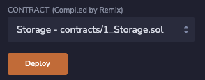
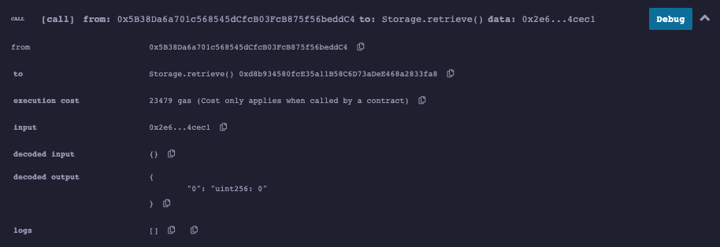
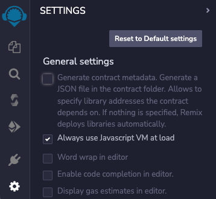

Remix contains a simulation of the blockchain that allows you to easily and safely deploy and interact with contracts, for free.

---

## Objectives

By the end of this lesson you should be able to:

- Deploy and test the Storage.sol demo contract in Remix

---

## Deploy the `Storage` Contract

Deploying a contract is easy, but remember that if the contract doesn't compile, the deploy button will instead deploy the last good compiled version of your contract. Verify that you see a green checkmark on the icon for the _Compiler_ contract on the left side of the editor, then select the _Deploy & Run Transactions_ plugin.

If you've already deployed any contracts, press the trash can button to the right of the _Deployed Contracts_ label. Then, press the orange button to deploy the `Storage` contract.



### Contract Addresses

After your contract deploys, it will appear in the _Deployed_ contracts section as _STORAGE AT_ followed by an address. Addresses are used for both contracts and wallets in EVM-compatible blockchains and serve a similar purpose to an IP address. You can copy the address to see what it looks like. It's 20 characters of hexadecimal, similar to `0xd8b934580fcE35a11B58C6D73aDeE468a2833fa8`.

The address is what you will use to find your contract with tools such as _Etherscan_, or to connect to it with a front end.

However, when you deploy using the Remix VM simulation, it will only exist in your browser.

### Deployments and Test Accounts

The result of any transactions, including deployments, will appear in the Remix terminal. Click the chevron next to the blue _Debug_ button to expand the log.


Doing so will show the full transaction log, which contains all of the details of the transaction, such as its amount, the address to and from, and the inputs and outputs provided to the transaction.

In this case, the sender (from) matches the first listed account in the panel, which has spent a small amount of simulated Ether to deploy the contract.

You can access a list of 15 test wallets here, each with 100 Ether to spend. Among other uses, you can use these accounts to compare behavior between wallets that are and are not the owner of a deployed contract.

### Interacting with the Contract

Click the chevron to expand your contract in the Deployed Contracts section of the left panel. You'll see two buttons, one for each `public` function in the `Storage` contract. Notice how the _Store_ button also has a field to pass a _uint256_, matching the parameter for `uint256 num`.


Let's click the retrieve button first. Before clicking, make a prediction: given that the `number` variable was instantiated without a value, what do you thing the return will be?

Go ahead and click – the result will appear below the button as:

```text
0: uint256: 0
```


Outputs from the EVM are in the form of an array, so in this case, the only return is in the 0th element and it is a `uint256` of 0. Were you expecting `undefined` or an error?

Unlike many languages, variables in Solidity have a [default value] if not assigned. For `uint` and `int`, that value is 0.

You can also review the results of your transaction in the console.



The screenshot above is from a newer version of Remix than the video. Outputs are now often decoded for you!

### Storing and Retrieving a Value

Use the input to store and retrieve a value. Which costs more gas? Storing or retrieving? This isn't a trick question, but it is a bit nuanced. Both cost about 23500 gas, but there is only a gas cost for the retrieve function if it is called by another contract. Calling it from the web is free, because you're only reading data that is on the blockchain and are not asking the EVM to perform a computational task.

---

## Disabling Artifact Generation

Return to the _File Explorer_ by clicking the double document icon in the upper left. You should now see a folder called _artifacts_ that has been added to your project. This folder contains a number of build artifacts, such as the [_ABI_] for your contract, that will be useful to you later, but currently just cause clutter.

You can disable artifact generation by clicking the settings gear in the bottom left corner, then deselecting the first checkbox to _Generate contract metadata..._



---

## Conclusion

Remix makes it easy to write, deploy, and test contracts. Contracts are deployed by a wallet address to their own address. These addresses are similar to how IP addresses work, in that they enable connections across the network. You can test deployed contracts directly in Remix and use the console to see detailed information about each transaction.

---

<!-- Reference Style Links -->

<!-- Add reference style links here.  These do not render on the page. -->

[default value]: https://docs.soliditylang.org/en/v0.8.17/control-structures.html#scoping-and-declarations
[_ABI_]: https://docs.soliditylang.org/en/v0.8.13/abi-spec.html
