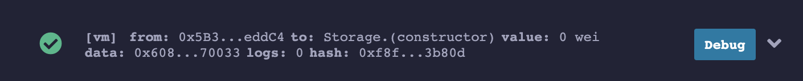

# Introduction to Remix

In this lesson, you'll be introduced to an online Solidity IDE called Remix. You'll tour the workspace and explore a sample smart contract.

---

## Objectives

By the end of this lesson you should be able to:

- List the features, pros, and cons of using Remix as an IDE
- Deploy and test the Storage.sol demo contract in Remix

---

## Remix Window Overview

Begin by opening a browser window and navigating to [remix.ethereum.org]. Open the project you created and cleaned up at the end of the last reading, and open `1_Storage.sol`. The editor should be organized in a way that is familiar to you. It is divided into three areas:

- Editor Pane
- Terminal/Output
- Left Panel

### Editor Pane

The editor pane loads with the Remix home screen, which contains news, helpful links, and warnings about common scams. Double-click on `1_Storage.sol` to open it in the editor. You can close the home tab if you'd like.

You'll edit your code in the editor pane. It also has most of the features you're expecting, such as syntax and error highlighting. Note that in Remix, errors are not underlines. Instead, you'll see an❗to the left of the line number where the error is present.

At the top, you'll see a large green arrow similar to the _Run_ button in other editors. In Solidity, this compiles your code, but it does not run it because you must first deploy your code to the simulated blockchain.

### Terminal/Output

Below the editor pane, you'll find the terminal:

You'll primarily use this panel to observe transaction logs from your smart contracts. It's also one way to access Remix's very powerful debugging tools.

### Left Panel

As with many other editors, the left panel in Remix has a number of vertical tabs that allow you to switch between different tools and functions. You can explore the files in your current workspace, create and switch between workspaces, search your code, and access a number of plugins.

---

## Plugins

Most of the features in Remix are plugins and the ones you'll use the most are active by default. You can view and manage plugins by clicking the plug button in the lower-left corner, right above the settings gear. You can turn them off and on by clicking activate/deactivate, and some, such as the _Debug_ plugin will be automatically activated through other parts of the editor.

### Solidity Compiler

The first default plugin (after the search function) is the _Solidity Compiler_. Be sure to check the `Auto compile` option. Smart contracts are almost always very small files, so this shouldn't ever cause a performance problem while editing code.

The `Compile and Run script` button in this plugin is a little misleading. This is **not** how you will usually run your contract through testing. You can click the `I` button for more information on this feature.

Finally, if you have errors in your contracts, the complete text for each error will appear at the bottom of the pane. Try it out by introducing some typos to `1_Storage.sol`.

### Deploy & Run Transactions

The _Deploy & Run Transactions_ plugin is what you'll use to deploy your contracts and then interact with them. At the top are controls to select which virtual machine to use, mock user wallets with test Ether, and a drop-down menu to select the contract you wish to deploy and test.

Fix any errors you introduced to `1_Storage.sol` and then click the orange `Deploy` button. You'll see your contract appear below as _STORAGE AT \<address\>_.

:::caution

There are two common gotchas that can be very confusing when deploying contracts in Remix.

1. Each time you hit the Deploy button, a new copy of your contract is deployed but the previous deployments remain. Unless you are comparing or debugging between different versions of a contract, or deploying multiple contracts at once, you should click the `Trash` button to erase old deployments before deploying again.
1. If your code will not compile, **clicking the deploy button will not generate an error!** Instead, the last compiled version will be deployed. Visually check and confirm that there are no errors indicated by a number in a red circle on top of the Compiler plugin.

:::

---

## Conclusion

Remix is a robust editor with many features and one or two gotchas. It is an excellent tool to use at the beginning of your journey because you can jump right in and start writing code for smart contracts.

## See also

[Remix](https://remix.ethereum.org)

[remix.ethereum.org]: https://remix.ethereum.org
