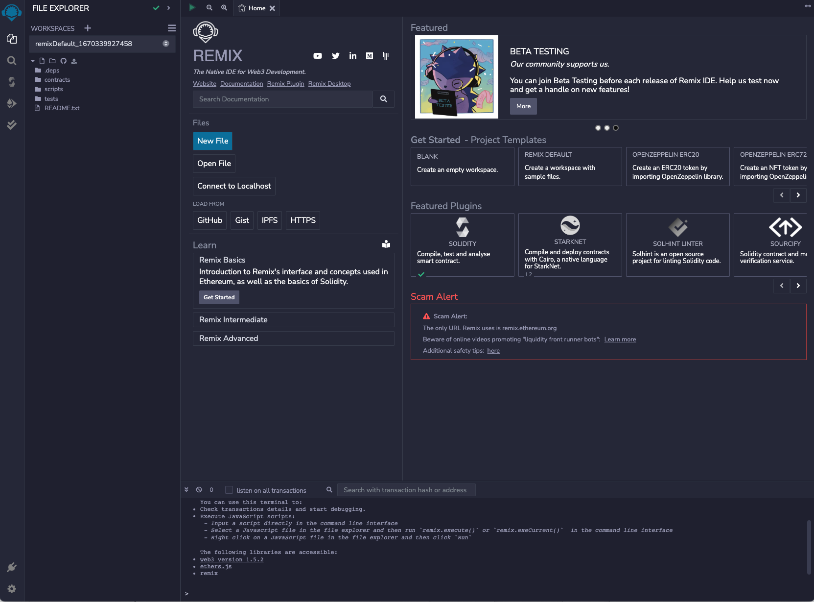
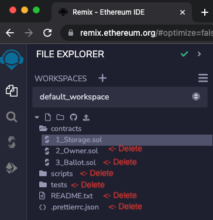

In this article, you'll learn about the origins and history of Solidity, where to find the docs, and review some of the considerations that make programming in Solidity relatively unique. You'll also learn about how to get started with development!

---

## Objectives

By the end of this lesson you should be able to:

- Describe why languages like Solidity are used to write smart contracts
- Relate an overview of the history (and pace of change) of Solidity and its strengths and weaknesses

---

## Introduction to Solidity

Solidity is a high-level language used to develop smart contracts compatible with the Ethereum Virtual Machine. It is object-oriented, strongly typed, and allows variadic (more than one argument) returns. Solidity was [inspired] by a number of languages, particularly C++. Compared to other languages, Solidity changes very rapidly. Review the [releases] to see just how rapid!

### The Docs

The [Solidity Docs] are thorough and helpful. This guide will regularly reference them and they should be your first source for specific information related to any of the components in the language. As with any versioned doc source, always double-check that the version you're referencing matches the version you are developing with.

### Origins TL;DR

Solidity was developed by the Ethereum Project's Solidity team and was first previewed in 2014 at DevCon0. The original goal was to create an easy-to-use language for smart contract development. A great [history overview] can be found in the team's blog.

### What it Actually Does

Solidity is very similar to the programming languages you are familiar with in that it's a high-level language that is relatively human-readable, which is then compiled into byte-code that can be read by the EVM. For example, this:

```solidity
// SPDX-License-Identifier: UNLICENSED
pragma solidity ^0.8.9;

contract Hello {
    function HelloWorld() public pure returns (string memory) {
        return "Hello World!";
    }
}
```

compiles into this:

```text
0x608060405234801561001057600080fd5b50610173806100206000396000f3fe608060405234801561001057600080fd5b506004361061002b5760003560e01c80637fffb7bd14610030575b600080fd5b61003861004e565b604051610045919061011b565b60405180910390f35b60606040518060400160405280600c81526020017f48656c6c6f20576f726c64210000000000000000000000000000000000000000815250905090565b600081519050919050565b600082825260208201905092915050565b60005b838110156100c55780820151818401526020810190506100aa565b60008484015250505050565b6000601f19601f8301169050919050565b60006100ed8261008b565b6100f78185610096565b93506101078185602086016100a7565b610110816100d1565b840191505092915050565b6000602082019050818103600083015261013581846100e2565b90509291505056fea2646970667358221220575a1ec2ade1712a7a3a4e91cc5d83212207e4a5c70f5b2bc50079ee65ad29b364736f6c63430008110033
```

As you can see, the first example is a little easier to read!

---

## Programming for Ethereum with Solidity

On the surface, writing code for the EVM using Solidity isn't particularly different from other programming languages. You write code organized into functions, and those functions get executed when called, often accepting arguments and returning values. However, there are a number of unusual traits that will require you to think a little differently. Additionally, the EVM is a much smaller, slower, and less-powerful computer than a desktop, or even a mobile device.

### Gas Fees

Every single [operation] your code performs costs gas, which your users pay for. You're probably already well-versed in _[time complexity]_ and know how to get an operation down to _O(log(n))_, when you have no choice but to run something that is _O(2^n)_, and that sometimes, nested for-loops go brrrrr. These constraints and practices still apply, but in Solidity, every inefficiency directly costs your users money, which can make your app more expensive, and less appealing, than needed.

When you were learning about _time complexity_, you probably heard the term _space complexity_ once, and then it was never mentioned again. This is because normally, computation is expensive, and storage is practically free. The opposite is true on the EVM. It costs a minimum of **20,000** gas to initialize a variable, and a minimum of **5,000** to change it. Meanwhile, the cost to add two numbers together is **3** gas. This means it is often much cheaper to repeatedly derive a value that is calculated from other values than it is to calculate it once and save it.

You also have to be careful to write code with predictable execution paths. Each transaction is sent with a gas limit and which various frameworks, such as _ethers.js_, in order to do their best to estimate. If this estimate is wrong, the transaction will fail, but **it will still cost the gas used up until the point it failed!**

### Contract Size Limit

[EIP-170] introduced a compiled byte-code size limit of **24 KiB** (24,576 B) to Ethereum Smart Contracts. Read that sentence again, as you're probably not used to thinking in this small of a number!

While there isn't an exact ratio of lines of code to compiled byte-code size, you're limited to deploying contracts that are approximately 300-500 lines of Solidity.

Luckily, there are a few ways around this limitation. Contracts can expose their functions to be called by other contracts, although there is an additional cost. Using this, you can write a suite of contracts designed to work together, or even make use of contracts already deployed by others. You can also use more advanced solutions, such as [EIP-2535].

### Stack Limit

Programs written for computers or mobile devices often work with hundreds of variables at the same time. The EVM operates with a stack that can hold 1,024 values, but it can only access the top 16.

There are many implications of this limit, but the one you'll run into most commonly is the "Stack too Deep" error because you're trying to work with too many variables at once.

In Solidity/EVM, your functions are limited to a total of 16 variables that are input, output, or initialized by the function.

### Permanence

Once deployed, smart contracts are permanent and cannot be changed by anyone, **even their creator(s)!** It is literally not possible to edit them. If the creators of a contract discover a vulnerability, they can't do anything about it except withdraw the funds - if the contract allows them to!

As a result, standard practice is to have a smart contract audited by an expert, before deployment.

### Pace of Change

Solidity files always start with a license and a version:

```solidity
// SPDX-License-Identifier: UNLICENSED
pragma solidity ^0.8.17;
```

One of the reasons for this is that the pace of development for Solidity is **very** fast, and changes are not always backwards-compatible. As a result, the compiler needs to know which version to use when converting the Solidity code to byte-code.

Review the [changelog] to see some of the recent additions and fixes.

---

## Development Environments

We'll be covering two tools that can be used to develop in Solidity.

### Remix

We'll start with [Remix], an online IDE similar to Codepen, Replit, or CodeSandbox. Remix is a great place to get started because it works out of the box, has a number of demo contracts, and has great debugging tools. More information can be found at the [Remix Project] website.



:::danger

**BE VERY CAREFUL** while using Remix, as it can also be used by scammers. Remix itself will warn you about this, so take heed! One common scam is for the scammer to convince you to paste and deploy code that is allegedly some sort of automated moneymaker, such as a staking tool, or a bot.

If you paste and run code that you don't understand, you may lose all assets from your currently connected wallet. You should also be careful to always navigate directly to `remix.ethereum.org`. More experienced developers prefer to use static versions of Remix deployed to [IPFS], but be careful. There are also deployments that are compromised and used as a part of a scam!

:::

### Hardhat

[Hardhat] is a development environment that allows you to develop and test Solidity on your local machine. It includes debugging and unit testing tools, and has an ecosystem of third-party-developed plugins that ease development and deployment. Among other things, these plugins can help you deploy contracts, see the size of your compiled byte-code, and even see unit test coverage.

We'll introduce Hardhat and local development after the basics.

## Remix Setup

The next lesson will explore one of the demo contracts within [Remix]. Open it up and review the quickstart information if this is your first time on the site. Then, open or create a new workspace using the `Default` template.

**Delete** everything except the contracts folder and the `1_Storage.sol` contract within that folder. You can also leave `.prettierrc.json` if you'd like.



---

## Conclusion

On the surface, Solidity is very similar to other programming languages; most developers won't struggle to write familiar operations. However, there are some critically important properties to keep in mind. Operations are much more expensive than in other environments, particularly storage. You can use most of the practices you are accustomed to, but you are limited to very small contract sizes and by the size of the stack. Finally, remember that you should always use a separate wallet for development. If you make a mistake, you could lose anything in it!

---

## See also

[Solidity Docs](https://docs.soliditylang.org/en/v0.8.17/)

[inspired]: https://docs.soliditylang.org/en/v0.8.17/language-influences.html
[releases]: https://github.com/ethereum/solidity/releases
[Solidity Docs]: https://docs.soliditylang.org/en/v0.8.17/
[history overview]: https://blog.soliditylang.org/2020/07/08/solidity-turns-5/
[operation]: https://ethereum.org/en/developers/docs/evm/opcodes/
[time complexity]: https://en.wikipedia.org/wiki/Time_complexity
[EIP-170]: https://eips.ethereum.org/EIPS/eip-170
[EIP-2535]: https://eips.ethereum.org/EIPS/eip-2535
[changelog]: https://github.com/ethereum/solidity/blob/develop/Changelog.md
[Remix]: https://remix.ethereum.org/
[IPFS]: https://ipfs.tech/
[Remix Project]: https://remix-project.org/
[Hardhat]: https://hardhat.org/
