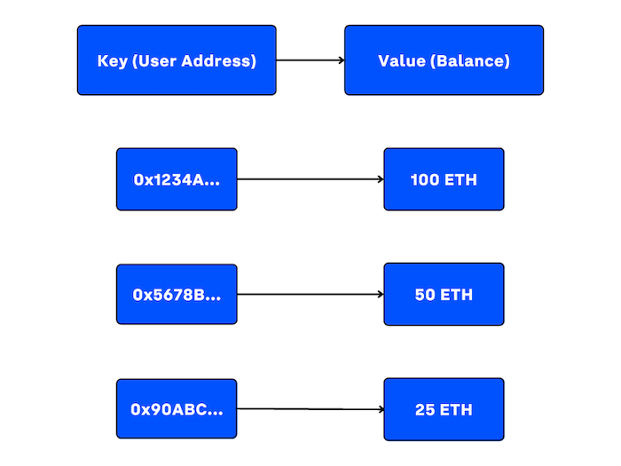
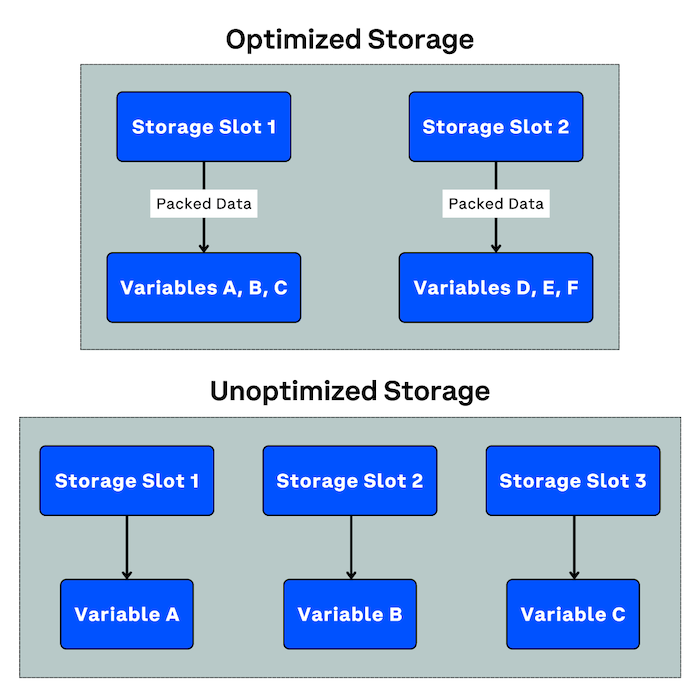
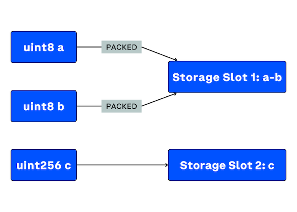
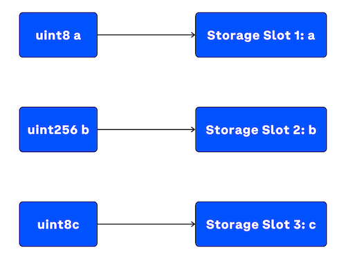

In this article, we will delve into the workings of Ethereum storage, explore the nuances of variable declaration ordering, and provide examples of efficient and inefficient storage practices to create optimized smart contracts.

---

## Objectives:

By the end of this lesson you should be able to:

- Diagram how a contract's data is stored on the blockchain (Contract -> Blockchain)
- Order variable declarations to use storage efficiently
- Diagram how variables in a contract are stored (Variable -> Contract)

---

## Introduction

Creating smart contracts that can operate efficiently requires a thorough understanding of how storage works in Ethereum. When designing a contract, you need to consider the storage requirements of the contract, including the types of storage needed, the gas costs associated with storage operations, and how to manage storage effectively. Poor storage management practices can lead to bloated contracts that consume excessive gas, making them more expensive to execute. By following best practices for storage management, you'll be equipped to create contracts that are lean, efficient, and cost-effective.

---

## Smart Contract Data Storage

### Key-Value Store

Smart contracts on Ethereum store and manage data utilizing a key-value store model, where each piece of data is identified by a unique key and accompanied by its corresponding value.

In this diagram, the keys (user addresses) are unique identifiers used to index the corresponding values (balances):



This model can be compared to a dictionary or a map where the key serves as the index and the value represents the data associated with that index. However, the key-value store has distinct characteristics that set it apart from these traditional data structures, which make it a more optimal choice for smart contracts on Ethereum.

- **Simplicity:** It is simple and straightforward, which allows for easier implementation and maintenance within a contract.

- **Scalability:** It is highly scalable, making it well-suited for managing vast amounts of data typically associated with apps and smart contracts. This scalability helps maintain performance levels even as data storage requirements grow.

- **Fixed-size chunks:** Storing data in fixed-size 32-byte chunks optimizes storage space and ensures that data location calculations are more efficient. This feature is particularly beneficial in the context of Ethereum, where storage costs are a significant concern.

- **Efficient storage and retrieval:** It is optimized for storing and retrieving large volumes of data efficiently, which is essential for quick access to stored information.

- **Security and immutability:** Unlike other storage models that may allow direct data manipulation, key-value stores within Ethereum's environment ensure data integrity and security through transaction-based modifications. This feature aligns with the decentralized and trustless nature of blockchain technology.

- **Gas-efficiency:** In Ethereum, every operation within a smart contract execution consumes gas. The key-value store model is designed to be gas-efficient, minimizing the gas consumption for storage and retrieval operations, thus reducing the overall cost of contract execution.

- **Compatibility with decentralized environments:** It is particularly suitable for decentralized environments, where data consistency, integrity, and security are crucial. The model's design inherently addresses the challenges posed by multi-threaded or concurrent environments where multiple processes or functions may attempt to access or modify the same data simultaneously.

### Types of Storage

There are three primary types of storage in Ethereum smart contracts: storage, memory, and stack. Each type has its specific use case and characteristics, which make them suitable for different aspects of smart contract execution.

#### Storage

Storage is the most persistent and expensive form of data storage. Data stored in the contract's storage persists across transaction executions and is accessible to any function within the smart contract. This storage is also visible on the blockchain and can be read by external sources, making it suitable for storing important and long-lasting information related to the contract's state.

Key attributes of storage:

- **Persistent:** Data remains in storage even after the contract execution finishes, allowing for state continuity across multiple transactions.

- **Expensive:** Storing and modifying data in storage consumes more gas compared to other data locations, making it costly in terms of transaction fees.

- **Visible on the blockchain:** Storage data is publicly available and can be read by external parties.

Consider the following contract:

```solidity
contract StorageDemo {
    // Declare a state variable to store data in storage
    uint256 public storedData;

    // Function to update the storedData variable in storage
    function updateData(uint256 newData) public {
        storedData = newData;
    }
}
```

The contract includes a state variable called `storedData`, which is stored in the contract's storage. The `public` visibility modifier allows anyone to access this variable. The contract also includes a public function called `updateData`, which can be called by anyone to modify the value of `storedData` in storage.

Any changes made to `storedData` in storage will persist across multiple transactions and will be visible to anyone who reads the blockchain. Please note that storage is more expensive than other data locations, so it is important to use it judiciously to minimize gas costs.

#### Memory

Memory is a temporary and more affordable data location. It's used to save data during the execution of a single transaction. Once the transaction is complete, the memory is wiped clean and any data within it is lost. Memory is suitable for storing intermediate variables and temporary data that does not need to persist across multiple transactions.

Key attributes of memory:

- **Temporary:** Data in memory is only available during a single transaction execution and is lost afterward.

- **Less expensive:** Saving and modifying data in memory consumes less gas compared to storage, making it more cost-effective for temporary data.

- **Not visible on the blockchain:** Memory data is not accessible to external parties and remains confined to the transaction execution.

Consider the following contract:

```solidity
contract MemoryDemo {
    // Declare a state variable to store data in storage
    uint256 public storedData;

    // Function to update the storedData variable in memory
    function updateData(uint256 newData) public {
        // Declare a memory variable to store the new data
        uint256 tempData = newData;

        // Assign the value of the memory variable to the storage variable
        storedData = tempData;
    }
}
```

In the contract, we declare a memory variable called `tempData` and assign the input parameter `newData` to it to update its value. The `tempData` variable is then assigned to the `storedData` variable to update its value in storage.

Unlike storage, data stored in memory is not persisted across transactions and is only accessible during the execution of the function. However, accessing and modifying data in memory is less expensive than doing so in storage, making it a more efficient option when dealing with temporary data. Additionally, any data stored in memory is not visible on the blockchain and cannot be read by external parties.

#### Stack

The stack is another form of temporary data storage, specifically used for holding function arguments, local variables, and intermediate values during function execution. The stack follows a Last-In-First-Out (LIFO) structure, meaning that the most recently added item is the first to be removed. This storage type is highly efficient but has limited space, making it suitable for small-scale data manipulation during function execution.

The stack is an internal data structure used by the EVM (Ethereum Virtual Machine) for computation during the execution of transactions. When a transaction is executed by the EVM, the bytecode of the smart contract is loaded into memory, and the EVM uses the stack to keep track of intermediate results and execute operations.

In Solidity, developers do not interact with the stack directly, but can optimize their code to make the best use of it and minimize the amount of gas used during transaction execution. This can include using more efficient algorithms or data structures, or avoiding unnecessary operations that can increase the depth of the stack.

Key attributes of the stack:

- **Temporary:** Like memory, stack data is only available during a single transaction execution and is lost afterward.

- **Highly efficient:** Stack operations consume minimal gas, making it the most cost-effective storage option for small-scale data manipulation.

- **LIFO structure:** The stack follows the Last-In-First-Out order, which allows for efficient management of function arguments, local variables, and intermediate values.

- **Limited space:** The stack has a maximum depth of 1024, restricting the number of elements it can hold at a given time.

- **Limited visibility:** Only the top 16 elements in the stack are accessible, limiting how many variables and other elements can be in scope at one time.

Let's compare two versions of a function and analyze their gas efficiency with regard to stack usage and gas consumption:

```solidity
contract GasEfficiencyDemo {
    uint256 public result;

    // Less efficient
    function sumLessEfficient(uint256 a, uint256 b) public {
        uint256 temp = a + b;
        result = temp;
    }

    // More efficient
    function sumMoreEfficient(uint256 a, uint256 b) public {
        result = a + b;
    }
}
```

In the `sumLessEfficient` function, the sum of the two input arguments `a` and `b` is first assigned to the temporary variable `temp` before being assigned to the state variable `result`. This additional step introduces an extra variable on the stack, which requires more gas for stack operations and consumes more gas overall.

In contrast, the `sumMoreEfficient` function directly assigns the sum of the input arguments `a` and `b` to the state variable result. This eliminates the need for the temporary variable and reduces the stack usage, leading to lower gas consumption for stack operations and a more gas-efficient execution.

Although the difference in gas consumption between these two functions may not be significant for such a simple example, the principle of minimizing stack usage and optimizing code to reduce gas consumption is essential for developing efficient smart contracts. By avoiding unnecessary variables and operations, you can improve the gas efficiency of your functions and reduce the cost of executing them on the EVM.

## Variable Storage

### Variable Packing

As we've learned, minimizing the storage footprint of a contract can substantially reduce gas costs. To make storage more efficient, Ethereum employs a concept called variable packing.

Variable packing is the process of placing multiple smaller variables into a single storage slot to optimize storage usage. A storage slot is a fixed-size container that can hold up to 32 bytes of data. Ethereum's Solidity compiler automatically packs smaller variables together if they can fit into a single storage slot.



### Ordering Variable Declarations

When declaring variables in a contract, their order can impact a contract's gas usage. You can optimize storage by declaring variables of similar sizes together, such that they can be packed into the same storage slot.

Let's illustrate how this works:

```solidity
contract StoragePackingExample {
    uint8 a; // 1 byte
    uint8 b; // 1 byte
    uint256 c; // 32 bytes
}
```

In this example, the compiler will automatically pack `a` and `b` into the same storage slot, as they are both 1-byte variables and can fit into a single 32-byte storage slot. However, `c` requires a separate storage slot due to its size (32 bytes).



If these variables were not in the correct order, the contract would not take advantage of variable packing. The variables would take up more storage and would potentially consume more gas to execute the contract.

Let's consider an inefficient example:

```solidity
contract StoragePackingBadExample {
    uint8 a; // 1 byte
    uint256 b; // 32 bytes
    uint8 c; // 1 byte
}
```

In this contract, the variables are not declared in the optimal order, and the compiler would store these variables in the following way:



To make the most of variable packing, it's important to group variables of the same size together and avoid mixing variable sizes. ​By doing this, the compiler can store them more efficiently, reducing the overall storage usage of the contract. This optimization will not only reduce the gas costs associated with storage, but it will also improve the contract's execution speed.

---

## Conclusion

Creating efficient and optimized smart contracts on Ethereum requires a thorough understanding of how storage works. Smart contracts use a key-value store model to manage and store data, which is simple, scalable, gas-efficient, and suitable for decentralized environments. There are three types of storage in Ethereum smart contracts: storage, memory, and stack, each with specific characteristics. Developers can optimize storage usage by using variable packing and ordering variable declarations based on their size. By following best practices for storage management, developers can create contracts that are lean, efficient, cost-effective, and improve their execution speed.

---

## See Also

- [Understanding Ethereum Smart Contract Storage](https://programtheblockchain.com/posts/2018/03/09/understanding-ethereum-smart-contract-storage/)
- [What is Smart Contract Storage Layout](https://docs.alchemy.com/docs/smart-contract-storage-layout)

<!-- Reference Style Links -->

[ethereum in depth, part 2]: https://blog.openzeppelin.com/ethereum-in-depth-part-2-6339cf6bddb9/
[ethereum yellow paper]: https://ethereum.github.io/yellowpaper/paper.pdf
