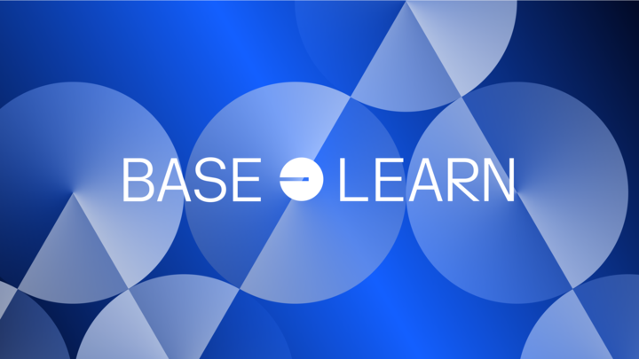

## Introduction

Welcome to Base Learn, your guide to learning smart contract development. Base Learn's curriculum has been expertly crafted to equip you with the skills and knowledge needed to build and deploy smart contracts on Base, or any EVM-compatible chain, including Ethereum, Optimism, and many more. Plus, you'll be eligible to earn NFTs as you complete each module, showcasing your mastery of the material.

Whether you're a curious novice or a seasoned pro looking to stay ahead of the game, our dynamic lessons cater to all levels of experience. You can start with the basics and work your way up, or dive straight into the more advanced concepts and push your limits to new heights.

Begin your journey today!

## What you can learn in this program

Base Learn covers the following topics. If you're looking for quickstarts, or deeper guides on advanced topics, check out our [Base Builder Tutorials]!

import LearningObjectives from './learning-objectives.md';

<LearningObjectives />

[Base Builder Tutorials]: https://docs.base.org/tutorials/
