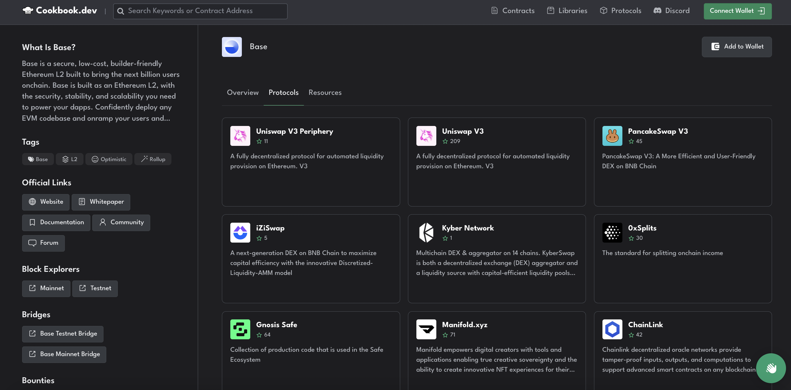
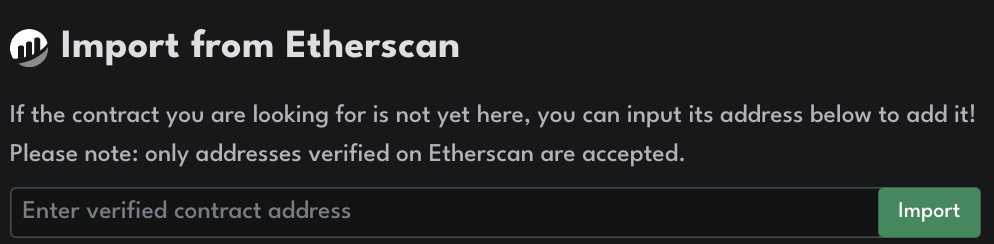
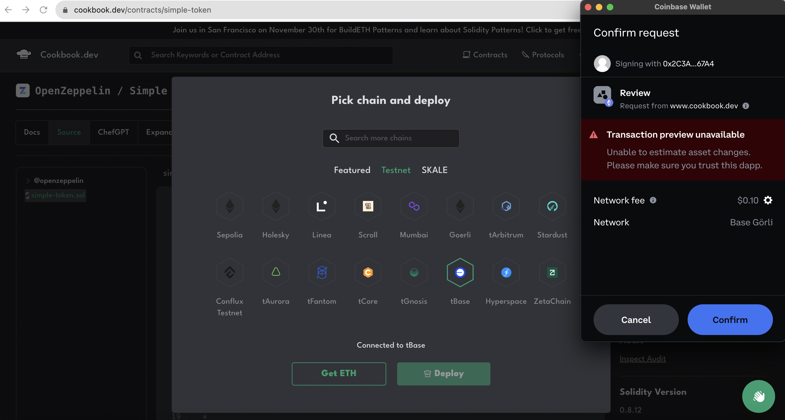
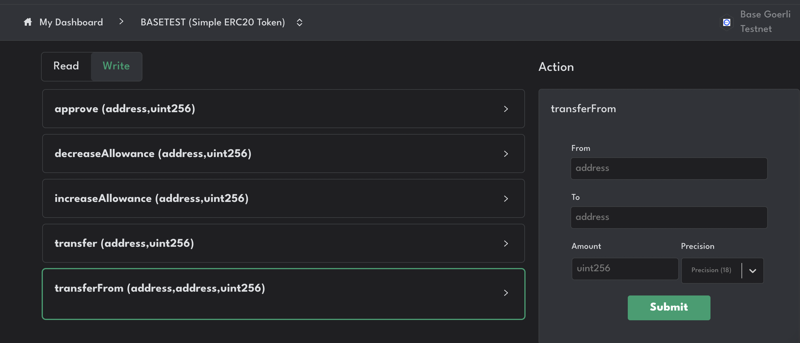
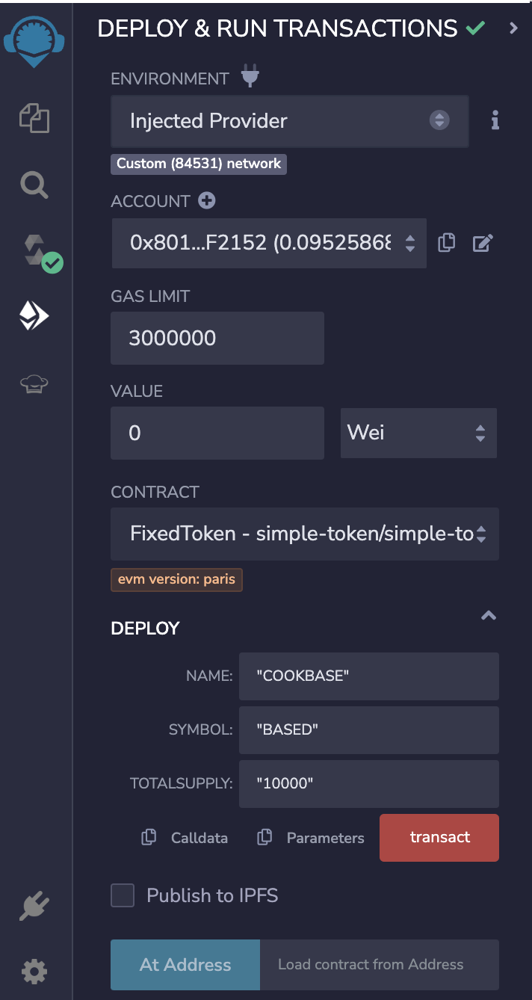
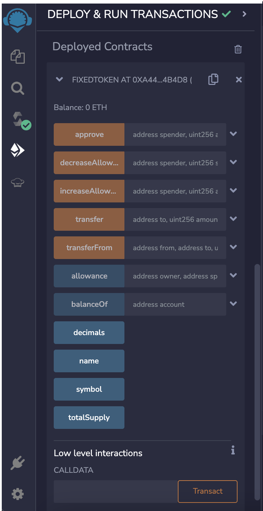

# Deploying a Smart Contract using Cookbook.dev

[Cookbook](https://www.cookbook.dev/?utm=basedocs) is an open source smart contract registry. You can search, download, deploy, manage and integrate any Solidity smart contract into your app. Cookbook integrates with and works with a variety of development environments and tooling providers such as Ethereum's Remix, Hardhat, Foundry and more.  

In this guide, you will learn to deploy a smart contract on Base using [cookbook.dev/chains/Base](https://www.cookbook.dev/chains/Base?utm=basedocs) and:
- Cookbook's No-code Deploy
- Cookbook's Remix IDE Plugin-in
- Cookbook's Hardhat Boilerplate
- Cookbook's Foundry Boilerplate

We will be using [Cookbook's Simple ERC-20 Token Smart Contract](https://www.cookbook.dev/contracts/simple-token?utm=basedocs) throughout this guide, but the principles here will apply to any smart contract found on or imported to [Cookbook](https://www.cookbook.dev?utm=basedocs). 

## Objectives

By the end of this guide you should be able to do the following:

- Search Cookbook for Base protocols and smart contracts
- Import smart contract code into your preferred development environment
- Compile a smart contract for Base
- Deploy a smart contract to Base
- Interact with a smart contract deployed on Base

## Prerequisites

## Coinbase Wallet

In order to deploy a smart contract, you will first need a web3 wallet. You can create a wallet by downloading the Coinbase Wallet browser extension.

* Download [Coinbase Wallet](https://chrome.google.com/webstore/detail/coinbase-wallet-extension/hnfanknocfeofbddgcijnmhnfnkdnaad?hl=en)

## Wallet funds
Deploying contracts to the blockchain requires a gas fee. Therefore, you will need to fund your wallet with ETH to cover those gas fees.

For this guide, you will be deploying a contract to the Base Goerli test network. You can fund your wallet with Base Goerli ETH using the following options:

* [Coinbase Faucet | Base Goerli](https://www.coinbase.com/faucets/base-ethereum-goerli-faucet)
* [Coinbase Wallet Faucets](https://chrome.google.com/webstore/detail/coinbase-wallet-extension/hnfanknocfeofbddgcijnmhnfnkdnaad)

For more detailed steps on funding your wallet with Base Goerli ETH, see [Network Faucets](https://docs.base.org/tools/network-faucets/).

# Search Cookbook's Smart Contract Registry

Navigate to [cookbook.dev/chains/Base](https://www.cookbook.dev/chains/Base?utm=basedocs) and explore **Protocols** on Base, or search for specific smart contracts in the search bar. 



To learn about a smart contract on Cookbook, select the contract, and select `Expand`. This opens the code alongside ChefGPT, Cookbook's AI Solidity assistant. 

Highlight selections of the code and press **Analyze Snippet** to get more information about the smart contract code you're looking at, or ask ChefGPT questions about Base, solidity, or your smart contract.


## Import any Smart Contract Code into Cookbook

Import verified smart contract code into Cookbook to fork, learn about, or build with by inputting any smart contract address into the Cookbook search bar.



:::tip
Supports Base, Ethereum, Polygon, BSC, Fantom, Optimism, Arbitrum, Moonbeam, Moonriver, Gnosis and Celo
:::

## Use No-Code Deploy to Deploy your smart contract to Base

Choose **No-Code Deploy** on select (usually simpler) smart contracts on [Cookbook](https://www.cookbook.dev/contracts/simple-token?utm=basedocs).


Connect your Coinbase Wallet to Cookbook.dev. 

Set your smart contract arguments within the Cookbook UI (if applicable). 

Select Base or tBase (Base Testnet) under **Pick Chain**.

Select **Deploy** and pay the network fee.



Manage your deployed smart contract under **My Dashboard** in Cookbook.  



## Deploy your Smart Contract to Base with Remix

[Remix](https://remix.ethereum.org) is an online IDE that you can use to rapidly develop and deploy smart contracts.

### Method #1 - Using the Cookbook.dev Website and Opening in Remix
 
On a smart contract or protocol page in Cookbook, select the **Open in Remix** option. Your smart contract will automatically be opened in a new Remix workspace.

[](https://remix.ethereum.org/#activate=cookbookdev&version=soljson-v0.8.12.js&call=cookbookdev//openContract//simple-token&lang=en&optimize=false&runs=200&evmVersion=null)


:::tip 
Click the "Open in Remix" button above to actually open the smart contract code in the Remix IDE!
:::

**Compile** your smart contract within remix. Most contracts opened with Cookbook will automatically compile within Remix. 


Once compiled, we can **deploy** our smart contract in Remix. We may need to set the constructor prior to deploying depending on which smart contract we're working with.



We can connect our own wallet to remix to deploy to Base by selecting injected provider - Coinbase Wallet in the **environments** tab within the **deploy** screen. 


Once deployed, we can interact with our smart contract within Remix.



### Method #2 - Using the Cookbook Remix Plug-in within the Remix IDE

Go to [Remix.Ethereum.org](https://remix.ethereum.org)

Add The Cookbook Plugin to Remix by clicking the Chef Hat Logo under **Featured Plugins** on the Remix Homepage.


Alternatively, search Cookbook and select **Activate** in the Remix Plugin Manager. 


Search for any protocol or smart contract and click the search result to import the smart contract code into Remix.


Cookbook's AI solidity co-pilot, ChefGPT, is available within the Remix plugin to answer questions about Base, Solidity, or the smart contract you're working with. 

Compile and deploy the smart contract as described in **Method 1** above. 

## Deploy your Smart Contract to Base with Hardhat

[Hardhat](https://hardhat.org/docs) is a developer tool that provides a simple way to deploy, test, and debug smart contracts.

After finding the smart contract or protocol you want to work with in [Cookbook](https://www.cookbook.dev/?utm=basedocs), select the **Download Source** option and select **Hardhat** to download the contract boilerplate. We'll use [Cookbook's Simple ERC-20 Token Smart Contract](https://www.cookbook.dev/contracts/simple-token?utm=basedocs).

To install the required packages and dependencies, run
```
npm install
```
To compile your smart contract, run 
```
npx hardhat compile
``` 
Add arguments to the `constructorArgs` array in the `deploy.js` file in the `scripts` folder and save.  If you do not need any arguments please leave the array empty.

### Deploy To Base Goerli (Testnet)
In your `.env.example` file, add your Alchemy API key and uncomment and add your wallet private key. Afterward change the name of the file to .env and create a gitignore to ignore your .env file.
```
ALCHEMY_API_KEY_BASE_GOERLI = "<YOUR ALCHEMY API KEY HERE>"
PRIVATE_KEY = "<YOUR WALLET PRIVATE KEY HERE>" 
``` 
In the `hardhat.config.js` file, after line 4 add 
```
const ALCHEMY_API_KEY_BASE_GOERLI = process.env.ALCHEMY_API_KEY_BASE_GOERLI;
```
and after line 39 add
```
 baseGoerli: {
       url: `https://base-goerli.g.alchemy.com/v2/${ALCHEMY_API_KEY_BASE_GOERLI}`,
          accounts: [PRIVATE_KEY],
 },
```

Make sure to uncomment the following line in the `hardhat.config.js`
```
const PRIVATE_KEY = process.env.PRIVATE_KEY;
```

To deploy your smart contract to the Base testnet, run 
```
npx hardhat run --network baseGoerli scripts/deploy.js
```
Hardhat will return the deployed smart contract address in your terminal. View and verify your smart contract on the [Base Goerli Network Explorer](https://goerli.basescan.org).

### Deploy To Base (Mainnet)

In your `.env.example` file, add your Alchemy API key and uncomment and add your wallet private key. Afterward change the name of the file to .env and create a gitignore to ignore your .env file.
```
ALCHEMY_API_KEY_BASE = "<YOUR ALCHEMY API KEY HERE>"
PRIVATE_KEY = "<YOUR WALLET PRIVATE KEY HERE>" 
``` 
In the `hardhat.config.js` file, after line 4 add 
```
const ALCHEMY_API_KEY_BASE = process.env.ALCHEMY_API_KEY_BASE;
```
and after line 39 add
```
Base: {
    //   url: `https://base-mainnet.g.alchemy.com/v2/${ALCHEMY_API_KEY_BASE}`,
    //   accounts: [PRIVATE_KEY],
},
```
To deploy your smart contract to the Base Mainnet, run 
```
npx hardhat run --network Base scripts/deploy.js".
```
Hardhat will return the deployed smart contract address in your terminal. View and verify your smart contract using a [block explorer](https://docs.base.org/tools/block-explorers).

### Verifying Smart Contracts Deployed to Base With Hardhat

Alternatively, verify your smart contract with Hardhat with the following steps. 

In `hardhat.config.js`, configure Base Goerli as a custom network. Add the following to your HardhatUserConfig:

```
etherscan: {
   apiKey: {
    "baseGoerli": "PLACEHOLDER_STRING"
   },
   customChains: [
     {
       network: "baseGoerli",
       chainId: 84531,
       urls: {
        apiURL: "https://api-goerli.basescan.org/api",
        browserURL: "https://goerli.basescan.org"
       }
     }
   ]
 },
```

:::info
When verifying a contract with Basescan on testnet (Goerli), an API key is not required. You can leave the value as PLACEHOLDER_STRING. On mainnet, you can get your Basescan API key from here after you sign up for an account.
:::

Now, you can verify your contract. Grab the deployed address and the constructor agruments you used in `deploy.js` and Run

```
npx hardhat verify --network baseGoerli <YOUR CONTRACT ADDRESS> "TEST" "TEST" 1000  --contract contracts/simple-token.sol:FixedToken
```

:::tip
To verify other smart contracts using the Cookbook Hardhat boilerplate, use the following format inputting your deployed contract addressk the constructor arguements you used in `deploy.js` and replacing CONTRACT_FILENAME with your own contract file name and CONTRACT_NAME with the contract name specified in your contract .sol file 
```
npx hardhat verify --network baseGoerli <YOUR CONTRACT ADDRESS> <YOUR CONSTRUCTOR ARGUMENTS>  --contract contracts/<CONTRACT_FILENAME>:<CONTRACT NAME>
```
:::

:::info
You can't re-verify a contract identical to one that has already been verified. If you attempt to do so, such as verifying the above contract, you'll get an error similar to:
```
Error in plugin @nomiclabs/hardhat-etherscan: The API responded with an unexpected message.
Contract verification may have succeeded and should be checked manually.
Message: Already Verified
```
:::


## Deploy your Smart Contract to Base with Foundry

[Foundry](https://book.getfoundry.sh) is a smart contract development toolchain.

Foundry manages your dependencies, compiles your project, runs tests, deploys, and lets you interact with the chain from the command-line and via Solidity scripts.

### Get Started

After finding the smart contract or protocol you want to work with in [Cookbook](https://www.cookbook.dev/?utm=basedocs), select the **Download Source** option and select **Foundry** to download the contract boilerplate.

Unzip and open the file in your preferred IDE. 

Before you can use Foundry, you need to install Rust, a programming language required to run Foundry. Follow the installation instructions provided [here](https://doc.rust-lang.org/book/ch01-01-installation.html).

Once Rust is installed, you can install Foundry. Follow the installation instructions provided [here](https://book.getfoundry.sh/getting-started/installation#using-foundryup).

To build your contracts, Run
```sh
forge build
```

If you encounter a "stack too deep" error, try running the following command instead

```sh
forge build --via
```

In the scripts folder, uncomment all the code in the `contract.s.sol` file. Replace `"ARG1"`, `"ARG2"`, `2000` with your `Token Name`, `Token Symbol` and desired `Token Quantity` where you see the code below
```
FixedToken _contract = new FixedToken("ARG1", "ARG2", 2000);
```

Before deploying your contracts, populate the `.env` file with your [Base Goerli RPC URL](https://www.alchemy.com/base), followed by your [Coinbase wallet private key](https://chrome.google.com/webstore/detail/coinbase-wallet-extension/hnfanknocfeofbddgcijnmhnfnkdnaad?hl=en)  and your [Etherscan API key token values](https://etherscan.io/apis). Then, run the following command to define your environment variables globally

```sh
source .env
```

:::tip 
add "0x" before your private key string in the `.env` file
:::

Deploy your contracts with the following command

```sh
forge script script/contract.s.sol:ContractScript --rpc-url $GOERLI_RPC_URL --broadcast --verify -vvvv
```

Your contract will be verified on basescan.org automatically upon deployment. You can manage and interact with your newly deployed smart contract in the [Base block explorer](https://basescan.org).

## Deploying any smart contract using the Foundry boilerplate

To deploy any smart contract to Base using the Cookbook Foundry 
Deploy your contracts with the following command

```sh
forge script script/CONTRACT_FILENAME:CONTRACT_NAME --rpc-url $GOERLI_RPC_URL --broadcast --verify -vvvv
```

:::tip 
make sure to replace `CONTRACT_FILENAME` with your own contract file name and `CONTRACT_NAME` with the contract name specified in your solidity script file
:::

Run the command below to test your contracts

```sh
forge test
```
:::note
The given tests in the contract.t.sol file are only examples, please generate your own
:::

**Further guidance**

For more information on using Cookbook to find, learn about or build with smart contracts, check out the following resources:

- [Documentation](https://docs.cookbook.dev/)
- [Blog](https://medium.com/@cookbookdev)
- [Twitter](https://twitter.com/cookbook_dev)
- [Community](https://discord.gg/cookbook)