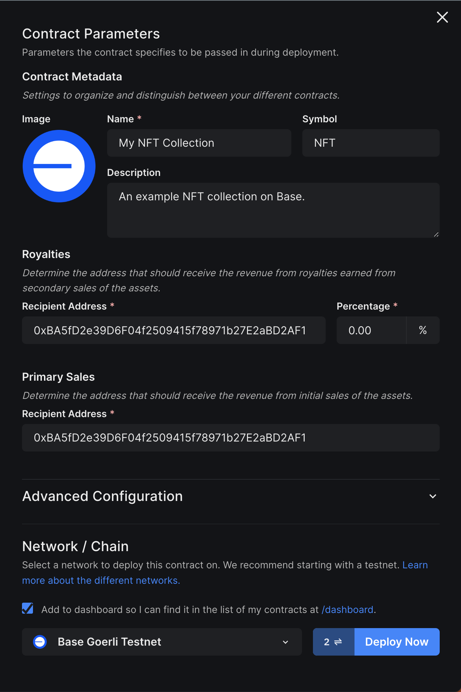
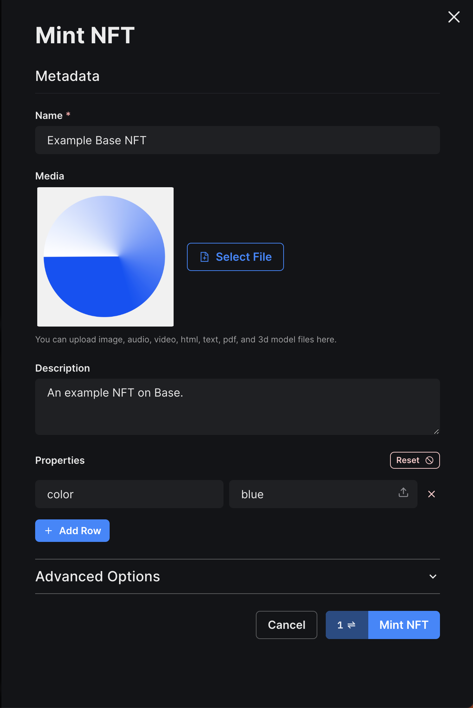

# Building a DApp using thirdweb

In this guide you will learn how to build a DApp on Base using the [thirdweb](https://portal.thirdweb.com/) platform.

To achieve this, you will deploy a smart contract for a NFT collection and create an NFT gallery DApp for viewing the metadata details of each NFT within the collection.

---

## Objectives

By the end of this guide, you should be able to:

- Create an NFT collection and mint new NFTs using thirdweb.
- Develop an NFT gallery DApp using a prebuilt thirdweb templates.

---

## Prerequisites

### 1. Setting Up a Coinbase Wallet

To begin developing a DApp on Base, you first need to set up a web3 wallet. We recommend using the Coinbase Wallet, which can be easily created by downloading the Coinbase Wallet browser extension.

[Download Coinbase Wallet](https://chrome.google.com/webstore/detail/coinbase-wallet-extension/hnfanknocfeofbddgcijnmhnfnkdnaad?hl=en)

### 2. Wallet Funding

Blockchain transactions, including deploying smart contracts, necessitate a gas fee. You must, therefore, fund your wallet with Ether (ETH) to cover these costs. This guide focuses on deploying a contract to the Base Goerli test network, and you can fund your wallet with Base Goerli ETH via the following options:

- [Coinbase Faucet (Base Goerli)](https://www.coinbase.com/faucets/base-ethereum-goerli-faucet)
- [Coinbase Wallet Faucets](https://chrome.google.com/webstore/detail/coinbase-wallet-extension/hnfanknocfeofbddgcijnmhnfnkdnaad)

Detailed steps on wallet funding with Base Goerli ETH can be found under [Network Faucets](https://docs.base.org/tools/network-faucets).

---

## Creating an NFT Collection

Before developing a DApp, you need to create an NFT collection via thirdweb.

Follow these steps to set up your NFT collection:

1. Visit the [thirdweb dashboard](https://thirdweb.com/dashboard).
2. Click the **Connect Wallet** button located in the upper right corner to connect your wallet.
3. From the dashboard, select **[Browse contracts](https://thirdweb.com/explore)** to explore a list of deployable smart contracts.
4. Navigate to the **NFTs** section and select the **[NFT Collection](https://thirdweb.com/thirdweb.eth/TokenERC721)** smart contract.
5. Click the **Deploy now** button.
6. Provide the required details for your NFT collection:
   1. Contract metadata (i.e. image, name, symbol, description)
   2. Network (Choose **Base Goerli Testnet**)
7. Click **Deploy Now**.



:::info

For production / mainnet deployments select `Base` (mainnet) as the network rather than `Base Goerli`.

:::

Post-deployment, you can manage your smart contract via the [thirdweb dashboard](https://thirdweb.com/dashboard/contracts).

Currently, your NFT Collection lacks NFTs. To populate our upcoming NFT Gallery DApp, we will need to create several NFTs.

Follow the steps below to mint new NFTs:

1. Visit the [thirdweb dashboard](https://thirdweb.com/dashboard).
2. From the dashboard, select **[View contracts](https://thirdweb.com/dashboard/contracts)** to view all your previously deployed contracts.
3. Select the NFT Collection smart contract you deployed.
4. Navigate to the **NFTs** tab on the left-hand sidebar.
5. Click **Mint**.
6. Fill in the metadata details for the NFT (name, media, description, properties).
7. Click **Mint NFT**.

Repeat these steps to mint as many NFTs as you'd like.



---

## Building an NFT Gallery DApp

With an NFT Collection in place, it's time to construct an NFT Gallery DApp. The [thirdweb CLI](https://portal.thirdweb.com/cli) provides various prebuilt and starter [templates](https://portal.thirdweb.com/templates) for popular DApp use-cases, which can significantly expedite your DApp development process.

In this guide, we'll use the [thirdweb CLI](https://portal.thirdweb.com/cli) to generate a new DApp project using the [NFT Gallery template](https://github.com/thirdweb-example/nft-gallery).

Run the following command:

```bash
npx thirdweb create --template nft-gallery
```

By default, the template is configured for an NFT collection on the Ethereum Mainnet. We will modify the code to adapt our NFT collection on the Base Goerli Testnet.

Follow these steps to update the template:

1. Open the project using your preferred code editor.
2. Open the `src/consts/parameters.ts` file.
   1. Update the `contractAddress` variable to your NFT collection's contract address (found on the thirdweb dashboard).
   2. Update the `chain` variable to `base-goerli`.
   3. Update the `blockExplorer` variable to `https://goerli.basescan.org`.
3. Open the `src/main.tsx` file.
4. Replace the file contents with the following code:

```javascript
    import React from "react";
import ReactDOM from "react-dom/client";
import App from "./App";
import "./index.css";
import { ThirdwebProvider } from "@thirdweb-dev/react";
import { BaseGoerli } from "@thirdweb-dev/chains";


ReactDOM.createRoot(document.getElementById("root") as HTMLElement).render(
  <React.StrictMode>
    <ThirdwebProvider activeChain={BaseGoerli}>
      <App />
    </ThirdwebProvider>
  </React.StrictMode>,
);
```

The above code imports and uses `BaseGoerli` to be the `activeChain`.

:::info

For production / mainnet deployments, update the information above so that the `chain` variable is `base` (step ii), the `blockExplorer` is `https://basescan.org` (step iii), and update both instances of `BaseGoerli` to `Base` in the example javascript code.

:::

---

## Running the Application

With the updated Base Goerli Testnet chain and your NFT collection's address, you can view your NFT collection from the application.

To start the application, run the following command from the root directory:

```bash
yarn dev
```

---

## Conclusion

Congratulations on reaching the end of this guide! You've now learned how to create an NFT collection using Thirdweb, mint new NFTs, and build an NFT gallery DApp on the Base blockchain!

As a next step, check out other prebuilt [smart contracts](https://thirdweb.com/explore) and starter [templates](https://portal.thirdweb.com/templates) provided by the [thirdweb](https://portal.thirdweb.com) platform that can help you build your next DApp on Base.

---
