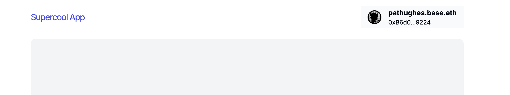

# Add Basenames to your wagmi/viem App using OnchainKit

[Basenames] is now live! But what exactly is it? Basenames allows users to register human-readable names for their addresses and serves as a foundational building block for onchain identity. Think of it as your favorite social media handle, but even bigger. Your Basename is multichain by default and yours forever—no platform can take it away from you (just make sure to pay your fee).

Integrating Basenames into your onchain app enhances the user experience by masking complex wallet addresses. Just as domains simplify IP addresses, Basenames do the same for wallet addresses.

[OnchainKit] is a React component library designed to make building Onchain applications easier. In this tutorial, we'll use the `<Identity/>` component to resolve Basenames.

This demo uses Coinbase Smart Wallet and Coinbase Wallet, but Basenames is supported across many [other wallets].

## Objectives

By the end of this tutorial, you should be able to:

- Understand how onchain identity works on the Base network
- Enable users to use their onchain identity in your app using [OnchainKit]

---

If you're starting from scratch, you'll need to create a new wagmi project. If you already have an existing wagmi project, you can skip ahead to the section on installing OnchainKit.

To create a new wagmi project using TypeScript and install the required dependencies, run the following command:

```bash
bun create wagmi
```

Next, you'll need to install OnchainKit. Run the following command:

```bash
bun add @coinbase/onchainkit
```

After adding OnchainKit, install all dependencies and start your development server with:

```
bun install && bun run dev
```

This command will install the necessary dependencies and start a development server.

To follow along with the tutorial effectively, open your web browser and your IDE side by side. This setup will allow you to code and see the changes in real time.

### Update Wagmi config

In this section, we will configure your wagmi project to support the Base blockchain by importing the necessary modules.

Start by importing the `base` and `baseSepolia` chains into your wagmi config. Navigate to `src/wagmi.ts` and update the file as follows:

```typescript title="wagmi.ts"
import { http, cookieStorage, createConfig, createStorage } from 'wagmi';
import { base, baseSepolia } from 'wagmi/chains';
import { coinbaseWallet, injected } from 'wagmi/connectors';

export function getConfig() {
  return createConfig({
    chains: [base, baseSepolia],
    connectors: [
      injected(),
      coinbaseWallet({
        appName: 'Create Wagmi',
        preference: 'smartWalletOnly',
      }),
    ],
    storage: createStorage({
      storage: cookieStorage,
    }),
    ssr: true,
    transports: {
      [base.id]: http(),
      [baseSepolia.id]: http(),
    },
  });
}

declare module 'wagmi' {
  interface Register {
    config: ReturnType<typeof getConfig>;
  }
}
```

This configuration sets up the wagmi project to connect to the Base and BaseSepolia networks, utilizing Coinbase Wallet and other connectors.

Now we’ll create a component to display the Basenames associated with an address.

:::tip Use Base as your chain
Ensure Chain is Set to Base Be sure to set the `chain={base}` parameter; otherwise, it will default to ENS (Ethereum Name Service).
:::

```typescript title="src/components/basename.tsx"
'use client';
import React from 'react';
('use client');
import React from 'react';
import { Avatar, Identity, Name, Address } from '@coinbase/onchainkit/identity';
import { base } from 'viem/chains';

interface DisplayBasenameProps {
  address: `0x${string}` | undefined;
}

export function Basenames({ address }: DisplayBasenameProps) {
  return (
    <Identity
      address={address}
      chain={base}
      schemaId="0xf8b05c79f090979bf4a80270aba232dff11a10d9ca55c4f88de95317970f0de9"
    >
      <Avatar address={address} chain={base} />
      <Name address={address} chain={base} />
      <Address />
    </Identity>
  );
}
```

This component uses OnchainKit to fetch and display the Basename, Avatar, and Address associated with the provided address.

:::note Style the Avatar
Remember to style the Avatar component to fit your application's design.
:::

Next, we’ll integrate the newly created Basenames component into your application. For instance, if you have a Header component with a Login button that allows users to connect their wallet, you can display the user's Basename instead of their wallet address after they connect.

Here’s an example of how to modify your header component to include the Basenames component:

```typescript title="src/app/page.tsx"
'use client';
import Footer from 'src/components/Footer';
import { ONCHAINKIT_LINK } from 'src/links';
import { useAccount } from 'wagmi';
import LoginButton from '../components/LoginButton';
import { Basenames } from '../components/basename';

export default async function Page() {
  const { address } = useAccount();
  const account = useAccount();

  return (
    <div className="flex h-full w-96 max-w-full flex-col px-1 md:w-[1008px]">
      <section className="mb-6 mt-6 flex w-full flex-col md:flex-row">
        <div className="flex w-full flex-row items-center justify-between gap-2 md:gap-0">
          <a href={SUPERCOOL_APP_LINK} title="Supercool App" target="_blank" rel="noreferrer">
            <h1 className="text-xl font-normal not-italic tracking-[-1.2px] text-indigo-600">
              Supercool App
            </h1>
          </a>
          <div className="flex items-center gap-3">
            {!address && <LoginButton />} {/*Connect wallet button*/}
            {account.status === 'connected' && (
              <div>
                <Basenames address={account.addresses?.[0]} />
              </div>
            )}
            {/* <h1>{result}</h1> */}
          </div>
        </div>
      </section>
      <section className="templateSection flex w-full flex-col items-center justify-center gap-4 rounded-xl bg-gray-100 px-2 py-4 md:grow"></section>
      <Footer />
    </div>
  );
}
```

In this example, once the user connects their wallet, the Basenames component is conditionally rendered to display their Basename instead of the raw wallet address.

## Conclusion

That’s it! You’ve successfully integrated Basenames into your wagmi/viem app using OnchainKit. Test your application by connecting a wallet and observing how the Basename is displayed instead of the wallet address.



[Basenames]: https://www.base.org/names/
[OnchainKit]: https://onchainkit.xyz/
[Ethereum Name Service]: https://ens.domains
[wagmi]: https://wagmi.sh
[viem]: https://viem.sh
[tanstack]: https://tanstack.com
[other wallets]: https://help.coinbase.com/en/wallet/getting-started/smart-wallet
