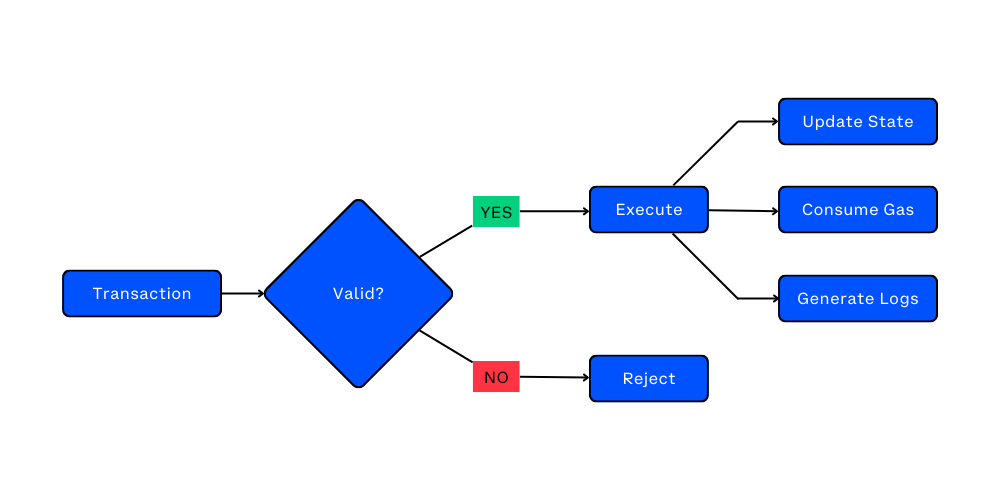
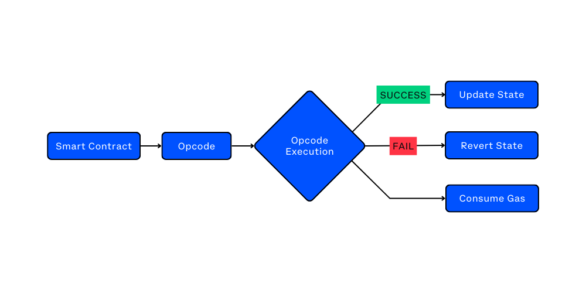
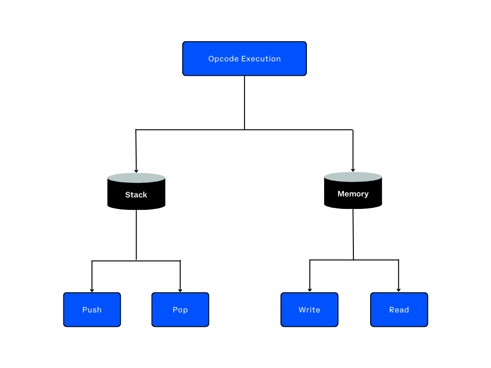
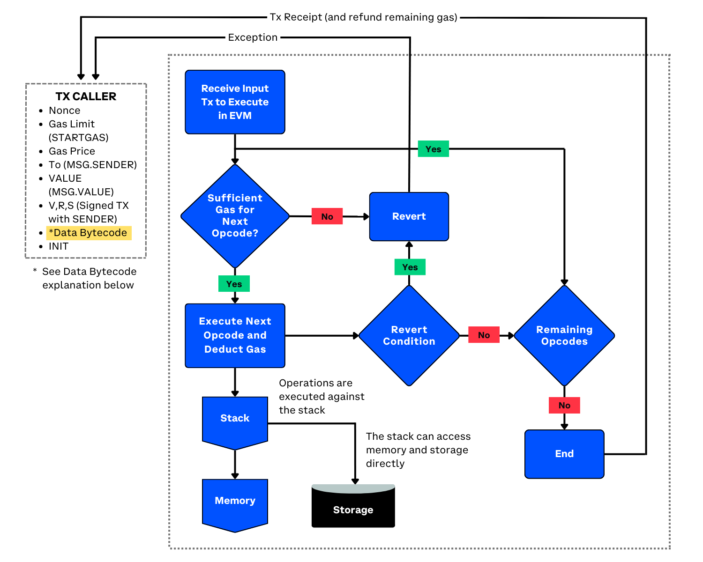

In this article, we'll examine the inner workings of the EVM, its components, and its role within the Ethereum network.

---

## Objectives

By the end of this lesson you should be able to:

- Diagram the EVM

---

## What is the EVM?

The Ethereum Virtual Machine (EVM) is the core engine of Ethereum. It is a Turing-complete, sandboxed virtual machine designed to execute smart contracts on the network. The term "sandboxed" means that the EVM operates in an isolated environment, ensuring that each smart contract's execution does not interfere with others or the underlying blockchain. As we've learned, the EVM's Turing-complete nature allows developers to write complex programs that can perform any computationally feasible task.

The EVM employs a sophisticated resource management system using gas to regulate computation costs and prevent network abuse. It also supports a rich ecosystem of apps by providing a versatile set of opcodes for smart contract logic, and fostering interoperability with various programming languages, tools, and technologies. This adaptability has made the EVM a fundamental component in the advancement and growth of the Ethereum network.

---

## EVM Components

The EVM has several key components that enable it to process and manage smart contracts. Let's define them:

- **World State:** Represents the entire Ethereum network, including all accounts and their associated storage.
- **Accounts:** Entities that interact with the Ethereum network, including Externally Owned Accounts (EOAs) and Contract Accounts.
- **Storage:** A key-value store associated with each contract account, containing the contract's state and data.
- **Gas:** A mechanism for measuring the cost of executing operations in the EVM, which protects the network from spam and abuse.
- **Opcodes:** Low-level instructions that the EVM executes during smart contract processing.
- **Execution Stack:** A last-in, first-out (LIFO) data structure for temporarily storing values during opcode execution.
- **Memory:** A runtime memory used by smart contracts during execution.
- **Program Counter:** A register that keeps track of the position of the next opcode to be executed.
- **Logs:** Events emitted by smart contracts during execution, which can be used by external systems for monitoring or reacting to specific events.

---

## EVM Execution Model

In simple terms, when a transaction is submitted to the network, the EVM first verifies its validity. If the transaction is deemed valid, the EVM establishes an execution context that incorporates the current state of the network and processes the smart contract's bytecode using opcodes. As the EVM runs the smart contract, it modifies the blockchain's world state and consumes gas accordingly. However, if the transaction is found to be invalid, it will be dismissed by the network without further processing. Throughout the smart contract's execution, logs are generated that provide insights into the contract's performance and any emitted events. These logs can be utilized by external systems for monitoring purposes or to respond to specific events.

---

## Gas and Opcode Execution

While we have already delved into the concept of gas in a previous lesson, it is worth reiterating its critical role within the EVM and as a fundamental component of Ethereum. Gas functions as a metric for quantifying the computational effort needed to carry out operations in the EVM. Every opcode in a smart contract carries a specific gas cost, which reflects the computational resources necessary for its execution.

Opcodes are the low-level instructions executed by the EVM. They represent elementary operations that allow the EVM to process and manage smart contracts.

During execution, the EVM reads opcodes from the smart contract, and depending on the opcode, it may update the world state, consume gas, or revert the state if an error occurs. Some common opcodes include:

- **ADD:** Adds two values from the stack.
- **SUB:** Subtracts two values from the stack.
- **MSTORE:** Stores a value in memory.
- **SSTORE:** Stores a value in contract storage.
- **CALL:** Calls another contract or sends ether.

---

## Stack and Memory

The EVM stack and memory are critical components of the EVM architecture, as they enable smart contracts to manage temporary data during opcode execution. The stack is a last-in, first-out (LIFO) data structure that is used for temporarily storing values during opcode execution. It is managed by the EVM and is separate from the contract's storage. The stack supports two primary operations: push and pop.

The push operation adds a value to the top of the stack, while the pop operation removes the top value from the stack. These operations are used to manage temporary data during opcode execution. For example, an opcode that performs an addition operation might push the two operands onto the stack, perform the addition, and then pop the result off the top of the stack.

During contract execution, memory serves as a collection of bytes, organized in an array, for the purpose of temporarily storing data. It can be read from and written to by opcodes. Memory is often used to store temporary data during opcode execution, such as when working with dynamically sized data like strings or arrays that are being manipulated or computed within the smart contract before being stored in the contract's storage. When a smart contract needs to store temporary data during opcode execution, it can use the memory to store that data.

---

## EVM Architecture and Execution Context

To fully grasp the EVM architecture and its components, it's important to see how they all come together in a cohesive manner. The following diagram provides an in-depth visualization of the EVM architecture, showcasing the interactions between key elements such as transactions, gas, opcodes, and the world state. With this diagram, you can see how each component plays a vital role in the seamless execution of smart contracts on the Ethereum network.

Image Source: [Mastering Ethereum](https://github.com/ethereumbook/ethereumbook) by Andreas M. Antonopoulos and Gavin Wood, licensed under [CC BY-SA 4.0](https://creativecommons.org/licenses/by-sa/4.0/)

---

## Conclusion

The EVM plays a vital role within the Ethereum network. By examining the EVM's key components as well as its architecture and execution model, we've gained insight into the engine of Ethereum and how it enables the smooth execution of smart contracts on the platform.

---

## See Also

- [The Ethereum Virtual Machine (Mastering Ethereum)](https://cypherpunks-core.github.io/ethereumbook/13evm.html#evm_architecture)
- [Ethereum Virtual Machine (Ethereum docs)](https://ethereum.org/en/developers/docs/evm/)

<!-- Reference Style Links -->

[the ethereum virtual machine (mastering ethereum)]: https://cypherpunks-core.github.io/ethereumbook/13evm.html#evm_architecture
