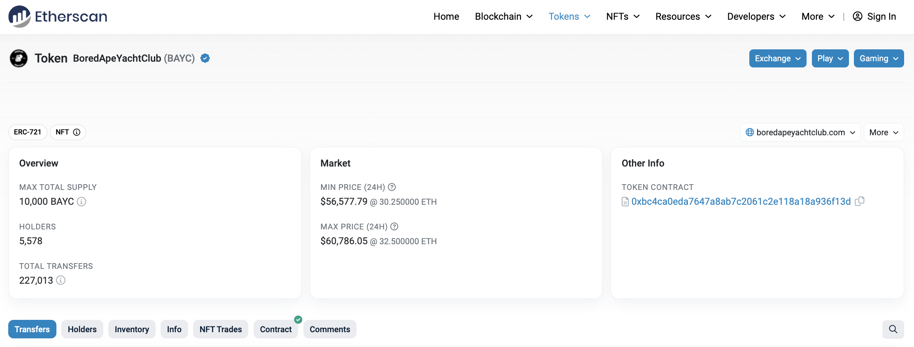
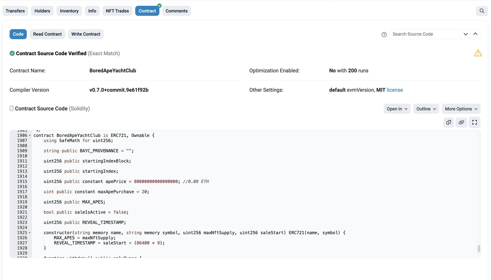
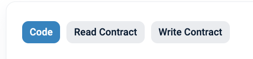
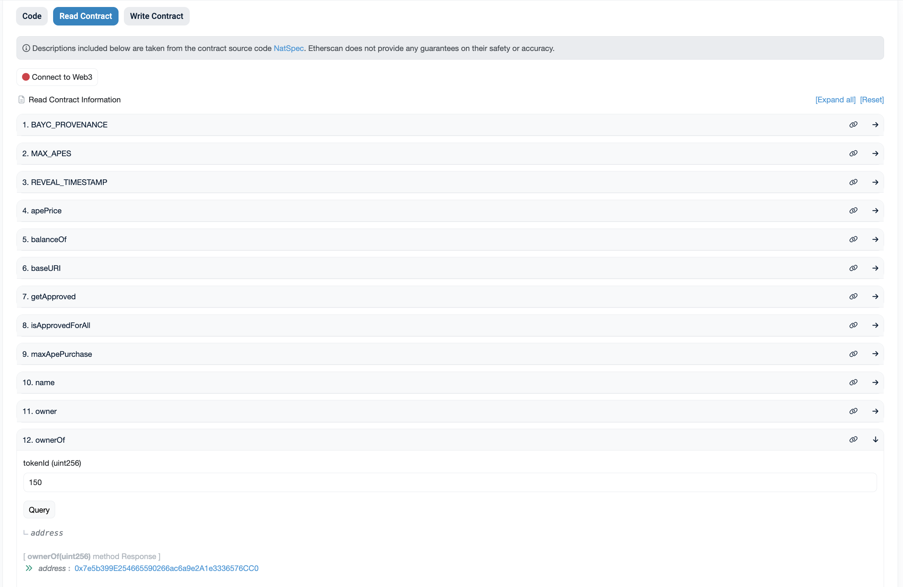
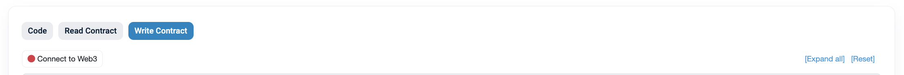

In this article, you'll learn about Etherscan, a blockchain explorer to inspect the Blockchain state and activity.

---

## Objectives

By the end of this lesson, you should be able to:

- List some of the features of Etherscan
- Read data from the Bored Apes Yacht Club contract on Etherscan
- Write data to a contract using Etherscan.

---

## Overview

[Etherscan](https://etherscan.io) is a popular Blockchain explorer that works for several different networks. In it, you can explore the state and activity of a particular network.

You can explore:

- Blocks
- Transactions
- Smart contracts
- And more!

For instance, the following shows the details of a Block:

Where you see information such as:

- Timestamp
- Transactions
- Block height
- And other details

There are many variations of Etherscan for different networks. For example:

- [Base](https://basescan.org)
- [Base Sepolia](https://sepolia.basescan.org)
- [Sepolia Etherscan](https://sepolia.etherscan.io)

## Reading data from smart contracts using Etherscan

One of the things you can do with Etherscan is interact with already-deployed contracts.

For example, if you want to read information from a famous contract such as [BAYC](https://etherscan.io/token/0xbc4ca0eda7647a8ab7c2061c2e118a18a936f13d), you can simply go to Etherscan and explore the contract:

You are able to see information such as:

- The ETH balance it holds
- The contract creator
- The transaction when it was created
- Latest transactions
- And the verified contract

In the **Contract** tab, you can see the full source code of BAYC:

For a developer, verifying contracts is important since it gives transparency to your users. However, there are some risks because this means that bad actors can see the full source code and can try to exploit it.

In order to read the state of the BAYC, you can go to the main menu and select the option **Read Contract**:

After you select that option, you are able to see all of the read functions of the contract.

You can also query who is the owner of the BAYC with id 150:

## Writing data to smart contracts using Etherscan

In a similar fashion, you can read data from smart contracts using Etherscan. It is also possible to write data.

To write data, go to the **Write Contract** tab:

From there, connect your wallet by clicking the **Connect with web3** button.

After you connect, the following UI appears:

You can then call the functions you wish to write to.

:::info

Be aware that you may need to have real Ethereum in case you want to write to a contract in Ethereum mainnet. Also, any logic that the smart contract defines will be respected. This means that if you try to write to a contract that verifies certain conditions during the transaction (e.g., a function where only the owner of the contract can write information), then you won't be able to execute the transaction if you are not the owner.

:::

## Conclusion

In this lesson, you've learned some of the main features of Etherscan, including interacting with already-deployed contracts such as BAYC in order to read and write data.

---

## See also

[Base]: https://basescan.org
[Base Sepolia]: https://sepolia.basescan.org
[Sepolia Etherscan]: https://sepolia.etherscan.io
