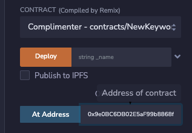
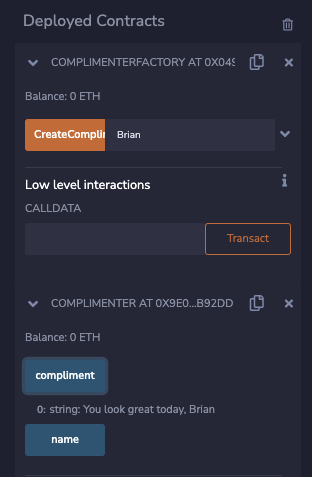

You've seen the `new` keyword and used it to instantiate `memory` arrays with a size based on a variable. You can also use it to write a contract that [creates other contracts].

---

## Objectives

By the end of this lesson you should be able to:

- Write a contract that creates a new contract with the new keyword

---

## Creating a Simple Contract Factory

A contract factory is a contract that creates other contracts. To start, let's create and interact with a very simple one. Create a new project in Remix and add a file called `ContractFactory.sol`.

### Adding the Template

Imagine you want to create a contract that can store its owner's name and compliment them upon request. You can create this contract fairly easily.

<details>

<summary>Reveal code</summary>

```solidity
contract Complimenter {
    string public name;

    constructor(string memory _name) {
        name = _name;
    }

    function compliment() public view returns(string memory) {
        return string.concat("You look great today, ", name);
    }
}
```

</details>

<br/>

Deploy and test.

### Creating a Factory

The `Complimenter` contract is a huge success! People love how it makes them feel and you've got customers banging on the doors and windows. Awesome!

The only problem is that it takes time and effort to manually deploy a new version of the contract for each customer. Luckily, there's a way to write a contract that will act as a self-service portal for your customers.

Start by adding a contract called `ComplimenterFactory`. The Remix interface makes things easier if you leave the factory in the same file as `Complimenter`.

Add a function called `CreateComplimenter` that is public, accepts a `string` called `_name`, and returns an `address`.

Creating a new contract is simple: `new Complimenter(_name)`

You can also save the return from that instantiation into a variable. This reference can be used to call public functions in the deployed contract, and can be cast to an address. We can use it to get an easy reference to find the copies made by the factory. The end result should look similar to:

<details>

<summary>Reveal code</summary>

```solidity
contract ComplimenterFactory {
    function CreateComplimenter(string memory _name) public returns (address) {
        Complimenter newContract = new Complimenter(_name);
        return address(newContract);
    }
}
```

</details>

<br/>

### Testing

Clear the environment if you haven't already, then start by deploying `ComplimenterFactory`. You've been working hard and deserve nice things, so call `CreateComplimenter` with your name.

In the terminal, the _decoded output_ will be the address of the new contract.

```text
{
	"0": "address: 0x9e0BC6DB02E5aF99b8868f0b732eb45c956B92dD"
}
```

Copy **only** the address.

Switch the _CONTRACT_ to be deployed to `Complimenter`, then paste the address you copied in the field next to the _At Address_ button which is below the _Deploy_ button.



Click _At Address_ and the instance of `Complimenter` should appear below `ComplimenterFactory`. Test to confirm it works, then try deploying more instances with the factory.



:::tip

If the deployed contract appears, but is instead a broken copy of the factory, it's because you didn't change the contract in the _CONTRACT_ dropdown above the deploy button.

Remix is trying to interact with `Complimenter` using the _ABI_ from the factory contract, which won't work.

:::

---

## Conclusion

In this lesson, you learned how to deploy contracts from another contract by using the `new` keyword. You also learned that you look great today!

---

[creates other contracts]: https://docs.soliditylang.org/en/v0.8.17/control-structures.html?#creating-contracts-via-new
