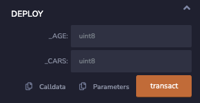

Ultimately, the power of the blockchain is that anyone can store their data on it via the `storage` in a smart contract. In this step by step guide, you'll learn how to access and use the `storage` data location.

---

## Objectives

By the end of this lesson you should be able to:

- Use the constructor to initialize a variable
- Access the data in a public variable with the automatically generated getter
- Order variable declarations to use storage efficiently

---

## Simple Storage Contract

Create a contract called `SimpleStorage`.

### Add a Storage Variable

In Solidity, variables declared at the class level are automatically `storage` variables. Create a variable to store the age of a person and another to store the number of cars that they own. Give `age` an initial value of your choosing, but don't make an assignment for `cars`;

<details>

<summary>Reveal code</summary>

```solidity
contract SimpleStorage {
    uint8 age = 41;
    uint8 cars;
}
```

</details>

<br/>

Because the age of a person, or the number of cars they own, is unlikely to be greater than 255, we can use a `uint8` for each of these. For types that are smaller than 32 bytes, multiple variables of the same type will be [packed] in the same storage slot. For this to work, the variables must be declared together.

```solidity
// These variables take advantage of packing
uint8 first;
uint8 second;
uint third;

// These variables DO NOT take advantage of packing and should be reordered
uint8 fourth;
uint fifth;
uint8 sixth;
```

### Initializing a Value with the Constructor

You may add a `constructor` function to your contract. Similar to other languages, this function is called exactly once, when the contract is deployed. The constructor may have parameters, but it does not require them.

You can use the constructor to perform various setup tasks. For example, the constructor for the _ERC-721_ token that is the underlying mechanism for most NFTs uses the constructor to set up the name and symbol for the token.

Create a constructor function and use it to assign the value of your choosing to `cars`.

<details>

<summary>Reveal code</summary>

```solidity
constructor() {
    cars = 1;
}
```

</details>

### Accessing State Variables

Deploy your contract in Remix. It should work fine, but you'll have one problem: there isn't a way to see if the variables have the expected values!

You could solve this by writing functions that return the values in your state variables, but you don't need to. The Solidity compiler automatically creates getters for all `public` variables.

Add the `public` keyword to both variables. Unlike most languages, `public` goes **after** the type declaration. Your contract should now be similar to:

<details>

<summary>Reveal code</summary>

```solidity
contract SimpleStorage {
    uint8 public age = 41;
    uint8 public cars;
    constructor() {
        cars = 1;
    }
}
```

</details>

<br/>

Redeploy your contract and test to confirm.

---

## Setting a State Variable with a Function

Good news! Our user bought a second car! The only problem is that we don't have a way to update the number of `cars` stored.

### Add a Function to Update `cars`

Before writing the function, let's think about design considerations for this feature. At any point in time, a user could:

- Buy or otherwise acquire a new car
- Get several new cars all at once (Woohoo!)
- Sell or give away one or more cars (😞)

Given this wide variety of conditions, **a** good approach would be to handle calculating the correct number of cars on the front end, and passing the updated value to the back end.

To meet this need, we can write a `public` function that takes a `uint8` for `_numberOfCars` and then simply assigns that value to the state variable `cars`. Because this function modifies state, it **does not** need `pure` or `view`. It isn't either of those.

<details>

<summary>Reveal code</summary>

```solidity
function updateNumberOfCars(uint8 _numberOfCars) public {
    cars = _numberOfCars;
}
```

</details>

<br/>

Deploy and test to make sure it works as expected.

:::warning

While packing variables can save on gas costs, it can also increase them. The EVM operates on 32 bytes at a time, so it will take additional steps to reduce the size of the element for storage.

Furthermore, the savings in writing to storage only apply when writing multiple values in the same slot at the same time.

Review the **Warning** in the [layout] section of the docs for more details!

:::

### Add a Function to Update `age`

It would also be good to be able update the `age` value. This problem has slightly different considerations. Sadly, `age` will never go down. It should also probably only go up by one year for each update. The `++` operator works in Solidity, so we can use that to create a function that simple increments age when called.

<details>

<summary>Reveal code</summary>


```solidity
function increaseAge() public {
    age++;
}
```

</details>

<br/>


But what if a user calls this function by mistake? Good point!

On your own, add a function called `adminSetAge` that can set the `age` to a specified value.

### Refactor the Constructor to Accept Arguments

We've got one problem remaining with this contract. What if your user has a different `age` or number of `cars` than what you've hardcoded into the contract?

As mentioned above, the `constructor` **can** take arguments and use them during deployment. Let's refactor the contract to set the two state variables in the constructor based on provided values.

<details>

<summary>Reveal code</summary>

```solidity
contract SimpleStorage {
    uint8 public age;
    uint8 public cars;
    constructor(uint8 _age, uint8 _cars) {
        age = _age;
        cars = _cars;
    }
}
```

</details>

<br/>

Redeploy your contract. Note that now you have added parameters to the `constructor`, you'll have to provide them during deployment.



Once completed, your contract should be similar to:


<details>

<summary>Reveal code</summary>

```solidity
contract SimpleStorage {
    uint8 public age;
    uint8 public cars;
    constructor(uint8 _age, uint8 _cars) {
        age = _age;
        cars = _cars;
    }

    function updateNumberOfCars(uint8 _numberOfCars) public {
        cars = _numberOfCars;
    }

    function increaseAge() public {
        age++;
    }

    function adminSetAge(uint8 _age) public {
        age = _age;
    }
}
```

</details>

<br/>

---

## Conclusion

In this lesson, you've explored how to persistently store values on the blockchain. You've also practiced updating them from functions. Finally, you've learned how to use the constructor to perform setup functionality during deployment, with and without parameters.

---

[packed]: https://docs.soliditylang.org/en/v0.8.17/internals/layout_in_storage.html
[layout]: https://docs.soliditylang.org/en/v0.8.17/internals/layout_in_storage.html
