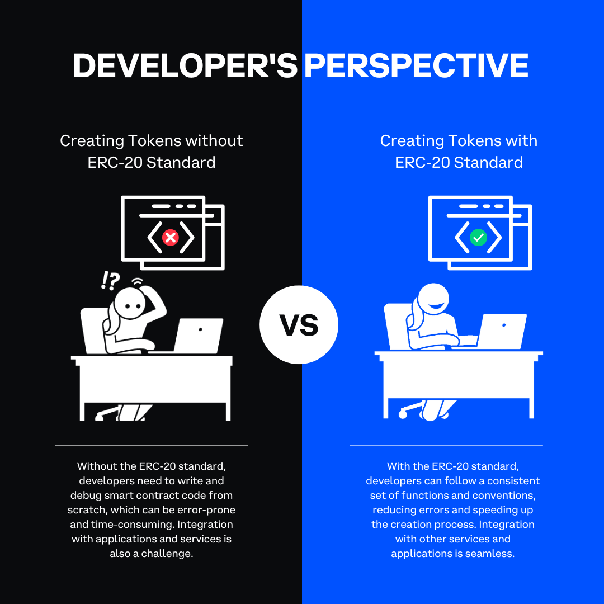
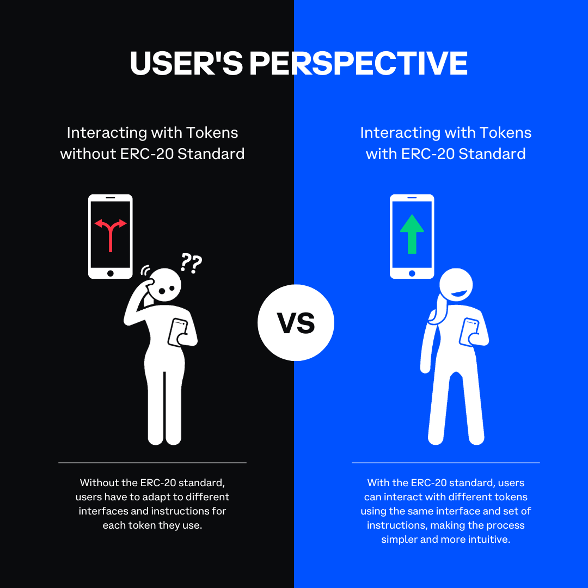

In this article, we'll delve into the structure and specifications of ERC-20 tokens, uncovering the key elements that contribute to their widespread adoption and diverse use cases.

---

## Objectives:

By the end of this lesson you should be able to:

- Analyze the anatomy of an ERC-20 token
- Review the formal specification for ERC-20

---

## Introduction

The emergence of the ERC-20 token standard marked a significant milestone in the evolution of the Ethereum ecosystem, providing a unified and adaptable framework for creating and managing fungible tokens. As the backbone for a vast array of applications in decentralized finance and beyond, ERC-20 tokens facilitate seamless collaboration and interoperability within the Ethereum ecosystem. Their adaptable nature and standardized structure have made them the go-to choice for developers and users alike, laying the groundwork for continued innovation and growth in the Ethereum space.

The ERC-20 token standard has not only streamlined the creation of new tokens but also bolstered the overall user experience by establishing a consistent set of rules and functions. As a result, it has garnered widespread adoption and solidified its position as the de facto standard for fungible tokens on Ethereum, driving the expansion of the decentralized economy and fostering the development of novel applications and services.

---

## ERC-20 Specification

EIP-20 (Ethereum Improvement Proposal 20) is the formal specification for ERC-20, defining the requirements to create compliant tokens on the Ethereum blockchain. EIP-20 prescribes the mandatory functions, optional functions, and events a token must implement to achieve ERC-20 compliance. Adherence to EIP-20 allows developers to create tokens compatible with existing Ethereum applications and services, streamlining integration.

---

## Anatomy of an ERC-20 Token

An ERC-20 token consists of a smart contract that implements the standardized interface, which comprises a set of six mandatory functions:

- **totalSupply():** Returns the total supply of the token.
- **balanceOf(address):** Provides the balance of tokens held by a specific address.
- **transfer(address, uint256):** Transfers a specified amount of tokens from the sender's address to the specified recipient's address.
- **transferFrom(address, address, uint256):** Enables a third party to transfer tokens on behalf of the token owner, given that the owner has approved the transaction.
- **approve(address, uint256):** Allows the token owner to grant permission to a third party to spend a specified amount of tokens on their behalf.
- **allowance(address, address):** Returns the amount of tokens the token owner has allowed a third party to spend on their behalf.

Additionally, ERC-20 tokens can include optional functions that provide descriptive information about the token:

- **name():** Returns the name of the token, for example, "Uniswap."
- **symbol():** Provides the token's symbol, like "UNI."
- **decimals():** Indicates the number of decimal places the token can be divided into, typically 18 for most tokens.

---

## Benefits of ERC-20 Standardization

The standardization of ERC-20 tokens provides several benefits for both developers and users. For developers, it simplifies the process of creating new tokens by providing a consistent set of functions and conventions. This reduces the likelihood of errors and ensures a smooth integration with existing applications and services in the Ethereum ecosystem.

For users, the standardized interface makes it easier to interact with a wide variety of tokens, regardless of their specific purpose or implementation. This means that users can effortlessly check their token balance, transfer tokens, or approve transactions using the same set of functions, whether they are interacting with a governance token like UNI or a stablecoin like USDC.

---

## Applications

ERC-20 tokens find wide-ranging applications in various categories, each with its unique purpose and functionality:

- **Utility tokens:** These tokens can be used to access specific services or features within a platform. Examples include Filecoin (FIL) for decentralized storage, Basic Attention Token (BAT) for digital advertising, and Decentraland's MANA for purchasing virtual land and assets.

- **Governance tokens:** These tokens grant voting rights and influence over the development of a project, allowing holders to participate in decision-making processes. Examples include Uniswap (UNI), Aave (AAVE), and Compound (COMP).

- **Stablecoins:** These tokens maintain a relatively stable value pegged to a reserve of assets or fiat currency, providing a less volatile option for transactions and trading. Examples include USD Coin (USDC), Tether (USDT), and MakerDAO's DAI.

- **Liquidity tokens:** Liquidity providers on DeFi platforms often receive ERC-20 tokens as a representation of their share in a liquidity pool. These tokens can be staked or traded, and they enable users to earn rewards for providing liquidity. Examples include Uniswap LP tokens and Curve LP tokens.

- **Rewards tokens:** Some platforms issue ERC-20 tokens as incentives for users to participate in their ecosystem, such as staking, lending, or providing liquidity. These tokens can be earned as passive income or used to access additional platform features. Examples include Synthetix (SNX) and SushiSwap (SUSHI).

Each of these use cases demonstrates the adaptability of ERC-20 tokens to serve different needs within the blockchain ecosystem.

---

## Conclusion

By providing a consistent framework for fungible tokens and adhering to the formal EIP-20 specification, ERC-20 has enabled the development of countless projects and applications that have revolutionized how value is exchanged and managed on Ethereum. Analyzing the anatomy of an ERC-20 token and reviewing its formal specification reveal the versatility and importance of this token standard.

---

## See Also

- [Introduction to Ethereum Improvement Proposals (EIPs)](https://ethereum.org/en/eips/)
- [EIP-20: ERC-20 Token Standard](https://eips.ethereum.org/EIPS/eip-20)
- [ERC-20 Token Standard](https://ethereum.org/en/developers/docs/standards/tokens/erc-20/)
