This tutorial shows you how to set up a private environment for smart contract **development on Base Network** using **Tenderly DevNets**.

Learn how to configure a DevNet, use built-in tools for **smart contract debugging,** run **transaction simulations** to validate your fixes, and introduce a DevNet into your **continuous integration**.

---

[Tenderly DevNets are a zero-setup environment](https://docs.tenderly.co/devnets/intro-to-devnets) for developing and testing smart contracts against production data. As a private replica of 30+ EVM networks, a DevNet environment allows you to instantly deploy, execute, and debug smart contracts. With an unlimited faucet, unlocked public accounts, and built-in debugging tools, you get full control over your environment while getting the latest network states. Additionally, you can integrate a DevNet RPC URL into your existing development and CI flows, automating setups with reusable and customizable YAML templates.

---

## Objectives

By the end of this tutorial, you should be able to:

- Create a **DevNet** with the most recent **Base network** states.
- **Deploy, verify, and execute** your contracts on a DevNet.
- **Debug** smart contracts instantly and optimize their gas usage.
- Use **transaction** **simulations** to validate fixes prior to deployment.
- Integrate a DevNet into your **Continuous Integration (CI)** to automate your testing.

---

## Prerequisites

### 1. Set up a Tenderly account

To begin developing on Tenderly, you must first set up an account. You can easily create one by visiting the [registration page](https://dashboard.tenderly.co/register).

### 2. Install the Tenderly CLI

After setting up your account, you should install the Tenderly Command Line Interface (CLI). This will allow you to interact with your DevNet environments directly from your terminal.

Follow these [instructions to install the Tenderly CLI](https://github.com/Tenderly/tenderly-cli#installation).

### 3. Create a DevNet template

Before developing a smart contract, you must create a DevNet template via Tenderly.

Follow these steps to set up your DevNet template for Base Network:

1. Visit the [Tenderly Dashboard](https://dashboard.tenderly.co/).
2. From the lefthand menu, navigate to **DevNets** and click **Create Template**.
3. When prompted:

   1. Choose **Base** for your Network.
   2. Give your Base DevNet a unique **Name**.
   3. Click **Create**.

   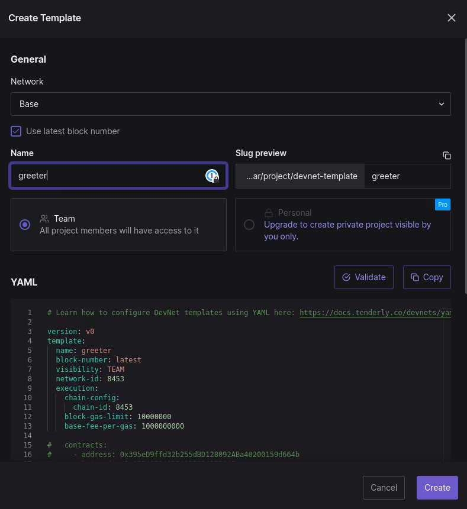

:::info
If needed, check out the Tenderly documentation for more information on [setting up a Devnet template](https://docs.tenderly.co/devnets/intro-to-devnets#basic-devnet-usage).
:::

4. Click **Spawn DevNet,** and that's about it - you've got your own private replica of Base Network.

:::info
If needed, check out the Tenderly documentation for more alternative [methods to spawn a DevNet](https://docs.tenderly.co/devnets/advanced/automated-devnet-spawning-bash-and-javascript).
:::

### 4. Customize your DevNet environment

You can also [use the YAML editor in DevNets to create reusable templates](https://docs.tenderly.co/devnets/yaml-template) that allow you to configure your environment. As a "blueprint" for your DevNets, the reusable YAML templates enable you to quickly spawn your DevNets with preset configurations. You can use them to override on-chain data for wallets and contracts of interest with custom values, including `balances`, `erc20`, `storage`, `wallets`, and `contracts`.

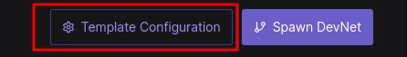

#### YAML Template Configuration

```yaml
# Learn how to configure DevNet templates using YAML here: https://docs.tenderly.co/devnets/yaml-template

version: v0
template:
  name: greeter
  block-number: latest
  visibility: TEAM
  network-id: 8453
  execution:
    chain-config:
      chain-id: 8453
    block-gas-limit: 10000000
    base-fee-per-gas: 1000000000

  #   contracts:
  #     - address: 0x395eD9ffd32b255dBD128092ABa40200159d664b
  #       bytecode: 0x123412341234123124123143
  #       balance: 100
  #       slots:
  #         - 0x3459054d09ae8631455b798b2b5d106e17bb4e68a39d2d2a935f5f1b7253988c: 0x0000000000000000000000000000000000000000000000000000000000000000
  #         - 0x3459054d09ae8631455b798b2b5d106e17bb4e68a39d2d2a935f5f1b7253988d: 0x0000000000000000000000000000000000000000000000000000000000000001
  #   wallets:
  #     - address: 0x395eD9ffd32b255dBD128092ABa40200159d664b
  #       balance: 100
  #     - private-key: 0x3459054d09ae8631455b798b2b5d106e17bb4e68a39d2d2a935f5f1b7253988c
  #       balance: 100
  #   storage:
  #     - address: 0x395eD9ffd32b255dBD128092ABa40200159d664b
  #       slots:
  #         - 0x1459054d09ae8631455b798b2b5d106e17bb4e68a39d2d2a935f5f1b7253988c: 0x0000000000000000000000000000000000000000000000000000000000000001
  #         - 0x2459054d09ae8631455b798b2b5d106e17bb4e68a39d2d2a935f5f1b7253988c: 0x0000000000000000000000000000000000000000000000000000000000000002
  #     - address: 0xabcde9ffd32b255dBD128092ABa40200159d665a
  #       slots:
  #         - 0x3459054d09ae8631455b798b2b5d106e17bb4e68a39d2d2a935f5f1b7253988c: 0x0000000000000000000000000000000000000000000000000000000000000003
  #   balances:
  #     - address: 0x395eD9ffd32b255dBD128092ABa40200159d664b
  #       amount: 1000
  #     - address: 0x395eD9ffd32b255dBD128092ABa40200159d664b
  #       amount: 1000
  #   erc20:
  #     - contract: 0x6B175474E89094C44Da98b954EedeAC495271d0F # DAI
  #       balances:
  #         - address: 0x0000000000000000000000000000000000000000
  #           amount: 100
  display-name: Greeter
```

### 5. Set up Hardhat and add a DevNet RPC

Next, let's extend your HardHat environment by connecting it to a Tenderly DevNet. All transactions from your scripts and tests will be recorded for later viewing in the Tenderly DevNet Dashboard.

First, you must modify a code example to use the new DevNet you created.

The rest of this tutorial assumes you're either using the [devnet-examples repository](https://github.com/Tenderly/devnet-examples.git) or that you have a Hardhat project set up with these dependencies included:

- `"@nomicfoundation/hardhat-toolbox": "^2.0.2"`
- `"@nomiclabs/hardhat-ethers": "^2.2.3"`
- `"@tenderly/hardhat-tenderly": "^1.7.7"`
- `"ethers": "^5.7.2"`
- `"hardhat": "^2.17.1"`

1. First, download the example code from the Tenderly Github repo:

   ```bash
   git clone https://github.com/Tenderly/devnet-examples.git
   ```

2. Navigate to the `local-development` directory _(make sure `@tenderly/hardhat-tenderly` is set to: `"^1.7.7"`)_ and execute the following:

   ```bash
   cd local-development
   yarn install
   ```

3. Modify your `hardhat.config.ts` file by adding the items below:

   ```ts
   import {HardhatUserConfig} from "hardhat/config";
   import "@nomicfoundation/hardhat-toolbox";

   import * as tdly from "@tenderly/hardhat-tenderly";
   import * as dotenv from "dotenv";
   dotenv.config();

   tdly.setup({
   		**// TODO: Prefer manual over automatic verification**
       automaticVerifications: false,
   });

   const config: HardhatUserConfig = {
       solidity: "0.8.18",
       defaultNetwork: "tenderly",
       networks: {
   				**// TODO: Make sure this is named "tenderly" as it is here.**
           tenderly: {
   						**// TODO: Add your Base DevNet RPC URL here (created during the spawn step)**
               url: 'PASTE RPC LINK HERE',
               chainId: 8453 // (Base ChainID)
           }
       },
       tenderly: {
   				**// TODO: Add your tenderly username (from the Dashboard)**
           username: "",
   				**// TODO: Add your project name (from the Dashboard)**
           project: "",
           privateVerification: false
       }
   };

   export default config;
   ```

---

## Verify your smart contract

You can [verify your smart contract on Tenderly](https://docs.tenderly.co/monitoring/smart-contract-verification#methods-of-verification) using several methods. In this tutorial, we [use the Tenderly Hardhat plugin method](https://docs.tenderly.co/monitoring/smart-contract-verification/verifying-contracts-using-the-tenderly-hardhat-plugin), but feel free to choose a different one if it better suits your project.

1. In `deployGreeter.ts`, add the following code after the `greeter.setGreeting()`.

   ```ts
   await greeter.deployed();
   await greeter.setGreeting('hello');

   // Add this
   await tenderly.verify({
     name: 'Greeter',
     address: greeter.address,
   });
   ```

2. Also, make sure to update the Tenderly import at the top of the file as well.

   ```js
   import { ethers, **tenderly** } from "hardhat"; // Add tenderly
   ```

3. Deploy your smart contract:

   ```bash
   npx hardhat run scripts/deployGreeter.ts --network tenderly
   ```

   If successful, you should get an output similar to:

   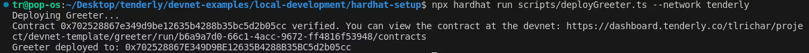

   You can see the result of the deployment in [this example on a publicly shared DevNet](https://dashboard.tenderly.co/shared/devnet/transaction/7811f867-2af4-4136-8c75-f77fbb4e17ed).

4. Test your smart contract to make sure there are no errors (It is always best practice to run the included tests).

---

## Use Tenderly Debugger

[Tenderly Debugger](https://docs.tenderly.co/debugger/how-to-use-tenderly-debugger) allows you to pinpoint the exact line of code causing an issue and speed up your debugging process. With Debugger, you can step through code and inspect stack traces, filter internal and external calls, see decoded events and logs, examine state changes, and more.

To use it, follow these steps:

- Open the Transaction tab in your DevNet.
- Click on the **setGreeting** transaction.
- Click Debugger.

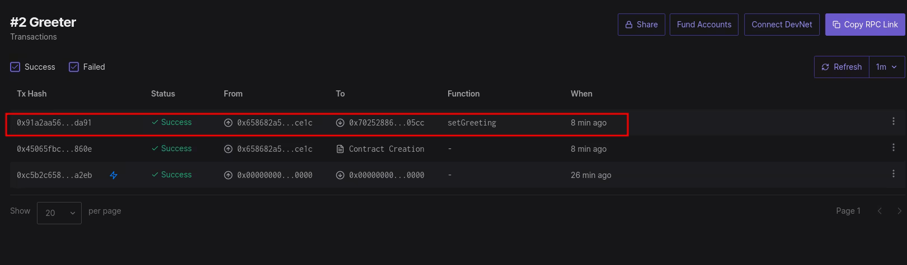

- Click the **Debugger** button.

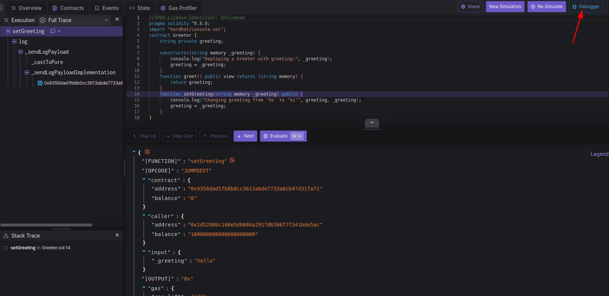

Notice the current line (line 14 in this example) is highlighted. Use Debugger to examine the **setGreeting** function.

Next, click the **Evaluate** button to evaluate complex expressions, global and local variables, functions, and other relevant parameters in a human-readable format.

To try it out, follow these steps:

- Click the **Evaluate** button.
- In the modal that appears, type `_greeting` and see what is being passed into the **setGreeting** function call.

You should see the output `{"result": "hello"}`!

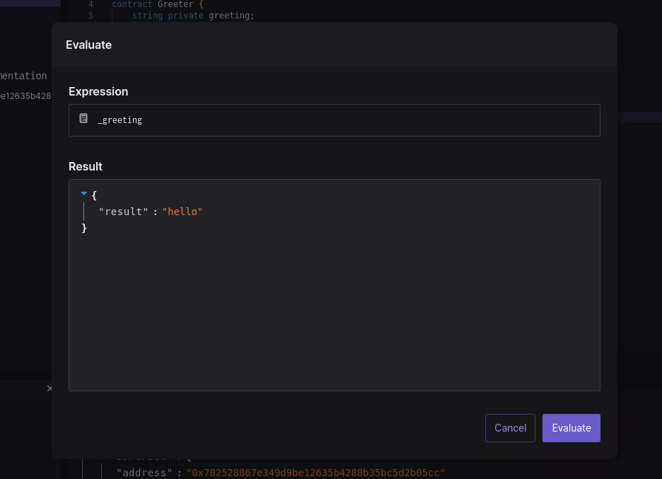

---

## Simulate transactions with updated contract source code

After detecting the exact cause of a bug, you can immediately try out a potential solution and make sure it works [using Transaction Simulator](https://docs.tenderly.co/simulations-and-forks/intro-to-simulations). This feature allows you to simulate transaction execution against real-time and historical Base data, as well as any other supported network, without actually deploying it on-chain.

You can **simulate transactions** with updated contract source code and modified transaction parameters within your DevNet to see what would happen if the transaction got executed on Base Network. Running a transaction simulation with [modified contract source code](https://docs.tenderly.co/simulations-and-forks/how-to-simulate-a-transaction/editing-contract-source) allows you to change compilation parameters, such as compiler version, optimization settings, or EVM version, to test your bug fixes.

Follow these steps to try it out:

- Click the **New Simulation** button.
  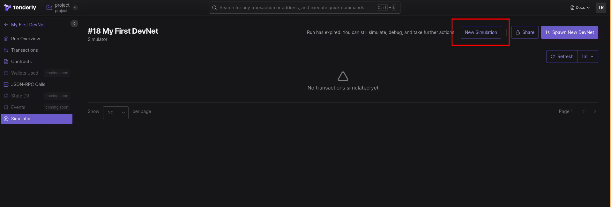
- Then, from the Simulation screen, find the **Select address** drop-down menu and click **Greeter**.
- Click **Edit Source**.
- Modify the console.log to say `You changed the` to the console.log within **SetGreeting** in the `Greeter.sol` smart contract and click the **Apply** button.
  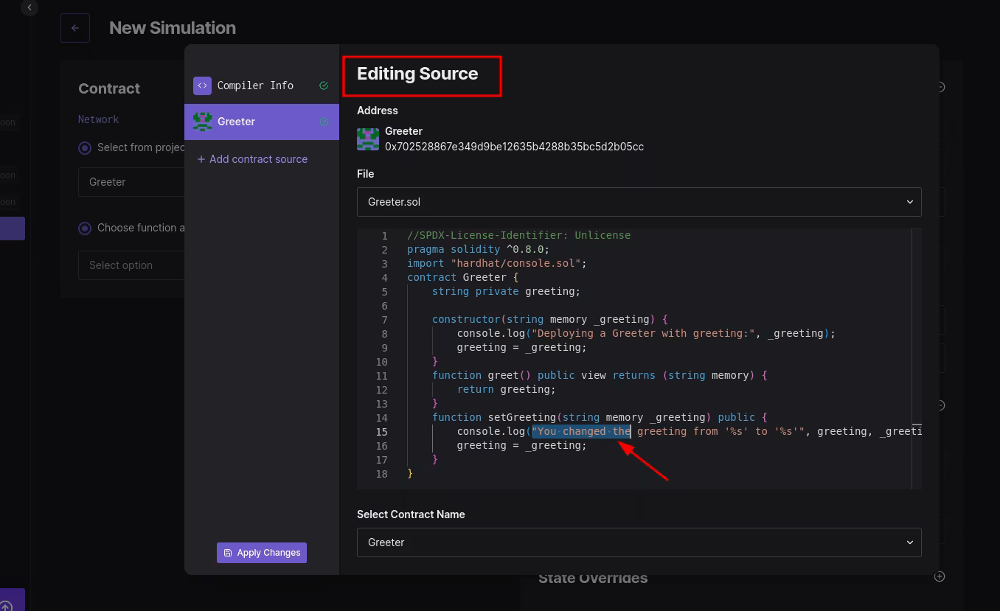
- From the **Select Option** drop-down menu, select "**Set Greeting**."
- Change the greeting to something like, `Hello from Base!`
  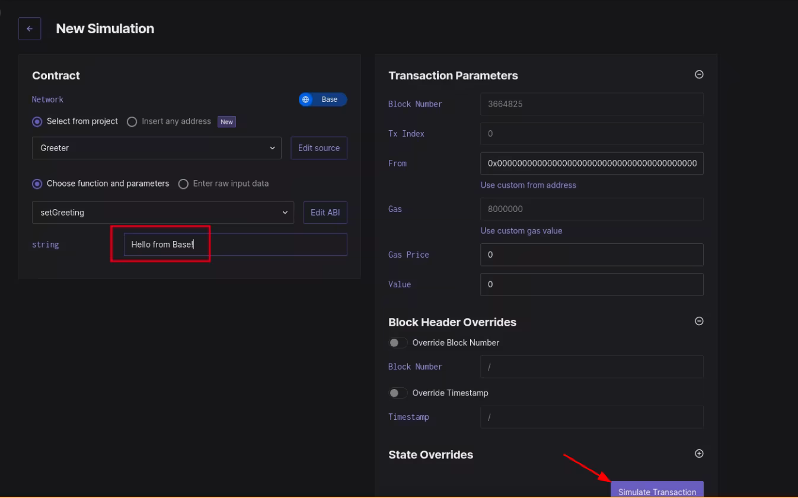
- Click **Simulate Transaction**.

Notice the smart contract edit you made is now reflected in the console.log. In addition, you simulated transaction execution under this new condition of a modified smart contract.

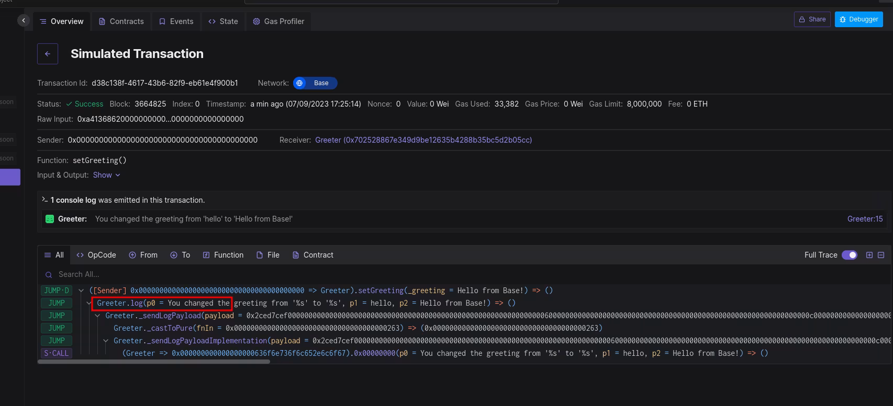

---

## Override the contract state

In addition, we can **change the state of the contract** before simulating a transaction. This is important because it allows you to mock contract states and execute highly specific simulation scenarios. Note that state overrides are valid for the simulation you're running. Subsequent simulations will be unaware of the state override.

1. To change the execution state, click on **Simulator** from the DevNet menu.
2. Click **New Simulation**.
3. Head over to **State Overrides**, select your contract, and assign a **KEY** and **VALUE** pair.
4. For **KEY**, enter `0x0000000000000000000000000000000000000000000000000000000000000000`
5. For **VALUE**, enter `0x48656c6c6f2066726f6d2054656e6465726c79`

   Note: The **VALUE** is hex for `Hello from Tenderly.` You can get a generated hex value [using a string-to-hex converter](https://string-functions.com/string-hex.aspx).

   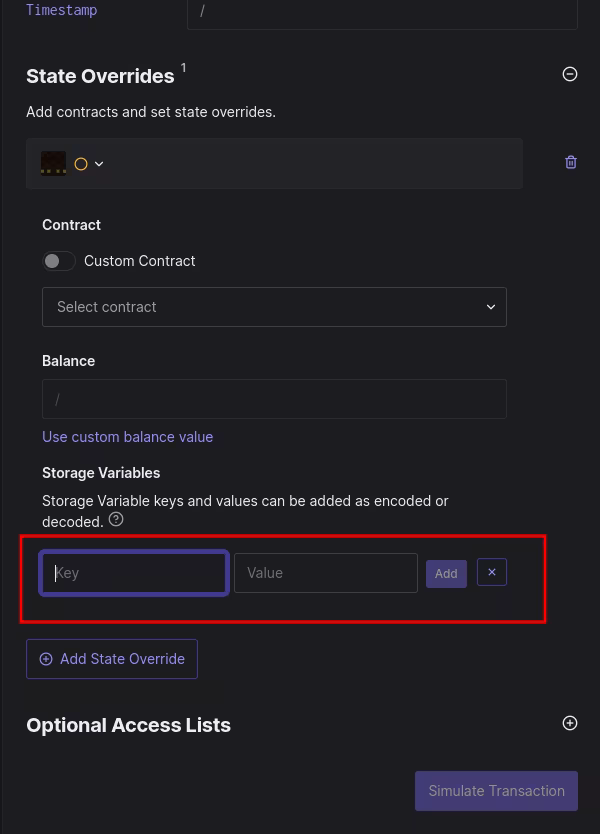

6. Click **Add**.
7. Click **Simulate**.

:::info
Note that this has overridden the existing state with a new default greeting. This functionality allows you to run transaction simulations under custom conditions.
:::

---

## Use DevNets in Continuous Integration (CI)

Production-level code requires constant testing and monitoring. You can integrate a Tenderly DevNet into your CI pipeline to generate a staging environment for precisely that purpose.

Follow along using the [DevNet example project](https://github.com/Tenderly/devnet-examples.git) to set up a CI using GitHub Actions.

1. Clone the devnets-example project if you haven't already:

   ```bash
   git clone https://github.com/Tenderly/devnet-examples.git
   ```

2. Install the Tenderly CLI if you haven't already. Follow the [provided instructions to install the CLI](https://github.com/Tenderly/tenderly-cli#installation).
3. Adapt the `.github/workflows/smart-contract-ci.yml` with the following configuration, and replace `???` with [project slug](https://www.notion.so/o/-LeLQOwIQG3HndcULLU2/s/-LeLQaB11_TIOtLg8tIW/other/platform-access/how-to-find-the-project-slug-username-and-organization-name), [username](https://www.notion.so/o/-LeLQOwIQG3HndcULLU2/s/-LeLQaB11_TIOtLg8tIW/other/platform-access/how-to-find-the-project-slug-username-and-organization-name), and a DevNet template slug.

   ```yaml
   name: Smart Contracts CI

   on:
     push:
       branches:
         - main
     pull_request:
       branches:
         - main

   jobs:
     build-and-test:
       runs-on: ubuntu-latest

       steps:
         - name: Checkout code
           uses: actions/checkout@v3

         - name: Set up Node.js
           uses: actions/setup-node@v3
           with:
             node-version: 16

         - name: Install dependencies
           run: yarn install
           working-directory: ./CI-project # hardhat location

         - name: Install Tenderly CLI
           run: curl https://raw.githubusercontent.com/Tenderly/tenderly-cli/master/scripts/install-linux.sh | sudo sh

         - name: Run tests
           run: yarn run test:devnet
           working-directory: ./CI-project # hardhat location
           env:
             TENDERLY_ACCESS_KEY: ${{ secrets.TENDERLY_ACCESS_KEY }}
             TENDERLY_PROJECT_SLUG: '???' # your project slug
             TENDERLY_DEVNET_TEMPLATE: '???' # your devnet template slug
             TENDERLY_ACCOUNT_ID: '???' # your username or organization name
   ```

   You can find the DevNet template slug (needed for `TENDERLY_DEVNET_TEMPLATE`) in the DevNets UI. Here is an example:

   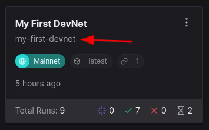

   Showing how to find TENDERLY_DEVNET_TEMPLATE

4. From your terminal, run the tests locally. The `test:devnet` script will [spawn a new DevNet automatically](https://github.com/Tenderly/devnet-examples/blob/main/spawn-devnet-auto/js/spawn-devnet.js) and run tests against it.

   ```bash
   npx hardhat test:devnet
   ```

5. To test, change any file, commit, and push the changes. Any time you push a change, your Tenderly DevNet tests will execute.
6. Head over to your project repository on GitHub.
7. Click the **Actions** tab.

Note that you should now have a workflow run in progress. After the build finishes, you can see all the transactions in a DevNet run.

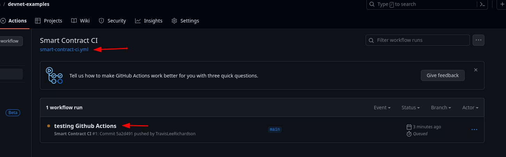

---

## Conclusion

Congrats! In this tutorial, you've learned how to set up your own private replica of Base with Tenderly DevNets. You can now use it to instantly deploy, execute, and debug your smart contracts.

Plus, you can validate your fixes using transaction simulations before deploying them on-chain. Finally, you can integrate a DevNet environment into your CI flow to speed up and automate your testing process.

**Further guidance**

For more information on the Tenderly full-stack infrastructure, check out the following resources:

- [Documentation](https://docs.tenderly.co/)
- [Blog](https://blog.tenderly.co/)
- [Twitter](https://twitter.com/TenderlyApp)
