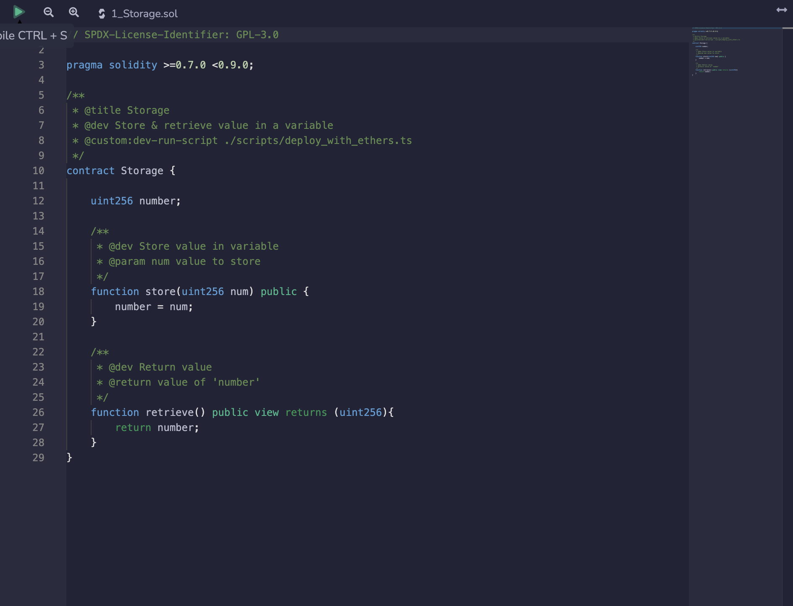
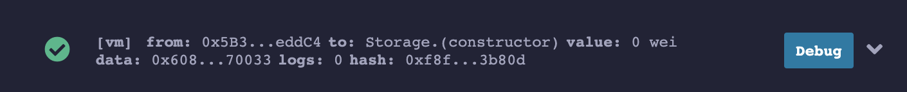
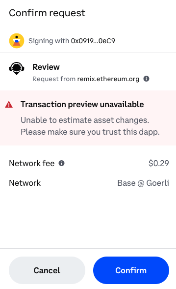
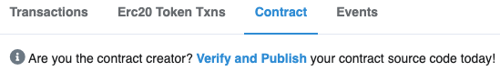
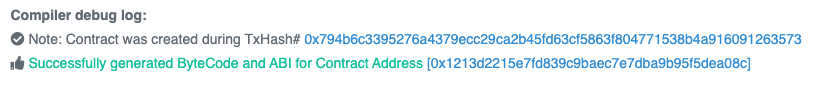

[Remix] is an online IDE that you can use to rapidly develop and deploy smart contracts. If you're new to smart contracts, it's a great tool that lets you jump right in without needing to configure a local editor or struggle through environment configuration issues before getting started.

Remix contains a simulation of a blockchain that you can use to rapidly deploy and test your contracts. This simulation only exists within your browser, so you can't share it with others or use external tools or a front end to interact with it. However, you can also deploy to a variety of testnets from within Remix. Doing so will allow you to share your contract with others, at the cost of making it public.

In this article, we'll give you an overview of Remix, and show you how to deploy a contract to **Base Sepolia** testnet.

:::info

For production / mainnet deployments the steps below in this tutorial will be almost identical, however, you'll want to ensure that you've selected `Base` (mainnet) as the network rather than `Base Sepolia` (testnet).

:::

If you're already familiar with Remix, you probably want to jump down to [here].

---

## Objectives

By the end of this tutorial, you should be able to:

- List the features, pros, and cons of using Remix as an IDE
- Deploy and test the Storage.sol demo contract in Remix
- Use Remix to deploy a contract to the Base Sepolia testnet and interact with it in [BaseScan]

---

## Remix Window Overview

Begin by opening a browser window and navigating to [remix.ethereum.org]. Click through the introductory tips, then review the editor. It is divided into three areas, which should look familiar.

### Editor Pane

The editor pane loads with the Remix home screen, which contains news, helpful links, and warnings about common scams. You can close the home tab if you'd like, then open `1_Storage.sol`, located inside the `contracts` folder of the `default_workspace`.

You'll edit your code in the editor pane. It also has most of the features you're expecting, such as syntax and error highlighting. Note that in Remix, errors are not underlined. Instead, you'll see an❗to the left of the line number where the error is present.

At the top, you'll see a big green arrow similar to the _Run_ button in other editors. In Solidity, this compiles your code, but it does not run it because you must first deploy your code to the simulated blockchain.

### Terminal/Output

Below the editor pane, you'll find the terminal.

You'll primarily use this panel to observe transaction logs from your smart contracts. It's also one way to access Remix's powerful debugging tools.

### Left Panel

As with many other editors, the left panel in Remix has a number of vertical tabs that allow you to switch between different tools and functions. You can explore the files in your current workspace, create and switch between workspaces, search your code, and access a number of plugins.

---

## Plugins

Most of the features in Remix are plugins, and the ones you'll use the most are active by default. You can view and manage plugins by clicking the plug button in the lower-left corner, right above the settings gear. You can turn them off and on by clicking activate/deactivate, and some, such as the _Debug_ plugin will be automatically activated through other parts of the editor.

### Solidity Compiler

The first default plugin (after the search function) is the _Solidity Compiler_. Be sure to check the `Auto compile` option. Smart contracts are almost always in very small files, so this shouldn't ever cause a performance problem while editing code.

The `Compile and Run script` button in this plugin is a little misleading. This is **not** how you will usually run your contract through testing. You can click the `I` button for more information on this feature.

Finally, if you have errors in your contracts, the complete text for each error will appear at the bottom of the page. Try it out by introducing some typos to `1_Storage.sol`.

### Deploy & Run Transactions

The _Deploy & Run Transactions_ plugin is what you'll use to deploy your contracts and then interact with them. At the top are controls to select which virtual machine to use, mock user wallets with test Ether, and a drop down menu to select the contract you wish to deploy and test.

Fix any errors you introduced to `1_Storage.sol` and click the orange `Deploy` button. You'll see your contract appear below as _STORAGE AT \<address\>_.

:::caution

There are a couple gotchas that can be very confusing with deploying contracts in Remix.

First, every time you hit the Deploy button, a new copy of your contract is deployed, but the previous deployments remain. Unless you are comparing or debugging between different versions of a contract, or deploying multiple contracts at once, you should click the `Trash` button to erase old deployments before deploying again.

Second, if your code will not compile, **clicking the deploy button will not generate an error!** Instead, the last compiled version will be deployed. Visually check and confirm that there are no errors indicated by a number in a red circle on top of the Compiler plugin.

:::

---

## Prepare for Deployment

Testnets operate in a similar, **but not exactly the same** manner as the main networks they shadow. You need a wallet with the appropriate token to interact with them by deploying a new contract or calling functions in a deployed contract.

### Set Up a Wallet

If you already have a wallet set up **exclusively for development**, you can skip to the next section. Otherwise, now is the time to jump in!

:::danger

It is very dangerous to use a wallet with valuable assets for development. You could easily write code with a bug that transfers the wrong amount of the wrong token to the wrong address. Transactions cannot be reversed once sent!

Be safe and use separate wallets for separate purposes.

:::

First, add the [Coinbase] or [MetaMask] wallet to your browser, and [set up] a new wallet. As a developer, you need to be doubly careful about the security of your wallet! Many apps grant special powers to the wallet address that is the owner of the contract, such as allowing the withdrawal of all the Ether that customers have paid to the contract, or changing critical settings.

Once you've completed wallet setup, enable developer settings and turn on testnets ([Coinbase Settings], [MetaMask Settings]).

### Add the Base Sepolia Network to your Wallet

Most wallets will already have the Base Sepolia network as one of the testnet networks. You may need to turn on developer mode to see them.

For this tutorial, you will be deploying a contract to the Base Sepolia test network. You can fund your wallet with Base Sepolia ETH using one of the faucets listed on the Base [Network Faucets](https://docs.base.org/tools/network-faucets) page.

### Get Testnet Ether

Testnet tokens have no real value, but the supply is not unlimited. You can use a faucet to get a small amount of Sepolia Ether to pay gas fees for testing. Most faucets allow you to ask for a small amount each day, and some won't send you more if your balance is too high.

You can find many faucets by searching, and it's good to keep a few bookmarked because they have a tendency to go down from time to time. Faucet providers are constantly combating bad actors and sometimes need to disable their faucets while doing so.

The Coinbase Wallet has faucets built in. Find them by clicking Settings -> Developer settings -> Testnet faucets.

You can also access the [faucets on the web].

Once you have testnet Base Sepolia Ether, you can view your balance under the _Testnets_ tab in the Coinbase wallet, or by selecting the testnet from the network dropdown in MetaMask. Sadly, it's not actually worth the amount listed!

---

## Deploying to Testnet

Once you have testnet Ether, you can deploy the `Storage` contract!

### Selecting the Environment

Open the _Deploy & Run Transactions_ tab. Under _Environment_, select _Injected Provider_. It will list _Coinbase_, _MetaMask_, or any other wallet you have activated here.

If that option is not available, you can add it by choosing `Customize this list...`

The first time you do this, your wallet will ask you to confirm that you want to connect this app (Remix) to your wallet.

Once you are connected, you'll see the name of the network below the _Environment_ dropdown.

For Base Sepolia, you should see `Custom (84532) network` (**note:** if you're deploying to mainnet rather than testnet, you should see `Custom (8453) network` instead).

If you don't see the correct network, change the active network in your wallet.

### Deploy the Contract

Click the orange _Deploy_ button. Because it costs gas to deploy a contract, you'll be asked to review and confirm a transaction.

:::danger

Always carefully review all transactions, confirming the transaction cost, assets transferred, and network. As a developer, you'll get used to approving transactions regularly. Do the best you can to avoid getting into the habit of clicking _Confirm_ without reviewing the transaction carefully. If you feel pressured to _Confirm_ before you run out of time, it is almost certainly a scam.

:::

After you click the _Confirm_ button, return to Remix and wait for the transaction to deploy. Copy its address and navigate to [`sepolia.basescan.org`]. **Note:** If you deployed to mainnet, you'll navigate to [`basescan.org`] instead.

### Verify the Contract

:::info

You don't need to verify the contract if you've deployed one identical to a contract that has already been verified.

:::

You can interact with your deployed contract using Remix, the same as before, but it's also possible to interact with it through [BaseScan]. Paste your address in the search field to find it.

On this page, you can review the balance, information about, and all the transactions that have ever occurred with your contract.

Click the _Contract_ tab in the main panel. If you've deployed a unique contract, at the top is a message asking you to _Verify and Publish_ your contract source code.

Verifying your contract maps the names of your functions and variables to the compiled byte code, which makes it possible to interact with the contract using a human-readable interface.

Click the link. Your contract address is already entered.

Under _Please select Compiler Type_ choose \_Solidity (Single file)

For _Please Select Compiler Version_ select the version matching the `pragma` at the top of your source file. Our examples are currently using _v0.8.17+commit.8df45f5f_.

For _Please select Open Source License Type_ pick the license that matches what you selected for your contract as the `SPDX-License-Identifier`. Pick _None_ if you followed the Solidity-recommended practice of using `UNLICENSED`.

On the next page, copy and paste your source code in the window. Verify that you are not a robot, and click _Verify and Publish_. You should see a success message.

Click the linked address to your contract to return to the contract page. You'll now see your code!

### Interact with the Contract

You can now interact with your contract using [BaseScan]. Click the _Read Contract_ button. Both of your functions will be listed here and can be tested using the web interface.

You won't have anything under _Write Contract_ because this contract doesn't have any functions that save data to state.

---

## Conclusion

You now have the power to put smart contracts on the blockchain! You've only deployed to a test network, but the process for real networks is exactly the same - just more expensive!

---

<!-- Add reference style links here.  These do not render on the page. -->

[`sepolia.basescan.org`]: https://sepolia.basescan.org/
[`basescan.org`]: https://basescan.org/
[coinbase]: https://www.coinbase.com/wallet
[MetaMask]: https://metamask.io/
[set up]: https://www.youtube.com/watch?v=CZDgLG6jpgw
[coinbase settings]: https://docs.cloud.coinbase.com/wallet-sdk/docs/developer-settings
[BaseScan]: https://sepolia.basescan.org/
[faucets on the web]: https://coinbase.com/faucets
[here]: #prepare-for-deployment
[remix]: https://remix.ethereum.org
