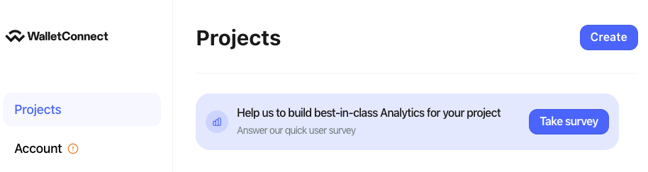
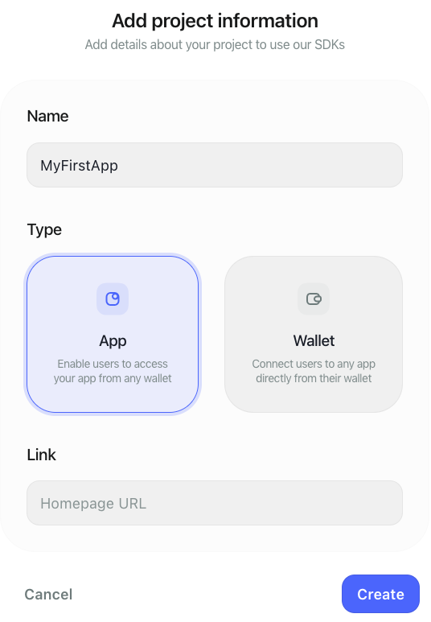
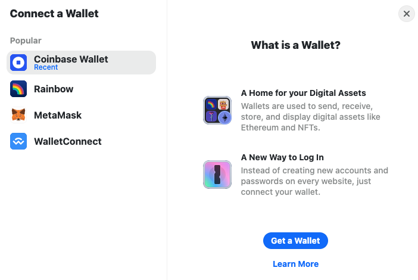
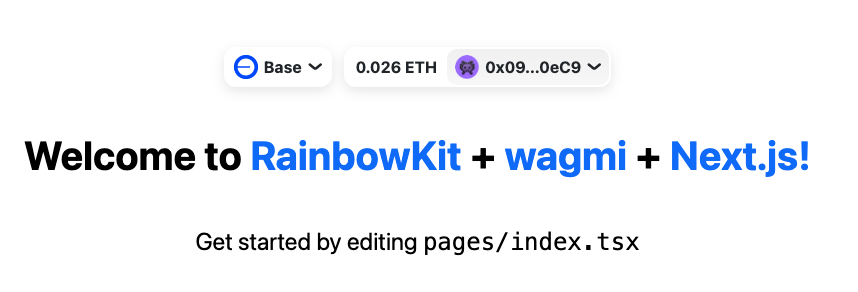
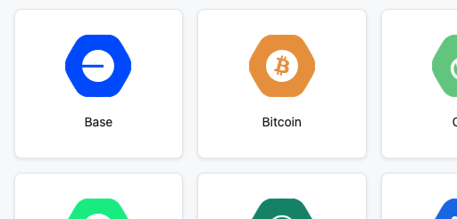
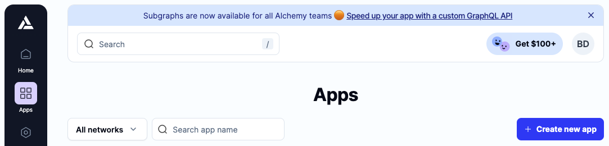

This tutorial provides an introduction to providers and shows you how to connect your frontend to the blockchain using JSON RPC blockchain providers, and the [RainbowKit], [wagmi], and [viem] stack.

---

## Objectives

By the end of this tutorial, you should be able to:

- Compare and contrast public providers vs. vendor providers vs. wallet providers
- Select the appropriate provider for several use cases
- Set up a provider in wagmi and use it to connect a wallet
- Protect API keys that will be exposed to the front end

---

## Prerequisites

### 1. Be familiar with modern, frontend web development

In this tutorial, we'll be working with a React frontend built with [Next.js]. While you don't need to be an expert, we'll assume that you're comfortable with the basics.

### 2. Possess a general understanding of the EVM and smart contract development

This tutorial assumes that you're reasonably comfortable writing basic smart contracts. If you're just getting started, jump over to our [Base Learn] guides and start learning!

---

## Types of Providers

Onchain apps need frontends, sometimes called dApps, to enable your users to interact with your smart contracts. A _provider_ makes the connection from frontend to the blockchain, and is used to read data and send transactions.

In blockchain development, the term _provider_ describes a company or service that provides an API enabling access to the blockchain as a service. This is distinct from the providers you wrap your app in using the [React Context API], though you'll use one of those to pass your blockchain provider deeply into your app.

These services enable interacting with smart contracts without the developer needing to run and maintain their own blockchain node. Running a node is expensive, complicated, and challenging. In most cases, you'll want to start out with a provider. Once you start to get traction, you can evaluate the need to [run your own node], or switch to a more advanced architecture solution, such as utilizing [Subgraph].

Figuring out which type of provider to use can be a little confusing at first. As with everything blockchain, the landscape changes rapidly, and search results often return out-of-date information.

:::info

New onchain devs sometimes get the impression that there are free options for connecting their apps to the blockchain. Unfortunately, this is not really true. Blockchain data is still 1's and 0's, fetched by computation and served to the internet via servers.

It costs money to run these, and you will eventually need to pay for the service.

:::

You'll encounter providers divided into three general categories: Public Providers, Wallet Providers, and Vendor Providers

### Public Providers

Many tutorials and guides, including the getting started guide for [wagmi], use a _Public Provider_ as the default to get you up and running. Public means that they're open, permissionless, and free, so the guides will also usually warn you that you need to add another provider if you don't want to run into rate limiting. Listen to these warnings! The rate-limits of public providers are severe, and you'll start getting limited very quickly.

In wagmi, a public client is automatically included in the default confit. This client is just a wrapper setting up a [JSON RPC] provider using the `chain` and `rpcUrls` listed in Viem's directory of chain information. You can view the [data for Base Sepolia here].

Most chains will list this information in their docs as well. For example, on the network information pages for [Base] and [Optimism]. If you wanted, you could manually set up a `jsonRpcProvider` in wagmi using this information.

### Wallet Providers

Many wallets, including Coinbase Wallet and MetaMask, inject an Ethereum provider into the browser, as defined in [EIP-1193]. The injected provider is accessible via `window.ethereum`.

Under the hood, these are also just JSON RPC providers. Similar to public providers, they are rate-limited.

Older tutorials for early libraries tended to suggest using this method for getting started, so you'll probably encounter references to it. However, it's fallen out of favor, and you'll want to use the public provider for your initial connection experiments.

### Vendor Providers

A growing number of vendors provide access to blockchain nodes as a service. Visiting the landing pages for [QuickNode], [Alchemy], or [Coinbase Developer Platform (CDP)] can be a little confusing. Each of these vendors provides a wide variety of services, SDKs, and information.

Luckily, you can skip most of this if you're just trying to get your frontend connected to your smart contracts. You'll just need to sign up for an account, and get an endpoint, or a key, and configure your app to connect to the provider(s) you choose.

It is worth digging in to get a better understanding of how these providers charge you for their services. The table below summarizes some of the more important API methods, and how you are charged for them by each of the above providers.

Note that the information below may change, and varies by network. Each provider also has different incentives, discounts, and fees for each level of product. They also have different allowances for calls per second, protocols, and number of endpoints. Please check the source to confirm!

|                 | [Alchemy Costs]  | [QuickNode Costs] | [CDP Costs]        |
| :-------------- | :--------------- | :---------------- | :----------------- |
| Free Tier / Mo. | 3M compute units | 50M credits       | 500M billing units |
| Mid Tier / Mo.  | 1.5B CUs @ $199  | 3B credits @ $299 | Coming soon        |
| eth_blocknumber | 10               | 20                | 30                 |
| eth_call        | 26               | 20                | 30                 |
| eth_getlogs     | 75               | 20                | 100                |
| eth_getbalance  | 19               | 20                | 30                 |

To give you an idea of usage amounts, a single wagmi `useContractRead` hook set to watch for changes on a single `view` via a TanStack query and `useBlockNumber` will call `eth_blocknumber` and `eth_call` one time each, every 4 seconds.

---

## Connecting to the Blockchain

[RainbowKit] is a popular library that works with [wagmi] to make it easy to connect, disconnect, and change between multiple wallets. It's batteries-included out of the box, and allows for a great deal of customization of the list of wallets and connect/disconnect button.

You'll be using RainbowKit's [quick start] to scaffold a new project for this tutorial. Note that at the time of writing, it does **not** use the Next.js app router. See [Building an Onchain App] if you wish to set this up instead.

:::info

The script doesn't allow you to use `.` to create a project in the root of the folder you run it from, so you'll want to run it from your `src` directory, or wherever you keep your project folders.

It will create a folder with the project name you give, and create the files inside.

:::

Open up a terminal and run:

```bash
yarn create @rainbow-me/rainbowkit
```

Give your project a name, and wait for the script to build it. It will take a minute or two.

:::warning

If you get an error because you are on the wrong version of node, change to the correct version then **delete everything** and run the script again.

:::

### Scaffolded App

Open your new project in the editor of your choice, and open `pages/_app.tsx`. Here, you'll find a familiar Next.js app wrapped in [context providers] for the TanStack QueryProvider, RainbowKit, and wagmi.

```tsx
function MyApp({ Component, pageProps }: AppProps) {
  return (
    <WagmiProvider config={config}>
      <QueryClientProvider client={client}>
        <RainbowKitProvider>
          <Component {...pageProps} />
        </RainbowKitProvider>
      </QueryClientProvider>
    </WagmiProvider>
  );
}
```

Note that these providers are using React's context feature to pass the blockchain providers and configuration into your app. It can be confusing to have the word _provider_ meaning two different things in the same file, or even the same line of code!

Before you can do anything else, you need to obtain a _WalletConnect_ `projectId`.

Open up the [WalletConnect] homepage, and create an account, and/or sign in using the method of your choice.

Click the `Create` button in the upper right of the `Projects` tab.



Enter a name for your project, select the `App` option, and click `Create`.



Copy the _Project ID_ from the project information page, and paste it in as the `projectId` in `getDefaultWallets`.

```tsx
const { connectors } = getDefaultWallets({
  appName: 'RainbowKit App',
  projectId: 'YOUR_PROJECT_ID',
  chains,
});
```

:::caution

Remember, anything you put on the frontend is public! That includes this id, even if you use environment variables to better manage this type of data. Next.js reminds you of the risk, by requiring you to prepend `NEXT_PUBLIC_` to any environment variables that can be read by the browser.

Before you deploy, make sure you configure the rest of the items in the control panel to ensure only your site can use this id.

:::

### Public Provider

By default, the setup script will configure your app to use the built-in public provider, and connect to a number of popular chains. To simply matters, remove all but `mainnet` and `base`.

```tsx
const config = getDefaultConfig({
  appName: 'RainbowKit App',
  projectId: 'YOUR_APP_ID_HERE',
  chains: [mainnet, base],
  ssr: true,
});
```

Open the terminal and start the app with:

```bash
yarn run dev
```

Click the `Connect Wallet` button, select your wallet from the modal, approve the connection, and you should see your network, token balance, and address or ENS name at the top of the screen. Select your wallet from the modal.



You've connected with the Public Provider!



### QuickNode

To select your provider(s), you'll use [`createConfig`] instead of `getDefaultConfig`. The [`transports`] property allows you to configure how you wish to connect with multiple networks. If you need more than one connector for a given network, you can use [`fallbacks`].

First, set up using [QuickNode] as your provider. Replace your import of the default config from RainbowKit with `createConfig` and `http` from wagmi:

```tsx
import { createConfig, http, WagmiProvider } from 'wagmi';
// ...Chains import
import { RainbowKitProvider } from '@rainbow-me/rainbowkit';
```

You'll need an RPC URL, so open up [QuickNode]'s site and sign up for an account if you need to. The free tier will be adequate for now, you may need to scroll down to see it. Once you're in, click `Endpoints` on the left side, then click `+ Create Endpoint`.

On the next screen, you'll be asked to select a chain. Each endpoint only works for one. Select `Base`, click `Continue`.



For now, pick `Base Mainnet`, but you'll probably want to delete this endpoint and create a new one for Sepolia when you start building. The free tier only allows you to have one at a time.

If you haven't already picked a tier, you'll be asked to do so, then you'll be taken to the endpoints page, which will display your endpoints for HTTP and WSS.

:::caution

As with your WalletConnect Id, these endpoints will be visible on the frontend. Be sure to configure the allowlist!

:::

Use this endpoint to add an `http` `transport` to your config:

```tsx
const config = createConfig({
  chains: [mainnet, base],
  ssr: true,
  transports: {
    [base.id]: http('YOUR PROJECT URL'),
    [mainnet.id]: http('TODO'),
  },
});
```

Now, the app will use your QuickNode endpoint for the Base network. Note that you don't need an app name or WalletConnect Id, because you are no longer using WalletConnect.

To test this out, switch networks a few times. You'll know it's working if you see your balance when Base is the selected network. You haven't added mainnet, so you'll get an error in the console and no balance when you switch to that.

### Alchemy

[Alchemy] is [no longer baked into wagmi], but it still works the same as any other RPC provider. As with QuickNode, you'll need an account and a key. Create an account and/or sign in, navigate to the `Apps` section in the left sidebar, and click `Create new app`.



Select Base Mainnet, and give your app a name.

:::caution

Once again, remember to configure the [allowlist] when you publish your app, as you'll be exposing your key to the world!

:::

On the dashboard for your new app, click the `API key` button, and copy the **HTTPS** link to the clipboard. Replace your todo with this link:

```tsx
const config = createConfig({
  chains: [mainnet, base],
  ssr: true,
  transports: {
    [base.id]: http('YOUR PROJECT URL'),
    [mainnet.id]: http('ALCHEMY HTTP URL'),
  },
});
```

As before, you can confirm the Alchemy Provider is working by running the app and changing the network. You should now no longer get an error and should be able to see your balance for Ethereum mainnet.

---

## Conclusion

In this tutorial, you've learned how Providers supply blockchain connection as a service, eliminating the need for developers to run and maintain their own nodes. You also learned how to connect your app to the blockchain using several different providers, including the public provider(s).

---

[Base Learn]: https://base.org/learn
[Next.js]: https://nextjs.org/
[RainbowKit]: https://rainbowkit.com/
[wagmi]: https://wagmi.sh/
[viem]: https://viem.sh/
[wagmi]: https://wagmi.sh
[quick start]: https://www.rainbowkit.com/docs/installation
[context providers]: https://react.dev/learn/passing-data-deeply-with-context
[WalletConnect]: https://cloud.walletconnect.com/
[JSON RPC provider]: https://wagmi.sh/react/providers/jsonRpc
[Alchemy]: https://www.alchemy.com/
[QuickNode]: https://www.quicknode.com/
[allowlist]: https://docs.alchemy.com/docs/how-to-add-allowlists-to-your-apps-for-enhanced-security
[smart contract development]: https://base.org/learn
[Subgraph]: https://thegraph.com/docs/en/developing/creating-a-subgraph/
[data for Base Sepolia here]: https://github.com/wagmi-dev/viem/blob/main/src/chains/definitions/baseSepolia.ts
[Base]: https://docs.base.org/network-information
[Optimism]: https://docs.optimism.io/chain/networks
[EIP-1193]: https://eips.ethereum.org/EIPS/eip-1193
[QuickNode]: https://www.quicknode.com/
[Alchemy Costs]: https://docs.alchemy.com/reference/compute-unit-costs
[QuickNode Costs]: https://www.quicknode.com/api-credits/base
[Coinbase Developer Platform (CDP)]: https://portal.cdp.coinbase.com/
[CDP Costs]: https://portal.cdp.coinbase.com/products/base
[smart contract development]: https://base.org/camp
[run your own node]: https://docs.base.org/guides/run-a-base-node
[React Context API]: https://react.dev/learn/passing-data-deeply-with-context
[Building an Onchain App]: https://docs.base.org/base-learn/docs/frontend-setup/building-an-onchain-app
[`createConfig`]: https://wagmi.sh/react/api/createConfig
[`transports`]: https://wagmi.sh/react/api/transports
[`fallback`]: https://wagmi.sh/core/api/transports/fallback
[no longer baked into wagmi]: https://wagmi.sh/react/guides/migrate-from-v1-to-v2#removed-wagmi-providers-entrypoints
