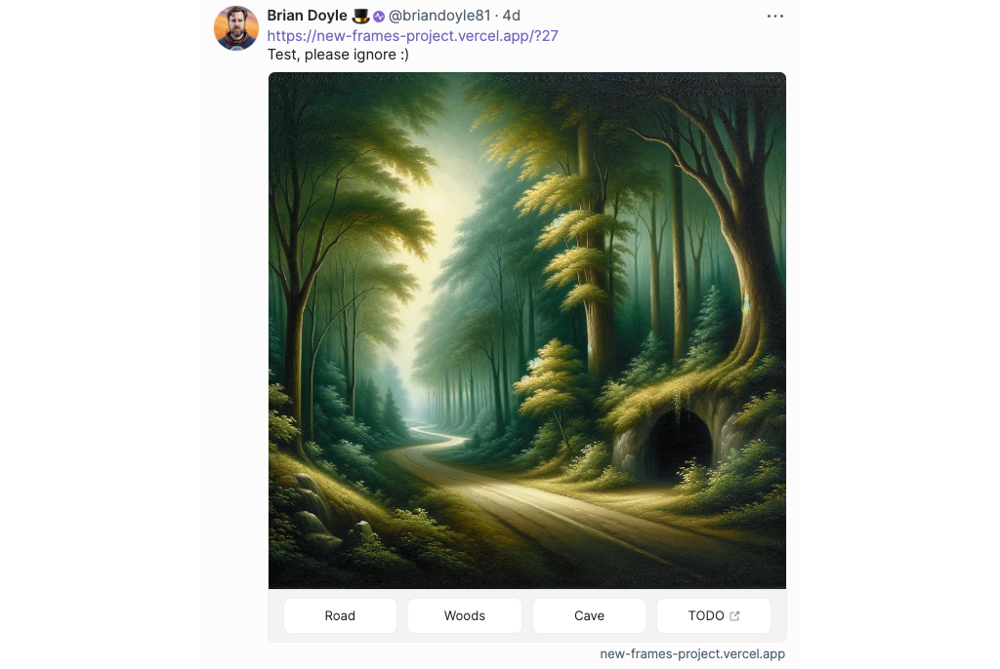

[Frames] on [Farcaster] are getting more complex. Developers are now building interactions that require a handful, or even dozens of frames in response to various user states, inputs, and actions. HyperFrames are a system to organize navigation for large numbers of frames, using [OnchainKit]. In this tutorial, we'll use making the navigation for an [old-school adventure game] fully in a frame. You can use this same technique for many other intents with your Frames, such as games, stores, customized mints, etc.

---

## Objectives

By the end of this tutorial, you should be able to:

- Build HyperFrames - connected [Farcaster] Frames that manage significant numbers of cross-linked frames in an organized fashion
- Add management of conditional states to the navigation system
- Use frame state to pass information from one frame to another

---

## Prerequisites

### Vercel

You'll need to be comfortable deploying your app to [Vercel], or using another solution on your own. Check out our tutorial on [deploying with Vercel] if you need a refresher!

### Farcaster

You must have a [Farcaster] account with a connected wallet. Check out the [Base channel] to stay in the loop when we release tutorials like this!

### Frames

You should be comfortable with the basics of creating Farcaster [Frames]. If you aren't, check out our tutorial on [NFT Minting Frame].

---

## Getting Started

This tutorial assumes you're using [a-frame-in-100-lines] as the base for your project. It's a very lightweight template, so with minor modifications, you can adapt this technique to any project.

You'll also need to create or find a handful of images to use for each frame. AI tools are wonderful for this type of prototyping, or you can right-click and save the images from the [old-school adventure game].

## Creating the First Frame

Open `app/page.tsx`. Modify the `getFrameMetadata` for the first frame to match the frame in the example.



```tsx
const frameMetadata = getFrameMetadata({
  buttons: [
    {
      label: 'Road',
    },
    {
      label: 'Woods',
    },
    {
      label: 'Cave',
    },
    {
      action: 'link',
      label: 'TODO',
      target: 'https://www.google.com',
    },
  ],
  image: {
    src: `${NEXT_PUBLIC_URL}/frame-1-forest.webp`,
    aspectRatio: '1:1',
  },
  postUrl: `${NEXT_PUBLIC_URL}/api/frame`,
});
```

:::caution

Per the [Frames] specification, `state` is not an allowed property on the first frame.

:::

Configure the rest of the metadata as you see fit. Remember, this won't show up in your frame, but it will appear if someone links your site to another platform that uses the standard Open Graph metadata.

```tsx
export const metadata: Metadata = {
  title: 'HyperFrames!',
  description: 'Time is a flat circle.',
  openGraph: {
    title: 'HyperFrames!',
    description: 'Time is a flat circle.',
    images: [`${NEXT_PUBLIC_URL}/frame-1-forest.webp`],
  },
  other: {
    ...frameMetadata,
  },
};
```

## Setting up the Route

The route you'll construct is similar to the example in [`app/api/route.ts`] of the 100-lines example. It will use [OnchainKit] to retrieve and validate the message from the frame. In doing so, it will collect:

- The user's address
- The button clicked by the user to get here
- Text, if the previous frame had a text box
- Any `state` data included in the sending frame

Stub out the route, but remove the conditionals and the existing response:

```tsx
import { FrameRequest, getFrameMessage, getFrameHtmlResponse } from '@coinbase/onchainkit';
import { NextRequest, NextResponse } from 'next/server';

async function getResponse(req: NextRequest): Promise<NextResponse> {
  let accountAddress: string | undefined = '';
  let text: string | undefined = '';

  const body: FrameRequest = await req.json();
  const { isValid, message } = await getFrameMessage(body, { neynarApiKey: 'NEYNAR_ONCHAIN_KIT' });

  if (isValid) {
    accountAddress = message.interactor.verified_accounts[0];
  } else {
    return new NextResponse('Message not valid', { status: 500 });
  }

  return new NextResponse();
  // TODO: Return a frame
}

export async function POST(req: NextRequest): Promise<Response> {
  return getResponse(req);
}

export const dynamic = 'force-dynamic';
```

### Identifying the Sending Frame

To identify which frame sent the request to the endpoint, you can extract the `state` sent with the frame data in the request. The first frame **will not** have this, so you'll have to make an assumption there.

After the first frame, if the `state` property is present, it will appear in the message as `state`, but it will need to be decoded.

```tsx
let state = { frame: 'start' };

try {
  state = JSON.parse(decodeURIComponent(message.state?.serialized));
} catch (e) {
  // Note that this error will always be triggered by the first frame
  console.error(e);
}
```

## HyperFrames

Add a file called `hyperframes.ts` to the `app` folder. Import:

```tsx
import { getFrameHtmlResponse } from '@coinbase/onchainkit';
import { NEXT_PUBLIC_URL } from './config';
```

Next, add an interface for the `HyperFrame`:

```tsx
export type HyperFrame = {
  frame: string;
  1: string | ((text: string) => string) | (() => string);
  2?: string | ((text: string) => string) | (() => string);
  3?: string | ((text: string) => string) | (() => string);
  4?: string | ((text: string) => string) | (() => string);
};
```

The interface contains properties to track the frame itself, and the identifier for which frame each button is mapped to. These are all strings, or functions that return strings, because you'll use string identifiers for your frames, and because the frame returned by `getFrameHtmlResponse` is formatted as a string.

For the buttons, you can now use:

- A string identifying the frame the button should lead to
- A function that returns a string that also takes a string argument. Use this to pass in the user's address, or the `text` from the frame
- Any function with no arguments that returns a frame name as a string

If you need to, update the type here to handle more complex cases.

Next, add a `Record` to store your collection of HyperFrames, and a function to add frames to the `Record`:

```tsx
const frames: Record<string, HyperFrame> = {};

export function addHyperFrame(label: string, frame: HyperFrame) {
  frames[label] = frame;
}
```

Finally, add a function to retrieve and return a HyperFrame by its `label` and handle the case of an error.

```tsx
export function getHyperFrame(frame: string, text: string, button: number) {
  const currentFrame = frames[frame];
  const nextFrameIdOrFunction = currentFrame[button as keyof HyperFrame];

  let nextFrameId: string;
  if (typeof nextFrameIdOrFunction === 'function') {
    nextFrameId = nextFrameIdOrFunction(text);
  } else {
    nextFrameId = nextFrameIdOrFunction as string;
  }

  if (!frames[nextFrameId]) {
    throw new Error(`Frame not found: ${nextFrameId}`);
  }

  return frames[nextFrameId].frame;
}
```

## Adding HyperFrames

You can put the HyperFrames wherever you want and import them into your route. For the sake of simplicity, this demo will simply include them at the top of the route file. Import

```tsx
import { addHyperFrame, getHyperFrame } from '../../hyperframes';
```

To store the HyperFrames, add them to the `Record` type with `addHyperFrame`. To create the frames themselves, use `getFrameHtmlResponse` to build the frame, and add the names of the frames you have created, or will create, to the appropriate button.

Add the name of each frame as that frame's `state` as well.

```tsx
addHyperFrame('start', {
  frame: getFrameHtmlResponse({
    buttons: [
      {
        label: 'Road',
      },
      {
        label: 'Woods',
      },
      {
        label: 'Cave',
      },
      {
        action: 'link',
        label: 'TODO',
        target: 'https://www.google.com',
      },
    ],
    image: {
      src: `${NEXT_PUBLIC_URL}/frame-1-forest.webp`,
      aspectRatio: '1:1',
    },
    state: { frame: 'start' },
    postUrl: `${NEXT_PUBLIC_URL}/api/frame`,
  }),
  1: 'road',
  2: 'woods-bear',
  3: 'cave-1',
});

addHyperFrame('road', {
  frame: getFrameHtmlResponse({
    buttons: [
      {
        label: 'Go Back',
      },
      {
        label: 'Shack',
      },
      {
        label: 'Forward',
      },
    ],
    image: {
      src: `${NEXT_PUBLIC_URL}/road.png`,
      aspectRatio: '1:1',
    },
    postUrl: `${NEXT_PUBLIC_URL}/api/frame`,
  }),
  1: 'start',
  2: 'shack',
  3: 'desert-road',
});
```

Above, you've created two HyperFrames. The first, has three buttons, mapped to the frames named `road`, `woods-bear`, and `cave-1`. Only the first will work, because you haven't built the other HyperFrames, or error handling.

The second, also has three buttons, mapped to frames as well. Only `start` is implemented as of yet.

## Calling `getHyperFrame`

Return to `route.ts`. To avoid TypeScript errors, you'll need to implement at least a minimum of error handling for the event that the `frame` query parameter or `button` are not present:

```tsx
if (!frame) {
  return new NextResponse('Frame not found', { status: 404 });
}

// There should always be a button number
if (!message?.button) {
  return new NextResponse('Button not found', { status: 404 });
}
```

Then, simply import and call `getHyperFrame` as the `NextResponse`:

```tsx
return new NextResponse(getHyperFrame(frame as string, text || '', message?.button));
```

Deploy, test with the [Frame Validator], and debug!

## Adding Conditionals

It's not very interesting for everyone to be able to explore without restriction, so add a lock with a password! To do so, add HyperFrame that contains a function to see if the `text` contains the correct password.

```tsx
addHyperFrame('shack', {
  frame: getFrameHtmlResponse({
    buttons: [
      {
        label: 'Go Back',
      },
      {
        label: 'Door',
      },
      {
        label: 'Testing',
      },
    ],
    image: {
      src: `${NEXT_PUBLIC_URL}/shack.png`,
      aspectRatio: '1:1',
    },
    input: {
      text: 'What is the password?',
    },
    state: { frame: 'shack' },
    postUrl: `${NEXT_PUBLIC_URL}/api/frame`,
  }),
  1: 'road',
  2: (text: string) => {
    return text === 'All your Base are belong to you' ? 'key' : 'shack-bad-password';
  },
});
```

For the event that the user enters the wrong password, simply add a nearly identical frame asking them to try again. If they enter the correct password, take them to a new room via a different HyperFrame:

```tsx
addHyperFrame('shack-bad-password', {
  frame: getFrameHtmlResponse({
    buttons: [
      {
        label: 'Go Back',
      },
      {
        label: 'Door',
      },
    ],
    image: {
      src: `${NEXT_PUBLIC_URL}/shack.png`,
      aspectRatio: '1:1',
    },
    input: {
      text: 'Try again. What is the password?',
    },
    state: { frame: 'shack-bad-password' },
    postUrl: `${NEXT_PUBLIC_URL}/api/frame`,
  }),
  1: 'road',
  2: (text: string) => {
    return text === 'All your Base are belong to you' ? 'key' : 'shack-bad-password';
  },
});

addHyperFrame('key', {
  frame: getFrameHtmlResponse({
    buttons: [
      {
        label: 'Go Back',
      },
      {
        label: 'TODO',
      },
    ],
    image: {
      src: `${NEXT_PUBLIC_URL}/key.png`,
      aspectRatio: '1:1',
    },
    state: { frame: 'key' },
    postUrl: `${NEXT_PUBLIC_URL}/api/frame`,
  }),
  1: 'shack',
});
```

---

## Conclusion

In this tutorial, you learned how to implement a system of HyperFrames - frames that are easily cross-linkable. You also learned how to add variety and depth to this system by adding conditionals for the button linking one frame to another. Finally, you learned how to use the `state` property to pass information between frames.

---

[Farcaster]: https://www.farcaster.xyz/
[a-frame-in-100-lines]: https://github.com/Zizzamia/a-frame-in-100-lines
[OnchainKit]: https://onchainkit.xyz/?utm_source=basedocs&utm_medium=tutorials&campaign=farcaster-frames-hyperframes
[Vercel]: https://vercel.com
[Frame Validator]: https://warpcast.com/~/developers/frames
[deploying with Vercel]: /tutorials/farcaster-frames-deploy-to-vercel
[Frames]: https://docs.farcaster.xyz/learn/what-is-farcaster/frames
[NFT Minting Frame]: /tutorials/farcaster-frames-nft-minting
[old-school adventure game]: https://warpcast.com/briandoyle81/0x108f1cdb
[`app/api/route.ts`]: https://github.com/Zizzamia/a-frame-in-100-lines/blob/main/app/api/frame/route.ts
