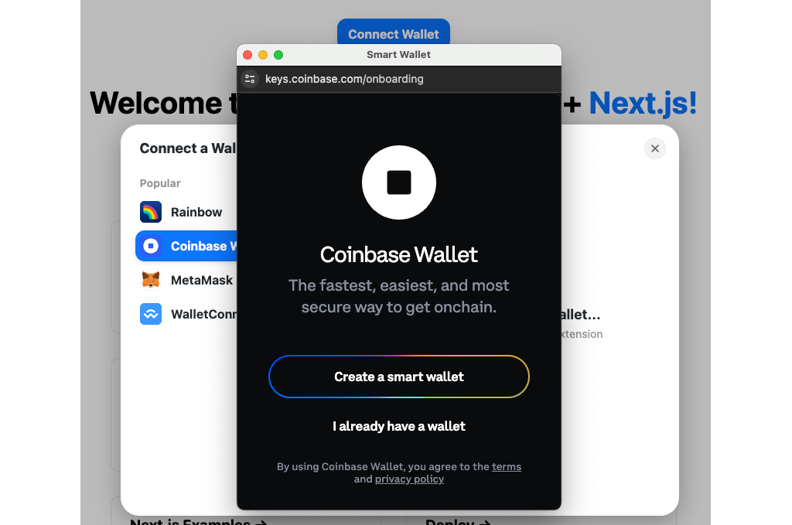
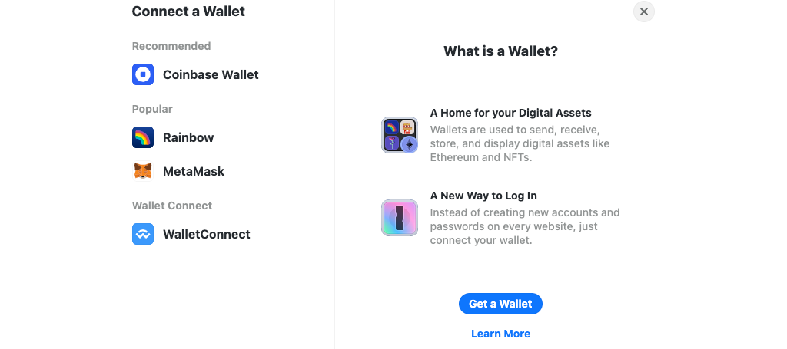

The [Coinbase Smart Wallet] is a great way to onboard new users to onchain apps, and offers a number of experiential improvements to existing crypto users as well. As we're in a period of adoption and transition, a pain point has developed where a user with both the Smart Wallet and a browser-extension EOA can't always select the wallet they want while connecting to an app.

In this tutorial, you'll learn how to improve that experience when using [RainbowKit] to connect your users to your app. An even easier development path can be found in our tutorial for [using the Wallet component] from [OnchainKit], which uses RainbowKit under the hood.

---

## Objectives

By the end of this tutorial, you should be able to:

- Customize the list of Wallets in the [RainbowKit] connection experience

- Give users the option to select the [Coinbase Smart Wallet] or EOA while connecting to your app with RainbowKit

---

## Prerequisites

### Be familiar with modern, frontend web development

In this tutorial, you'll be working with a React frontend built with [Next.js]. While you don't need to be an expert, we'll assume that you're comfortable with the basics.

### Possess a general understanding of the EVM and smart contract development

This tutorial assumes that you're reasonably comfortable writing basic smart contracts. If you're just getting started, jump over to our [Base Learn] guides and start learning!

### Understand providers and connectors

You'll need to be familiar with how to connect an onchain app to the blockchain with a provider. If you're not, start with the [Onchain App Development] section of [Base Learn], or at least complete the tutorial [Introduction to Providers].

### Coinbase Wallets

You need to have both the [Coinbase Wallet] and [Coinbase Smart Wallet] for this tutorial. You need to set up the [Coinbase Wallet] in advance, but you can create a smart wallet during the tutorial.

---

## The Default Experience

Start a new project with the RainbowKit [quick start]. Install dependencies, run the project, and attempt to connect with a browser that has the [Coinbase Wallet] browser extension installed. Clicking on `Coinbase` will automatically connect with your EOA browser extension wallet.


What about the smart wallet? Isn't it supposed to work automatically?

It does, but only if the user **does not** have the browser extension installed. Open a private window with extensions disabled and try again. Now, you will be directed to use the smart wallet to log in.


As mentioned above, this experience isn't bad for users of one type of wallet or the other, but it makes things difficult for users who are using both types of wallet and may want to choose one or the other when interacting with your app. It also might not be the listing or ordering of wallets you prefer.

## Customizing the List of Wallets

To fix this UI/UX problem, you can create a [custom wallet list]. Open `src/wagmi.ts`:

As mentioned above, this experience isn't bad for users of one type of wallet or the other, but it makes things difficult for users who are using both types of wallet and may want to choose one or the other when interacting with your app.

## Customizing the List of Wallets

To fix this UI/UX problem, you can create a [custom wallet list]. Open `src/wagmi.ts`:

- Change the list imported networks to `base` and `baseSepolia`
- Import `connectorsForWallets` from RainbowKit, instead of `getDefaultConfig`
- Import the `coinbaseWallet`, and any other wallets you wish to support
- Import `http` and `createConfig` from wagmi

```tsx
import { http, createConfig } from 'wagmi';
import { base, baseSepolia } from 'wagmi/chains';
import {
  coinbaseWallet,
  metaMaskWallet,
  rainbowWallet,
  walletConnectWallet,
} from '@rainbow-me/rainbowkit/wallets';
import { connectorsForWallets } from '@rainbow-me/rainbowkit';
```

Next, use `connectorsForWallets` to create a list of wallets, organized in the groups you prefer. You'll need to get a `projectId` from [WalletConnect] if you don't have one already.

```tsx
const connectors = connectorsForWallets(
  [
    {
      groupName: 'Recommended',
      wallets: [coinbaseWallet],
    },
    {
      groupName: 'Popular',
      wallets: [rainbowWallet, metaMaskWallet],
    },
    {
      groupName: 'Wallet Connect',
      wallets: [walletConnectWallet],
    },
  ],
  {
    appName: 'Your App Name',
    projectId: '<YOUR WALLETCONNECT PROJECT ID>',
  },
);
```

Finally, export your `config` using the `connectors` and networks you've selected.

```tsx
export const config = createConfig({
  connectors,
  chains: [base, baseSepolia],
  ssr: true,
  transports: {
    [base.id]: http(),
    [baseSepolia.id]: http(),
  },
});
```

Now, the connection experience contains the wallets in the order you selected!



---

## Tuning the Coinbase Wallet Connection

:::danger

If you've already connected with the site, the below won't work unless you clear site data! It will appear that the flag does nothing.

In Chrome: Developer Tools -> Application Tab -> Storage Tab -> Clear Site Data button
In Firefox: Developer Tools -> Storage -> Right-click each item -> Delete All

:::

With RainbowKit, you can force the connector to use the smart wallet or EOA with:

```tsx
coinbaseWallet.preference = 'smartWalletOnly';
```

And:

```tsx
coinbaseWallet.preference = 'eoaOnly';
```

The default is:

```tsx
coinbaseWallet.preference = 'all';
```

Set this line at the root level of the document, under the imports:

```tsx
import { http, createConfig } from 'wagmi';
import { baseSepolia } from 'wagmi/chains';
import {
  coinbaseWallet,
  metaMaskWallet,
  rainbowWallet,
  walletConnectWallet,
} from '@rainbow-me/rainbowkit/wallets';
import { connectorsForWallets } from '@rainbow-me/rainbowkit';

coinbaseWallet.preference = 'all';
```

This setting exhibits the behavior you've observed before. If the EOA is present, it will be used. Otherwise, the Smart Wallet UI/UX will pop up.

You can use these settings to direct users of your app to your preferred use case, or tie it to a UI element to give them a choice.

:::info

The Coinbase Smart Wallet will support user-selected choice of which wallet to use very soon!

:::

=======

- Import `createConfig` from wagmi

```tsx
import { connectorsForWallets } from '@rainbow-me/rainbowkit';
import { createConfig } from 'wagmi';
import {
  coinbaseWallet,
  metaMaskWallet,
  walletConnectWallet,
} from '@rainbow-me/rainbowkit/wallets';
import { base, baseSepolia } from 'wagmi/chains';
```

---

## Conclusion

In this tutorial, you've learned how connect users to your app using [RainbowKit]. You've also learned how to customize the list of wallets, their groupings, and their ordering. Finally, you've learned how to manage your preference for your users to be able to use the [Coinbase Smart Wallet] or browser extension EOA.

---

[Base Learn]: https://base.org/learn
[Next.js]: https://nextjs.org/
[RainbowKit]: https://rainbowkit.com/
[OnchainKit]: https://onchainkit.xyz/?utm_source=basedocs&utm_medium=tutorials&campaign=smart-wallet-and-rainbowkit
[wagmi]: https://wagmi.sh/
[viem]: https://viem.sh/
[quick start]: https://www.rainbowkit.com/docs/installation
[WalletConnect]: https://cloud.walletconnect.com/
[smart contract development]: https://base.org/learn
[Base]: https://docs.base.org/network-information
[smart contract development]: https://base.org/camp
[`createConfig`]: https://wagmi.sh/react/api/createConfig
[Introduction to Providers]: ./intro-to-providers
[Onchain App Development]: https://docs.base.org/base-learn/docs/frontend-setup/overview
[Coinbase Wallet]: https://www.coinbase.com/wallet
[Coinbase Smart Wallet]: https://www.coinbase.com/wallet/smart-wallet
[custom wallet list]: https://www.rainbowkit.com/docs/custom-wallet-list
[using the Wallet component]: /tutorials/smart-wallet-and-eoa-with-onchainkit
[OnchainKit]: https://onchainkit.xyz
