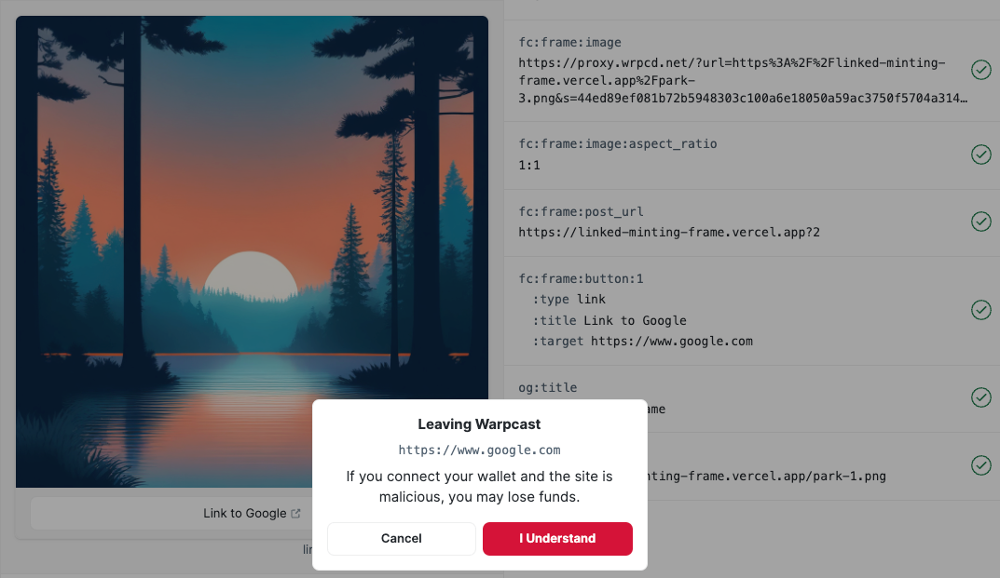

[Frames] on [Farcaster] allow you to add buttons that link to external sites in a new window. In this tutorial, you'll learn how to build a frame with [OnchainKit] that links to an NFT mint on [mint.fun], a no-code platform for creating and sharing NFT collections. If you're new to frames and not ready to write a smart contract, this is an excellent starting point! If you've already made a few, this one does showcase the latest features, so check it out and make sure you haven't missed anything.

---

## Objectives

By the end of this tutorial you should be able to:

- Build a Frame with an external link button
- Use [mint.fun] to set up a no-code NFT mint

---

## Prerequisites

### ERC-721 Tokens

This tutorial assumes that you are familiar with ERC-721 tokens (NFTs). You do not need to be able to write a smart contract. You'll use an online tool for that part.

### Vercel

You'll need to be comfortable deploying your app to [Vercel], or using another solution on your own. If you need a refresher, check out our tutorial on [deploying with Vercel]!

### Farcaster

You must have a [Farcaster] account with a connected wallet. Check out the [Base channel] to stay in the loop when we release tutorials like this!

---

## Setup

Create a copy of [a-frame-in-100-lines] If you're working off of an existing copy, check to make sure you have the most up-to-date version of [OnchainKit]!

Run `yarn install`.

Frames need to be deployed to a server to work, so connect your repo to [Vercel] with CI/CD. Remember that while doing so does make it much easier to test and redeploy, it also makes it easier to break a live frame!

Open `app/config.ts` and update `NEXT_PUBLIC_URL` to your new deployment.

## Creating the Initial Frame

As always, you'll set up the first frame in `app/page.tsx`. Open that up, and change the example to have a single button. You can keep the example that links to Google:

```tsx
const frameMetadata = getFrameMetadata({
  buttons: [
    {
      action: 'link',
      label: 'Link to Google',
      target: 'https://www.google.com',
    },
  ],
  image: {
    src: `${NEXT_PUBLIC_URL}/park-3.png`,
    aspectRatio: '1:1',
  },
});
```

Commit and push to deploy the frame. Wait for Vercel to build, then test with the [Frame Validator]. You should see a frame with a single button, that opens a new window once the warning is passed:



## Setting up the Mint

Before you can link to your mint, you need to set it up! Navigate to [mint.fun]. Create an account or log in, then click the `+` button in the upper right corner by the wallet balance.

Give your project a snappy name and upload a picture. Unless you're an experienced NFT artist, the default settings are probably best. **Note** that the mint will only run for a fixed time, so you may want to do the first pass with a test name and asset.

It will cost a small amount of gas to create the project. Approve the transaction, then you'll be taken to your mint page.

Copy the link, and update your button, and change the frame to use the image that you uploaded for your NFT:

```tsx
const frameMetadata = getFrameMetadata({
  buttons: [
    {
      action: 'link',
      label: 'Mint',
      target: 'https://mint.fun/base/<your contract address>',
    },
  ],
  image: {
    src: `${NEXT_PUBLIC_URL}/2024-a-base-odyssey.png`,
    aspectRatio: '1:1',
  },
});
```

Deploy and test, now your button links to your NFT!

## Next Steps

Your simple mint is ready to use on [Farcaster]! Be sure to check out our other tutorials if you want to add more [advanced behavior], or [mint with your own contract].

---

## Conclusion

In this tutorial, you learned how to make a simple [Frame] on [Farcaster] that is tied to a [mint.fun] NFT mint!

---

[mint.fun]: https://mint.fun/
[Farcaster]: https://www.farcaster.xyz/
[a-frame-in-100-lines]: https://github.com/Zizzamia/a-frame-in-100-lines
[OnchainKit]: https://onchainkit.xyz/?utm_source=basedocs&utm_medium=tutorials&campaign=farcaster-frames-nocode-minting
[Vercel]: https://vercel.com
[Frame Validator]: https://warpcast.com/~/developers/frames
[Base channel]: https://warpcast.com/~/channel/base
[deploying with Vercel]: /tutorials/farcaster-frames-deploy-to-vercel
[Frame]: https://docs.farcaster.xyz/learn/what-is-farcaster/frames
[Frames]: https://docs.farcaster.xyz/learn/what-is-farcaster/frames
[advanced behavior]: /tutorials/farcaster-frames-gating-and-redirects
[mint with your own contract]: ./farcaster-frames-nft-minting
