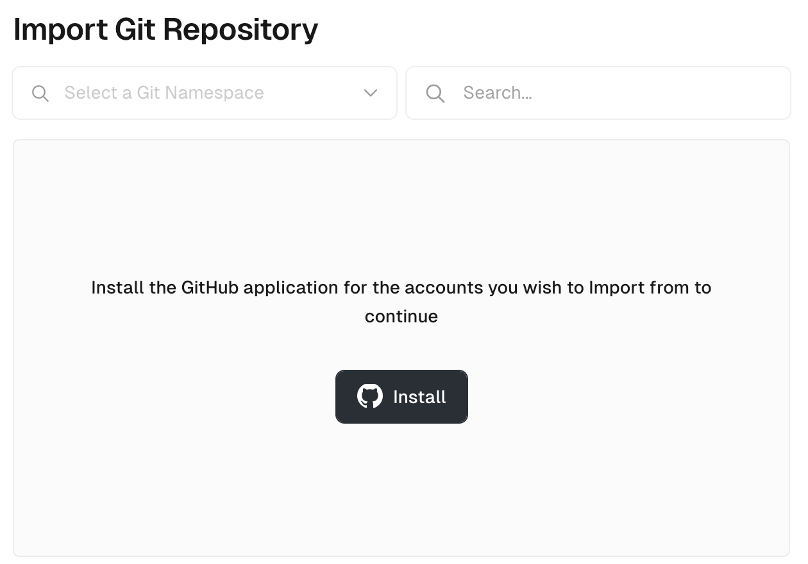
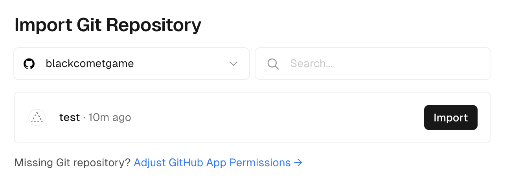
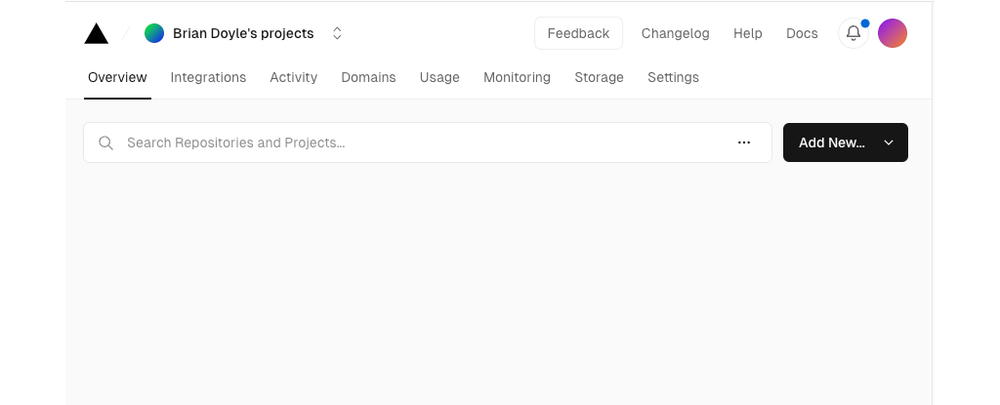
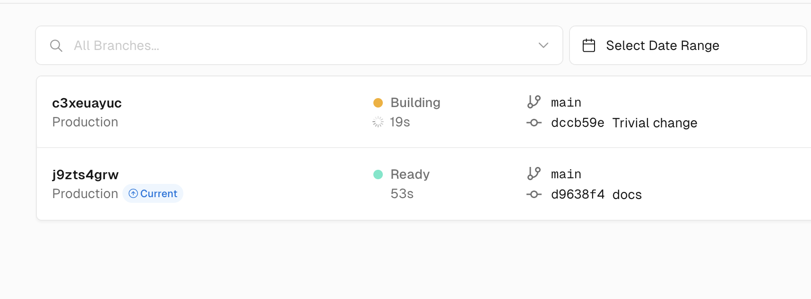
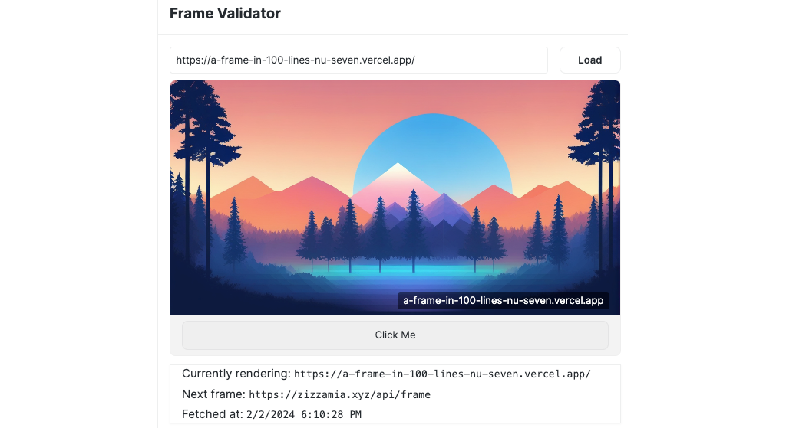

To share your [Frames] on [Farcaster], you must first deploy them to the web. Farcaster reads the metadata from your site to build the Frame as it initially appears to the user. In this tutorial, you'll learn how to deploy the frame in the [OnchainKit] example - [a-frame-in-100-lines].

---

## Objectives

By the end of this tutorial, you should be able to:

- Deploy a [Farcaster] Frame with [Vercel]
- Use CI/CD to automatically deploy to Vercel when you update your `main` or `master` branch
- Find and review logs and error messages for your deployed Frame

---

## Prerequisites

### Onchain App Development

You'll need to be comfortable building onchain apps.

### GitHub

You'll need a [GitHub] account and should be comfortable pushing code to it. If you're using another solution for managing your code, you should be able to adapt this tutorial to your use case.

### Farcaster

You must have a [Farcaster] account with a connected wallet. Check out the [Base channel] to stay in the loop when we release tutorials like this!

---

## Setup and Testing the Template

Start by creating a new repo using [a-frame-in-100-lines] as a template.

Run `yarn install`, then `yarn dev`.

In the browser, open `http://localhost:3000/`. All you'll see is a heading with _Zizzamia.xyz_. This is expected!

Open `app/page.tsx`. Here, you'll find the initial setup of the metadata that Farcaster reads to create the frame, as well as the simple page you just viewed. Change the `<h1>` to be your name.

```tsx
export default function Page() {
  return (
    <>
      <h1>YOUR NAME HERE</h1>
    </>
  );
}
```

Change the `label` of the first button in `buttons` to be something you'll recognize as well. This can be your name, your pet's, or anything you like!

```tsx
buttons: [
  {
    label: 'YOUR NAME HERE',
  },
  {
    action: 'tx',
    label: 'Send Base Sepolia',
    target: `${NEXT_PUBLIC_URL}/api/tx`,
    postUrl: `${NEXT_PUBLIC_URL}/api/tx-success`,
  },
],
```

## Setting up Vercel

Navigate to [Vercel]. Create an account if you need to, then sign in. You'll want to use your social login from [GitHub], GitLab, or BitBucket.

You should see something like this:



Click the `Install` button to install the Vercel app in your Github organization. You'll need to select the appropriate choice for your organization between `All repositories` and `Only selected repositories`.

All is more convenient, but gives a (well respected) third party more access than is required. For this tutorial, we're assuming that you've chosen to go with minimum necessary access. Click the `Select repositories` dropdown, and pick the repo for your Frame.

Click `Install`.

You should see the `Import Git Repository` screen:



:::info

If you've come back to Vercel after a few months, it may be unclear how to add more repos. To do so, use the `Add New...` dropdown on the projects page to get to the screen above, then click `Adjust GitHub App Permissions ->`. Scroll down in the popup window to find your list of repos to add.



:::

Click the button, then configure your project. The [a-frame-in-100-lines] example uses `Next.js`, which is made by the same people as Vercel, so the default settings are fine. Pick a new name if you'd like, then click `Deploy`.

:::caution

You won't have been the first person to name a project `a-frame-in-100-lines`, so Vercel will adjust the name for you for the file path, if you gave your template copy the same name. Don't be confused when your changes don't show up at `a-frame-in-100-lines.vercel, app`, that one isn't yours!

:::

After the deploy completes, click `Continue to Dashboard`.

On this screen, you'll see:

- A _Deployment_ link to this specific deployment. These persist, so you can always go back to compare before and after if you need to
- A _Domains_ link that goes to the main domain for your project. This will always link to your most recent deploy
- The _Status_ of your deploy, indicating, success, failure, or in process for each build
- A preview of the front page of your site

There are also a number of useful tabs. You should eventually check them all out, but for now inspect:

- _Project_: You are here
- _Deployments_: A list of the current, and all prior deployments. You'll use this tab to monitor new deployments as they build, or to revert to an old one if you need to
- _Logs_: Any `console.log` or `console.error` logs you put in your code will appear here. Note that there may be a few seconds delay
- _Settings_: Among other things, this is where you can set your environment variables. If it works locally but not deployed, this is a good place to review!

## CI/CD with Vercel

By default, Vercel sets up CI/CD, so whenever you push a change to your main branch, it will automatically redeploy!

Make a trivial change to your repo, commit it, and push it. When you do so, you'll see a new build in the _Deployments_ tab:



If it fails, you'll get a fairly comprehensive log explaining what happened. Otherwise, it will automatically deploy!

## Manual Deploys

If you want, you can disable CI/CD and set up manual deploys. One convenient way to do this is to set up a [one click deploy button].

## Testing the Cast

Open the [Frame Validator] and paste in your link. Viewing a frame from the validator will re-cache it for **future** casts, but it **will not** change any existing casts of the frame.

Click `Load`. You should see:



Except it will have the text that you edited!

---

## Conclusion

In this tutorial, you learned how to deploy a frame with [Vercel] and take advantage of CI/CD.

---

[OnchainKit]: https://onchainkit.xyz/?utm_source=basedocs&utm_medium=tutorials&campaign=farcaster-frames-deploy-to-vercel
[Base Learn]: https://docs.base.org/base-learn/docs/welcome
[Farcaster]: https://www.farcaster.xyz/
[a-frame-in-100-lines]: https://github.com/Zizzamia/a-frame-in-100-lines
[Vercel]: https://vercel.com
[Frame Validator]: https://warpcast.com/~/developers/frames
[Base channel]: https://warpcast.com/~/channel/base
[Frames]: https://warpcast.notion.site/Farcaster-Frames-4bd47fe97dc74a42a48d3a234636d8c5
[GitHub]: https://github.com
[one click deploy button]: https://vercel.com/blog/deploy-button
