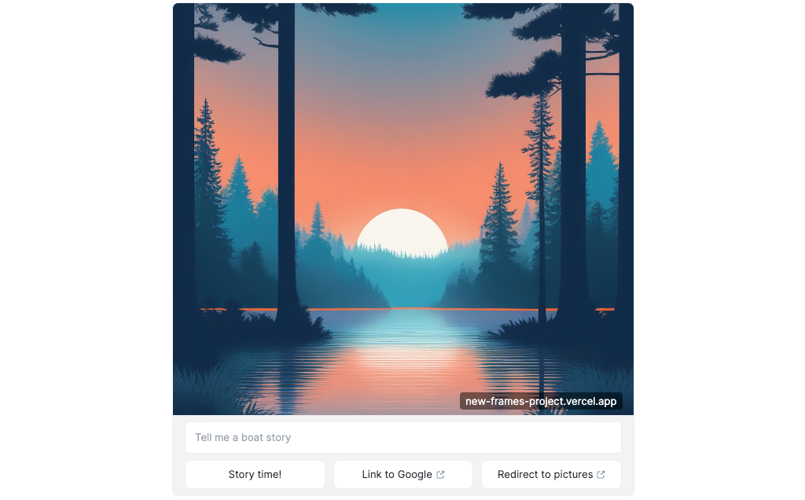
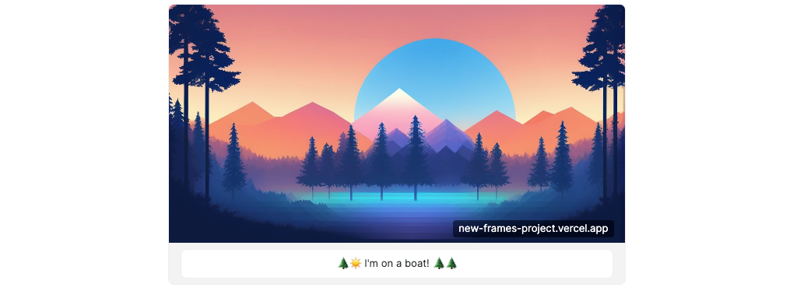

You can build complex and exciting [Frames] on [Farcaster] that meet the community's expectation for new and exciting things to do. [OnchainKit], and our [a-frame-in-100-lines] demo give you a number of tools to build complex interactions within a frame.

---

## Objectives

By the end of this tutorial, you should be able to:

- Build a [Farcaster] Frame that gates content behind a requirement that the user follows, recasts, or likes you or your frame
- Create frames that use the text field and extract it from the message
- Construct redirect buttons in Frames
- Create multiple paths within a Frame based on the button clicked by a user

---

## Prerequisites

### Onchain App Development

You'll need to be comfortable building onchain apps.

### Vercel

You'll need to be comfortable deploying your app to [Vercel], or using another solution on your own. Check out our tutorial on [deploying with Vercel] if you need a refresher!

### Farcaster

You must have a [Farcaster] account with a connected wallet. Check out the [Base channel] to stay in the loop when we release tutorials like this!

### Frames

You should be comfortable with the basics of creating Farcaster [Frames]. If you aren't, check out our tutorial on [NFT Minting Frame].

---

## Setting Up a Copy of A Frame in 100 Lines

Create a new repo using [a-frame-in-100-lines] as a template.

Add your new repo to Vercel and deploy. If you need a refresher, check out [deploying with Vercel]. Open the [Frame Validator] and test the current version of the template.



The demo has examples of most of the features available for your frames.

### Buttons and Images

The core functionality of a frame is an image and at least 1 button. Buttons can do a number of things, including requesting a new frame to replace the current one, opening a transaction for the user to consider approving, or opening a link to a website.

### Text Entry

Optionally, frames can include a text entry field. Try it out! When you click the `Story Time!` button, the text will be preserved, and will appear in the button on the next frame.



The text input field is created by adding the `input` property to `getFrameMetadata`.

```tsx
const frameMetadata = getFrameMetadata({
  buttons: [
    {
      label: 'Story time',
    },
    {
      action: 'tx',
      label: 'Send Base Sepolia',
      target: `${NEXT_PUBLIC_URL}/api/tx`,
      postUrl: `${NEXT_PUBLIC_URL}/api/tx-success`,
    },
  ],
  image: {
    src: `${NEXT_PUBLIC_URL}/park-3.png`,
    aspectRatio: '1:1',
  },
  input: {
    text: 'Tell me a story',
  },
  postUrl: `${NEXT_PUBLIC_URL}/api/frame`,
});
```

When the user enters the text, it gets included in the frame message. You can see how it is retrieved in `api/frame/route.ts`. The `getFrameMessageBody` function extracts the frame message from the request, and validates it. The returned `message` contains a number of useful properties that can be seen where it is defined in [OnchainKit], in `src/frame/types.ts`:

```tsx
export interface FrameValidationData {
  address: string | null; // The connected wallet address of the interacting user.
  button: number; // Number of the button clicked
  following: boolean; // Indicates if the viewer clicking the frame follows the cast author
  input: string; // Text input from the viewer typing in the frame
  interactor: {
    fid: number; // Viewer Farcaster ID
    custody_address: string; // Viewer custody address
    verified_accounts: string[]; // Viewer account addresses
    verified_addresses: {
      eth_addresses: string[] | null;
      sol_addresses: string[] | null;
    };
  };
  liked: boolean; // Indicates if the viewer clicking the frame liked the cast
  raw: NeynarFrameValidationInternalModel;
  recasted: boolean; // Indicates if the viewer clicking the frame recasted the cast
  state: {
    serialized: string; // Serialized state (e.g. JSON) passed to the frame server
  };
  transaction: {
    hash: string;
  } | null;
  valid: boolean; // Indicates if the frame is valid
}
```

The demo doesn't make use of the `input` property, but it does extract the text:

```tsx
//api/frames/route.ts

// Extract the input:
const text = message.input || '';
```

### Link Button

You can now add outbound links to buttons. To do this with [OnchainKit], simply create a button with an `action` property of `link`, and a `target` of the desired url:

```tsx
{
  action: 'link',
  label: 'Link to Google',
  target: 'https://www.google.com',
},
```

### Redirect Button

You can also do a redirect with a button. The example has one on the second frame - `Dog pictures ↗`:

```tsx
{
  action: 'post_redirect',
  label: 'Dog pictures',
},
```

The way it works is a little tricky.

Clicking this button hits the `postUrl`, with the requirement that you return a `redirect` response with a status of 302, and a link. You can see that in `route.ts`:

```tsx
if (message?.button === 3) {
  return NextResponse.redirect(
    'https://www.google.com/search?q=cute+dog+pictures&tbm=isch&source=lnms',
    { status: 302 },
  );
}
```

Try changing it to your favorite link!

## Creating Gates

The `message`, shown above, has properties that make it easy to design interactions based on whether or not the user interacting with the frame has liked or recast your post, or if they follow the original caster.

!!!caution

The community is evolving quickly and many people are fatigued with "Like, follow, recast" spam in their feeds. These are useful tools, but some consideration should be given for designing an experience for the current culture of the community you are trying to reach.

!!!

### Like Gate

To require the user to "like" the cast before seeing images of puppies, simply modify the conditional for the redirect to include that check:

```tsx
if (message?.button === 3 && message?.liked) {
  return NextResponse.redirect(
    'https://www.google.com/search?q=cute+dog+pictures&tbm=isch&source=lnms',
    { status: 302 },
  );
}
```

If they haven't, return a version of the original frame with a new message in the third button. In doing so, you've created a loop with a behavior condition for the user to exit:

```tsx
if (message?.button === 3 && message.liked) {
  return NextResponse.redirect(
    'https://www.google.com/search?q=cute+dog+pictures&tbm=isch&source=lnms',
    { status: 302 },
  );
} else if (message?.button === 3) {
  return new NextResponse(
    getFrameHtmlResponse({
      buttons: [
        {
          label: `State: ${state?.page || 0}`,
        },
        {
          action: 'link',
          label: 'OnchainKit',
          target: 'https://onchainkit.xyz',
        },
        {
          action: 'post_redirect',
          label: 'Like to see doggos!',
        },
      ],
      image: {
        src: `${NEXT_PUBLIC_URL}/park-1.png`,
      },
      postUrl: `${NEXT_PUBLIC_URL}/api/frame`,
      state: {
        page: state?.page + 1,
        time: new Date().toISOString(),
      },
    }),
  );
}
```

Note that we're returning a `getFrameHtmlResponse` here, **not** a `getFrameMetadata`. That's only used for the initial frame created from a page!

### Follow and Recast Gates

On your own, try changing the "like" gate to require the user to follow you, recast, or all three!

:::info

**Hint:** Take a close look at the `FrameValidationData` properties. [OnchainKit] makes this easy!

:::

## Conclusion

In this tutorial, you learned how to use the main features of Frames - text input, link buttons, and redirects. You also learned how to use new features in [OnchainKit] to require your users to perform certain actions to unlock features in your Frame. Finally, you learned how to create a loop in your Frame's behavior, which can be used to create very complicated Frames!

---

[Base Learn]: https://docs.base.org/base-learn/docs/welcome
[Farcaster]: https://www.farcaster.xyz/
[a-frame-in-100-lines]: https://github.com/Zizzamia/a-frame-in-100-lines
[OnchainKit]: https://onchainkit.xyz/?utm_source=basedocs&utm_medium=tutorials&campaign=farcaster-frames-gating-and-redirects
[Vercel]: https://vercel.com
[Frame Validator]: https://warpcast.com/~/developers/frames
[Base channel]: https://warpcast.com/~/channel/base
[deploying with Vercel]: /tutorials/farcaster-frames-deploy-to-vercel
[NFT Minting Frame]: /tutorials/farcaster-frames-nft-minting
[Frames]: https://warpcast.notion.site/Farcaster-Frames-4bd47fe97dc74a42a48d3a234636d8c5
[viem]: https://viem.sh/
[Basescan]: https://basescan.org/
