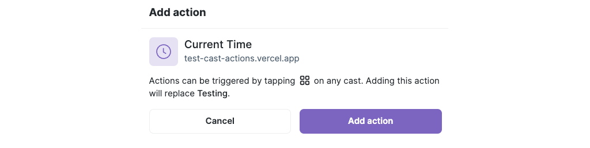

[Cast Actions] are a new feature of [Farcaster] that enable you to create actions that users can install on their Farcaster client and then click a button on any cast to trigger the action. In this tutorial, you'll learn how to build a simple cast action with [OnchainKit] that returns a message to the Farcaster client.

:::caution

Cast Actions are brand new and tools for building them are evolving quickly. Check the [Cast Actions] docs and OnchainKit [changelog]!

:::

---

## Objectives

By the end of this tutorial you should be able to:

- Create a Farcaster cast action that returns a message when triggered by a user
- Identify the location to add additional functionality to the cast
- Enable users to install the cast action

---

## Prerequisites

### Vercel

You'll need to be comfortable deploying your app to [Vercel], or using another solution on your own. If you need a refresher, check out our tutorial on [deploying with Vercel]!

### Farcaster

You must have a [Farcaster] account with a connected wallet. Check out the [Base channel] to stay in the loop when we release tutorials like this!

---

## Setup

Create a copy of [a-frame-in-100-lines]. It's a template, so you can easily add a new copy by clicking the green button at the top of the page. If you're working off of an existing copy, check to make sure you have the most up-to-date version of [OnchainKit]!

Run `yarn install`.

Cast actions need to be deployed to a server to work, so connect your repo to [Vercel] with CI/CD. Remember that while doing so does make it much easier to test and redeploy, it also makes it easier to break a live cast action!

Open `app/config.ts` and update `NEXT_PUBLIC_URL` to your new deployment.

## Creating A Simple Cast Action

Cast actions work similarly to the way [Frames] call your api endpoint. As a result, you can quickly adapt the code of an endpoint expecting a frame to instead manage a cast action.

Add a new folder in `api` called `action` with a file called `route.ts` to create a new route in your app. Import dependencies from OnchainKit and Next.js:

```tsx
import { FrameRequest, getFrameMessage } from '@coinbase/onchainkit/frame';
import { NextRequest, NextResponse } from 'next/server';
```

You won't be returning a frame, so you don't need `getFrameHtmlResponse`.

Stub out your `POST` handler and response function:

```tsx
async function getResponse(req: NextRequest): Promise<NextResponse> {
  // TODO
}

export async function POST(req: NextRequest): Promise<Response> {
  console.log('POST');
  return getResponse(req);
}

export async function GET(req: NextRequest): Promise<Response> {
  console.log('GET');
  return getResponse(req);
}

export const dynamic = 'force-dynamic';
```

Parse and validate the request exactly the same as you would a frame in the top of `getResponse`:

```tsx
const body: FrameRequest = await req.json();
const { isValid, message } = await getFrameMessage(body, { neynarApiKey: 'NEYNAR_ONCHAIN_KIT' });

if (!isValid) {
  return new NextResponse('Message not valid', { status: 500 });
}
```

Instead of returning a frame, you'll return a json `NextResponse` with a string `message` and a 200 status:

```tsx
return NextResponse.json({ message: 'Hello from the frame route' }, { status: 200 });
```

### Testing the Cast Action

Commit your work to trigger a deploy in [Vercel]. Once it's done, you can test your cast action with the [Cast Actions Playground].

The above link has an example embedded in it. Try it out, then replace the `Post URL` with your own. Click `Submit Action` and you will see the hello message from your route.

## Performing a Task in the Cast Action

Before sending the response, you can do whatever you want to give your cast action functionality. Possibilities include:

- Extracting the cast hash or caster FID from the request and using it for something
- Reading or writing from a database or smart contract
- Anything else you'd use an API call to do on behalf of a user

For now, you can add a simple addition to let the user know what time it is.

Modify your `return`:

```tsx
// Get the current date and time
const now = new Date();
const date = now.toLocaleDateString();
const time = now.toLocaleTimeString();

// Format them as a string
const dateTime = `${date} ${time} UTC`;

return NextResponse.json({ message: dateTime }, { status: 200 });
```

## Installing the Cast Action

To install a cast action, you need to pick an [Octicon] from the list at the bottom of the [Cast Actions] doc. You also need to decide on a name for your action. Using those, you create a deeplink to Warpcast that will prompt the user to install your action. Currently, this replaces their existing action, but the capacity for multiple will be added soon.

For example:

```text
https://warpcast.com/~/add-cast-action?actionType=post&name=Current+Time&icon=clock&postUrl=https%3A%2F%2Ftest-cast-actions.vercel.app%2Fapi%2Faction
```

The [Cast Actions Playground] has a nice tool to build this link for you!

### From a Web Page

To enable your users to install your action from a web page, simply include the link. Update the root of your site to do so:

```tsx
export default function Page() {
  return (
    <>
      <div>
        <a href="https://warpcast.com/~/add-cast-action?actionType=post&name=Current+Time&icon=clock&postUrl=https%3A%2F%2Ftest-cast-actions.vercel.app%2Fapi%2Faction">
          Click here to install the Current Time action on Warpcast.
        </a>
      </div>
    </>
  );
}
```



### From a Frame

Finally, update the frame on your root page to also have the install link:

```tsx
const frameMetadata = getFrameMetadata({
  buttons: [
    {
      action: 'link',
      label: 'Add Current Time Action',
      target:
        'https://warpcast.com/~/add-cast-action?actionType=post&name=Current+Time&icon=clock&postUrl=https%3A%2F%2Ftest-cast-actions.vercel.app%2Fapi%2Faction',
    },
  ],
  image: {
    src: `${NEXT_PUBLIC_URL}/park-3.png`,
    aspectRatio: '1:1',
  },
});
```

---

## Conclusion

In this tutorial, you created a [Farcaster] [Cast Action] that allows your users to get the current date and time from a cast. You also learned where and how you can add further functionality to your action. Finally, you created a link and a frame to allow your users to install your cast action.

Watch the [Base Channel] to stay up-to-date on new developments!

---

[Octicon]: https://primer.style/foundations/icons/
[Cast Actions Playground]: https://warpcast.com/~/developers/cast-actions?icon=home&name=Random+City+Name&postUrl=https%3A%2F%2F660b36e4ccda4cbc75dc8ec2.mockapi.io%2Fcity
[Cast Action]: https://warpcast.notion.site/Spec-Farcaster-Actions-84d5a85d479a43139ea883f6823d8caa
[Farcaster]: https://www.farcaster.xyz/
[a-frame-in-100-lines]: https://github.com/Zizzamia/a-frame-in-100-lines
[OnchainKit]: https://onchainkit.xyz/?utm_source=basedocs&utm_medium=tutorials&campaign=farcaster-cast-actions-simple
[Vercel]: https://vercel.com
[Frame Validator]: https://warpcast.com/~/developers/frames
[Base channel]: https://warpcast.com/~/channel/base
[deploying with Vercel]: /tutorials/farcaster-frames-deploy-to-vercel
[Frame]: https://docs.farcaster.xyz/learn/what-is-farcaster/frames
[Frames]: https://docs.farcaster.xyz/learn/what-is-farcaster/frames
[Cast Actions]: https://warpcast.notion.site/Spec-Farcaster-Actions-84d5a85d479a43139ea883f6823d8caa
