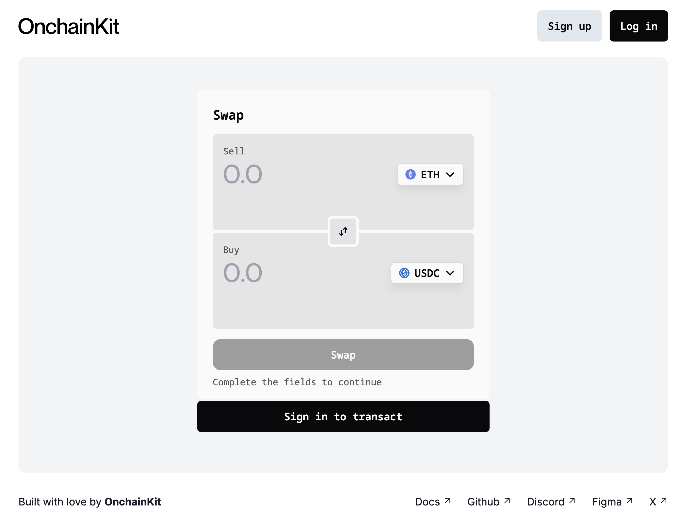
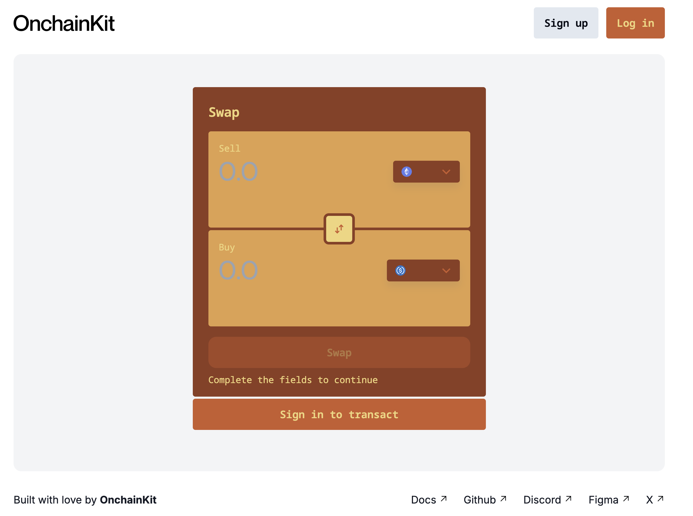

In this tutorial, you'll learn how to create a swap component with a custom theme using OnchainKit. We'll start with the OnchainKit App Template and modify it to include a swap interface for ERC20 tokens on Base.

---

## Objectives

By the end of this tutorial, you will be able to:

- Set up a project using the OnchainKit App Template
- Implement a swap component for ERC20 tokens
- Customize the theme of your OnchainKit components
- Apply CSS overrides to fine-tune the appearance of your app

## Prerequisites

### React and TypeScript

You should be familiar with React and TypeScript. If you're new to these technologies, consider reviewing their [official documentation](https://react.dev/) first.

### OnchainKit

This tutorial uses [OnchainKit]. Familiarity with its basic concepts will be helpful.

---

## Setting up the Project

To get started, clone the OnchainKit App Template by running:

```bash
git clone git@github.com:coinbase/onchain-app-template.git
```

If you have an existing app that uses OnchainKit, update to the latest version:

```bash
bun update @coinbase/onchainkit --latest
```

Now let's implement the Swap component by importing it from OnchainKit. Import it into a new route of your app or, if you're following along, the `src/app/page.tsx` file:

```ts
import {
  Swap,
  SwapAmountInput,
  SwapToggleButton,
  SwapButton,
  SwapMessage,
  SwapToast,
} from '@coinbase/onchainkit/swap';

import type { Token } from 'node_modules/@coinbase/onchainkit/esm/token/types';
```

The `<Swap/>` component enables you to swap any ERC20 token on Base. For this example, your users will be able to swap between USDC and ETH. Next, using the `Token` type, create instances of ETH and USDC.

```ts
const ETHToken: Token = {
  address: '',
  chainId: 8453,
  decimals: 18,
  name: 'Ethereum',
  symbol: 'ETH',
  image:
    'https://dynamic-assets.coinbase.com/dbb4b4983bde81309ddab83eb598358eb44375b930b94687ebe38bc22e52c3b2125258ffb8477a5ef22e33d6bd72e32a506c391caa13af64c00e46613c3e5806/asset_icons/4113b082d21cc5fab17fc8f2d19fb996165bcce635e6900f7fc2d57c4ef33ae9.png',
};

const USDCToken: Token = {
  address: '0x833589fCD6eDb6E08f4c7C32D4f71b54bdA02913',
  chainId: 8453,
  decimals: 6,
  name: 'USDC',
  symbol: 'USDC',
  image:
    'https://dynamic-assets.coinbase.com/3c15df5e2ac7d4abbe9499ed9335041f00c620f28e8de2f93474a9f432058742cdf4674bd43f309e69778a26969372310135be97eb183d91c492154176d455b8/asset_icons/9d67b728b6c8f457717154b3a35f9ddc702eae7e76c4684ee39302c4d7fd0bb8.png',
};
```



Here's a [sample](https://gist.github.com/hughescoin/4558feabb4f40b51f800091f04a945ae) of the full `page.tsx` file for reference.

## Changing the Theme

To change the theme of the site, navigate to `src/components/OnchainProviders.tsx` and add a `config` object to the `OnchainKitProvider`. This is the first step in enabling Themes for your project.

```js
config={{
    appearance: {
        mode: 'auto', // 'auto' | 'light' | 'dark'
        theme: 'default', // 'default' | 'base' | 'cyberpunk' | 'hacker'
    },
}}
```

OnchainKit provides you with four preset themes. We'll use the "hacker" theme for its fonts but change the colors to a different palette.

If you need help coming up with a color palette, there are many online tools available. For example, I used [color magic](https://colormagic.app).

## Customizing the CSS

Once you've chosen your colors, add them to the CSS file. Update the `src/app/global.css` file to include CSS overrides for OnchainKit properties. In the sample below, the comments provide guidance on which properties will change color.

:::tip Having trouble changing an element?

Use the "Inspect" feature in your browser to identify the element you wish to override in your `global.css` file.

:::

```css
@layer base {
  :root,
  .default-light,
  .default-dark,
  .base,
  .cyberpunk,
  .hacker {
    /* Text colors */
    --ock-text-inverse: #f1d579;
    --ock-text-foreground: #8c3e21;
    --ock-text-foreground-muted: #f1d579;
    --ock-text-error: #c85c2d;
    --ock-text-primary: #e1a04c;
    --ock-text-success: #f5b370;
    --ock-text-warning: #f1d579;
    --ock-text-disabled: #8c3e21;

    /* Background colors */
    --ock-bg-default: #8c3e21;
    --ock-bg-default-hover: #c85c2d;
    --ock-bg-default-active: #f1d579;
    --ock-bg-alternate: #f1d579;
    --ock-bg-alternate-hover: #e1a04c;
    --ock-bg-alternate-active: #c85c2d;
    --ock-bg-inverse: #c85c2d;
    --ock-bg-inverse-hover: #e1a04c;
    --ock-bg-inverse-active: #f5b370;
    --ock-bg-primary: #c85c2d;
    --ock-bg-primary-hover: #e1a04c;
    --ock-bg-primary-active: #f1d579;
    --ock-bg-primary-washed: #f5b370;
    --ock-bg-primary-disabled: #8c3e21;
    --ock-bg-secondary: #e1a04c;
    --ock-bg-secondary-hover: #f1d579;
    --ock-bg-secondary-active: #f5b370;
    --ock-bg-error: #c85c2d;
    --ock-bg-warning: #f1d579;
    --ock-bg-success: #f5b370;
    --ock-bg-default-reverse: #c85c2d;

    /* Icon colors */
    --ock-icon-color-primary: #c85c2d;
    --ock-icon-color-foreground: #c85c2d;
    --ock-icon-color-foreground-muted: #e1a04c;
    --ock-icon-color-inverse: #f5b370;
    --ock-icon-color-error: #c85c2d;
    --ock-icon-color-success: #f5b370;
    --ock-icon-color-warning: #f1d579;

    /* Line colors */
    --ock-line-primary: #c85c2d;
    --ock-line-default: #8c3e21;
    --ock-line-heavy: #f1d579;
    --ock-line-inverse: #e1a04c;
  }
}

.ock-font-family.font-semibold.text-xl.leading-7 {
  color: #f1d579;
}
```

Now refresh your page, and you should see your swap component change to your defined color palette!



If something looks off, remember to check that you've overridden the correct element. See the above tip to learn how to find the correct element.

## Conclusion

Congratulations! You've successfully implemented the `<Swap/>` component and customized it to a theme of your choice. Pretty neat, right?
[OnchainKit]: https://github.com/coinbase/onchainkit
[OnchainKit App Template]: https://github.com/coinbase/onchain-app-template
[color magic]: https://colormagic.app
[sample]: https://gist.github.com/hughescoin/4558feabb4f40b51f800091f04a945ae
