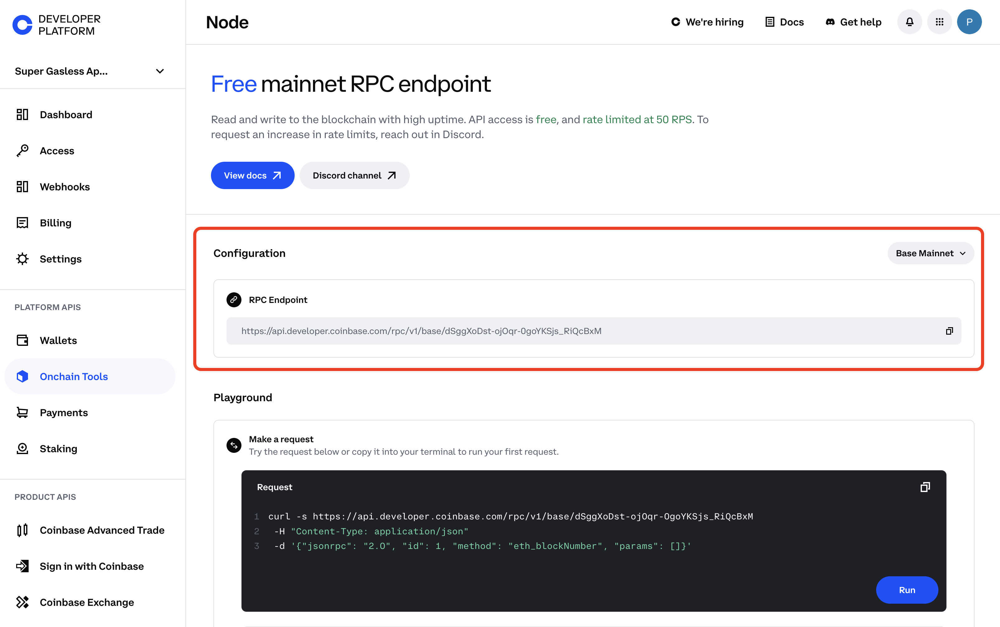
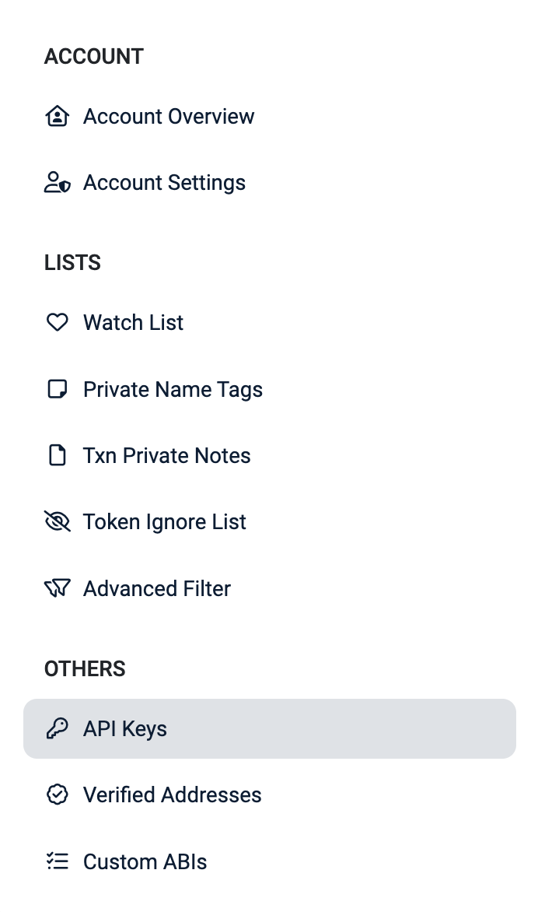
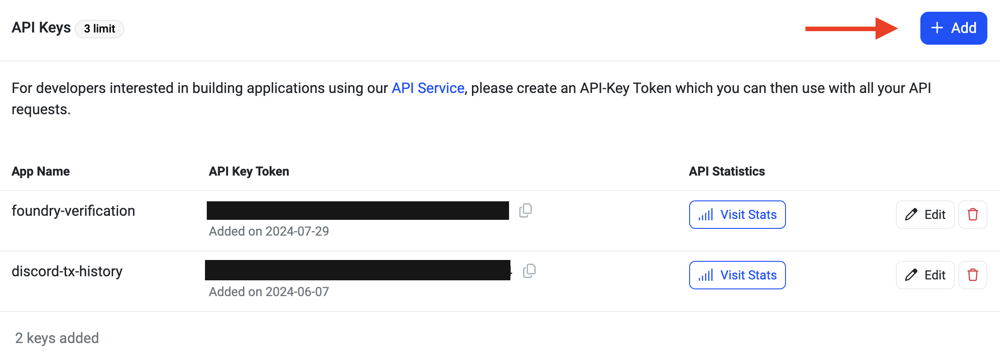

[Basescan] is a block explorer specifically designed for [Base], offering developers a way to interact with and verify the smart contracts deployed on Base. Smart contract verification is a critical step in ensuring the transparency and security of onchain applications, as it allows others to review and validate the source code of deployed contracts. There are multiple ways to verify contracts and by the end of this tutorial you will learn how to verify a contract using the [Solidity] single file verification method using the [Basescan API].

---

## Objectives

By the end of this tutorial, you should be able to:

- Deploy a smart contract using [Foundry]
- Interact with the [Basescan API] to verify your deployed contract
- Obtain and configure a (free) Base RPC Node from [Coinbase Developer Platform (CDP)](https://portal.cdp.coinbase.com/products/node)

---

## Prerequisites

**Familiarity with smart contract development and the Solidity programming language**

Solidity is the primary programming language for writing smart contracts on Ethereum and Ethereum-compatible blockchains like Base. You should be comfortable with writing, compiling, and deploying basic smart contracts using Solidity. If not, check out [Base Learn].

**Basic understanding of Foundry for Ethereum development**

Foundry is a fast and portable toolkit for Ethereum application development. It simplifies the process of deploying, testing, and interacting with smart contracts. This tutorial assumes you have experience using Foundry to compile and [deploy smart contracts].

**Access to a Coinbase Developer Platform (CDP) account**

The [Coinbase Developer Platform] provides access to tools and services necessary for blockchain development, including RPC nodes for different networks. You'll need to sign up for a CDP account to obtain a [Base RPC Node], which will be essential for deploying and interacting with your smart contracts on the Base blockchain.

**Node + Basic API requests**

## Jump Right In

For this turotial, you will deploy a simple contract that is included in the Foundry quickstart. To do so, ensure that you have Foundry installed.

If you don't have Foundry install it:

```bash
curl -L https://foundry.paradigm.xyz | bash
```

Once installed, create a Foundry project:

```bash
forge init verify_contracts
```

then change into the newly made directory:

```bash
cd verify_contracts
```

You should have a folder structure similar to this:

```bash
├── lib
├── script
├── src
└── test
```

The `src` folder will contain a `Counter.sol` file which will serve as the country you want to deploy.

:::note You will need ETH on Base to deploy
You (the deployer wallet) will need some ETH in order to broadcast the transaction to the Base network. Fortunately, transactions are usually < 1 cent on Base mainnet.

If using a [Coinbase Wallet] use the "Buy" button to onramp crypto from your Coinbase account.

:::

You will need a private key of the wallet that you want to deploy the smart contract from. Obtain it and store it as an env variable in your terminal.

Once you have the private key to the wallet of your choice, open your terminal and store it in an environment variable:

```bash
export PRIVATE_KEY="<YOUR_PRIVATE_KEY>"
```

To deploy our contract you will need a RPC URL to a Base node in order to broadcast our transactions to the network. [CDP] provides us with a free node for interacting with Base mainnet and testnet.

Obtain a rpc url from the [Node product] and store the url as an environment variable similar to the private key in the previous step.



Then store it as a environment variable in your terminal:

```bash
export BASE_RPC_URL="your_base_rpc_url"
```

It's deployment time! Deploy the `Counter.sol` contract using `forge create --rpc-url $BASE_RPC_URL --private-key $PRIVATE_KEY src/Counter.sol:Counter`

Once deployed, it should return something like this:

```bash
[⠊] Compiling...
[⠢] Compiling 1 files with Solc 0.8.26
[⠆] Solc 0.8.26 finished in 1.23s
Compiler run successful!
Deployer: 0xLo69e5523D33FBDbF133E81C91639e9d3C6cb369
Deployed to: 0xEF5fe818Cb814E5c8277C5F12B57106B4EC3DdaA
Transaction hash: 0xb191f9679a1fee253cf430ac09a6838f6806cfb2a250757fef407880f5546836
```

Congrats! You've now deployed a contract to Base. The output of the deployment command contiains a contract address (e.g `Deployed to: 0xEF5fe818Cb814E5c8277C5F12B57106B4EC3DdaA`). Copy this address as you will need it in the next step.

### Verify the contract

You will now interact with the [Basescan API]. For this, you need API Keys. Create an account using an email or [login to Basescan].

After signing in, navigate to your [Basescan account] then select `API Keys` on the left navigation bar.



From the [API Key page], click the blue "Add" button to create a new API Key then copy your `API Key Token`



Save this to your clipboard for the next step.

Create a `.js` file to create a function to that will call the Basescan's contract verification endpoint.

In your terminal create a new file: `touch verifyContractBasescan.js` then open this file in your IDE of choice.

At the top of the file create a variable that contains the `Counter.sol` that was created from your foundry project.

```javascript
const sourceCode = `pragma solidity ^0.8.13;
contract Counter {
	uint256 public number;
	function setNumber(uint256 newNumber) public {
	number = newNumber;
}
	function increment() public {
	number++;
	}
}`;
```

Create an `async` function to call the basescan api. Basescan offers a few endpoints to interact with their api with the base url being: `https://api.basescan.org/api`

To verify a contract you will use the `verifysourcecode` route, with the `contract` module, and your `apiKey` as query parameters.

:::tip Unsure what data to input?

In every foundry project you will have a `.json` file that contains the conrtacts metadata and ABI. For this particular project, this information is located in the `/verify_contracts/out/Counter.sol/Counter.json`

Under the `Metadata` object you will find the compiler version under `evmversion`
:::

Putting everything together, our function will look like this:

```
async function verifySourceCode() {
  const url = 'https://api.basescan.org/api';

  const params = new URLSearchParams({
    module: 'contract',
    action: 'verifysourcecode',
    apikey: 'DK8M329VYXDSKTF633ABTK3SAEZ2U9P8FK', //remove hardcode
  });

  const data = new URLSearchParams({
    chainId: '8453',
    codeformat: 'solidity-single-file',
    sourceCode: sourceCode,
    contractaddress: '0x8aB096ea9886ACe363f81068d2439033F67F62E4',
    contractname: 'Counter',
    compilerversion: 'v0.8.26+commit.8a97fa7a',
    optimizationUsed: 0,
    evmversion: 'paris',
  });
  }
```

Now add a `try-catch` block to send the request and log any errors to the console.

Your final file should look something like this:

```javascript
const sourceCode = `pragma solidity ^0.8.13;

contract Counter {
    uint256 public number;

    function setNumber(uint256 newNumber) public {
        number = newNumber;
    }

    function increment() public {
        number++;
    }
}`;

async function verifySourceCode() {
  const url = 'https://api.basescan.org/api';

  const params = new URLSearchParams({
    module: 'contract',
    action: 'verifysourcecode',
    apikey: 'YOUR_API_KEY',
  });

  const data = new URLSearchParams({
    chainId: '8453',
    codeformat: 'solidity-single-file',
    sourceCode: sourceCode,
    contractaddress: '0x8aB096ea9886ACe363f81068d2439033F67F62E4',
    contractname: 'Counter',
    compilerversion: 'v0.8.26+commit.8a97fa7a',
    optimizationUsed: 0,
    evmversion: 'paris',
  });

  try {
    const response = await fetch(`${url}?${params}`, {
      method: 'POST',
      headers: {
        'Content-Type': 'application/x-www-form-urlencoded',
      },
      body: data,
    });

    if (!response.ok) {
      throw new Error(`HTTP error! status: ${response.status}`);
    }

    const result = await response.json();
    console.log(result);
    return result;
  } catch (error) {
    console.error('Error:', error);
    throw error;
  }
}

verifySourceCode().catch((error) => console.error('Unhandled error:', error));
```

Save your file and then run `node verifyContractBasescan.js` in your terminal

If successful, your terminal will output JSON text with three properties `status`, `message` and `result` like below:

```bash
{
  status: '1',
  message: 'OK',
  result: 'cqjzzvppgswqw5adq4v6iq4xkmf519pj1higvcxsdiwcvwxemd'
}
```

Result is the GUID and is a unique identifier for checking the status of your contracts verification.

To verify the contract, let's create a curl request with the following paramters

```bash
curl "https://api.basescan.org/api?module=contract&action=checkverifystatus&guid=cqjzzvppgswqw5adq4v6iq4xkmf519pj1higvcxsdiwcvwxemd&apikey=DK8M329VYXDSKTF633ABTK3SAEZ2U9P8FK"
```

Run the command and you will see a that the contract should already be verified based on the `result` field

```json
{ "status": "0", "message": "NOTOK", "result": "Already Verified" }
```

## Conclusion

Congratulations! You’ve successfully deployed and verified a smart contract using the Basescan API. Now, your users don’t have to rely solely on your word—they can verify the contract’s functionality through the code itself.

---

[Coinbase Developer Platform]: https://portal.cdp.coinbase.com/
[Base RPC Node]: https://portal.cdp.coinbase.com/products/node
[CDP]: https://portal.cdp.coinbase.com/
[Base]: https://base.org/
[Basescan]: https://basescan.org/
[Solidity]: https://soliditylang.org/
[Basescan account]: https://basescan.org/myaccount/
[API Key page]: https://basescan.org/myapikey/
[Basescan API]: https://docs.basescan.org/
[login to Basescan]: https://basescan.org/login/
[Node product]: https://portal.cdp.coinbase.com/products/node/
[deploy smart contracts]: https://docs.base.org/tutorials/deploy-with-foundry/
[Base Learn]: https://docs.base.org/base-learn/docs/welcome/
[Foundry]: https://book.getfoundry.sh/getting-started/installation
