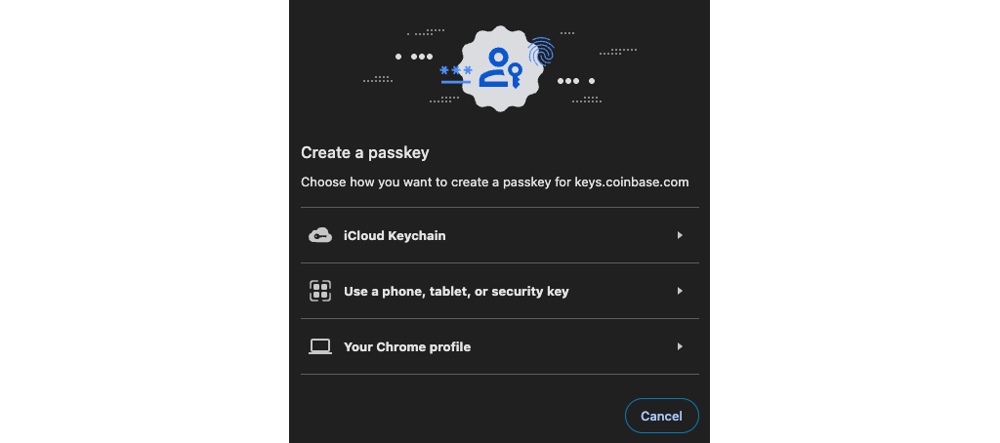
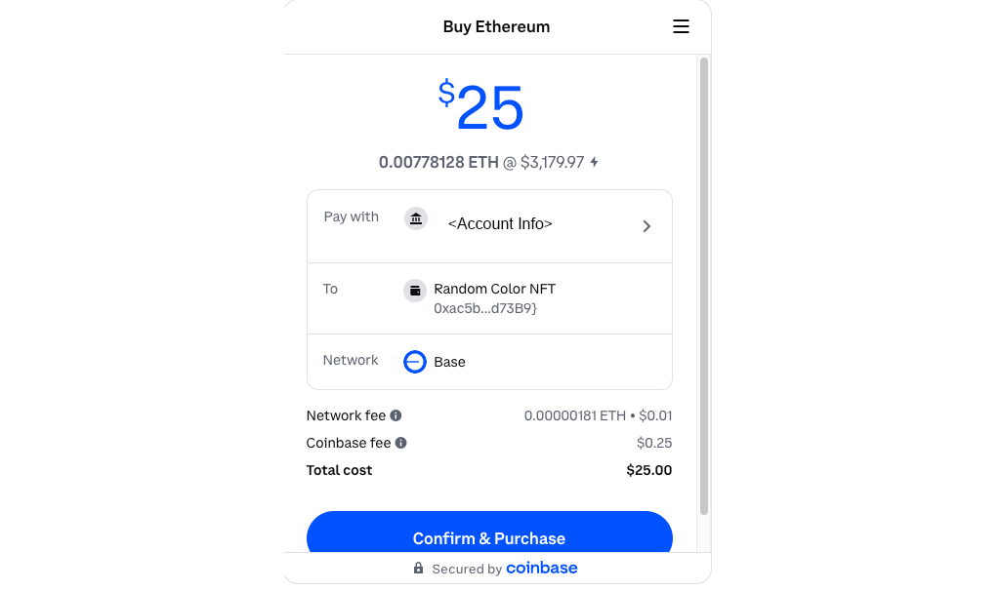
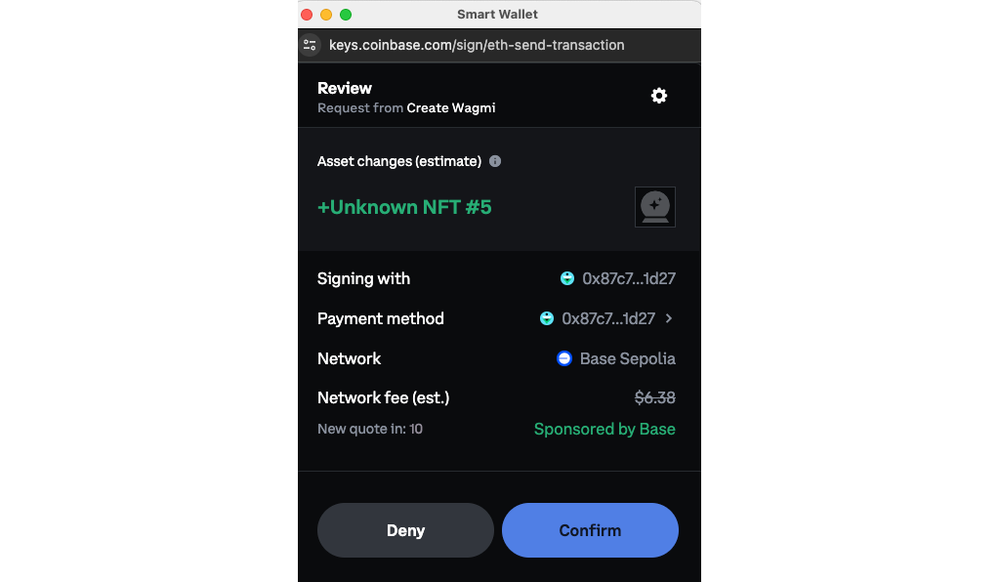

The [Coinbase Smart Wallet] is a new application of account abstraction that makes it easy to give the exact same onboarding to both native crypto users who have their own EOA wallet, and new users who would benefit from an easier onboarding to crypto. For the former, the wallet works almost exactly the way they are used to. For the latter, [passkeys] are used to create a wallet and securely save the keys.

Most importantly, this wallet will work for the user across all apps using the Smart Wallet, across many different chains! Think of it as an onchain version of the social logins that most regular users now expect in their apps.

---

## Objectives

By the end of this tutorial you should be able to:

- Connect users to your onchain app using the Coinbase Smart Wallet
- Integrate the Smart Wallet with wagmi
- Provide an easy path for your users to buy crypto and put it in their wallet
- Compare and contract the Smart Wallet with other forms of account abstraction
- Take advantage of the [Base Gasless Campaign] to onboard your first users with free gas

---

## Prerequisites

### ERC-721 Tokens

This tutorial assumes that you are able to write, test, and deploy your own ERC-721 tokens using the Solidity programming language. If you need to learn that first, check out our content in [Base Camp] or the sections specific to [ERC-721 Tokens]!

### Vercel

You'll need to be comfortable deploying your app to [Vercel], or using another solution on your own. Check out our tutorial on [deploying with Vercel] if you need a refresher!

### Onchain Apps

The tutorial assumes you're comfortable with the basics of deploying an app and connecting it to a smart contract. If you're still learning this part, check out our tutorials in [Base Camp] for [Building an Onchain App].

---

## Building the Contract

Start by setting up an [OpenZeppelin ERC-721] contract. You'll need to set up a `mintTo` function that accepts the address that should receive the NFT.

```solidity
// SPDX-License-Identifier: UNLICENSED
pragma solidity ^0.8.24;

import "hardhat/console.sol";
import "@openzeppelin/contracts/token/ERC721/ERC721.sol";

contract RandomColorNFT is ERC721 {
    uint public counter;

    constructor() ERC721("RandomColorNFT", "RCNFT") {
    }

    function mintTo(address _to) public {
        counter++;
        _safeMint(_to, counter);
    }
}
```

:::caution

You need to be careful how you handle `msg.sender` when you are using a smart wallet with account abstraction. Unlike a normal transaction with a traditional wallet, `msg.sender` is **not** the address of the user's wallet address. It is instead their smart contract address.

:::

### Onchain Metadata

Rather than pointing to a `json` file on the traditional internet, you can put your metadata directly in the contract. To do so, first import some helper libraries:

```Solidity
import "@openzeppelin/contracts/utils/Base64.sol";
import "@openzeppelin/contracts/utils/Strings.sol";
```

Next, `override` the functions for `_baseURI` and `tokenURI` to return base 64 encoded json metadata with the appropriate information:

```Solidity
function _baseURI() internal pure override returns (string memory) {
  return "data:application/json;base64,";
}

function tokenURI(uint _tokenId) public view override returns (string memory) {
  if(_tokenId > counter) {
    revert InvalidTokenId(_tokenId);
  }

  string memory json = Base64.encode(
    bytes(
      string(
        abi.encodePacked(
        '{"name": "',
        name(),
        ' #: ',
        Strings.toString(_tokenId),
        '","description": "Random colors are pretty or boring!", "image": "image": "data:image/svg+xml;base64,',
        // TODO...,
        '"}'
        )
      )
    )
  );

  return string(abi.encodePacked(_baseURI(), json));
}
```

**Be very careful** setting up the single and double quotes above and be sure to test this function to make sure the result is valid json metadata. An error here will break the NFT and it won't show up correctly in wallets or marketplaces!

### Onchain SVG Image

For this NFT, the art will consist of a simple onchain SVG containing a square with a pseudo-randomly chosen color. Check out our tutorial on [Building Onchain NFTs] if you want to try something more complicated.

Start by scaffolding out a `render` function:

```solidity
function render(uint _tokenId) public view returns (string memory) {
  return string(
    abi.encodePacked(
      "<svg xmlns='http://www.w3.org/2000/svg' viewBox='0 0 1024 1024'>",
        // TODO: add a rectangle with a random color fill
      "</svg>"
    )
  );
}
```

Rectangles in SVG images are created with the [rect] element. To cover the whole background, you can set the width and height to the size of the `viewbox`. Although not listed directly in the MDN page for rectangles, you can add a `fill` property to add a fill color to any SVG element. You can use color names, or hex codes for colors:

```html
<rect width="100" height="100" fill="#aabbcc" />
```

### Generating a Random Color

Instead of a fixed color, your design calls for a unique color for each NFT. Add a function to generate this:

```solidity
// Function to generate a random color hex code
function generateRandomColor() public view returns (string memory) {
  // Generate a pseudo-random number using block.prevrandao
  uint256 randomNum = uint256(keccak256(abi.encodePacked(block.prevrandao, block.timestamp, msg.sender)));

  // Extract RGB components from the random number
  bytes memory colorBytes = new bytes(3);
  colorBytes[0] = bytes1(uint8(randomNum >> 16));
  colorBytes[1] = bytes1(uint8(randomNum >> 8));
  colorBytes[2] = bytes1(uint8(randomNum));

  // Convert RGB components to hex string
  string memory colorHex = string(abi.encodePacked(
    "#",
    toHexDigit(uint8(colorBytes[0]) >> 4),
    toHexDigit(uint8(colorBytes[0]) & 0x0f),
    toHexDigit(uint8(colorBytes[1]) >> 4),
    toHexDigit(uint8(colorBytes[1]) & 0x0f),
    toHexDigit(uint8(colorBytes[2]) >> 4),
    toHexDigit(uint8(colorBytes[2]) & 0x0f)
  ));

  return colorHex;
}

// Helper function to convert a uint8 to a hex character
function toHexDigit(uint8 d) internal pure returns (bytes1) {
  if (d < 10) {
    return bytes1(uint8(bytes1('0')) + d);
  } else {
    return bytes1(uint8(bytes1('a')) + d - 10);
  }
}
```

:::caution

Remember, randomness generated using onchain information is not fully secure. A determined attacker could manipulate a block to compromise your contract. That being said, `prevrandao` is a passable solution for anything not involving a large amount of money.

:::

### Saving the Color to the NFT

You'll need to generate this color with the function, then save it in a way that it can be retrieved when the `tokenURI` function is called. Add a mapping to store this relationship:

```solidity
mapping (uint => string) public tokenIdToColor;
```

Then set the color when the token is minted:

```solidity
function mintTo(address _to) public {
  counter++;
  _safeMint(_to, counter);
  tokenIdToColor[counter] = generateRandomColor();
}
```

### Finishing the `tokenURI` Function

Update your `render` function to generate the SVG.

```solidity
function render(uint _tokenId) public view returns (string memory) {
  return string(
    abi.encodePacked(
      "<svg xmlns='http://www.w3.org/2000/svg' viewBox='0 0 1024 1024'>",
      "<rect width='1024' height='1024' fill='",
      tokenIdToColor[_tokenId],
      "' />",
      "</svg>"
    )
  );
}
```

Then update your `tokenURI` function to use it, and return the SVG as base64 encoded data:

```solidity
function tokenURI(uint _tokenId) public view override returns (string memory) {
  if(_tokenId > counter) {
    revert InvalidTokenId(_tokenId);
  }

  string memory json = Base64.encode(
    bytes(
      string(
        abi.encodePacked(
        '{"name": "',
        name(),
        ' #: ',
        Strings.toString(_tokenId),
        '","description": "Random colors are pretty or boring!", "image": "data:image/svg+xml;base64,',
        Base64.encode(bytes(render(_tokenId))),
        '"}'
        )
      )
    )
  );

  return string(abi.encodePacked(_baseURI(), json));
}
```

### List of NFTs Owned

Most ERC-721 implementations don't contain an on-contract method to retrieve a list of **all** the NFTs owned by a single address. The reason for this is that it costs extra gas go manage this list, and the information can be retrieved by using read-only services that analyze blockchain data.

However, gas prices are getting lower, and adding this data to your contract will reduce your dependency on third-party APIs.

To track ownership in-contract, first import `EnumerableSet` from OpenZeppelin:

```solidity
import "@openzeppelin/contracts/utils/structs/EnumerableSet.sol";
```

Then enable it for `uint` sets and add a mapping to relate `addresses` to token ids.

```solidity
// Inside the RandomColorNFT contract
using EnumerableSet for EnumerableSet.UintSet;

mapping (address => EnumerableSet.UintSet) tokensOwned;
```

Finally, utilize the `_update` function to handle changes of ownership, including minting:

```solidity
function _update(address to, uint256 tokenId, address auth) internal override(ERC721) returns(address) {
  // Only remove the token if it is not being minted
  if (tokenId != counter){
    tokensOwned[auth].remove(tokenId);
  }
  tokensOwned[to].add(tokenId);

  return super._update(to, tokenId, auth);
}
```

Now that you have a list of NFTs owned by an address, you can add a function to retrieve all of them. While you're at it, add the json metadata for each token. Doing so lets you get the complete list of NFTs **and** their metadata for just one RPC call!

```solidity
function getNFftsOwned(address owner) public view returns (TokenAndMetatdata[] memory) {
  TokenAndMetatdata[] memory tokens = new TokenAndMetatdata[](tokensOwned[owner].length());
  for (uint i = 0; i < tokensOwned[owner].length(); i++) {
    uint tokenId = tokensOwned[owner].at(i);
    tokens[i] = TokenAndMetatdata(tokenId, tokenURI(tokenId));
  }
  return tokens;
}
```

### Testing

Write some local tests, then [deploy] and test your contract. It can be very tricky to get all the commas, brackets, and single, and double quotes all lined up properly. The surest way to make sure it is working is to check the collection on [Testnet Opensea] or similar.

Remember, it can take a few minutes for them to register and add the collection. If the metadata or image don't show up correctly, use [Sepolia Basescan] to pull the `tokenURI` and an online or console base64 decoder to decode and check the json metadata and SVG image.


## Building an Onchain App

If you're an experienced frontend developer looking to build a production-ready site, check out the [BOAT] template. You can also use the [wagmi template] if you want to start with a smaller and simpler site.

Follow the instructions to spin up a new app. Using the [wagmi template], pick:

- Name as you see fit. The script does allow you to use `.` to install in the current folder
- React
- Next

### Initial Testing

Run `pnpm install` then `pnpm run dev` to start the site. First, open it with your regular browser. If you have a wallet browser extension installed, you'll see two buttons to connect:


The reason is that the `wagmi` template maps all the connectors it can detect to a button on the page. In this case, it has both the injected provider from your browser extension, and the Smart Wallet provider you added doing the setup steps. You'll fix this UX quirk shortly.

Try connecting, and you'll find that it works exactly like you're expecting it to as a user who has a wallet already and is familiar with onchain apps.

### Testing as a New User

Next, open up a private or incognito window in your browser and visit your site on `localhost:3000`. If you've enabled your wallet extension in this mode, you'll need to disable it.

Here, you should see only one button. The magic happens when you click it. Pretend you are an onchain newbie and click the `Create a smart wallet` button.

Select any of the options to create a new passkey.

That's it, you've created a new wallet and logged into your app!



The next time you try this, the app will automatically log you in. If you want to create a new wallet, use the `Disconnect` button, then the `Coinbase Wallet Button`, then click the gear and log out of the wallet.

## Improving the Experience

By using the Smart Wallet, you've made it easy for both new and experienced users to connect with your onchain app, but there are some improvements you can make that will benefit both types of users.

Open `page.tsx` and find the `<div>` with the Connect section:

```typescript
<div>
  <h2>Connect</h2>
  {connectors.map((connector) => (
    <button key={connector.uid} onClick={() => connect({ connector, chainId })} type="button">
      {connector.name}
    </button>
  ))}
  <div>{status}</div>
  <div>{error?.message}</div>
</div>
```

Add a `<header>` element to the top (or as appropriate for the UI/UX library you are using). Move the Connect `<div>` inside, and replace the `connectors.map` function with one that finds the Smart Wallet and uses it to connect. First, create the function:

```typescript
const createWallet = useCallback(() => {
  const coinbaseWalletConnector = connectors.find(
    (connector) => connector.id === 'coinbaseWalletSDK',
  );
  if (coinbaseWalletConnector) {
    connect({ connector: coinbaseWalletConnector, chainId });
  }
}, [connectors, connect]);
```

Then update the `<header>` to use it. You can also move the `Disconnect` button into the header. Only show the appropriate button, depending on the connection state.

```typescript
<header>
  <div>
    <h2>Connect</h2>
    {account.status === 'disconnected' && (
      <button onClick={() => createWallet()} type="button">
        Connect
      </button>
    )}
    {account.status === 'connected' && (
      <button type="button" onClick={() => disconnect()}>
        Disconnect
      </button>
    )}
    <div>{'Status: ' + status}</div>
    <div>{error?.message}</div>
  </div>
</header>
```

### Showing the User's Balance

Experienced users will know that they need funds for gas and payments to interact with your app, but new users may not. Both benefit from seeing their balance shown on the app. Import `useBalance` and initialize it below `useAccount`:

```typescript
const account = useAccount();
const balance = useBalance({ address: account.address });
```

Then add it to the display when the user is logged in. You'll need to extract it from the object returned by `useBalance`, and you'll want to truncate some decimals. It's also a good idea to indicate the chain the user is on.

Create a helper function to show the balance with four decimals:

```typescript
function weiToEtherString(wei: bigint) {
  const ether = formatEther(wei);
  return parseFloat(ether).toFixed(4).toString();
}
```

Then use it to display the user's balance:

```typescript
<div>
  {account.status === 'connected' &&
    'Balance: (' + account.chain?.name + ') ' + weiToEtherString(balance?.data?.value || BigInt(0))}
</div>
```

### Making it Easy to Fund Wallets

One of the most confusing things about onchain apps for new users is the number of steps and the amount of knowledge it takes to get the right amount of the right currency on the right network to be able to use these apps.

**The most important thing you can do to help your app and _every_ app on Base is to make it easy for _anyone_ to fund their wallet.**

In doing so, you make it much easier for people to onboard to your app, and you can take advantage of being a part of a community of developers doing the same.

Together, we can create a gateway to bring the world onchain!

Start by logging in to [Coinbase Commerce]. Create an account if you don't have one yet.

Find your App Id by going to [Project Settings]. It's listed as `Project ID`.

**You must initialize the Onramp feature.** Click on the tab for `Onramp`, then `Edit` your `Display wallet name`. It takes a few minutes to process.

Once you have that, you can use the _One Click_ pay feature to set up a transaction that will allow the user to use their Coinbase retail account to easily fund their new wallet. These funds will be available for them to use on **any** app on Base that uses the Smart Wallet.



To add this, first add a helper function to build the link:

```typescript
const APP_ID = 1234; // Replace with your Project Id

function buildOneClickURL() {
  return `https://pay.coinbase.com/buy/one-click?appId=${APP_ID}&defaultAsset=ETH&defaultPaymentMethod=ACH_BANK_ACCOUNT&destinationWallets=[{"address":"${account.address}","blockchains":["base"]}]&fiatCurrency=usd&presetFiatAmount=25&quoteId=fund-wallet-button`;
}
```

Then add a new button that opens the URL in a new window:

```typescript
<div>
  {account.status === 'connected' && (
    <button onClick={() => window.open(buildOneClickURL())}>Fund Wallet (Uses Real Money!)</button>
  )}
</div>
```

:::danger

This link creates real transactions taking payment in real money for real ETH on Base. During testing, you may want to hide this feature, or make it clear that it is not using testnet funds.

:::

For your production app, it would also be a good idea to add a tooltip explaining:

> Onchain apps use cryptocurrency to make it easy for users to send and receive payments to one another, or the app. They also use cryptocurrency to allow users to directly pay for their own computation and resource usage in a transparent manner. As such, you need funds to use this app. You can add them with the button above, and you'll be able to use these funds on **any app** within the **Base ecosystem** that uses the smart wallet.

## Connecting to the Contract

Use a blockchain explorer to mint a few NFTs on your contract if you haven't yet.

Add a new folder in `app` for `components` then add a component called `nftList` in a file of the same name. Import the address and ABI for your deployed Random Color NFT contract. Also import `useAccount` and `useReadContract` from `wagmi`:

```typescript
import { useAccount, useReadContract } from 'wagmi';
import contractData from '../contracts/RandomColorNFT.json';
```

Build the component and return a list of the tokens owned by the connected address, as well as the metadata for that token. First, add a type matching the `struct` you added to your contract:

```solidity
type NFTData = {
  tokenId: bigint;
  metadata: string;
};
```

Then add a state variable to hold the list of NFTs, and fetch them with `useReadContract`:

```solidity
export function NFTList() {
  const account = useAccount();
  const [nfts, setNfts] = useState<NFTData[]>([]);

  const { data: nftData, refetch: refetchNftData } = useReadContract({
    abi: contractData.abi,
    address: contractData.address as `0x${string}`,
    functionName: "getNFftsOwned",
    args: [account.address],
  });

  useEffect(() => {
    if (nftData) {
      const newNfts = nftData as NFTData[];
      setNfts(newNfts);
    }
  }, [nftData]);

  return (
    <div>
      <h2>NFTs</h2>
      {/* TODO */}
    </div>
  );
}
```

### Interpreting the Metadata and Image

Add a type and helper function to convert the base64 encoded metadata to JSON:

```typescript
type JSONMetadata = {
  name: string;
  description: string;
  image: string;
};

function getJsonMetadata(nft: NFTData) {
  const base64String = nft.metadata.split(',')[1];
  const jsonString = atob(base64String);
  return JSON.parse(jsonString) as JSONMetadata;
}
```

The image is already in a format usable by `` tags!

### Displaying a List of NFTs

Now that you can extract your metadata and image from your data, use it to build a render function for your NFTs:

```typescript
function renderNft(nft: NFTData) {
  const metadata = getJsonMetadata(nft);
  return (
    <div key={nft.tokenId.toString()}>
      <h3>{metadata.name}</h3>
      <p>{metadata.description}</p>
      
    </div>
  );
}
```

And use it to display them:

```typescript
return (
  <div>
    <h2>NFTs</h2>
    <div>{`Address: ${account.address}`}</div>
    <div>{nfts.map((nft) => renderNft(nft))}</div>
  </div>
);
```

Add further styling or use a library to improve the appearance.

### Testing with Smart Wallet

Test with both your normal wallet in the browser, and use incognito or private mode to test with the Smart Wallet.

Don't forget to mint some NFTs for the Smart Wallet address!

Everything should work as expected for both.

### Adding a Mint Button

Import and set up functions to write to your contract and wait for the receipt:

```typescript
const { data: writeData, writeContract } = useWriteContract();
const { data: receipt } = useWaitForTransactionReceipt({
  hash: writeData,
});
```

Wait for the receipt, and use it to trigger a refetch of the NFT data. Doing so will update the user's list of NFTs after they buy a new one:

```typescript
useEffect(() => {
  if (receipt) {
    refetchNftData();
  }
}, [receipt]);
```

Finally, add a button allowing the user to purchase a new NFT:

```typescript
<button
  onClick={() =>
    writeContract({
      abi: contractData.abi,
      address: contractData.address as `0x${string}`,
      functionName: 'mintTo',
      args: [account.address],
    })
  }
>
  Mint NFT
</button>
```

Test it with your normal wallet. Everything should work as expected. Now, test it with the Smart Wallet. You **don't** need to fund the wallet (on testnet).

Not only does the transaction work in a way that's easy for new users, but for a currently, Base is automatically sponsoring transactions done through the Smart Wallet (**on testnet only)**.



But you can also get **thousands of dollars of gas sponsorship** with a few setup steps during the [Base Gasless Campaign]. Also check out the [Paymaster] docs to see how to sponsor gas beyond this.

## Interacting with the Contract

When using the Smart Wallet, you can effortlessly use the same code for both EOA wallet users and Smart Wallet users.

Try adding a button that sends the NFT to another user. You can use one of the known testing addresses for now. Update `renderNFT`:

```solidity
  function renderNft(nft: NFTData) {
    const metadata = getJsonMetadata(nft);
    return (
      <div key={nft.tokenId.toString()}>
        <h3>{metadata.name}</h3>
        <p>{metadata.description}</p>
        
        <button
          onClick={() =>
            writeContract({
              abi: contractData.abi,
              address: contractData.address as `0x${string}`,
              functionName: "transferFrom",
              args: [account.address, "0xf39Fd6e51aad88F6F4ce6aB8827279cffFb92266", nft.tokenId],
            })
          }
        >Test Transfer</button>
      </div>
    );
  }
```

Test with both the EOA and Smart Wallet. Everything works as expected!

## Conclusion

In this tutorial, you've learned how to connect users to your onchain app with the Coinbase Smart Wallet. You've seen how the wallet works seamlessly for both EOA and Smart Wallet users. It provides the experience expected for both audiences, without you needing to do extra development to accommodate both paths. You've also learned of a method to make it easy for both new and experienced users to fund their wallets with ETH on Base that they can use on any app in the ecosystem. Finally, you've learned where you can find resources for applying for the [Base Gasless Campaign]. This program will give you a gas subsidy that you can pass on to your users.

---

[Base Camp]: https://base.org.camp
[ERC-721 Tokens]: https://docs.base.org/base-camp/docs/erc-721-token/erc-721-standard-video
[Building an Onchain App]: https://docs.base.org/base-camp/docs/frontend-setup/overview
[Vercel]: https://vercel.com
[deploying with Vercel]: /tutorials/farcaster-frames-deploy-to-vercel
[OpenZeppelin ERC-721]: https://docs.openzeppelin.com/contracts/2.x/api/token/erc721
[Pinata]: https://www.pinata.cloud/
[ERC-191]: https://eips.ethereum.org/EIPS/eip-191
[EIP-712]: https://eips.ethereum.org/EIPS/eip-712
[Hardhat]: https://hardhat.org/
[viem]: https://viem.sh/
[signMessage]: https://viem.sh/docs/actions/wallet/signMessage.html
[OpenZeppelin]: https://www.openzeppelin.com/
[Coinbase Smart Wallet]: www.smartwallet.dev
[passkeys]: https://fidoalliance.org/passkeys/
[Building Onchain NFTs]: https://docs.base.org/tutorials/complex-onchain-nfts
[rect]: https://developer.mozilla.org/en-US/docs/Web/SVG/Element/rect
[Testnet Opensea]: https://testnets.opensea.io/
[deploy]: https://docs.base.org/tutorials?tag=smart%20contracts
[Sepolia Basescan]: https://sepolia.basescan.org/
[BOAT]: https://www.smartwallet.dev/guides/create-app/using-boat
[wagmi template]: https://www.smartwallet.dev/guides/create-app/using-wagmi
[Coinbase Commerce]: https://commerce.coinbase.com/sign-in
[Base Gasless Campaign]: https://www.smartwallet.dev/base-gasless-campaign
[Paymaster]: https://www.smartwallet.dev/guides/paymasters
[Project Settings]: https://portal.cdp.coinbase.com/project-settings
