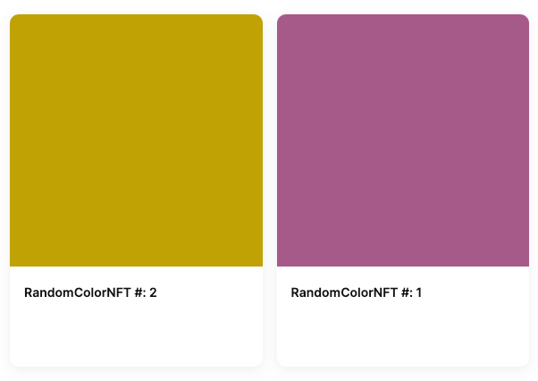

Many NFTs are dependent on offchain metadata and images. Some use immutable storage locations, such as [IPFS]. Others use traditional web locations, and many of these allow the owner of the contract to modify the URL returned by a contract when a site or user attempts to retrieve the location of the token art and metadata. This power isn't inherently bad, because we probably want someone to be able to fix the contract if the storage location goes down. However, it does introduce a requirement to trust the contract owner.

In this tutorial, we'll show you how to do this to create a simple NFT that is fully onchain. This contract is used in our tutorials for [Thirdweb and Unreal - NFT Items] and the [Coinbase Smart Wallet].

The result of this tutorial is used in other tutorials. [Below], you can find the complete contract and ABI. Feel free to use it if you're working on one of those and don't want to get sidetracked.

---

## Objectives

By the end of this tutorial you should be able to:

- Programmatically generate and return json metadata for ERC-721 tokens
- Deterministically construct unique SVG art in a smart contract
- Generate deterministic, pseudorandom numbers

---

## Prerequisites

### ERC-721 Tokens

This tutorial assumes that you are able to write, test, and deploy your own ERC-721 tokens using the Solidity programming language. If you need to learn that first, check out our content in [Base Camp] or the sections specific to [ERC-721 Tokens]!

### Vector Art

You'll need some familiarity with the SVG art format and a basic level of ability to edit and manipulate vector art. If you don't have this, find an artist friend and collaborate!

---

## Building the Contract

Start by setting up an [OpenZeppelin ERC-721] contract. You'll need to set up a `mintTo` function that accepts the address that should receive the NFT.

```solidity
// SPDX-License-Identifier: UNLICENSED
pragma solidity ^0.8.24;

import "hardhat/console.sol";
import "@openzeppelin/contracts/token/ERC721/ERC721.sol";

contract RandomColorNFT is ERC721 {
    uint public counter;

    constructor() ERC721("RandomColorNFT", "RCNFT") {
    }

    function mintTo(address _to) public {
        counter++;
        _safeMint(_to, counter);
    }
}
```

:::info

With the Smart Wallet, `msg.sender` is the users custodial address - where you want to send the NFT. This is not always the case with account abstraction. In some other implementations, `msg.sender` is the smart contract address, even if the user signs in with an EOA. Regardless, it's becoming a common practice to pass the address you want the NFT to go to explicitly.

:::

### Onchain Metadata

Rather than pointing to a `json` file on the traditional internet, you can put your metadata directly in the contract. To do so, first import some helper libraries:

```Solidity
import "@openzeppelin/contracts/utils/Base64.sol";
import "@openzeppelin/contracts/utils/Strings.sol";
```

Next, `override` the functions for `_baseURI` and `tokenURI` to return base 64 encoded json metadata with the appropriate information:

```Solidity
function _baseURI() internal pure override returns (string memory) {
  return "data:application/json;base64,";
}

function tokenURI(uint _tokenId) public view override returns (string memory) {
  if(_tokenId > counter) {
    revert InvalidTokenId(_tokenId);
  }

  string memory json = Base64.encode(
    bytes(
      string(
        abi.encodePacked(
        '{"name": "',
        name(),
        ' #: ',
        Strings.toString(_tokenId),
        '","description": "Random colors are pretty or boring!", "image": "image": "data:image/svg+xml;base64,',
        // TODO...,
        '"}'
        )
      )
    )
  );

  return string(abi.encodePacked(_baseURI(), json));
}
```

**Be very careful** setting up the single and double quotes above and be sure to test this function to make sure the result is valid json metadata. An error here will break the NFT and it won't show up correctly in wallets or marketplaces!

### Onchain SVG Image

For this NFT, the art will consist of a simple onchain SVG containing a square with a pseudo-randomly chosen color. Check out our tutorial on [Building Onchain NFTs] if you want to try something more complicated.

Start by scaffolding out a `render` function:

```solidity
function render(uint _tokenId) public view returns (string memory) {
  return string(
    abi.encodePacked(
      "<svg xmlns='http://www.w3.org/2000/svg' viewBox='0 0 1024 1024'>",
        // TODO: add a rectangle with a random color fill
      "</svg>"
    )
  );
}
```

Rectangles in SVG images are created with the [rect] element. To cover the whole background, you can set the width and height to the size of the `viewbox`. Although not listed directly in the MDN page for rectangles, you can add a `fill` property to add a fill color to any SVG element. You can use color names, or hex codes for colors:

```html
<rect width="100" height="100" fill="#aabbcc" />
```

### Generating a Random Color

Instead of a fixed color, your design calls for a unique color for each NFT. Add a function to generate this:

```solidity
// Function to generate a random color hex code
function generateRandomColor() public view returns (string memory) {
  // Generate a pseudo-random number using block.prevrandao
  uint256 randomNum = uint256(keccak256(abi.encodePacked(block.prevrandao, block.timestamp, msg.sender)));

  // Extract RGB components from the random number
  bytes memory colorBytes = new bytes(3);
  colorBytes[0] = bytes1(uint8(randomNum >> 16));
  colorBytes[1] = bytes1(uint8(randomNum >> 8));
  colorBytes[2] = bytes1(uint8(randomNum));

  // Convert RGB components to hex string
  string memory colorHex = string(abi.encodePacked(
    "#",
    toHexDigit(uint8(colorBytes[0]) >> 4),
    toHexDigit(uint8(colorBytes[0]) & 0x0f),
    toHexDigit(uint8(colorBytes[1]) >> 4),
    toHexDigit(uint8(colorBytes[1]) & 0x0f),
    toHexDigit(uint8(colorBytes[2]) >> 4),
    toHexDigit(uint8(colorBytes[2]) & 0x0f)
  ));

  return colorHex;
}

// Helper function to convert a uint8 to a hex character
function toHexDigit(uint8 d) internal pure returns (bytes1) {
  if (d < 10) {
    return bytes1(uint8(bytes1('0')) + d);
  } else {
    return bytes1(uint8(bytes1('a')) + d - 10);
  }
}
```

:::caution

Remember, randomness generated using onchain information is not fully secure. A determined attacker could manipulate a block to compromise your contract. That being said, `prevrandao` is a passable solution for anything not involving a large amount of money.

:::

### Saving the Color to the NFT

You'll need to generate this color with the function, then save it in a way that it can be retrieved when the `tokenURI` function is called. Add a mapping to store this relationship:

```solidity
mapping (uint => string) public tokenIdToColor;
```

Then set the color when the token is minted:

```solidity
function mintTo(address _to) public {
  counter++;
  _safeMint(_to, counter);
  tokenIdToColor[counter] = generateRandomColor();
}
```

### Finishing the `tokenURI` Function

Update your `render` function to generate the SVG.

```solidity
function render(uint _tokenId) public view returns (string memory) {
  return string(
    abi.encodePacked(
      "<svg xmlns='http://www.w3.org/2000/svg' viewBox='0 0 1024 1024'>",
      "<rect width='1024' height='1024' fill='",
      tokenIdToColor[_tokenId],
      "' />",
      "</svg>"
    )
  );
}
```

Then update your `tokenURI` function to use it, and return the SVG as base64 encoded data:

```solidity
function tokenURI(uint _tokenId) public view override returns (string memory) {
  if(_tokenId > counter) {
    revert InvalidTokenId(_tokenId);
  }

  string memory json = Base64.encode(
    bytes(
      string(
        abi.encodePacked(
        '{"name": "',
        name(),
        ' #: ',
        Strings.toString(_tokenId),
        '","description": "Random colors are pretty or boring!", "image": "data:image/svg+xml;base64,',
        Base64.encode(bytes(render(_tokenId))),
        '"}'
        )
      )
    )
  );

  return string(abi.encodePacked(_baseURI(), json));
}
```

### List of NFTs Owned

Most ERC-721 implementations don't contain an on-contract method to retrieve a list of **all** the NFTs owned by a single address. The reason for this is that it costs extra gas go manage this list, and the information can be retrieved by using read-only services that analyze blockchain data.

However, gas prices are getting lower, and adding this data to your contract will reduce your dependency on third-party APIs.

To track ownership in-contract, first import `EnumerableSet` from OpenZeppelin:

```solidity
import "@openzeppelin/contracts/utils/structs/EnumerableSet.sol";
```

Then enable it for `uint` sets and add a mapping to relate `addresses` to token ids.

```solidity
// Inside the RandomColorNFT contract
using EnumerableSet for EnumerableSet.UintSet;

mapping (address => EnumerableSet.UintSet) tokensOwned;
```

Finally, utilize the `_update` function to handle changes of ownership, including minting:

```solidity
function _update(address to, uint256 tokenId, address auth) internal override(ERC721) returns(address) {
  // Only remove the token if it is not being minted
  if (tokenId != counter){
    tokensOwned[auth].remove(tokenId);
  }
  tokensOwned[to].add(tokenId);

  return super._update(to, tokenId, auth);
}
```

Now that you have a list of NFTs owned by an address, you can add a function to retrieve all of them. While you're at it, add the json metadata for each token. Doing so lets you get the complete list of NFTs **and** their metadata for just one RPC call!

```solidity
function getNFftsOwned(address owner) public view returns (TokenAndMetatdata[] memory) {
  TokenAndMetatdata[] memory tokens = new TokenAndMetatdata[](tokensOwned[owner].length());
  for (uint i = 0; i < tokensOwned[owner].length(); i++) {
    uint tokenId = tokensOwned[owner].at(i);
    tokens[i] = TokenAndMetatdata(tokenId, tokenURI(tokenId));
  }
  return tokens;
}
```

### Testing

Write some local tests, then [deploy] and test your contract. It can be very tricky to get all the commas, brackets, and single, and double quotes all lined up properly. The surest way to make sure it is working is to check the collection on [Testnet Opensea] or similar.

Remember, it can take a few minutes for them to register and add the collection. If the metadata or image don't show up correctly, use [Sepolia Basescan] to pull the `tokenURI` and an online or console base64 decoder to decode and check the json metadata and SVG image.



## Conclusion

In this lesson, you learned how to make a simple NFT that is entirely onchain. You generated an SVG with a random color, and set up the JSON metadata for your NFT -- entirely onchain! Next, check out our tutorial for [Complex Onchain NFTs]!

## Random Color NFT Contract

```solidity
// SPDX-License-Identifier: UNLICENSED
pragma solidity ^0.8.24;

import "hardhat/console.sol";
import "@openzeppelin/contracts/token/ERC721/ERC721.sol";
import "@openzeppelin/contracts/utils/Base64.sol";
import "@openzeppelin/contracts/utils/Strings.sol";
import "@openzeppelin/contracts/utils/structs/EnumerableSet.sol";

contract RandomColorNFT is ERC721 {
  using EnumerableSet for EnumerableSet.UintSet;

  mapping (address => EnumerableSet.UintSet) tokensOwned;

  uint public counter;

  mapping (uint => string) public tokenIdToColor;

  error InvalidTokenId(uint tokenId);
  error OnlyOwner(address);

  constructor() ERC721("RandomColorNFT", "RCNFT") {
  }

  function mintTo(address _to) public {
    counter++;
    _safeMint(_to, counter);
    tokenIdToColor[counter] = generateRandomColor();
  }

  struct TokenAndMetatdata {
    uint tokenId;
    string metadata;
  }

  function getNftsOwned(address owner) public view returns (TokenAndMetatdata[] memory) {
    TokenAndMetatdata[] memory tokens = new TokenAndMetatdata[](tokensOwned[owner].length());
    for (uint i = 0; i < tokensOwned[owner].length(); i++) {
      uint tokenId = tokensOwned[owner].at(i);
      tokens[i] = TokenAndMetatdata(tokenId, tokenURI(tokenId));
    }
    return tokens;
  }

  function shuffleColor(uint _tokenId) public {
    if(_tokenId > counter) {
      revert InvalidTokenId(_tokenId);
    }
    if(ownerOf(_tokenId) != msg.sender) {
      revert OnlyOwner(msg.sender);
    }
    tokenIdToColor[_tokenId] = generateRandomColor();
  }

  function _update(address to, uint256 tokenId, address auth) internal override(ERC721) returns(address) {
    // Only remove the token if it is not being minted
    if (tokenId != counter){
      tokensOwned[auth].remove(tokenId);
    }
    tokensOwned[to].add(tokenId);

    return super._update(to, tokenId, auth);
  }

  function _baseURI() internal pure override returns (string memory) {
    return "data:application/json;base64,";
  }

  function tokenURI(uint _tokenId) public view override returns (string memory) {
    if(_tokenId > counter) {
      revert InvalidTokenId(_tokenId);
    }

    string memory json = Base64.encode(
      bytes(
        string(
          abi.encodePacked(
          '{"name": "',
          name(),
          ' #: ',
          Strings.toString(_tokenId),
          '","description": "Random colors are pretty or boring!", "image": "data:image/svg+xml;base64,',
          Base64.encode(bytes(render(_tokenId))),
          '"}'
          )
        )
      )
    );

    return string(abi.encodePacked(_baseURI(), json));
  }

  function render(uint _tokenId) public view returns (string memory) {
    return string(
      abi.encodePacked(
        "<svg xmlns='http://www.w3.org/2000/svg' viewBox='0 0 1024 1024'>",
        "<rect width='1024' height='1024' fill='",
        tokenIdToColor[_tokenId],
        "' />",
        "</svg>"
      )
    );
  }

  // Function to generate a random color hex code
  function generateRandomColor() public view returns (string memory) {
    // Generate a pseudo-random number using block.prevrandao
    uint256 randomNum = uint256(keccak256(abi.encodePacked(block.prevrandao, block.timestamp, msg.sender)));

    // Extract RGB components from the random number
    bytes memory colorBytes = new bytes(3);
    colorBytes[0] = bytes1(uint8(randomNum >> 16));
    colorBytes[1] = bytes1(uint8(randomNum >> 8));
    colorBytes[2] = bytes1(uint8(randomNum));

    // Convert RGB components to hex string
    string memory colorHex = string(abi.encodePacked(
      "#",
      toHexDigit(uint8(colorBytes[0]) >> 4),
      toHexDigit(uint8(colorBytes[0]) & 0x0f),
      toHexDigit(uint8(colorBytes[1]) >> 4),
      toHexDigit(uint8(colorBytes[1]) & 0x0f),
      toHexDigit(uint8(colorBytes[2]) >> 4),
      toHexDigit(uint8(colorBytes[2]) & 0x0f)
    ));

    return colorHex;
  }

  // Helper function to convert a uint8 to a hex character
  function toHexDigit(uint8 d) internal pure returns (bytes1) {
    if (d < 10) {
      return bytes1(uint8(bytes1('0')) + d);
    } else {
      return bytes1(uint8(bytes1('a')) + d - 10);
    }
  }
}
```

```json
{
  "address": "0x59c35beE5eAdeEDDc2c34d419459243bD70AFD72",
  "abi": [
    {
      "inputs": [],
      "stateMutability": "nonpayable",
      "type": "constructor"
    },
    {
      "inputs": [
        {
          "internalType": "address",
          "name": "sender",
          "type": "address"
        },
        {
          "internalType": "uint256",
          "name": "tokenId",
          "type": "uint256"
        },
        {
          "internalType": "address",
          "name": "owner",
          "type": "address"
        }
      ],
      "name": "ERC721IncorrectOwner",
      "type": "error"
    },
    {
      "inputs": [
        {
          "internalType": "address",
          "name": "operator",
          "type": "address"
        },
        {
          "internalType": "uint256",
          "name": "tokenId",
          "type": "uint256"
        }
      ],
      "name": "ERC721InsufficientApproval",
      "type": "error"
    },
    {
      "inputs": [
        {
          "internalType": "address",
          "name": "approver",
          "type": "address"
        }
      ],
      "name": "ERC721InvalidApprover",
      "type": "error"
    },
    {
      "inputs": [
        {
          "internalType": "address",
          "name": "operator",
          "type": "address"
        }
      ],
      "name": "ERC721InvalidOperator",
      "type": "error"
    },
    {
      "inputs": [
        {
          "internalType": "address",
          "name": "owner",
          "type": "address"
        }
      ],
      "name": "ERC721InvalidOwner",
      "type": "error"
    },
    {
      "inputs": [
        {
          "internalType": "address",
          "name": "receiver",
          "type": "address"
        }
      ],
      "name": "ERC721InvalidReceiver",
      "type": "error"
    },
    {
      "inputs": [
        {
          "internalType": "address",
          "name": "sender",
          "type": "address"
        }
      ],
      "name": "ERC721InvalidSender",
      "type": "error"
    },
    {
      "inputs": [
        {
          "internalType": "uint256",
          "name": "tokenId",
          "type": "uint256"
        }
      ],
      "name": "ERC721NonexistentToken",
      "type": "error"
    },
    {
      "inputs": [
        {
          "internalType": "uint256",
          "name": "tokenId",
          "type": "uint256"
        }
      ],
      "name": "InvalidTokenId",
      "type": "error"
    },
    {
      "inputs": [
        {
          "internalType": "address",
          "name": "",
          "type": "address"
        }
      ],
      "name": "OnlyOwner",
      "type": "error"
    },
    {
      "anonymous": false,
      "inputs": [
        {
          "indexed": true,
          "internalType": "address",
          "name": "owner",
          "type": "address"
        },
        {
          "indexed": true,
          "internalType": "address",
          "name": "approved",
          "type": "address"
        },
        {
          "indexed": true,
          "internalType": "uint256",
          "name": "tokenId",
          "type": "uint256"
        }
      ],
      "name": "Approval",
      "type": "event"
    },
    {
      "anonymous": false,
      "inputs": [
        {
          "indexed": true,
          "internalType": "address",
          "name": "owner",
          "type": "address"
        },
        {
          "indexed": true,
          "internalType": "address",
          "name": "operator",
          "type": "address"
        },
        {
          "indexed": false,
          "internalType": "bool",
          "name": "approved",
          "type": "bool"
        }
      ],
      "name": "ApprovalForAll",
      "type": "event"
    },
    {
      "anonymous": false,
      "inputs": [
        {
          "indexed": true,
          "internalType": "address",
          "name": "from",
          "type": "address"
        },
        {
          "indexed": true,
          "internalType": "address",
          "name": "to",
          "type": "address"
        },
        {
          "indexed": true,
          "internalType": "uint256",
          "name": "tokenId",
          "type": "uint256"
        }
      ],
      "name": "Transfer",
      "type": "event"
    },
    {
      "inputs": [
        {
          "internalType": "address",
          "name": "to",
          "type": "address"
        },
        {
          "internalType": "uint256",
          "name": "tokenId",
          "type": "uint256"
        }
      ],
      "name": "approve",
      "outputs": [],
      "stateMutability": "nonpayable",
      "type": "function"
    },
    {
      "inputs": [
        {
          "internalType": "address",
          "name": "owner",
          "type": "address"
        }
      ],
      "name": "balanceOf",
      "outputs": [
        {
          "internalType": "uint256",
          "name": "",
          "type": "uint256"
        }
      ],
      "stateMutability": "view",
      "type": "function"
    },
    {
      "inputs": [],
      "name": "counter",
      "outputs": [
        {
          "internalType": "uint256",
          "name": "",
          "type": "uint256"
        }
      ],
      "stateMutability": "view",
      "type": "function"
    },
    {
      "inputs": [],
      "name": "generateRandomColor",
      "outputs": [
        {
          "internalType": "string",
          "name": "",
          "type": "string"
        }
      ],
      "stateMutability": "view",
      "type": "function"
    },
    {
      "inputs": [
        {
          "internalType": "uint256",
          "name": "tokenId",
          "type": "uint256"
        }
      ],
      "name": "getApproved",
      "outputs": [
        {
          "internalType": "address",
          "name": "",
          "type": "address"
        }
      ],
      "stateMutability": "view",
      "type": "function"
    },
    {
      "inputs": [
        {
          "internalType": "address",
          "name": "owner",
          "type": "address"
        }
      ],
      "name": "getNFftsOwned",
      "outputs": [
        {
          "components": [
            {
              "internalType": "uint256",
              "name": "tokenId",
              "type": "uint256"
            },
            {
              "internalType": "string",
              "name": "metadata",
              "type": "string"
            }
          ],
          "internalType": "struct RandomColorNFT.TokenAndMetatdata[]",
          "name": "",
          "type": "tuple[]"
        }
      ],
      "stateMutability": "view",
      "type": "function"
    },
    {
      "inputs": [
        {
          "internalType": "address",
          "name": "owner",
          "type": "address"
        },
        {
          "internalType": "address",
          "name": "operator",
          "type": "address"
        }
      ],
      "name": "isApprovedForAll",
      "outputs": [
        {
          "internalType": "bool",
          "name": "",
          "type": "bool"
        }
      ],
      "stateMutability": "view",
      "type": "function"
    },
    {
      "inputs": [
        {
          "internalType": "address",
          "name": "_to",
          "type": "address"
        }
      ],
      "name": "mintTo",
      "outputs": [],
      "stateMutability": "nonpayable",
      "type": "function"
    },
    {
      "inputs": [],
      "name": "name",
      "outputs": [
        {
          "internalType": "string",
          "name": "",
          "type": "string"
        }
      ],
      "stateMutability": "view",
      "type": "function"
    },
    {
      "inputs": [
        {
          "internalType": "uint256",
          "name": "tokenId",
          "type": "uint256"
        }
      ],
      "name": "ownerOf",
      "outputs": [
        {
          "internalType": "address",
          "name": "",
          "type": "address"
        }
      ],
      "stateMutability": "view",
      "type": "function"
    },
    {
      "inputs": [
        {
          "internalType": "uint256",
          "name": "_tokenId",
          "type": "uint256"
        }
      ],
      "name": "render",
      "outputs": [
        {
          "internalType": "string",
          "name": "",
          "type": "string"
        }
      ],
      "stateMutability": "view",
      "type": "function"
    },
    {
      "inputs": [
        {
          "internalType": "address",
          "name": "from",
          "type": "address"
        },
        {
          "internalType": "address",
          "name": "to",
          "type": "address"
        },
        {
          "internalType": "uint256",
          "name": "tokenId",
          "type": "uint256"
        }
      ],
      "name": "safeTransferFrom",
      "outputs": [],
      "stateMutability": "nonpayable",
      "type": "function"
    },
    {
      "inputs": [
        {
          "internalType": "address",
          "name": "from",
          "type": "address"
        },
        {
          "internalType": "address",
          "name": "to",
          "type": "address"
        },
        {
          "internalType": "uint256",
          "name": "tokenId",
          "type": "uint256"
        },
        {
          "internalType": "bytes",
          "name": "data",
          "type": "bytes"
        }
      ],
      "name": "safeTransferFrom",
      "outputs": [],
      "stateMutability": "nonpayable",
      "type": "function"
    },
    {
      "inputs": [
        {
          "internalType": "address",
          "name": "operator",
          "type": "address"
        },
        {
          "internalType": "bool",
          "name": "approved",
          "type": "bool"
        }
      ],
      "name": "setApprovalForAll",
      "outputs": [],
      "stateMutability": "nonpayable",
      "type": "function"
    },
    {
      "inputs": [
        {
          "internalType": "uint256",
          "name": "_tokenId",
          "type": "uint256"
        }
      ],
      "name": "shuffleColor",
      "outputs": [],
      "stateMutability": "nonpayable",
      "type": "function"
    },
    {
      "inputs": [
        {
          "internalType": "bytes4",
          "name": "interfaceId",
          "type": "bytes4"
        }
      ],
      "name": "supportsInterface",
      "outputs": [
        {
          "internalType": "bool",
          "name": "",
          "type": "bool"
        }
      ],
      "stateMutability": "view",
      "type": "function"
    },
    {
      "inputs": [],
      "name": "symbol",
      "outputs": [
        {
          "internalType": "string",
          "name": "",
          "type": "string"
        }
      ],
      "stateMutability": "view",
      "type": "function"
    },
    {
      "inputs": [
        {
          "internalType": "uint256",
          "name": "",
          "type": "uint256"
        }
      ],
      "name": "tokenIdToColor",
      "outputs": [
        {
          "internalType": "string",
          "name": "",
          "type": "string"
        }
      ],
      "stateMutability": "view",
      "type": "function"
    },
    {
      "inputs": [
        {
          "internalType": "uint256",
          "name": "_tokenId",
          "type": "uint256"
        }
      ],
      "name": "tokenURI",
      "outputs": [
        {
          "internalType": "string",
          "name": "",
          "type": "string"
        }
      ],
      "stateMutability": "view",
      "type": "function"
    },
    {
      "inputs": [
        {
          "internalType": "address",
          "name": "from",
          "type": "address"
        },
        {
          "internalType": "address",
          "name": "to",
          "type": "address"
        },
        {
          "internalType": "uint256",
          "name": "tokenId",
          "type": "uint256"
        }
      ],
      "name": "transferFrom",
      "outputs": [],
      "stateMutability": "nonpayable",
      "type": "function"
    }
  ]
}
```

---

[Base Camp]: https://base.org.camp
[ERC-721 Tokens]: https://docs.base.org/base-camp/docs/erc-721-token/erc-721-standard-video
[IPFS]: https://ipfs.tech/
[Base64]: https://en.wikipedia.org/wiki/Base64
[Hardhat and Hardhat Deploy]: https://docs.base.org/base-camp/docs/hardhat-deploy/hardhat-deploy-sbs
[testnet version of Opensea]: https://testnets.opensea.io/
[sample project]: https://github.com/base-org/land-sea-and-sky
[Sample Art]: https://github.com/base-org/land-sea-and-sky/tree/master/Final_SVGs
[Basescan]: https://sepolia.basescan.org/
[Thirdweb and Unreal - NFT Items]: ./thirdweb-unreal-nft-items
[Coinbase Smart Wallet]: ./coinbase-smart-wallet
[Below]: #random-color-nft-contract
[Complex Onchain NFTs]: ./complex-onchain-nfts
