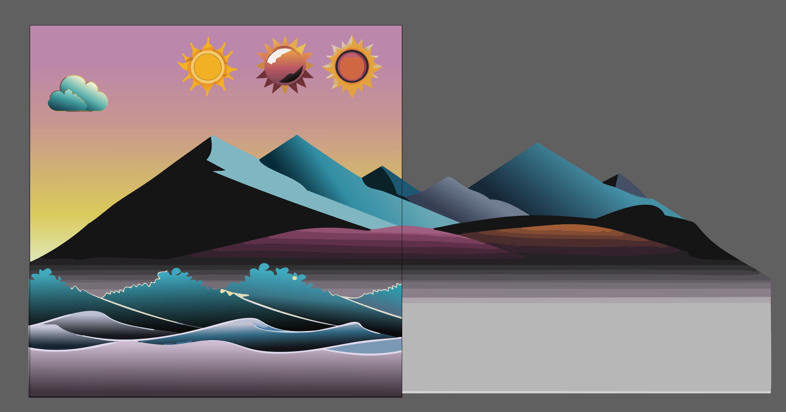
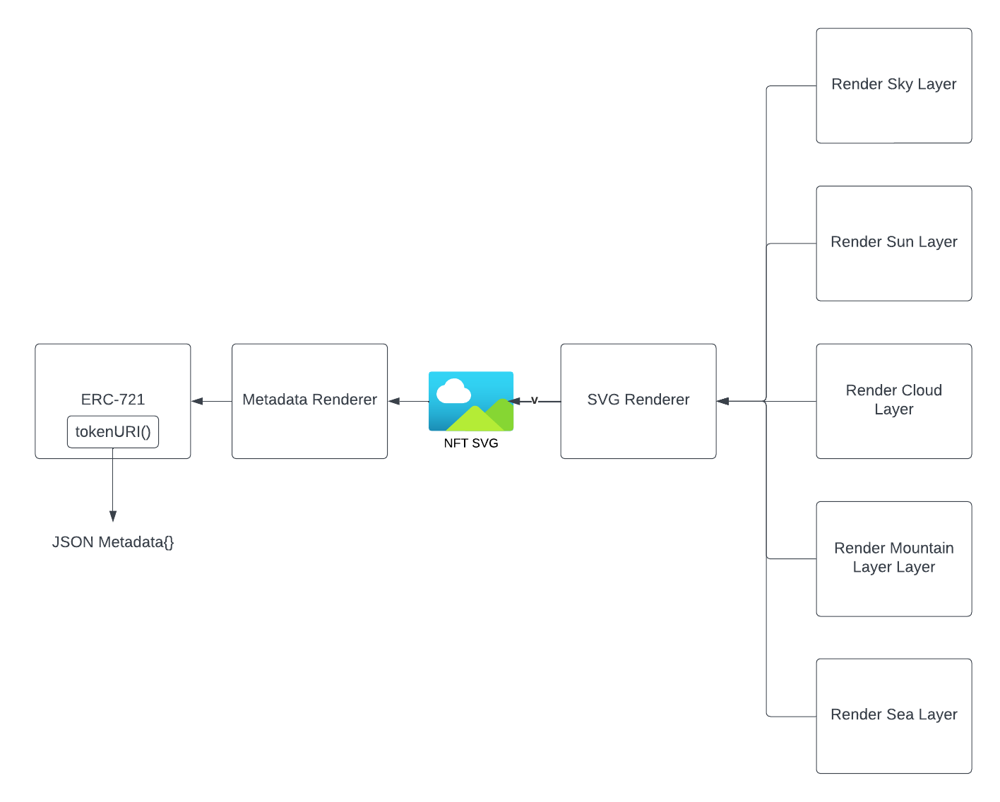
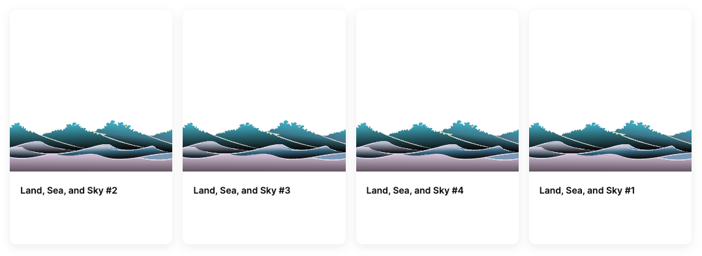
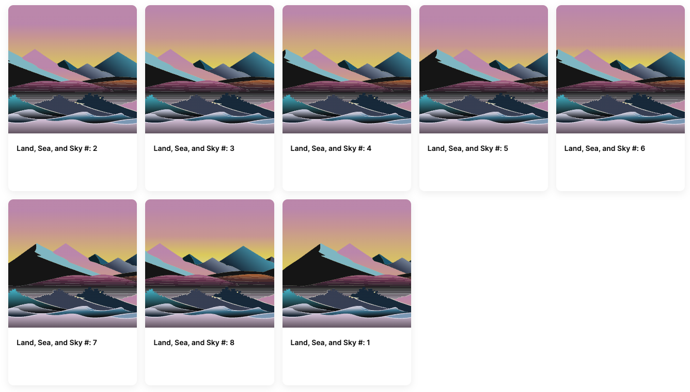

Many NFTs are dependent on offchain metadata and images. Some use immutable storage locations, such as [IPFS]. Others use traditional web locations, and many of these allow the owner of the contract to modify the URL returned by a contract when a site or user attempts to retrieve the location of the token art and metadata. This power isn't inherently bad, because we probably want someone to be able to fix the contract if the storage location goes down. However, it does introduce a requirement to trust the contract owner.

Although challenging, it is possible to write a smart contract that contains all the necessary logic and data to generate json metadata and SVG images, entirely onchain. It **will** be expensive to deploy, but will be as cheap as simpler contracts to mint!

In this tutorial, we'll show you how to do this to create your own fully-onchain art project, similar to our [sample project].

---

## Objectives

By the end of this tutorial you should be able to:

- Programmatically generate and return json metadata for ERC-721 tokens
- Deterministically construct unique SVG art in a smart contract
- Generate deterministic, pseudorandom numbers

---

## Prerequisites

### ERC-721 Tokens

This tutorial assumes that you are able to write, test, and deploy your own ERC-721 tokens using the Solidity programming language. If you need to learn that first, check out our content in [Base Learn] or the sections specific to [ERC-721 Tokens]!

### Vector Art

You'll need some familiarity with the SVG art format and a basic level of ability to edit and manipulate vector art. If you don't have this, find an artist friend and collaborate!

---

## Creating the Art Assets

To start, you'll need to build a few vector art assets and mock up an example of what your NFT might look like. Later, you'll cut these up and format them in a way that your smart contract will use to assemble unique NFTs for each minter.

The mockup needs to have all of the elements you plan to have in the NFT, and you should be able to manually move things around or change colors to make it so that you can create the range of variation you want. For example:

- A gradient sky in which the colors are randomized
- One of three styles of sun, always in the same spot in the upper right corner
- One to five clouds placed randomly in the upper half of the canvas
- A wide mountain ridge that will always be in the middle, but slide side to side to show a different part for each NFT
- An ocean in the foreground that is always the same

If you are an artist, or are working with one, you can use the vector drawing tool of your choice to assemble your mockup. If not, you can use a number of stock art or AI tool options to assist you. If you do, make sure you understand any relevant laws or terms of service!

You can also work from ours: [Sample Art]

Either way, you should end up with something similar to this:



## The Art of Making it Fit

You'll notice that the SVG is probably way too big to be placed in a smart contract. The example is 103 KB, so you'll have to be clever to make this work.

You'll accomplish this task by splitting each element out of the mockup and deploying them into separate smart contracts. To do so, individually export each element, and make sure that the exported pieces are no bigger than about 15 KB. That way, you'll have enough space to fit each piece within the 24KiB limit for compiled bytecode.

If you're working with the sample, you'll end up with individual SVGs for:

- Sun 1: 9 KB
- Sun 2: 9 KB
- Sun 3: 9 KB
- Ocean: 17 KB
- Mountain: 14 KB
- Cloud: 6 KB
- Sky: 802 bytes

If you don't have the tools to do this, you can find these files here: [Sample Art]

## Contract Architecture

You'll need to build and deploy a number of contracts for this project. They'll be organized in this architecture:



Deploying this many contracts will have a cost associated with it, but once they're deployed, this contract will cost the same as any other NFT contract. Remember, `pure` and `view` functions called outside the blockchain don't cost any gas. This means that you can use multiple contracts to assemble a relatively large graphic without additional costs!

## Building the Contracts

Create a new project using the toolkit of your choice, and add a contract called `LandSeaSkyNFT`. Import OpenZeppelin's ERC-721, inherit from it, and set it up with the constructor, a mint function, and a counter to keep track of the token ID:

```solidity
// SPDX-License-Identifier: UNLICENSED
pragma solidity ^0.8.20;

import "hardhat/console.sol";
import "@openzeppelin/contracts/token/ERC721/ERC721.sol";

contract LandSeaSkyNFT is ERC721 {
    uint public counter;

    constructor() ERC721("Land, Sea, and Sky", "LSS") {}

    function mint() public {
        counter++;
        _safeMint(msg.sender, counter);
    }
}
```

### Overriding the `_baseURI()` Function

Normally, you'd override `_baseURI()` with the base URL for the location you select to keep your NFT metadata. This could be a website, IPFS folder, or many other possible locations.

Since this contract will be generating the .json file directly, instead set it to indicate this to the browser:

```solidity
function _baseURI() internal pure override returns (string memory) {
  return "data:application/json;base64,";
}
```

### Importing the Base64 Library

As indicated above, you'll be returning the json metadata in [Base64] format. OpenZeppelin has a utility contract to do this. You'll also need the `Strings` library. Go ahead and import them:

```solidity
import "@openzeppelin/contracts/utils/Base64.sol";
import "@openzeppelin/contracts/utils/Strings.sol";
```

:::info

Base64 allows the transport of binary data over the web in a reliable way. It is not a compression algorithm, and actually increased the data size by a 4/3 ratio.

:::

### Planning the override for the `tokenURI()` Function

Next, set up your `tokenURI` function override. You'll need to write some other contracts to make this work, but you can write most of the code and stub out a plan for the rest to:

- Check and ensure the token ID exists
- Compile the json metadata for the token, including:
  - The `"name"` of the NFT
  - A `"description"`
  - The `"image"`
- Base64 encode the above, combine it with the `_baseURI` and return it.

```solidity
function tokenURI(uint _tokenId) public view override returns (string memory) {
  if(_tokenId > counter) {
    revert InvalidTokenId(_tokenId); // Don't forget to add the error above!
  }

  string memory json = Base64.encode(
    bytes(
      string(
        abi.encodePacked(
          '{"name": "Land, Sea, and Sky #: ',
          Strings.toString(_tokenId),
          '", "description": "Land, Sea, and Sky is a collection of generative art pieces stored entirely onchain.", "image": "data:image/SVG+xml;base64,',
          "TODO: Build the SVG with the token ID as the seed",
          '"}'
        )
      )
    )
  );

  return string(abi.encodePacked(_baseURI(), json));
}
```

:::caution

Getting the quotes and commas correct when the json is broken apart like this is challenging. When debugging, look here first!

:::

### Test Your Progress

Test your function by writing a simple test to mint an NFT, then call and log the output of the `tokenURI` function. You should get something similar to:

```text
string: data:application/json;base64,eyJuYW1lIjogIkxhbmQsIFNlYSwgYW5kIFNreSAjMSIsICJkZXNjcmlwdGlvbiI6ICJMYW5kLCBTZWEsIGFuZCBTa3kgaXMgYSBjb2xsZWN0aW9uIG9mIGdlbmVyYXRpdmUgYXJ0IHBpZWNlcyBzdG9yZWQgZW50aXJlbHkgb25jaGFpbi4iLCAiaW1hZ2UiOiAiZGF0YTppbWFnZS9zdmcreG1sO2Jhc2U2NCxUT0RPOiBCdWlsZCB0aGUgU1ZHIHdpdGggdGhlIHRva2VuIElEIGFzIHRoZSBzZWVkIn0=
```

To see if it worked, you'll need to use a manual method to decode the base64 data; everything after the comma:

```text
eyJuYW1lIjogIkxhbmQsIFNlYSwgYW5kIFNreSAjMSIsICJkZXNjcmlwdGlvbiI6ICJMYW5kLCBTZWEsIGFuZCBTa3kgaXMgYSBjb2xsZWN0aW9uIG9mIGdlbmVyYXRpdmUgYXJ0IHBpZWNlcyBzdG9yZWQgZW50aXJlbHkgb25jaGFpbi4iLCAiaW1hZ2UiOiAiZGF0YTppbWFnZS9zdmcreG1sO2Jhc2U2NCxUT0RPOiBCdWlsZCB0aGUgU1ZHIHdpdGggdGhlIHRva2VuIElEIGFzIHRoZSBzZWVkIn0=
```

You can use the terminal: `echo -n '<string to decode>' | base64 --decode`

Do so, and you'll get:

```text
{"name": "Land, Sea, and Sky #: 1", "description": "Land, Sea, and Sky is a collection of generative art pieces stored entirely onchain.", "image": "data:image/SVG+xml;base64,TODO: Build the SVG with the token ID as the seed"}
```

## Building the SVG

Next, you need to build logic to compile a real, working SVG from the pieces you've saved. You'll also need to add some variation based on the ID of the NFT.

### SVG Renderer Contract

Add a new file and contract called `SVGRenderer`. It doesn't need a constructor, but it will need the `Strings` library:

```solidity
// SPDX-License-Identifier: UNLICENSED
pragma solidity ^0.8.20;

import "hardhat/console.sol";
import "@openzeppelin/contracts/utils/Strings.sol";

contract SVGRenderer {

}
```

Open the exemplar SVG in a code editor, and using it as an example, build out a function that uses `abi.encodePacked` to build everything from the SVG **except** the actual art. That's much too big for one contract, so add stubs instead.

Depending on the tool you used to make the SVG, there may be unneeded extras you can remove from these lines. You also **don't** need the items in `<defs>` or `<styles>`. You'll take advantage of the flexibility of the format to include those in the pieces returned by the supporting contract.

```solidity
function render(uint _tokenId) public view returns (string memory) {
  return string(
    abi.encodePacked(
      "<SVG xmlns='http://www.w3.org/2000/SVG' viewBox='0 0 1024 1024'>",
      // TODO: Add the clouds,
      // TODO: Add the sun,
      // TODO: Add the land,
      // TODO: Add the sea,
      // TODO: Add the background,
      "</SVG>"
    )
  );
}
```

### Rendering the Sea

The sea element of this NFT will be the same for all NFTs, so it makes sense to write that contract first. Create it called, `SeaRenderer`, with a function called `render`. The `<g>` element is the root of the different pieces of the SVG, so add that and a stub for the rest.

```solidity
// SPDX-License-Identifier: UNLICENSED
pragma solidity ^0.8.20;

import "hardhat/console.sol";
import "@openzeppelin/contracts/utils/Strings.sol";

contract SeaRenderer {
  function render() public pure returns (string memory) {
    return // TODO: Render the sea
  }
}
```

The next part is tricky, and a little messy. You'll need to combine parts of the individually exported SVG that has the sea art and all of its properties with the position data for this part of the art from the exemplar SVG. You'll then need to flatten it to a single line, and add it as a string constant.

Start by opening the Ocean SVG. Change the viewBox to `viewBox="0 0 1024 1024"`. Move the `<defs>` and `<scripts>` tag inside of the `<g>` tag. Open the SVG in the browser to make sure it hasn't broken.

Next, delete the `id` and `data-name` from the top level `<g>` and experiment with the `transform="translate(20,2.5)"` property to move the art back down to the bottom of the viewport.

With the sample art, `<g transform="translate(0,700)">` should work.

The last edits you need to make are **critical** - do a find/replace to change all of the `cls-1` and similar classnames, to `cls-land-1`! Otherwise, the classes will override one another and nothing will be the right color. Also find all instances of `linear-gradient` and do the same.

**Make sure** you change both the definitions, and where they're called!

Finally, use the tool of your choice to minify **only** the outermost `<g>` tag and its contents. This will flatten the code to a single line and remove extra empty character spaces. Doing so makes it easier to add to your contract, and makes the data smaller. Add it as a constant string to `SeaRenderer.sol`:

```solidity
string constant SVG = '<g transform="translate(0,700)"<way more code></g>';
```

You may need to do a find/replace and ensure you're using only one type of quote in the SVG.

Replace your `TODO` with the constant.

```solidity
// SPDX-License-Identifier: UNLICENSED
pragma solidity ^0.8.20;

import "hardhat/console.sol";
import "@openzeppelin/contracts/utils/Strings.sol";

string constant SVG = <A very long string!>;

contract SeaRenderer {
  function render() public pure returns (string memory) {
    return SVG;
  }
}
```

Test this function independently and make sure that if you paste the content inside a set of `<SVG>` tags, it renders as expected!

### Calling SeaRenderer

Return to `SVGRenderer.sol`. Add an `interface` for the `SeaRenderer`. All of your renderer contracts will have a function called `render` that either takes a `uint _tokenId`, or no arguments, and returns a string. Because of this, you can use a single interface for all the render contracts:

```solidity
interface ISVGPartRenderer {
  function render() external pure returns (string memory);
  function render(uint _tokenId) external pure returns (string memory);
}
```

Add an instance inside the `SVGRenderer` contract for the `SeaRenderer`, and a constructor that takes an address for the `SeaRenderer`:

```solidity
constructor(address _seaRenderer) {
  seaRenderer = ISVGPartRenderer(_seaRenderer);
}
```

Replace `// TODO: Add the sea,` with a call to your external function.

```solidity
function render(uint _tokenId) public view returns (string memory) {
  return string(
    abi.encodePacked(
      "<SVG xmlns='http://www.w3.org/2000/SVG' viewBox='0 0 1024 1024'>",
      // TODO: Add the clouds,
      // TODO: Add the sun,
      // TODO: Add the land,
      seaRenderer.render(),
      // TODO: Add the background,
      "</SVG>"
    )
  );
}
```

## Finishing a First Pass

Return to your `LandSeaSkyNFT` contract and add an `interface` for the `SVGRenderer`.

```solidity
interface ISVGRenderer {
  function render(uint _tokenId) external view returns (string memory);
}
```

Add an instance of it and update the `constructor` to set it:

```
ISVGRenderer SVGRenderer;

constructor(address _SVGRenderer) ERC721("Land, Sea, and Sky", "LSS") {
  SVGRenderer = ISVGRenderer(_SVGRenderer);
}
```

:::info

For testing purposes, it may be easier if you add functions to allow you to change these addresses after deployment. But the whole point of all this work is to make immutable, onchain NFTs, so be sure to delete them before you do your real deployment!

:::

Finally, swap your `TODO` with a line to `Base64.encode` a call to the renderer:

```Solidity
string memory json = Base64.encode(
  bytes(
    string(
      abi.encodePacked(
        '{"name": "Land, Sea, and Sky #: ',
        Strings.toString(tokenId),
        '", "description": "Land, Sea, and Sky is a collection of generative art pieces stored entirely onchain.", "image": "data:image/SVG+xml;base64,',
        Base64.encode(bytes(SVGRenderer.render(tokenId))),
        '"}'
      )
    )
  )
);
```

### Test Deploy

Now is a good time to deploy to testnet and see if this first pass is working as expected. If you're using [Hardhat and Hardhat Deploy], you can use this script:

```tsx
import { HardhatRuntimeEnvironment } from 'hardhat/types';
import { DeployFunction } from 'hardhat-deploy/types';

const func: DeployFunction = async function (hre: HardhatRuntimeEnvironment) {
  const { deployments, getNamedAccounts } = hre;
  const { deploy } = deployments;
  const { deployer } = await getNamedAccounts();

  const SeaRenderer = await deploy('SeaRenderer', {
    from: deployer,
  });

  const SVGRenderer = await deploy('SVGRenderer', {
    from: deployer,
    args: [SeaRenderer.address],
  });

  const LandSeaSkyNFT = await deploy('LandSeaSkyNFT', {
    from: deployer,
    args: [SVGRenderer.address],
  });

  await hre.run('verify:verify', {
    address: LandSeaSkyNFT.address,
    constructorArguments: [SVGRenderer.address],
    contract: 'contracts/LandSeaSkyNFT.sol:LandSeaSkyNFT',
  });
};
export default func;
```

Deploy the contracts to Base Sepolia and verify them, or at least verify `LandSeaSkyNFT` (the above script will do this).

Open the contract in [Basescan], connect with your wallet, and mint some NFTs.

**Wait a few minutes**, then open the [testnet version of Opensea] and look up your contract. It may take several minutes to show up, but when it does, if everything is working you'll see NFTs with the ocean part of the art! Neat!



## Adding the Sky Renderer

Great work! Much of the hardest part is done. All you need to do now is add a renderer for each of the other elements, with the twist that you'll be doing customization inside the SVGs themselves. You'll have to do a little surgery!

### Preparing the SVG

Open the sky SVG in both an editor, and the browser. As with for the sea, the first step is to change the viewport to 1024x1024, move the `<defs>` and `<style>` elements inside the top-level `<g>`, and transform/translate that group to the correct location (0,0 will work!).

Change `cls-1` to `cls-sky-1` in both the definition and where it's used. Add `sky` to the `linear-gradient` as well.

Delete the data and layer information for this group as well. You'll end up with:

```html
<svg xmlns="http://www.w3.org/2000/SVG" viewBox="0 0 1024 1024">
  <g transform="translate(0,0)">
    <defs>
      <style>
        cls-sky-1 {
          fill: url(#linear-gradient-sky);
          stroke-width: 0px;
        }
      </style>
      <linearGradient
        id="linear-gradient-sky"
        x1="511.76"
        y1="10.19"
        x2="512.24"
        y2="865.99"
        gradientTransform="translate(63.89) scale(.88)"
        gradientUnits="userSpaceOnUse"
      >
        <stop offset=".12" stop-color="#c391b4" />
        <stop offset=".34" stop-color="#ce9f9b" />
        <stop offset=".68" stop-color="#dfd061" />
        <stop offset=".96" stop-color="#e3f9f7" />
      </linearGradient>
    </defs>
    <path class="cls-sky-1" d="M1024,0v768.9H0V0h1024Z" />
  </g>
</svg>
```

You have some design choices to make here. You could use deterministically chosen, but essentially random colors to make up the gradient. However, doing so will lead to the vast majority of NFTs having truly bizarre colors that don't look nice and don't look like they belong with the rest of the art.

No one wants their sky to be a mix of cyan, teal, maroon, and brown!

It might be better to add a gentle modification to the existing gradient colors and range. Start by minifying the top level `<g>` group and contents, then create **two** constant strings, one for everything before the first `<stop>` element, and one for everything after the last `<stop>` element.

Neither string should have the `<stop>`s. You'll make those next.

### Building the Renderer Contract

Add a new file and contract called `SkyRenderer`. Add your strings:

```solidity
// SPDX-License-Identifier: UNLICENSED
pragma solidity ^0.8.20;

import "hardhat/console.sol";
import "@openzeppelin/contracts/utils/Strings.sol";

string constant START = '<g transform="translate(0,0)"> <defs> <style>.cls-sky-1{fill: url(#linear-gradient-sky); stroke-width: 0px;}</style> <linearGradient id="linear-gradient-sky" x1="511.76" y1="10.19" x2="512.24" y2="865.99" gradientTransform="translate(63.89) scale(.88)" gradientUnits="userSpaceOnUse">';
string constant END = '</linearGradient> </defs> <path class="cls-sky-1" d="M1024,0v768.9H0V0h1024Z"/> </g>';

contract SkyRenderer {
  function render(uint _tokenId) public pure returns (string memory) {
    return //TODO;
  }
}
```

Next, add constants for the existing `offset` and `stop-color` properties:

```solidity
string constant OFFSET1 = ".12";
string constant OFFSET2 = ".34";
string constant OFFSET3 = ".68";
string constant OFFSET4 = ".96";
string constant COLOR1 = "#c391b4";
string constant COLOR2 = "#ce9f9b";
string constant COLOR3 = "#dfd061";
string constant COLOR4 = "#e3f9f7";
```

Now, stub out your return for the `render` function. It will use the built in method of using `abi.encode` and casting to `string` to combine all the parts and return them.

```solidity
function render(uint _tokenId) public pure returns (string memory) {
  return string(
    abi.encodePacked(
      START,
      // TODO stop 1,
      // TODO stop 2,
      // TODO stop 3,
      // TODO stop 4,
      END
    )
  );
}
```

Do the same for a function to `buildStop`:

```solidity
function _buildStop(
    string memory _offset,
    string memory _color,
    uint _tokenId,
    uint _stopNumber
    ) internal pure returns (string memory) {
    return string(
      abi.encodePacked(
        '<stop offset="',
        // TODO tweaked offset,
        '" stop-color="',
        _color,
        '"/>'
      )
    );
  }
```

Now, you just need to figure out how to modify the properties based on the `_tokenId`. It needs to be "random" in the sense that every NFT should be different, but it has to be deterministic, so that you get the same art every time you load the image.

First, **subtract 10** from the values and convert them to `uints` **without** decimals in each of your stop constants, and reduce the last to `80`:

```solidity
uint constant OFFSET1 = 2;
uint constant OFFSET2 = 24;
uint constant OFFSET3 = 58;
uint constant OFFSET4 = 80;
```

You'll also need to update the parameter in `_buildStop`.

Add a function to `_buildOffsetValue`. This will pick an integer between 0 and 20 for each offset, and add it to the modified offsets you just made. The result will be a change of + or 1 10 for each value (with the last being slightly different to keep it in range):

```solidity
function _buildOffsetValue(
    uint _offset,
    uint _tokenId,
    uint _stopNumber
  ) internal pure returns (string memory) {
  bytes32 hash = keccak256(abi.encodePacked(_offset, _tokenId, _stopNumber));
  uint rand = uint(hash);
  uint change = rand % 20; // Produces a number between 0 and 19
  if(change >= 10) {
    return string(
      abi.encodePacked(
        '.',
        Strings.toString(_offset + change)
      )
    );
  } else {
      return string(
      abi.encodePacked(
        '.',
        '0', // 9 is .09, not .9
        Strings.toString(_offset + change)
      )
    );
  }
}
```

This function uses hashing to create a pseudo-random number with the token id and stop as seeds, guaranteeing a consistent value, unique for each token and each stop within that token. It takes advantage of the way the offset property is interpreted - in this case, `".12+.20" == ".32"`.

Finally, update your `render` function to call `_buildStop`:

```solidity
function render(uint _tokenId) public pure returns (string memory) {
  return string(
    abi.encodePacked(
      START,
      _buildStop(OFFSET1, COLOR1, _tokenId, 1),
      _buildStop(OFFSET2, COLOR2, _tokenId, 2),
      _buildStop(OFFSET3, COLOR3, _tokenId, 3),
      _buildStop(OFFSET4, COLOR4, _tokenId, 4),
      END
    )
  );
}
```

### Incorporating the Sky Renderer

Return to `SVGRenderer.sol` and add an instance of `ISVGPartRenderer` for the skyRenderer. Add an argument to the `constructor` and initialize it, then call the `render` function in place of your `TODO` for the background.

```solidity
// SPDX-License-Identifier: UNLICENSED
pragma solidity ^0.8.20;

import "hardhat/console.sol";
import "@openzeppelin/contracts/utils/Strings.sol";

interface ISVGPartRenderer {
  function render() external pure returns (string memory);
  function render(uint _tokenId) external pure returns (string memory);
}

contract SVGRenderer {

  ISVGPartRenderer seaRenderer;
  ISVGPartRenderer skyRenderer;

  constructor(address _seaRenderer, address _skyRenderer) {
    seaRenderer = ISVGPartRenderer(_seaRenderer);
    skyRenderer = ISVGPartRenderer(_skyRenderer);
  }

  function render(uint _tokenId) public view returns (string memory) {
    return string(
      abi.encodePacked(
        "<SVG xmlns='http://www.w3.org/2000/SVG' viewBox='0 0 1024 1024'>",
        // TODO: Add the clouds,
        // TODO: Add the sun,
        // TODO: Add the land,
        skyRenderer.render(_tokenId),
        seaRenderer.render(),
        "</SVG>"
      )
    );
  }
}
```

Update your deploy script, then deploy and test as before.

```tsx
const SkyRenderer = await deploy('SkyRenderer', {
  from: deployer,
});

const SVGRenderer = await deploy('SVGRenderer', {
  from: deployer,
  args: [SeaRenderer.address, SkyRenderer.address],
});
```

Test as before. Your NFTs now have the sky!

## Adding the LandRenderer

Next up is the mountain part of the SVG. For this, you'll change the horizontal translation left to right to show a different part of the mountains for each NFT.

### Preparing the SVG

Open the mountain SVG in both your browser and the editor. Once again, set the `viewBox` to 1024x1024 and move the `<defs>` and `<styles>` inside the top-level group (`<g>`).

Find transform/translate values that first put the mountains so that they are at the bottom, and the left-most portion is shown, then the right-most. `transform="translate(-150,350)"` and `transform="translate(-800,350)"` are about right.

Don't forget to add `-land` to the classnames!

### Writing the Contract

Add a file and stub for the `LandRenderer`:

```solidity
// SPDX-License-Identifier: UNLICENSED
pragma solidity ^0.8.20;

import "hardhat/console.sol";
import "@openzeppelin/contracts/utils/Strings.sol";

contract LandRenderer {
  function render(uint _tokenId) public pure returns (string memory) {
    return string(
      abi.encodePacked(
        '<g transform="translate(',
        // TODO,
        ',300)">',
        END
      )
    );
  }
}
```

Minify the top-level `<g>` element, and add a constant with everything after the opening `<g>` tag. Use similar techniques as before to generate an offset based on the token id, then build the SVG. You'll end up with something like this:

```solidity
// SPDX-License-Identifier: UNLICENSED
pragma solidity ^0.8.20;

import "hardhat/console.sol";
import "@openzeppelin/contracts/utils/Strings.sol";

string constant END = "<long SVG string>";

contract LandRenderer {
  function render(uint _tokenId) public pure returns (string memory) {
    return string(
      abi.encodePacked(
        '<g transform="translate(',
        _buildOffset(_tokenId),
        ',300)">',
        END
      )
    );
  }

  function _buildOffset(uint _tokenId) internal pure returns (string memory) {
    bytes32 hash = keccak256(abi.encodePacked(_tokenId));
    uint rand = uint(hash);
    uint xOffset = (rand % 650) + 150; // Produces a number between 150 and 799
    return string(abi.encodePacked("-", Strings.toString(xOffset)));
  }
}
```

### Incorporating the LandRenderer

Update `SVGRenderer`:

```solidity
ISVGPartRenderer seaRenderer;
ISVGPartRenderer skyRenderer;
ISVGPartRenderer landRenderer;

constructor(address _seaRenderer, address _skyRenderer, address _landRenderer) {
  seaRenderer = ISVGPartRenderer(_seaRenderer);
  skyRenderer = ISVGPartRenderer(_skyRenderer);
  landRenderer = ISVGPartRenderer(_landRenderer);
}

function render(uint _tokenId) public view returns (string memory) {
  return string(
    abi.encodePacked(
      "<SVG xmlns='http://www.w3.org/2000/SVG' viewBox='0 0 1024 1024'>",
      skyRenderer.render(_tokenId),
      landRenderer.render(_tokenId),
      seaRenderer.render(),
      "</SVG>"
    )
  );
}
```

And the deploy script:

```tsx
const LandRenderer = await deploy('LandRenderer', {
  from: deployer,
});

const SVGRenderer = await deploy('SVGRenderer', {
  from: deployer,
  args: [SeaRenderer.address, SkyRenderer.address, LandRenderer.address],
});
```

Test as before. It's starting to look really nice!



## Adding the Sun Renderer

The sun renderer will use similar techniques as those you've already incorporated. The sun will be in the same place for all NFTs. Variation will come from each one having only one of the three suns shown in the exemplar art file.

### Preparing the SVGs

For each of the three sun SVGs:

- Change the `viewBox` to 1024x1024
- Move the `<defs>` and `<styles>` into the first group
- Find the correct translation to put the sun in the upper right
  - 750, 100 should work with the sample art
- Add `-sun` to the classnames

### Writing the Contracts

The tricky part here is that you can't fit all the suns into one contract. They're too big! Instead, split them into three, similar to the original ocean renderer. For example:

```solidity
// SPDX-License-Identifier: UNLICENSED
pragma solidity ^0.8.20;

import "hardhat/console.sol";
import "@openzeppelin/contracts/utils/Strings.sol";

string constant SVG = '<long SVG>'

contract SunRenderer1 {
  function render() public pure returns (string memory) {
    return SVG;
  }
}
```

### Incorporating the SunRenderer

Add the three `SunRenderer`s as you have the other rendering contracts. You'll have to incorporate this one a little differently. Add a function that picks which `SunRenderer` to call, based on the NFT id.

```solidity
function pickSunRenderer(uint _tokenId) public view returns (ISVGPartRenderer) {
    bytes32 hash = keccak256(abi.encodePacked(_tokenId));
    uint rand = uint(hash);
    uint sun = rand % 3;
    if(sun == 0) {
      return sunRenderer1;
    } else if(sun == 1) {
      return sunRenderer2;
    } else {
      return sunRenderer3;
    }
  }
```

Make sure to put it after `skyRenderer` in the main `render` function!

```solidity
function render(uint _tokenId) public view returns (string memory) {
  return string(
    abi.encodePacked(
      "<SVG xmlns='http://www.w3.org/2000/SVG' viewBox='0 0 1024 1024'>",
      skyRenderer.render(_tokenId),
      pickSunRenderer(_tokenId).render(),
      landRenderer.render(_tokenId),
      seaRenderer.render(),
      "</SVG>"
    )
  );
}
```

Test it out. You've now got one of three suns in the sky for each NFT!

## Adding the Cloud Renderer

On your own, try adding the clouds. The clouds renderer should:

- Randomly select between one and seven clouds
- Place those clouds randomly on the top half of the canvas
- Be on the layer on top of the sun and sky, but below the sea and mountains

## Conclusion

In this tutorial, you've learned how to take advantage of the fact that offchain calls to your smart contracts don't use gas to create a significantly complex system to render complicated and unique NFTs, with the metadata and art existing entirely onchain. You've also explored some techniques for creating deterministic, pseudorandom numbers, and how to use them to add variation to your art. You've dealt with some of the many caveats and quirks of programmatically combining SVG files. Finally, you've practiced building multiple contracts that interact with one another.

---

[Base Learn]: https://base.org/learn
[ERC-721 Tokens]: https://docs.base.org/base-learn/docs/erc-721-token/erc-721-standard-video
[IPFS]: https://ipfs.tech/
[Base64]: https://en.wikipedia.org/wiki/Base64
[Hardhat and Hardhat Deploy]: https://docs.base.org/base-learn/docs/hardhat-deploy/hardhat-deploy-sbs
[testnet version of Opensea]: https://testnets.opensea.io/
[sample project]: https://github.com/base-org/land-sea-and-sky
[Sample Art]: https://github.com/base-org/land-sea-and-sky/tree/master/Final_SVGs
[Basescan]: https://sepolia.basescan.org/
