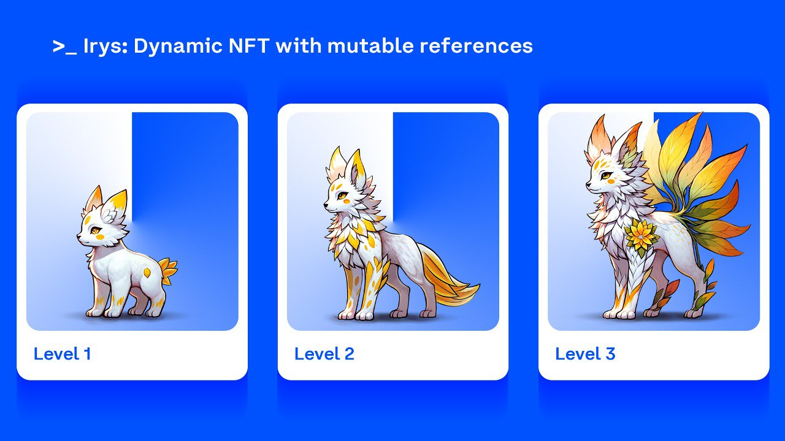
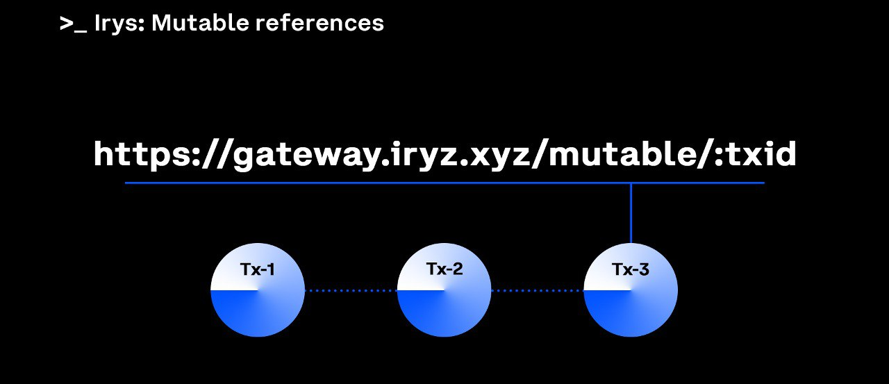
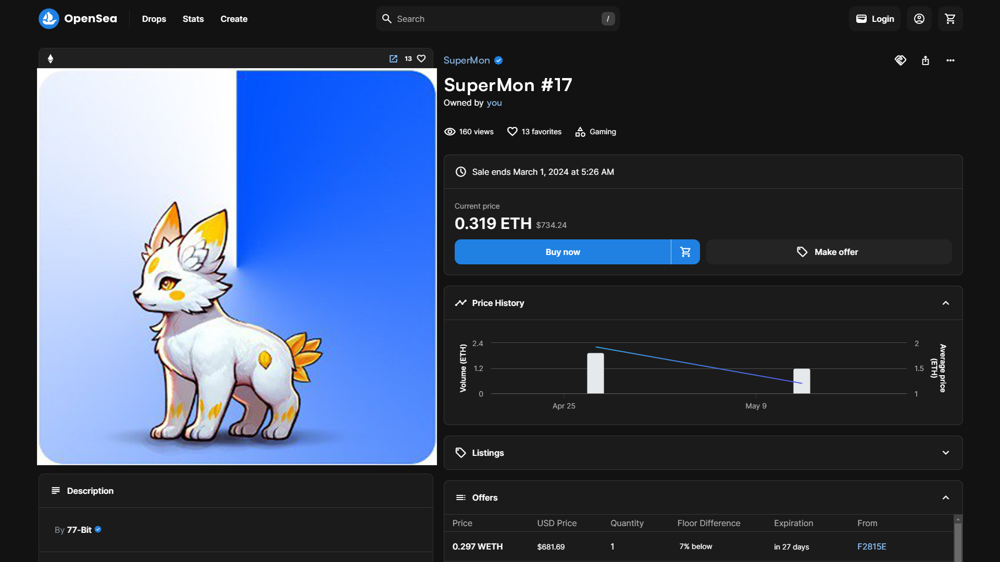
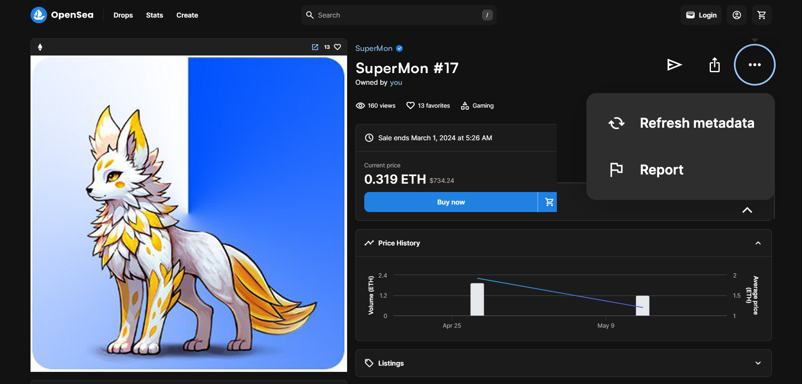

# Build a Dynamic NFT on Base with Irys

In this tutorial, you will create a dynamic NFT using Irys's [mutability features].



Dynamic NFTs are NFTs whose metadata evolves over time. They are commonly used in:

- Gaming projects where in-game assets evolve as players progress
- Loyalty programs where NFTs evolve as users accumulate points

## Objectives

By the end of this tutorial, you should be able to:

- Permanently upload data onchain using Irys
- Create NFT metadata and use it to mint an NFT
- "Mutate" (change) the NFT metadata using Irys's mutability features

## Prerequisites

1. **Setup a Coinbase Wallet:** You'll need a web3 wallet; you'll use it to deploy the NFT contract and to sign and pay for uploads to Irys. We recommend using the [Coinbase Wallet].

2. **Wallet Funding:** You'll need to fund your wallet with some Base Sepolia tokens. You can do this for free using the [Base Faucet].

## About Irys

[Irys] is a datachain, a blockchain optimized for data storage. Data uploaded to Irys is:

- Permanent and immutable
- Onchain
- Censorship-resistant
- Blockchain agnostic
- Unconstrained (you can upload files of any size)

When you store your NFT assets on Irys and mint them using a smart contract on Base, you can guarantee the NFT will be retrievable forever. Creators can rest assured that their works will endure indefinitely, while collectors can feel secure knowing their NFTs are permanently preserved.

### Irys + Base

Irys has a pay-once-store-forever model and accepts payment for storage using multiple tokens, including ETH on Base.

## "Mutability"

Data on Irys is permanent and immutable, but you use Irys's [mutability features] to simulate mutability and create dynamic NFTs that evolve based on onchain or offchain actions.



Using Irys's mutability features, you create a single, static URL that is linked to a series of transactions. Then, you can add a new transaction to the series at any time, and the URL will always resolve to the most recent transaction.

You'll mint your NFT using a mutable-style URL, and then push updates to that URL. The URL won't change, but the metadata it resolves to will.

## About

This tutorial focuses on creating a SuperMon NFT, similar to one used in a web3 game that would evolve during gameplay. The NFT starts with a basic appearance and can be "upgraded" twice. You will use the Irys CLI to "mutate" the metadata, simulating the automatic changes that would occur through player interactions in an actual game.

## Smart contract

You're building an NFT, which means you need a smart contract. Here's a simple one you can use to mint the NFT you'll create.

```solidity filename="SuperMon.sol"
// SPDX-License-Identifier: MIT
pragma solidity ^0.8.0;

// Import OpenZeppelin's ERC721 and ERC721URIStorage contracts
// These URLs are compatible with Remix IDE
import "@openzeppelin/contracts/token/ERC721/ERC721.sol";
import "@openzeppelin/contracts/token/ERC721/extensions/ERC721URIStorage.sol";
import "@openzeppelin/contracts/access/Ownable.sol";

contract SuperMon is ERC721URIStorage {
    uint256 private _tokenIdCounter;

    // No arguments in the constructor, the owner will be the contract deployer
    constructor() ERC721("SuperMon", "SMON") {
        _tokenIdCounter = 0;
    }

    // Mint function to create a new NFT
    function mint(address to, string memory uri) public {
        uint256 tokenId = _tokenIdCounter;
        _tokenIdCounter += 1;
        _safeMint(to, tokenId);
        _setTokenURI(tokenId, uri);
    }
}

```

Deploy the smart contract using [Remix].

## Irys CLI

You'll use the [Irys CLI] to upload images and metadata.

### Installing the CLI

Install the Irys CLI globally using the `-g` flag. Depending on your setup, you may need to use sudo.

```bash
npm i -g @irys/cli
```

Or:

```bash
sudo npm i -g @irys/cli
```

### Using private keys

When executing CLI commands involving funding and signing, you must provide a private key. Use the `-w` flag to specify a private key along with the `-t` flag to signal you're using ETH on Base.

```console
irys -w <base-private-key> -t base-eth
```

## Uploading the images


[Download a zip containing PNGs] for each level, and save them on your local drive.

Next, fund Irys with 0.1 [Base Sepolia ETH] to pay for your uploads.

> In all of these CLI examples, make sure to replace the value of the `-w` parameter with your own private key.

```console
irys fund 100000000000000000 \
  -n devnet \
  -t base-eth \
  -w 6dd5e....54a120201cb6a \
  --provider-url https://sepolia.base.org
```

> The `fund` command accepts a value in atomic units, 0.1 ETH is equal to 100000000000000000 in atomic units.

Next, use the Irys CLI to upload each of the images to the Irys Devnet.

> Uploads to Irys's devnet are kept for ~60 days and are paid for using free tokens available from [faucets].

```console
irys upload image-level-1.png \
  -n devnet \
  -t base-eth \
  -w 6dd5e....54a120201cb6a \
  --provider-url https://sepolia.base.org

irys upload image-level-2.png \
  -n devnet \
  -t base-eth \
  -w 6dd5e....54a120201cb6a \
  --provider-url https://sepolia.base.org

irys upload image-level-3.png \
  -n devnet \
  -t base-eth \
  -w 6dd5e....54a120201cb6a \
  --provider-url https://sepolia.base.org
```

## Uploading the metadata

Create three metadata files similar to the ones below. Make sure to change the value of the image field to match the URLs generated in the previous step.

```jason filename="metadata-level-1.json"
{
  "name": "SuperMon",
  "symbol": "SMON",
  "image": "https://gateway.irys.xyz/3JE8cucmpLkXK1t84QwqDRv25FTB2EJWCUgpWdtvuJZd",
  "description": "Super dooper, changing shapes, changing power",
  "attributes": [
    {
      "trait_type": "supermon-level",
      "value": "1"
    }
  ]
}
```

```jason filename="metadata-level-2.json"
{
  "name": "SuperMon",
  "symbol": "SMON",
  "image": "https://gateway.irys.xyz/3JE8cucmpLkXK1t84QwqDRv25FTB2EJWCUgpWdtvuJZd",
  "description": "Super dooper, changing shapes, changing power",
  "attributes": [
    {
      "trait_type": "supermon-level",
      "value": "2"
    }
  ]

}
```

```jason filename="metadata-level-3.json"
{
  "name": "SuperMon",
  "symbol": "SMON",
  "image": "https://gateway.irys.xyz/3JE8cucmpLkXK1t84QwqDRv25FTB2EJWCUgpWdtvuJZd",
  "description": "Super dooper, changing shapes, changing power",
  "attributes": [
    {
      "trait_type": "supermon-level",
      "value": "3"
    }
  ]

}
```

And upload **just the first file** using the Irys CLI.

```console
irys upload metadata-level-1.json \
  -n devnet \
  -t base-eth \
  -w 6dd5e....54a120201cb6a \
  --provider-url https://sepolia.base.org
```

The CLI will return a URL similar to `https://gateway.irys.xyz/94TNg3UUKyZ96Dj8eSo9DVkBiivAz9jT39jjMFeTFvm3`. To convert that to a mutable-style URL, interpolate it by adding `/mutable/` after the domain and before the transaction ID.

Your final URL will be similar to `https://gateway.irys.xyz/mutable/94TNg3UUKyZ96Dj8eSo9DVkBiivAz9jT39jjMFeTFvm3`.

## Minting the NFT

To mint your NFT in Remix:

1. Return to Remix.
2. Under "Deployed Contracts", locate your contract and expand it to see its functions.
3. Under the `Mint` function, enter the wallet address you want to mint the NFT to and the metadata URL (e.g. `https://gateway.irys.xyz/mutable/94TNg3UUKyZ96Dj8eSo9DVkBiivAz9jT39jjMFeTFvm3`) from the previous step.
4. Click Transact.



You can now view the NFT on the [Opensea Testnet].

## Mutating the metadata

To now "mutate" the NFT, upload a new version of the metadata tagging it as having a `Root-TX` equal to the transaction ID of your first transaction. In my example, I pass the value of `94TNg3UUKyZ96Dj8eSo9DVkBiivAz9jT39jjMFeTFvm3`, however make sure to change this to match your unique transaction ID.

```console
irys upload metadata-level-2.json \
  -n devnet \
  -t base-eth \
  -w 6dd5e....54a120201cb6a \
  --tags Root-TX 94TNg3UUKyZ96Dj8eSo9DVkBiivAz9jT39jjMFeTFvm3 \
  --provider-url https://rpc.sepolia.org
```

Return to Opensea and request that it refresh your metadata.



Give it a few minutes and your updated NFT should be visible.

## Free metadata uploads

Uploads of less than 100 KiB are free on Irys, which is more than enough for most metadata files. This means projects can let users "evolve" their NFTs without having to pay gas fees.

## Caching

Wallets and NFT websites typically cache metadata to optimize performance, this can affect the visibility of updates to dynamic NFTs. While OpenSea offers a feature for users to manually request metadata refreshes, not all platforms provide this level of control. When building dynamic NFT projects, make sure to thoroughly test and understand the implications of caching on your platform.

## Irys SDK

This tutorial used the Irys CLI to permanently upload data. Irys also has a JS-SDK that can be used on the [server] and in the [browser].

## Conclusion

In this tutorial, you learned how to permanently upload data to Irys using their CLI and how to create a dynamic NFT. Data on Irys is onchain, permanent and immutable. When your NFT images and metadata are on Irys, you can guarantee to your users that the NFT will be retrievable forever.

Dynamic NFTs are commonly used with gaming projects, similar to the one we built in this tutorial. However, there are countless other applications too. For example:

- **Points programs**: Create an NFT representing a user's participation in a points program. As the user earns more points, the NFT evolves.
- **Sports NFTs**: Create an NFT from a sports team that changes whenever the team wins an important game.
- **Holiday NFTs**: Create an NFT that changes seasonally to represent different holidays.
- **Activity tracking**: Create a health and wellness NFT that changes based on data from an activity tracker.

---

[Irys]: https://www.irys.xyz/
[Base Faucet]: https://docs.base.org/docs/tools/network-faucets/
[faucets]: https://docs.base.org/docs/tools/network-faucets/
[Base Sepolia]: https://docs.base.org/docs/tools/network-faucets/
[browser]: https://docs.irys.xyz/build/d/irys-in-the-browser
[Coinbase Wallet]: https://chrome.google.com/webstore/detail/coinbase-wallet-extension/hnfanknocfeofbddgcijnmhnfnkdnaad?hl=e
[Download a zip containing PNGs]: https://gateway.irys.xyz/MoOvEzePMwFgc_v6Gw3U8ovV6ostgrkWb9tS4baAJhc
[Irys CLI]: https://docs.irys.xyz/build/d/storage-cli/installation
[mutability features]: https://docs.irys.xyz/build/d/features/mutability
[Opensea Testnet]: https://testnets.opensea.io/accoun
[Remix]: https://docs.base.org/tutorials/deploy-with-remix
[server]: https://docs.irys.xyz/build/d/quickstart
