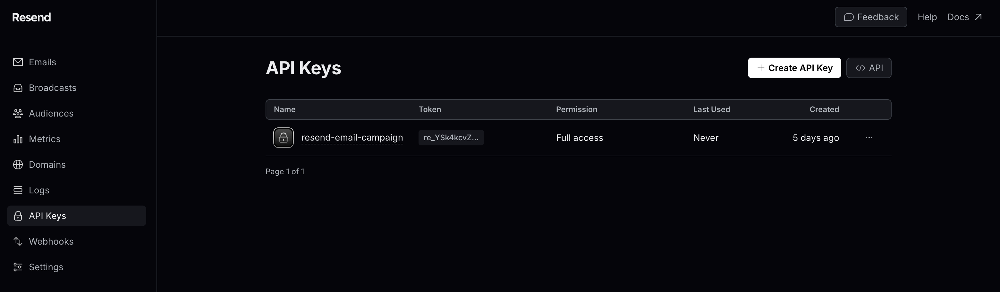
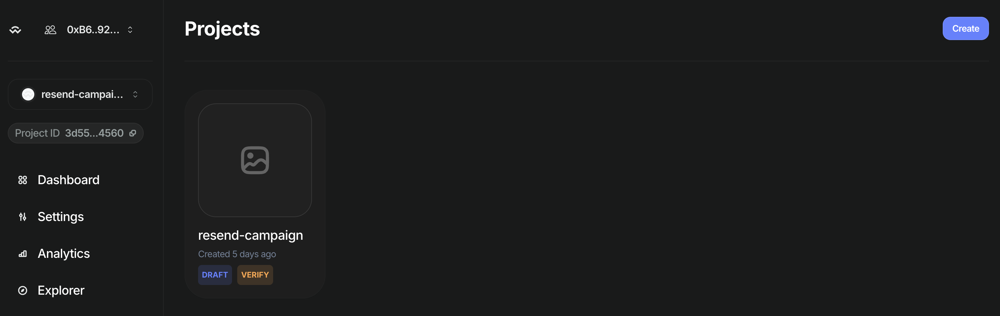
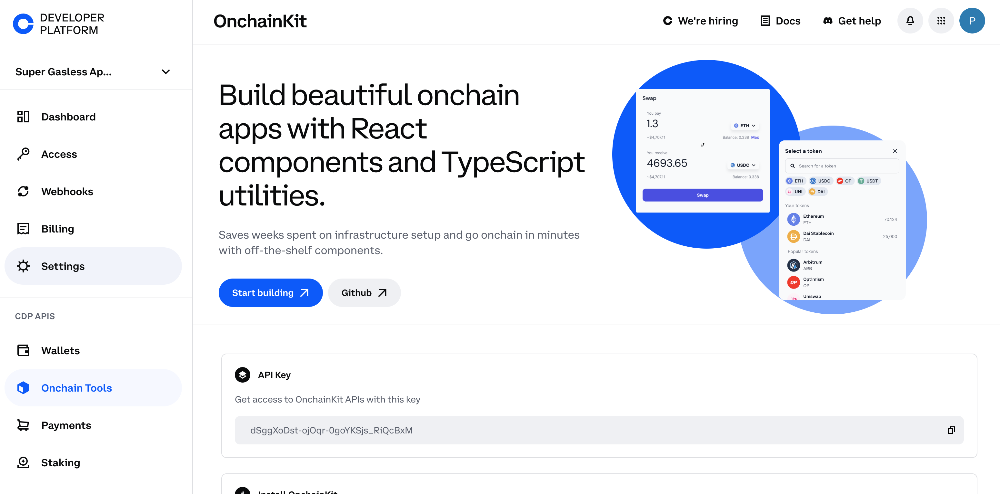
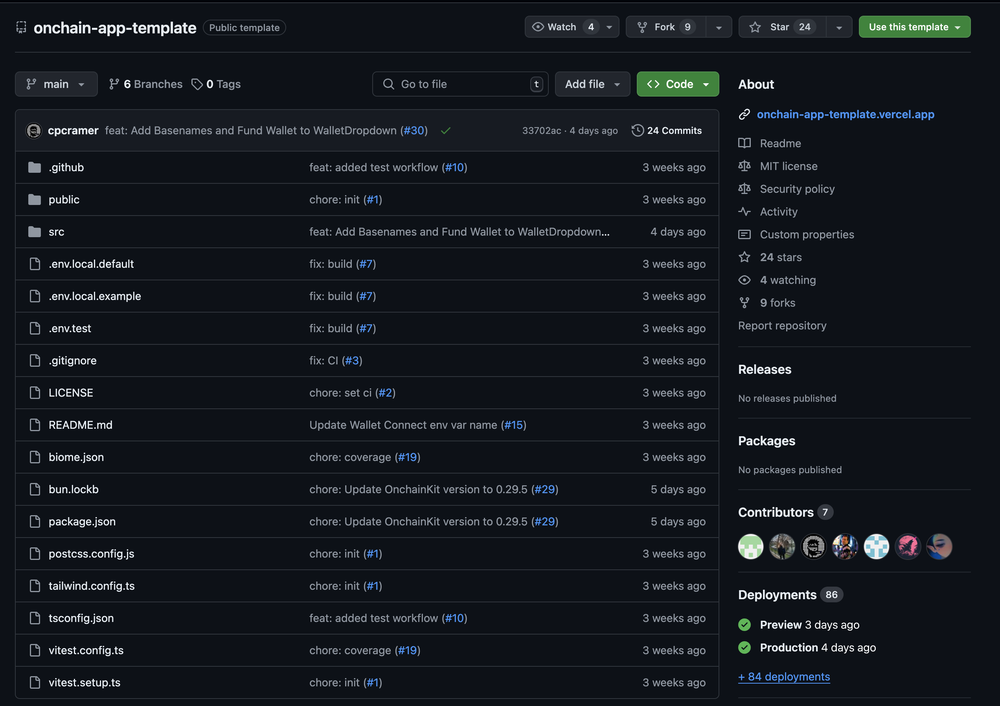
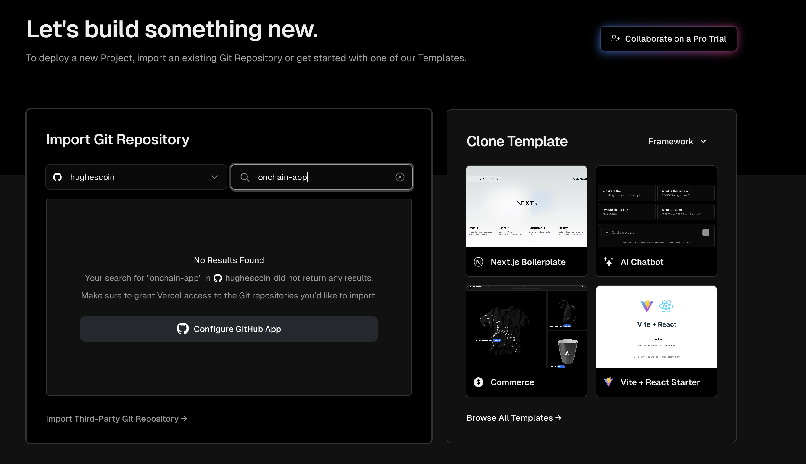
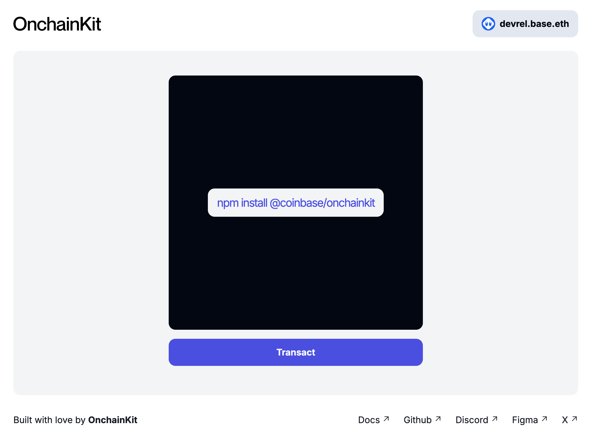
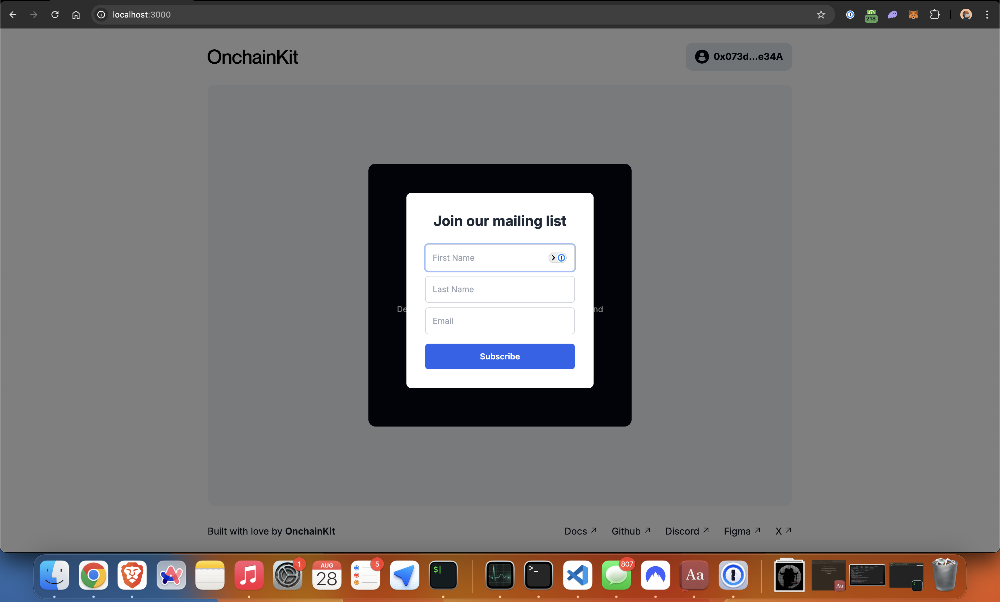
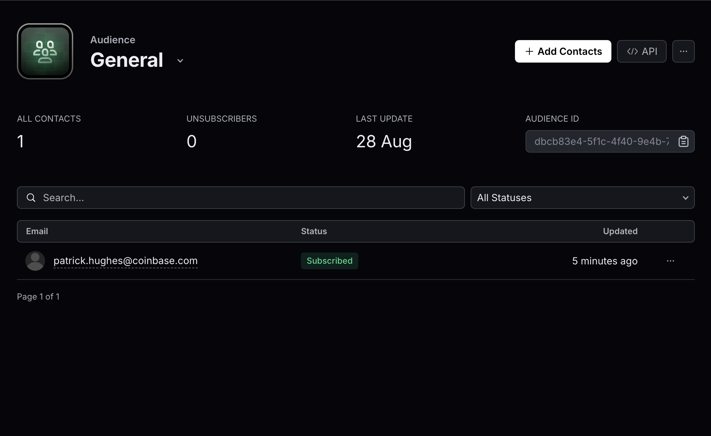

# Create email campaigns for smart wallets using Resend

In today’s digital landscape, onchain interactions are becoming increasingly common, but email remains a powerful tool for personal and business communication. When a user logs into your application, capturing their onchain information is just the first step. To build lasting relationships and keep your users engaged, you need to connect with them where they’re most likely to respond—through their inbox.

This tutorial will guide you through the process of seamlessly prompting users to join your company's mailing list after they sign up with your app. By the end, you'll be equipped to launch effective email campaigns that bridge the gap between onchain activity and offchain communication.

## Prerequisites

1. [Coinbase Developer Platform (CDP) Account](https://www.coinbase.com/cloud)

You’ll need to set up an account on the Coinbase Developer Platform (CDP). The CDP provides various tools and services for blockchain development, including access to API endpoints and other resources that will be instrumental in your project. Once you’ve created your account, you’ll be ready to move forward with integrating these services into your application.

2. [WalletConnect Project ID](https://cloud.walletconnect.com/)

You’ll need to set up a cloud account with [WalletConnect], a protocol that enables secure wallet connections across different platforms.

3. [Resend Account](https://resend.com)

You’ll need to set up an account with [Resend], a service that allows you to send email campaigns programmatically. If you don’t already have an account, visit their website and sign up. Once your account is created, you’ll be able to generate API keys, which are essential for integrating Resend with your application.

After creating your Resend account, navigate to the API keys page within your Resend dashboard. Here, you’ll generate a new API key that will be used to authenticate your requests when sending emails from your application. Make sure to store this key securely, as it will be required in later steps.



Once your WalletConnect account is set up, log in to obtain an API key. This key allows your application to interact with WalletConnect’s services. Navigate to the API keys section in your WalletConnect dashboard, generate a new key, and store it securely.

With your WalletConnect API key in hand, it’s time to create a project within the WalletConnect Cloud.



This project will house your integration settings and project-specific credentials. Go to the projects section of your WalletConnect dashboard and create a new project. After creating your WalletConnect project, you’ll be provided with a unique Project ID. Copy this Project ID and keep it handy, as you’ll need it for the upcoming integration steps.



You will now set up your development environment.

:::tip Integrating Resend to an existing project?

If you’re planning to integrate Resend into an existing project, feel free to skip ahead to the backend section where we’ll create custom API routes for interacting with Resend.

:::

To begin, you’ll need to fork the [OnchainKit App template] from GitHub by clicking the green `Use this template` button. This template provides a solid foundation for building onchain applications and will be used as the base for our demo.



Once you’ve forked the repository, it’s time to clone it to your local machine. Open your terminal and run the following command, replacing the repository URL with the appropriate one if different:

```bash
git clone git@github.com:<REPLACE-WITH-YOUR-GITHUB-USERNAME>/onchain-app-template.git resend-demo
```

This command clones the repository into a directory named `resend-demo`.

After cloning the repository, navigate into the project directory using the following command:

```bash
cd resend-demo
```

This will switch your terminal’s context to the project’s root directory, where you can begin working on the code.

The OnchainKit template uses [Bun] as the package manager. If you don’t have Bun installed, you can install it by running the following command:

```bash
# Install bun in case you don't have it
bun curl -fsSL <https://bun.sh/install> | bash
```

:::tip Is Bun Installed?

After installation, you may need to restart your terminal or run source ~/.bashrc (or ~/.zshrc) to ensure Bun is recognized as a command.

:::

Next, install the Resend package to handle email campaign functionality within your app:

```bash
bun install resend
```

This command adds Resend as a dependency to your project, making it available for use in your application.

In this templates, environment variables are stored in a `.env.example` file. You’ll need to rename this file to `.env` to ensure the environment variables are properly loaded. Run the following command:

```bash
mv .env.local.example .env
```

With the `.env` file in place, open it in your preferred text editor and update it with your API keys and project IDs. These keys are essential for connecting to Resend, WalletConnect, and the Coinbase Developer Platform.

Here’s an example of how your `.env` file should look:

```bash
NEXT_CDP_API_KEY="YOUR_COINBASE_API_KEY"
NEXT_PUBLIC_WC_PROJECT_ID="YOUR_WALLET_CONNECT_PROJECT_ID"
RESEND_API_KEY="YOUR_RESEND_API_KEY"
RESEND_AUDIENCE_ID="YOUR_RESEND_AUDIENCE_ID"
```

:::note

Make sure to replace the placeholder values (YOUR_COINBASE_API_KEY, etc.) with your actual keys.

:::

## Deploy template to Vercel

To send emails from your application using Resend, you’ll need to deploy your project to a live environment. Vercel is a popular platform for deploying web applications, and it’s ideal for this purpose. By deploying your cloned repo on Vercel, you’ll obtain a live domain where your app can interact with Resend.

If you don’t already have a Vercel account, head over to [Vercel’s website] and sign up. You can sign up using your GitHub account, which will make importing your project easier.

Once logged in, go to the Projects section of your Vercel dashboard. Click on the `Add New` button to start the process of deploying a new project.

In the next step, Vercel will prompt you to import a Git repository. Click on Import Git Repository and search for the OnchainKit app that you forked earlier. Select the repository to proceed.



This step connects your GitHub (or other Git provider) account with Vercel, allowing Vercel to pull the code from your repository.

:::note Private Repos

If your project is private, you’ll see an option to Configure GitHub App. Click this button to give Vercel the necessary permissions to access your private repository. Follow the prompts to complete the authorization process.

:::

After Vercel has access to your repository, you’ll be guided through the final deployment steps. Vercel will automatically detect the settings for your project, but you may want to double-check that everything is correct, such as the project name and deployment settings.

Environment Variables: Before completing the deployment, ensure that your environment variables (from the `.env` file) are correctly set up in Vercel. Vercel provides an interface to input these variables during the deployment process. Follow Vercel's guide for [adding environment variables].

After the build is complete, Vercel will provide you with a deployment URL. This URL is your live domain, where your application will be hosted. You can visit this URL to see your deployed site in action.



## Set up logic and functionality

Let's start by removing a few imports to clean our `page.tsx` file up.

Start by removing `TransactionWrapper` and `WalletWrapper` imports and the code within the second `<section/>` html element.

Your `src/app/page.tsx` file should look like this:

```typescript
'use client';
import Footer from 'src/components/Footer';
import { ONCHAINKIT_LINK } from 'src/links';
import OnchainkitSvg from 'src/svg/OnchainkitSvg';
import { useAccount } from 'wagmi';
import LoginButton from '../components/LoginButton';
import SignupButton from '../components/SignupButton';

export default function Page() {
  const { address } = useAccount();

  return (
    <div className="flex h-full w-96 max-w-full flex-col px-1 md:w-[1008px]">
      <section className="mb-6 mt-6 flex w-full flex-col md:flex-row">
        <div className="flex w-full flex-row items-center justify-between gap-2 md:gap-0">
          <a href={ONCHAINKIT_LINK} title="onchainkit" target="_blank" rel="noreferrer">
            <OnchainkitSvg />
          </a>
          <div className="flex items-center gap-3">
            <SignupButton />
            {!address && <LoginButton />}
          </div>
        </div>
      </section>
      <section className="templateSection flex w-full flex-col items-center justify-center gap-4 rounded-xl bg-gray-100 px-2 py-4 md:grow"></section>
      <Footer />
    </div>
  );
}
```

Use react hooks and create the following state variables

```
import { useState, useEffect } from  'react';
```

`src/app/page.tsx:`

```typescript title="src/app/page.tsx"
const [showForm, setShowForm] = useState(false);
const [formData, setFormData] = useState({ firstName: '', lastName: '', email: '' });
const [isSubscribed, setIsSubscribed] = useState(false);
const [isMember, setIsMember] = useState(false);
```

Add useEffect hook: Add this useEffect hook to update form visibility and member status based on wallet connection:

```typescript title="src/app/page.tsx"
useEffect(() => {
  if (address) {
    setShowForm(true);
  } else {
    setShowForm(false);
    setIsMember(false);
  }
}, [address]);
```

Add form submission handler: Add the handleSubscribe function to handle form submissions:

```typescript title="src/app/page.tsx"
const handleSubscribe = async (e: React.FormEvent) => {
  e.preventDefault();
  try {
    const { firstName, email } = formData;

    // Send email using API
    const emailResponse = await fetch('/api/send', {
      method: 'POST',
      headers: { 'Content-Type': 'application/json' },
      body: JSON.stringify({ firstName, email }),
    });
    const emailData = await emailResponse.json();
    if (!emailResponse.ok) throw new Error(emailData.error || 'Failed to send email');

    // Create contact using API
    const contactResponse = await fetch('/api/create', {
      method: 'POST',
      headers: { 'Content-Type': 'application/json' },
      body: JSON.stringify({ firstName, email }),
    });
    const contactData = await contactResponse.json();
    if (!contactResponse.ok) throw new Error(contactData.error || 'Failed to create contact');

    console.log('Subscription successful:', { emailData, contactData });
    setIsSubscribed(true);
    setIsMember(true);

    // Close the form after 3 seconds
    setTimeout(() => {
      setShowForm(false);
      setIsSubscribed(false);
    }, 3000);
  } catch (error) {
    console.error('Error subscribing:', error);
    alert(error instanceof Error ? error.message : 'An unknown error occurred');
  }
};
```

Add input change handler: Add the `handleChange` function to handle input changes:

```typescript title="src/app/page.tsx"
const handleChange = (e: React.ChangeEvent<HTMLInputElement>) => {
  setFormData({ ...formData, [e.target.name]: e.target.value });
};
```

Add outside click handler: Add the handleOutsideClick function to close the form when clicking outside:

```typescript title="src/app/page.tsx"
const handleOutsideClick = (e: React.MouseEvent<HTMLDivElement>) => {
  if (e.target === e.currentTarget) {
    setShowForm(false);
  }
};
```

Create a component that will serve as the email template:

`src/components/EmailTemplate.tsx: `

```typescript title="src/components/EmailTemplate.tsx"
import * as React from 'react';

interface EmailTemplateProps {
  firstName: string;
}
export const EmailTemplate: React.FC<Readonly<EmailTemplateProps>> = ({ firstName }) => (
  <div>
    <h1>Welcome, {firstName}!</h1>
  </div>
);
```

In `src/app/page.tsx` add the following section to display wether the user is a member or not:

```html
<section
  className="templateSection flex w-full flex-col items-center justify-center gap-4 rounded-xl bg-gray-100 px-2 py-4 md:grow"
>
  <div
    className="flex h-[450px] w-[450px] max-w-full items-center justify-center rounded-xl bg-[#030712]"
  >
    <div className="flex flex-col items-center justify-center gap-4">
      <h1 className="text-2xl font-bold text-white font-inter">
        {isMember ? "You're now a member." : "Welcome to Smart Wallet"}
      </h1>
      <p className="text-sm text-white font-inter">
        {isMember ? "Thank you for joining!" : "Demo app to showcase the Smart Wallet with Resend"}
      </p>
    </div>
  </div>
</section>
```

In the same file (`src/app/page.tsx`) add the following logic to display the form after the last `section/>` element:

```html
{ showForm && (
<div
  className="fixed inset-0 flex items-center justify-center bg-black bg-opacity-50"
  onClick="{handleOutsideClick}"
>
  <div className="w-80 rounded-lg bg-white p-8 shadow-lg">
    {isSubscribed ? (
    <h2 className="text-center text-2xl font-bold text-black">Subscribed!</h2>
    ) : (
    <form onSubmit="{handleSubscribe}" className="space-y-4">
      <h2 className="mb-6 text-center text-2xl font-bold text-gray-800">Join our mailing list</h2>
      {/* Form inputs */}
      <div className="space-y-2">
        <input
          type="text"
          name="firstName"
          placeholder="First Name"
          value="{formData.firstName}"
          onChange="{handleChange}"
          className="focus:black w-full rounded-md border border-gray-300 p-3 text-sm focus:outline-none focus:ring-2"
          required
        />
        <input
          type="text"
          name="lastName"
          placeholder="Last Name"
          value="{formData.lastName}"
          onChange="{handleChange}"
          className="focus:black w-full rounded-md border border-gray-300 p-3 text-sm focus:outline-none focus:ring-2"
          required
        />
        <input
          type="email"
          name="email"
          placeholder="Email"
          value="{formData.email}"
          onChange="{handleChange}"
          className="focus:black w-full rounded-md border border-gray-300 p-3 text-sm focus:outline-none focus:ring-2"
          required
        />
      </div>
      <button
        type="submit"
        className="w-full rounded-md bg-blue-600 p-3 text-sm font-semibold text-white transition duration-300 ease-in-out hover:bg-blue-700"
      >
        Subscribe
      </button>
    </form>
    )}
  </div>
</div>
) }
```

Now, let's set up our API routes for creating contacts and sending emails. In your project's `app` directory, create a new folder called `api`. Inside this `api` folder, create two more folders: `create` and `send`.

In the `create` folder, we'll create a file named `route.ts`. This route will handle creating a new contact using the Resend API. In the `send` folder, create another `route.ts` file. This route will be responsible for sending an email to the user, also using the Resend API.

These two routes will work together to add a new subscriber to your list and send them a welcome email.

`src/app/api/send/route.ts: `

```typescript title="src/app/api/send/route.ts"
import { EmailTemplate } from '../../../components/EmailTemplate';
import { Resend } from 'resend';

const resend = new Resend(process.env.RESEND_API_KEY);

export async function POST() {
  try {
    const { data, error } = await resend.emails.send({
      from: 'Acme <onboarding@resend.dev>',
      to: ['delivered@resend.dev'],
      subject: 'Hello world',
      react: EmailTemplate({ firstName: 'John' }),
    });

    if (error) {
      return Response.json({ error }, { status: 500 });
    }

    return Response.json(data);
  } catch (error) {
    return Response.json({ error }, { status: 500 });
  }
}
```

`src/app/api/send/route.ts: `

```typescript title="src/app/api/send/route.ts"
import { Resend } from 'resend';

const resend = new Resend(process.env.RESEND_API_KEY);

export async function POST(request: Request) {
  try {
    const { firstName, email } = await request.json();

    const { data, error } = await resend.contacts.create({
      email,
      firstName,
      audienceId: process.env.RESEND_AUDIENCE_ID || '',
    });

    if (error) {
      console.error('Contact creation error:', error);
      return Response.json({ error: 'Failed to create contact' }, { status: 500 });
    }

    return Response.json({ success: true, data });
  } catch (error) {
    console.error('Unexpected error:', error);
    return Response.json({ error: 'An unexpected error occurred' }, { status: 500 });
  }
}
```

Now that everything is set up, it’s time to test your integration to ensure everything is working as expected.

Start your development server by running the following command:

```bash
bun run dev
```

Open your application in a web browser by navigating to `http://localhost:3000` or the port specified in your `package.json`. You can sign up or log in using your smart wallet. This will trigger the wallet connection process.

After connecting your wallet, you should see a prompt to join the mailing list. Enter your name and email address in the form provided.



Once you’ve submitted the form, navigate to your [Resend Audience] dashboard. You should see a new contact with the name and email information you provided while testing on the development server.



## Conclusion

Congratulations! You've set up a seamless process to capture user emails after signing in with a Smart Wallet. You can better engage with your users more effectively and build stronger, lasting relationships. Keep exploring the potential of onchain apps and continue enhancing your user experience!

---

[Basenames]: https://www.base.org/names/
[OnchainKit]: https://onchainkit.xyz/
[Wallet Connect]: https://cloud.walletconnect.com/sign-in
[OnchainKit App template]: https://github.com/coinbase/onchain-app-template
[Bun]: https://bun.sh/package-manager
[adding environment variables]: https://vercel.com/docs/projects/environment-variables
[Resend Audience]: https://resend.com/audiences/
