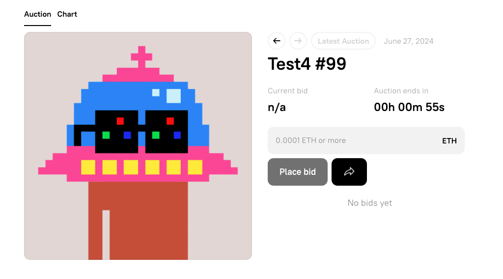

You've probably seen people in onchain communities use ⌐◨-◨ in their profile names. These are called _Nouns Goggles_, or _Noggles_. They're an ASCII representation of the glasses found on every procedurally generated [Nouns] NFT avatar. The [Nouns Auction] makes one new Noun available for auction every single day - forever!

In this tutorial, you'll learn how to use Nouns and the Coinbase [Smart Wallet] to create an app in which non-crypto-native participants at an IRL event can be onboarded and receive Nounish avatars.

---

## Objectives

By the end of this tutorial you should be able to:

- Deploy a copy of the [Nouns Protocol]
- Construct a web app that scan a user's QR code and indicate whether or not the user possesses the appropriate NFT

## Prerequisites

### ERC-721 Tokens

This tutorial assumes that you are familiar with the properties of ERC-721 tokens.

### Vercel

You'll need to be comfortable deploying your app to [Vercel], or using another solution on your own. Check out our tutorial on [deploying with Vercel] if you need a refresher!

### Onchain Apps

The tutorial assumes you're comfortable with the basics of deploying an app and connecting it to a smart contract. If you're still learning this part, check out our tutorials in [Base Learn] for [Building an Onchain App].

---

## The Nouns Protocol

Ownership of a Noun gives a wallet address membership in the [Nouns DAO]. The [Nouns Protocol] is open-source and the art is public domain, so any builder can leverage the protocol to create their own community. For example, the [Purple DAO] supports [Farcaster].

## Creating your Own DAO

You can use the contracts in the [Nouns Monorepo] to deploy your own DAO, but there's an easier method! [BuilderDAO] is a DAO that maintains a set of tools making it easy for anyone to create their own DAO.

Navigate to the [Testnet Builder DAO] site and connect your wallet.

:::danger

The name of this site is a little misleading. It will treat the DAOs you create here as test DAOs, but it deploys contracts on Base Mainnet, **not** Base Sepolia. Luckily, gas is inexpensive enough that this isn't a terrible price.

:::

Click the green circle in the upper right, and select `Create a DAO`


### General

Give your DAO a name and symbol. Optionally, upload a cover avatar image and/or link to a website. Click `Continue`.

### Auction

For testing, you'll want the `Auction Reserve Price` as low as possible, .0001 ETH, and the `Auction Duration` to be enough time to buy a few NFTs for testing with different wallet addresses, but not so long you get bored. About 2 minutes is a good middle ground.

**Be sure** to change `Days` from 1 to 0!

## Veto and Allocation

Set `Veto Power` and initial `Token Allocation` as you see fit. To speed up testing, you may wish to grant several addresses here.

:::caution

The app gets confused if you change addresses from the browser extension wallet, copy them from another window, or another location.

:::

### Artwork

Add a description for your DAO. You must put something in this field.

For the art, click the `Download demo folder` link and review the assets downloaded if you're not familiar with how these types of collections assemble NFT art out of random properties.

When you're done, simply upload the folder you downloaded. Use the `Generate Random Preview` button a few times to see the variants of NFTs this protocol can create, then click `Continue`.

### Deploying the Contracts

Review the linked documents for the ToS and Protocol Rewards, the check the boxes and click `Deploy Contracts (1 of 2)`.

Approve the transaction. **Remember, this is using real funds!**

Click `Deploy Contracts (2 of 2)` and approve the transaction. After it processes, you should be taken to the auction page for your DAO. Click `Start Auction` and approve the transaction.

If you chose to distribute tokens to founding addresses, those will be airdropped to those addresses. Otherwise, use the auction to purchase NFTs with a few different addresses.



### Finding the Contracts

Near the bottom of the page, click the `Contracts` tab. You'll need the `NFT` contract address for the app.

## Building the App

The app is designed to be used by the person at the door to a private event for DAO members. To gain entry, members must prove their ownership of at least 1 NFT from the DAO.

The app will work by using a QR code scanner to read the member's "pay me" QR code, look up their NFT ownership status, then share that with the person using the app to scan entrants.

### Setting up the Template

Start by using the [Onchain App Template] as the foundation of your app.

Clone your copy of the repo, install dependencies, and check that it works.

Open `src/app/page.tsx`. Clean out the demo content and set up for your app:

```tsx
'use client';

export default function Page() {
  return (
    <div className="flex w-96 flex-col md:w-[600px]">
      <section className="mb-6 flex w-full flex-col border-b border-sky-800 pb-6">
        <aside className="mb-6 flex">
          <h2 className="text-2xl">Welcome to our Event!</h2>
        </aside>
        <main className="flex flex-col space-x-4">
          <p className="text-body mb-4 text-white">
            Please scan the QR code for your wallet address that holds the NFT.
          </p>
        </main>
      </section>
    </div>
  );
}
```

### Reading QR Codes

You'll need a library to read QR codes. A lightweight option is [Html5-QRCode].

Add it with:

```bash
bun add html5-qrcode
```

In `page.tsx`, import, and add the state variables needed by the scanner, as outlined in the [Html5-QRCode Docs], and the variables you'll need to show whether or not to let the person into the event:

```tsx
import { Html5Qrcode } from 'html5-qrcode';
```

```tsx
const [scannedAddress, setScannedAddress] = useState<`0x${string}` | null>(null);
const [authorized, setAuthorized] = useState(false);
const [scanning, setScanning] = useState(false);
```

`scannedAddress` will be populated by the QR Code scanner. You'll use it with `useEffect` to check for NFT ownership.

Review the operations of the scanner from the [Html5-QRCode Docs], and modify it to only look for addresses, and to handle the different formats used by popular wallets:

```tsx
async function startScanning() {
  setScanning(true);
  setScannedAddress(null);
  setAuthorized(false);
  let cameraId = '';

  try {
    // This method will trigger user permissions
    const devices = await Html5Qrcode.getCameras();

    if (!devices || devices.length === 0) {
      return;
    }

    cameraId = devices[0].id;

    const html5QrCode = new Html5Qrcode('reader', false);

    try {
      html5QrCode.start(
        { facingMode: 'environment' } || cameraId,
        {
          fps: 10, // Optional, frame per seconds for qr code scanning
          qrbox: { width: 500, height: 500 }, // Optional, if you want bounded box UI
        },
        (decodedText) => {
          let scannedAddress = decodedText;
          if (scannedAddress.includes('ethereum:')) {
            scannedAddress = scannedAddress.replace('ethereum:', '');
          }

          // If there is an @ symbol, remove it and everything after it
          if (scannedAddress.includes('@')) {
            scannedAddress = scannedAddress.split('@')[0];
          }

          // If it's not the correct length, it's not a valid address
          if (scannedAddress.length !== 42) {
            return;
          }

          // handle the result
          setScannedAddress(scannedAddress as `0x${string}`);
          setScanning(false);
          html5QrCode.stop();
        },
        (errorMessage) => {
          // parse error, ignore it.
        },
      );
    } catch (error) {}
  } catch (error) {}
}
```

Update the returned HTML to display:

- The scanner object
- The last scanned address
- Whether or not the last scanned address is authorized to enter
- Any errors
- A button to start up the scanner

```tsx
return (
  <div className="flex w-96 flex-col md:w-[600px]">
    <section className="mb-6 flex w-full flex-col border-b border-sky-800 pb-6">
      <aside className="mb-6 flex">
        <h2 className="text-2xl">Welcome to our Event!</h2>
      </aside>
      <main className="flex flex-col space-x-4">
        <p className="text-body mb-4 text-white">
          Please scan the QR code for your wallet address that holds the NFT.
        </p>
        <div id="middle" className="flex h-3/4 items-center justify-center">
          {!scanning && (
            <button
              onClick={() => startScanning()}
              className="rounded bg-blue-500 px-4 py-2 font-bold text-white hover:bg-blue-700"
            >
              Scan QR Code
            </button>
          )}
          {scanning && (
            <div id="reader-container" className="h-full w-full">
              <div id="reader"></div>
            </div>
          )}
        </div>
        <div id="bottom" className="h-1/8">
          <br />
          <p>Last scanned: {scannedAddress}</p>
          <p>Authorized: {authorized ? 'Yes' : 'No'}</p>
        </div>
      </main>
    </section>
  </div>
);
```

Run the app, and press the button to enable your camera. You may have to grant permissions.

On your phone, open your wallet app, display the QR code you use to receive payments and show it to the camera. Your wallet address will be displayed below the video. If you have another wallet app, try it as well.

`Authorized` won't change because you aren't checking for NFT ownership yet.

### Verifying NFT Ownership

To verify NFT ownership, you can use the ERC-721 `balanceOf` function and check that the balance returned for the scanned address is > 0. To call this, you'll need the address of the NFT contract, which you got above from the Nouns Builder page, and the ABI for the contract.

You may be used to generating the ABI as a part of your deployment process, but that's not the only way to get it. They also **don't** need to be complete, and aren't unique for contracts following a specification.

This means that you can use a simplified one here. Add a folder in `app` called `constants`, and a file called `abi.ts`. In it, put:

```tsx
export const abi = [
  {
    constant: true,
    inputs: [
      {
        name: 'owner',
        type: 'address',
      },
    ],
    name: 'balanceOf',
    outputs: [
      {
        name: '',
        type: 'uint256',
      },
    ],
    payable: false,
    stateMutability: 'view',
    type: 'function',
  },
] as const;
```

Back in `page.tsx`, import your ABI and add a constant for your contract address:

```tsx
import { abi } from './constants/abi';
const contractAddress = '<YOUR CONTRACT ADDRESS HERE>';
```

Your contract is on Base Mainnet, so you need to modify `src/wagmi.ts` to use that. Go ahead and update your app name while you're there:

```tsx
import { http, createConfig } from 'wagmi';
import { base } from 'wagmi/chains';
import { coinbaseWallet } from 'wagmi/connectors';

export const wagmiConfig = createConfig({
  chains: [base],
  // turn off injected provider discovery
  multiInjectedProviderDiscovery: false,
  connectors: [
    coinbaseWallet({
      appName: 'DAO Gate',
      preference: 'all',
      version: '4',
    }),
  ],
  ssr: true,
  transports: {
    [base.id]: http(),
  },
});

declare module 'wagmi' {
  interface Register {
    config: typeof wagmiConfig;
  }
}
```

Return to `page.tsx`, and implement a `useReadContract` to read the `balanceOf` the scanned address. First, add needed dependencies:

```tsx
import { useReadContract } from 'wagmi';
import { useQueryClient } from '@tanstack/react-query';
```

And the `queryClient`:

```tsx
export default function Page() {
  // Other state variables

  const queryClient = useQueryClient();

  // Other code...
```

Then, add the `useReadContract` hook:

```tsx
const {
  data: balanceData,
  isError: balanceIsError,
  isPending: balanceIsPending,
  queryKey: balanceQueryKey,
} = useReadContract({
  address: contractAddress,
  abi,
  functionName: 'balanceOf',
  args: scannedAddress ? [scannedAddress] : undefined,
});
```

And a `useEffect` to handle the `balanceData` being retrieved. You should also make use of the additional variables to handle errors, pending state, etc. on your own.

```tsx
useEffect(() => {
  if (balanceData !== undefined) {
    const balance = balanceData as bigint;
    setAuthorized(balance > 0n);
  }
}, [balanceData]);
```

You also need a `useEffect` to refetch the data from the blockchain when `scannedAddress` changes, accomplished by invalidating the query for the `queryKey` you extracted from `useReadContract` :

```tsx
useEffect(() => {
  if (scannedAddress) {
    queryClient.invalidateQueries({ queryKey: balanceQueryKey });
  }
}, [scannedAddress]);
```

With these pieces in place, when the scanner scans a QR code, it will check if what it has read is a valid address and return it. That triggers an update to the `scannedAddress`, which in turn causes a read of the blockchain to see if that address owns any of the NFTS. If the address does own at least one NFT, it sets `authorized` to `true`, and displays that the user may enter.

From here, you can add much better styling, or even pull the NFT art of the owner's NFT for a personalized welcome! Another great feature would be displaying a status level based on the number of NFTs owned by the entrant.

## Conclusion

In this tutorial, you learned about [Nouns] and how the platform makes it easy to create avatar-based communities. You also learned how to use [BuilderDAO] to create your own DAO without writing any code. Finally, you learned how to create an app that can be used to allow or deny access to a private event based on ownership of an NFT in your DAO.

---

[Base Learn]: https://base.org/learn
[ERC-721 Tokens]: https://docs.base.org/base-learn/docs/erc-721-token/erc-721-standard-video
[OpenZeppelin ERC-721]: https://docs.openzeppelin.com/contracts/2.x/api/token/erc721
[OpenZeppelin]: https://www.openzeppelin.com/
[Nouns]: https://nouns.center/intro
[Nouns Auction]: https://nouns.wtf/
[Nouns DAO]: https://nouns.wtf/vote
[Nouns Protocol]: https://nouns.center/dev/nouns-protocol
[Nouns Monorepo]: https://github.com/nounsDAO/nouns-monorepo/
[Purple DAO]: https://nouns.build/dao/base/0x8de71d80eE2C4700bC9D4F8031a2504Ca93f7088/563
[Farcaster]: https://www.farcaster.xyz/
[Smart Wallet]: https://www.smartwallet.dev/why
[Next.js]: https://nextjs.org/
[Onchain App Template]: https://github.com/coinbase/onchain-app-template
[Smart Wallet]: https://www.coinbase.com/wallet/smart-wallet
[BuilderDAO]: https://nouns.build/about
[Testnet Builder DAO]: https://testnet.nouns.build/
[Html5-QRCode]: https://github.com/mebjas/html5-qrcode
[Html5-QRCode Docs]: https://qrcode.minhazav.dev/
