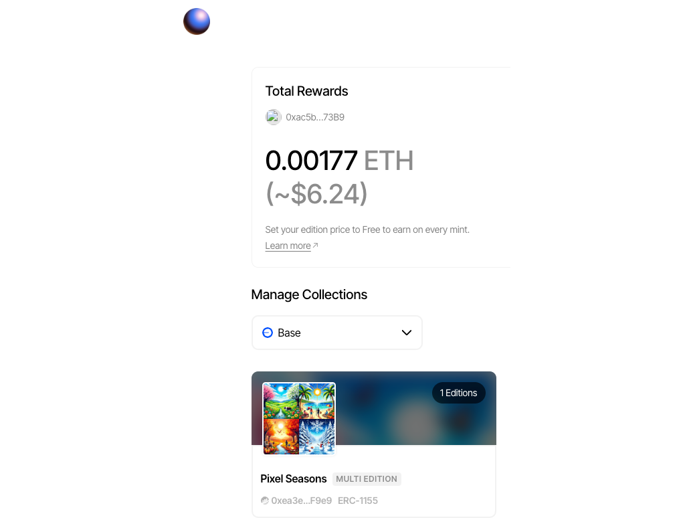

[Zora]'s mission is to make creating on the internet free and valuable. To support this, they've made a number of no-code tools, SDKs, and contracts that make creating NFTs easier. They're also a part of the [superchain ecosystem], which means most of their tools also work on Base!

You can interact with Zora's contracts through your own frontend, which makes it easier to create secure, efficient, and feature-rich minting experiences for your users.

For this tutorial, you'll use Zora's [gasless 1155 premint] with [An Onchain App in 100 Components] to allow not-yet-onchain artists to use your app to create and share NFT collections **without** needing a funded wallet. And because the template includes the Coinbase [Smart Wallet], you can help these users create their first wallet and automatically receive their rewards and payments without them needing to figure anything out.

In doing so, you'll help grow the ecosystem of Base users for everyone!

---

## Objectives

By the end of this tutorial you should be able to:

- Programmatically use Zora's [gasless 1155 premint] create ERC-1155 minting experiences on a frontend
- Use the connected wallet address to receive minting rewards and payments

---

## Prerequisites

### ERC-1155 Tokens

This tutorial assumes that you are familiar with the properties of ERC-1155 tokens, but you don't need to know how to write one.

### Vercel

You'll need to be comfortable deploying your app to [Vercel], or using another solution on your own. Check out our tutorial on [deploying with Vercel] if you need a refresher!

### Onchain Apps

The tutorial assumes you're comfortable with the basics of deploying an app and connecting it to a smart contract. If you're still learning this part, check out our tutorials in [Base Learn] for [Building an Onchain App].

---

## Getting Started

Begin by making a copy of the [Onchain App Template] by clicking the `Use this Template` button then cloning it locally.

The team recommends using [Bun], so install it if you need to, then install the packages and run the app:

```bash
# Install bun in case you don't have it
curl -fsSL <https://bun.sh/install> | bash

# Install packages
bun i

# Run Next app
bun run dev
```

Navigate to `localhost:3000` and confirm the app is working.

## Building the App

This tutorial won't cover all of the frontend development, auth, databases, or other details of making a production app, but it will walk you through the major pieces of enabling your users to use your app to:

- Create a Coinbase Smart Wallet, if they need one
- Create an NFT collection, gaslessly with `Premint`
- Add tokens to that collection
- Allow other people to mint the tokens

Begin by opening `src/app/page.tsx` and doing some cleanup. Delete everything expect the wallet integration, and add some copy that is friendly to non-crypto-native users:

```tsx
'use client';
import WalletComponents from '@/components/WalletComponents';

export default function Page() {
  return (
    <div className="flex w-96 flex-col md:w-[600px]">
      <section className="mb-6 flex w-full flex-col border-b border-sky-800 pb-6">
        <aside className="mb-6 flex">
          <h2 className="text-xl">Wallet</h2>
        </aside>
        <p className="text-body text-white">
          Welcome! Please sign in with your wallet. If you are new at this, you can create a new
          wallet by clicking the "Connect wallet" button and following the instructions!
        </p>
        <WalletComponents />
      </section>
    </div>
  );
}
```

You can also delete the files for the components you removed. You still need `OnchainProviders.tsx` and `WalletComponents.tsx`.

### Creating the Premint from the App

:::info

Gas on Base is currently inexpensive enough that we're doing this tutorial on the live network! Zora supports Base Sepolia as well, so feel free to use that instead.

:::

Open `src/app/wagmi.ts` and convert the references of `baseSepolia` to `base`.

Install the [Zora Protocol SDK].

```bash
bun add @zoralabs/protocol-sdk viem@2.x
```

In `src/app/components` add a file called `CreatePremint.tsx`. Open `CreatePremint.tsx`.

Import dependencies, instantiate a client, and stub out a component.

```tsx
import { createCreatorClient } from '@zoralabs/protocol-sdk';
import { useEffect, useState } from 'react';
import { useAccount, useChainId, usePublicClient, useSignTypedData } from 'wagmi';

export default function CreatePremint() {
  const chainId = useChainId();
  const publicClient = usePublicClient()!;
  const { address: creatorAddress } = useAccount();

  const creatorClient = createCreatorClient({ chainId, publicClient });

  const { signTypedData, data: signature } = useSignTypedData();

  return <div>TODO</div>;
}
```

This tutorial isn't going to cover the management of storing and retrieving all of your users' premints or active mints, so add some debug state variables to hold the necessary data for the mint this example will create.

```tsx
// Debug to store collection info, stand-in for database, etc.
const [debugGlobalAddress, setDebugGlobalAddress] = useState<string | null>(null);
const [debugGlobalUid, setDebugGlobalUid] = useState<number | null>(null);
```

You'll also need some state variables to capture the premint data and functions created by `creatorClient.createPremint`.

```tsx
const [premintConfig, setPremintConfig] = useState<any>(null);
const [collectionAddress, setCollectionAddress] = useState<string | null>(null);
const [typedDataDefinition, setTypedDataDefinition] = useState<any>(null);
const [submit, setSubmit] = useState<Function | null>(null);
```

Finally, you need a way to collect all of the data needed to create the mint. Add a `type` and use it for the `CreatePremint` components props.

```tsx
export type PremintProps = {
  contractName: string;
  maxSupply: bigint;
  maxTokensPerAddress: bigint;
  mintStart: bigint;
  mintDuration: bigint;
  pricePerToken: bigint;
};

export default function CreatePremint({
  contractName,
  maxSupply,
  maxTokensPerAddress,
  mintStart,
  mintDuration,
  pricePerToken,
}: PremintProps) {
  // Existing code...
}
```

The example in the [premint docs] goes into detail about the parameters, but they should be largely self-evident.

Open `src/app/page.tsx` and add a debug instance of your props. As you develop the app, replace this with data gathered from other components to allow your users to upload images and enter the name, etc. into a form that you pin to IPFS for them.

```tsx
const debugPremintProps = {
  contractName: 'Pixel Seasons',
  contractURI: 'ipfs://QmYjwarNweXhQAfu3phirz8vwnwFEqo5t8m3xt3HWpFd8N',
  tokenURI: 'ipfs://QmXr9NuvX9afZhHTpd2jRgFHbVnaWPKD315AtnTT6H67hz',
  maxSupply: 1000n,
  maxTokensPerAddress: 5n,
  mintStart: 0n,
  mintDuration: 0n,
  pricePerToken: 0n,
};
```

The `contractURI` is a file pinned to IPFS containing contract metadata, such as:

```tsx
{
  "name": "Pixel Seasons",
  "description": "Retro images representing each season.",
  "image": "ipfs://QmaSaa3VkFiywQi2HmE1YmuXZCfp992Awso9SquEnYpcC1"
}
```

The `tokenURI` is an IPFS link to valid NFT metadata, such as:

```tsx
{
  "name": "Pixel Summer",
  "description": "",
  "image": "ipfs://Qmb8EYToz59cGExgaGyMxuGf22WtrNYXo5cNRApKrkaxdB",
  "content": {
    "mime": "image/jpg",
    "uri": "ipfs://Qmb8EYToz59cGExgaGyMxuGf22WtrNYXo5cNRApKrkaxdB"
  }
}
```

Add your component to the page and pass it the debug data:

```tsx
<section className="mb-6 flex w-full flex-col border-b border-sky-800 pb-6">
  <aside className="mb-6 flex">
    <h2 className="text-xl">Create Premint</h2>
  </aside>
  <p className="text-body text-white">
    You can use this component to set up a premint for your non-engineer customers. After the
    premint is created, it will demonstrate how their customers can mint the NFT.
  </p>
  <p className="text-body text-white">
    For a production app, put a form here to collect info and upload images.
  </p>
  <br />
  <CreatePremint {...debugPremintProps} />
</section>
```

Return to `CreatePremint.tsx`. `createPremint` is an asynchronous function, so you'll need to wrap it in a `useEffect` to trigger it and update your state when the `createorAddress` is fetched by `useAccount`.

Be sure to put **your** address for `createReferral`. Zora will pay you a share of the revenue automatically to this address for your part in helping create the mint!

```tsx
useEffect(() => {
  async function createPremint() {
    const {
      premintConfig: pC,
      collectionAddress: cA,
      typedDataDefinition: tDD,
      submit: sub,
    } = await creatorClient.createPremint({
      // info of the 1155 contract to create.
      contract: {
        // the account that will be the admin of the collection.
        // Must match the signer of the premint.
        contractAdmin: creatorAddress!,
        contractName,
        contractURI,
      },
      // token info of token to create
      token: {
        tokenURI,
        // Put your address as `createReferral`, you get rewards!
        createReferral: '<YOUR ADDRESS HERE>',
        maxSupply,
        maxTokensPerAddress,
        mintStart,
        mintDuration,
        pricePerToken,
        payoutRecipient: creatorAddress!,
      },
    });

    setPremintConfig(pC);
    setCollectionAddress(cA);
    setTypedDataDefinition(tDD);
    setSubmit(() => sub); // Ensure submit is set as a function
  }

  if (creatorAddress) {
    createPremint();
  }
}, [creatorAddress]);
```

You've decomposed a `signTypedData` function and `data`, renamed as `signature`, from the `useSignTypedData` hook. The `signature` will be updated when that function is called. You can use this with `useEffect` to trigger sending the signed message to Zora with the `submit` function you decomposed from `createPremint`. This is also a good place to set your debug variables, or however you choose capturing the contract information in a production app:

```tsx
useEffect(() => {
  if (signature) {
    if (submit) {
      submit({
        signature,
      });
      // Debug to store collection info
      setDebugGlobalAddress(collectionAddress);
      setDebugGlobalUid(premintConfig.uid);
    } else {
      console.error('Submit function is not set.');
    }
  }
}, [signature]);
```

Finally, set up your return to show some instructions and the `Create Premint` button if the premint is not yet created, and some information about the mint if it has been:

```tsx
if (!debugGlobalAddress || !debugGlobalUid) {
  return (
    <main className="flex h-10 items-center space-x-4">
      <button
        className="rounded bg-blue-500 px-4 py-2 font-bold text-white hover:bg-blue-700"
        onClick={() => signTypedData(typedDataDefinition)}
      >
        Create Premint
      </button>
    </main>
  );
} else {
  return (
    <main className="flex h-10 items-center space-x-4">
      <p>Collection Address: {debugGlobalAddress}</p>
      <p>UID: {debugGlobalUid}</p>
    </main>
  );
}
```

Test the app! You should be able to sign the message, and see the address and uid for you mint after the message is signed.

### Minting from the Premint

Add a new file in `src/app/components` called `ZoraCollectPremint.tsx` and open it.

Create a stub with dependencies that instantiates a `collectorClient` instance:

```tsx
import { createCollectorClient } from '@zoralabs/protocol-sdk';
import { useAccount, useChainId, usePublicClient, useWriteContract } from 'wagmi';

export type CollectPremintProps = {
  contractAddress: string;
  uid: number;
};

export default function ZoraCollectPremint({ contractAddress, uid }: CollectPremintProps) {
  const chainId = useChainId();
  const publicClient = usePublicClient()!;

  const { address: minterAccount } = useAccount();
  const { writeContract } = useWriteContract();

  const collectorClient = createCollectorClient({ chainId, publicClient });

  return <div>TODO</div>;
}
```

Next, add an async function to `collectPremint`. This will use `collectorClient.mint` to create a transaction that will deploy the NFT contract, if it hasn't been deployed yet, and claim `quantityToMint` NFTs. It then uses `writeContract` from [wagmi] to execute the transaction for the user to sign.

```tsx
async function collectPremint() {
  if (!minterAccount) {
    console.error('No minter account');
    return;
  }
  const { parameters } = await collectorClient.mint({
    tokenContract: contractAddress as `0x${string}`,
    mintType: 'premint',
    uid,
    quantityToMint: 1,
    mintComment: 'Neat!!!',
    minterAccount,
  });

  writeContract(parameters);
}
```

Update the `return` to return a button that calls the function with the props for the component:

```tsx
return (
  <button
    className="rounded bg-blue-500 px-4 py-2 font-bold text-white hover:bg-blue-700"
    onClick={collectPremint}
  >
    Collect Premint
  </button>
);
```

Return to `CreatePremint.tsx`. You wouldn't necessarily want to use this architecture for a production app since the creator probably **doesn't** want to be the first minter, but this is the most convenient place to test the component.

Add an instance of `ZoraCollectPremint` to the return for after the premint has been created and pass it the debug variables:

```tsx
return (
  <main className="flex h-10 items-center space-x-4">
    <p>Collection Address: {debugGlobalAddress}</p>
    <p>UID: {debugGlobalUid}</p>
    <br />
    <ZoraCollectPremint contractAddress={debugGlobalAddress} uid={debugGlobalUid} />
  </main>
);
```

Test out the app. When you click the button, you should get a transaction to mint the NFT. Finally, open your [Zora Dashboard]. Select `Base` as the network. You'll see your collection, **and** the rewards you've received from Zora for facilitating the creation of the collection and the mint of the NFT!



## Conclusion

In this tutorial, you've learned how to build an experience using the [Zora Protocol SDK] where non-crypto-native creators can create NFT collections **without** needing to fund a wallet and without you needing to subsidize their gas. You've also learned how to create a mint UI/UX from these premints, and how to collect your own rewards from [Zora].

---

[Base Learn]: https://base.org/learn
[Building an Onchain App]: https://docs.base.org/base-learn/docs/frontend-setup/overview
[Vercel]: https://vercel.com
[deploying with Vercel]: /tutorials/farcaster-frames-deploy-to-vercel
[OpenZeppelin ERC-721]: https://docs.openzeppelin.com/contracts/2.x/api/token/erc721
[wagmi template]: https://www.smartwallet.dev/guides/create-app/using-wagmi
[superchain ecosystem]: https://www.superchain.eco/chains
[Zora]: https://zora.co/
[Onchain App Template]: https://github.com/coinbase/onchain-app-template
[Next.js]: https://nextjs.org/
[Coinbase Developer Platform]: https://www.coinbase.com/developer-platform
[Basescan]: https://basescan.org/
[Zora Docs]: https://docs.zora.co/docs/intro
[Zora Protocol SDK]: https://ourzora.github.io/zora-protocol/protocol-sdk/introduction
[Zora 1155 Contracts]: https://docs.zora.co/docs/smart-contracts/creator-tools/Deploy1155Contract
[viem]: https://viem.sh/
[gasless 1155 premint]: https://ourzora.github.io/zora-protocol/protocol-sdk/creator/premint
[Smart Wallet]: https://www.coinbase.com/wallet/smart-wallet
[premint docs]: https://ourzora.github.io/zora-protocol/protocol-sdk/creator/premint
[wagmi]: https://wagmi.sh
[Zora Dashboard]: https://zora.co/manage
