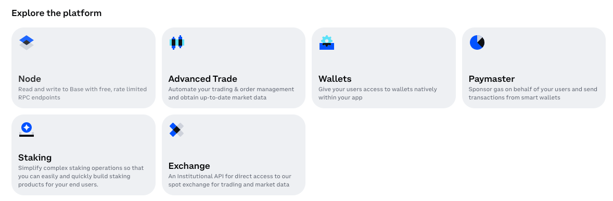

[Zora]'s mission is to make creating on the internet free and valuable. To support this, they've made a number of no-code tools, sdks, and contracts that make creating NFTs easier. They're also a part of the [superchain ecosystem], which means most of their tools also work on Base!

You can interact with Zora's contracts through your own frontend, which makes it easier to create secure, efficient, and feature-rich minting experiences for your users.

For this tutorial, you'll use Zora's [gassless 1155 premint] with the [Build Onchain Apps Template (⛵️)] to allow not-yet-onchain artists to use your app to create and share NFT collections **without** needing a funded wallet. And because the template includes the Coinbase [Smart Wallet], you can help these users create their first wallet and automatically receive their rewards and payments without them needing to figure anything out.

In doing so, you'll help grow the ecosystem of Base users for everyone!

---

## Objectives

By the end of this tutorial you should be able to:

- Programmatically use Zora's [gassless 1155 premint] create ERC-1155 minting experiences on a frontend
- Use the connected wallet address to receive minting rewards and payments

---

## Prerequisites

### ERC-1155 Tokens

This tutorial assumes that you are able to write, test, and deploy your own ERC-1155 tokens using the Solidity programming language. If you need to learn that first, check out our content in [Base Camp].

### Vercel

You'll need to be comfortable deploying your app to [Vercel], or using another solution on your own. Check out our tutorial on [deploying with Vercel] if you need a refresher!

### Onchain Apps

The tutorial assumes you're comfortable with the basics of deploying an app and connecting it to a smart contract. If you're still learning this part, check out our tutorials in [Base Camp] for [Building an Onchain App].

### Build Onchain Apps Template (⛵️)

The [Build Onchain Apps Template (⛵️)] is an advanced onchain app template that saves you weeks of work moving towards a production-ready frontend. The tutorial assumes you are working with BOAT, but these techniques should work in almost any other template built on [Next.js].

---

## Getting Started

Begin by creating a new project with the [Build Onchain Apps Template (⛵️)]. In the folder where you wish to **create** your project folder, run:

```bash
npx @coinbase/build-onchain-apps@latest create
```

Enter a name for your project, then use the space bar to remove all three experiences. You won't need them for this tutorial.

Open the [Coinbase Developer Platform] and sign in or create an account if you need one. Select `Node` from the list of prouducts.



Copy your `RPC Endpoint` and paste it into the terminal prompt for `Base RPC URL`.

Next, navigate to [Basescan] and log in or create an account. In the left panel, click `API Keys`. Copy your `API Key Token` and paste it into the console.

Wait for the script to run then open the generated folder in your editor. CD into the `web` folder then run `yarn install && yarn dev`.

Navigate to `localhost:3000` and confirm the app is working.

## Building the App

This tutorial won't cover all of the frontend development, auth, databases, or other details of making a production app, but it will walk you through the major pieces of enabling your users to use your app to:

- Create an NFT collection, gasslessly with `Premint`
- Add tokens to that collection
- Allow other people to mint the tokens

### Creating the Premint from the App

Start by installing Zora's [Protocol SDK].

```bash
yarn add @zoralabs/protocol-sdk viem@2.x
```

Continue by adding a new page to the app. In the `app` folder, create a folder called `createPremint` with a file called `page.tsx`. Add a stub for a page:

```typescript
import { generateMetadata } from '@/utils/generateMetadata';

export const metadata = generateMetadata({
  title: 'Create your NFT collection',
  description: 'Create your NFT collection quickly, easily, and for free!',
  images: 'themes.png',
  pathname: '',
});

export default function Page() {
  return <div>TODO</div>;
}
```

In `src/components` add a folder called `Zora` and a file called `CreatePremint.tsx`.

In it, import dependencies and instantiate a `creatorClient`.

```typescript

```

## Conclusion

---

[Base Camp]: https://base.org.camp
[Building an Onchain App]: https://docs.base.org/base-camp/docs/frontend-setup/overview
[Vercel]: https://vercel.com
[deploying with Vercel]: /tutorials/farcaster-frames-deploy-to-vercel
[OpenZeppelin ERC-721]: https://docs.openzeppelin.com/contracts/2.x/api/token/erc721
[BOAT]: https://www.smartwallet.dev/guides/create-app/using-boat
[wagmi template]: https://www.smartwallet.dev/guides/create-app/using-wagmi
[superchain ecosystem]: https://www.superchain.eco/chains
[Zora]: https://zora.co/
[Build Onchain Apps Template (⛵️)]: https://github.com/coinbase/build-onchain-apps/
[Next.js]: https://nextjs.org/
[Coinbase Developer Platform]: https://www.coinbase.com/developer-platform
[Basescan]: https://basescan.org/
[Zora Docs]: https://docs.zora.co/docs/intro
[Zora 1155 Contracts]: https://docs.zora.co/docs/smart-contracts/creator-tools/Deploy1155Contract
[viem]: https://viem.sh/
[gassless 1155 premint]: https://ourzora.github.io/zora-protocol/protocol-sdk/creator/premint
[Smart Wallet]: https://www.coinbase.com/wallet/smart-wallet
